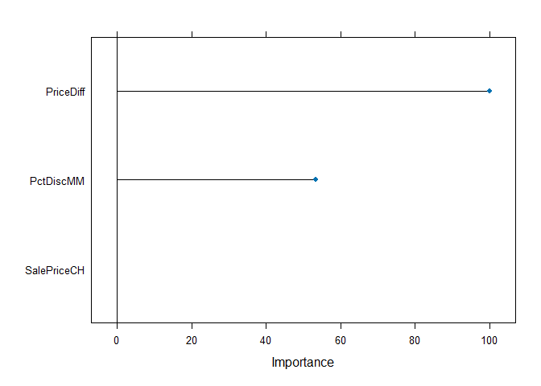
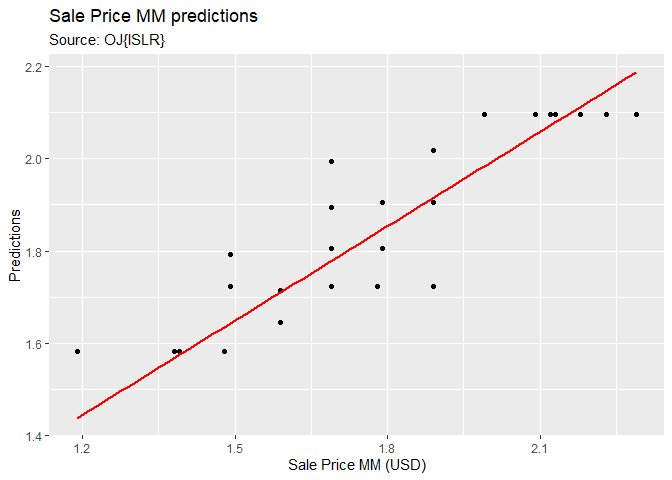

# Boosting using train{caret}

Function _train()_ "sets up a grid of tuning parameters for a number of classification and regression routines, fits each model and calculates a resampling based performance measure." [Rstudio doc]

This example uses _train()_ to fit a _Boosting_ model using the OJ{ISLR} dataset.

Additional documention:

http://topepo.github.io/caret/available-models.html


# Libraries


# Tree-based regression using Boosting on OJ{ISLR} dataset

Fit a Boosting regression model for sale price of _Minute Made Orange Juice_ . 

Explore OJ using '?' Rstudio help:

\>?OJ

Orange Juice Data

Description

## Load the data


```r
# load the data:
data(OJ)
str(OJ)
```

```
## 'data.frame':	1070 obs. of  18 variables:
##  $ Purchase      : Factor w/ 2 levels "CH","MM": 1 1 1 2 1 1 1 1 1 1 ...
##  $ WeekofPurchase: num  237 239 245 227 228 230 232 234 235 238 ...
##  $ StoreID       : num  1 1 1 1 7 7 7 7 7 7 ...
##  $ PriceCH       : num  1.75 1.75 1.86 1.69 1.69 1.69 1.69 1.75 1.75 1.75 ...
##  $ PriceMM       : num  1.99 1.99 2.09 1.69 1.69 1.99 1.99 1.99 1.99 1.99 ...
##  $ DiscCH        : num  0 0 0.17 0 0 0 0 0 0 0 ...
##  $ DiscMM        : num  0 0.3 0 0 0 0 0.4 0.4 0.4 0.4 ...
##  $ SpecialCH     : num  0 0 0 0 0 0 1 1 0 0 ...
##  $ SpecialMM     : num  0 1 0 0 0 1 1 0 0 0 ...
##  $ LoyalCH       : num  0.5 0.6 0.68 0.4 0.957 ...
##  $ SalePriceMM   : num  1.99 1.69 2.09 1.69 1.69 1.99 1.59 1.59 1.59 1.59 ...
##  $ SalePriceCH   : num  1.75 1.75 1.69 1.69 1.69 1.69 1.69 1.75 1.75 1.75 ...
##  $ PriceDiff     : num  0.24 -0.06 0.4 0 0 0.3 -0.1 -0.16 -0.16 -0.16 ...
##  $ Store7        : Factor w/ 2 levels "No","Yes": 1 1 1 1 2 2 2 2 2 2 ...
##  $ PctDiscMM     : num  0 0.151 0 0 0 ...
##  $ PctDiscCH     : num  0 0 0.0914 0 0 ...
##  $ ListPriceDiff : num  0.24 0.24 0.23 0 0 0.3 0.3 0.24 0.24 0.24 ...
##  $ STORE         : num  1 1 1 1 0 0 0 0 0 0 ...
```

```r
head(OJ)
```

```
##   Purchase WeekofPurchase StoreID PriceCH PriceMM DiscCH DiscMM SpecialCH
## 1       CH            237       1    1.75    1.99   0.00    0.0         0
## 2       CH            239       1    1.75    1.99   0.00    0.3         0
## 3       CH            245       1    1.86    2.09   0.17    0.0         0
## 4       MM            227       1    1.69    1.69   0.00    0.0         0
## 5       CH            228       7    1.69    1.69   0.00    0.0         0
## 6       CH            230       7    1.69    1.99   0.00    0.0         0
##   SpecialMM  LoyalCH SalePriceMM SalePriceCH PriceDiff Store7 PctDiscMM
## 1         0 0.500000        1.99        1.75      0.24     No  0.000000
## 2         1 0.600000        1.69        1.75     -0.06     No  0.150754
## 3         0 0.680000        2.09        1.69      0.40     No  0.000000
## 4         0 0.400000        1.69        1.69      0.00     No  0.000000
## 5         0 0.956535        1.69        1.69      0.00    Yes  0.000000
## 6         1 0.965228        1.99        1.69      0.30    Yes  0.000000
##   PctDiscCH ListPriceDiff STORE
## 1  0.000000          0.24     1
## 2  0.000000          0.24     1
## 3  0.091398          0.23     1
## 4  0.000000          0.00     1
## 5  0.000000          0.00     0
## 6  0.000000          0.30     0
```

Notes about the dataset:

> Variable _Purchase_ is a 2-level factor with values _CH_ ($1$) or _MM_ ($2$).

> The dataset has separate columns for _sale prices_ of _CH_ and _MM_.

> We are interested in the _sale price_ of _MM_: _SalePriceMM_.We want to predict it, but
we do not want to take _PriceMM_, nor _PriceDiff_ into account.


## Split the data: train / test datasets


```r
set.seed(1234)
ind <- sample(2, nrow(OJ), replace = T, prob = c(0.7, 0.3))
train <- OJ[ind == 1,]
test <- OJ[ind == 2,]
```


## Fit the model: Sale price of MM vs some variables

To predict SalePriceMM, remove -PriceMM -PriceDiff, -ListPriceDiff from the formula. Otherwise, the accuracy will 
be too high. We want to challenge the model at least a little bit.


```r
set.seed(1234)
cvcontrol <- trainControl(method="repeatedcv",
                          number = 5,
                          repeats = 2,
                          allowParallel=TRUE)

set.seed(1234)
boo <- train(SalePriceMM ~ PriceDiff
             +PctDiscMM
             #+DiscMM
             +SalePriceCH,
                data=train,
             method="xgbTree", 
             trControl=cvcontrol,
             tuneGrid = expand.grid(nrounds = 500,
                                    max_depth = 3,
                                    eta = 0.2,
                                    gamma = 2.1,
                                    colsample_bytree = 1,
                                    min_child_weight = 1,
                                    subsample = 1))
```

### Top contributors


```r
# Put the important variables in a dataframe for convenience
contributors <- varImp(boo)$importance

# Note, each contributor is a row. There is one column containing the importance score.
#(contributors_names <- rownames(contributors$importance))

# Arrange them top to bottom:
contributors %>% dplyr::select(Overall) %>% arrange(desc(Overall))
```

```
##               Overall
## PriceDiff   100.00000
## PctDiscMM    53.37525
## SalePriceCH   0.00000
```

### plot the model


```r
plot(varImp(boo))
```

<!-- -->

### See what Boosting did on train dataset


```r
boo
```

```
## eXtreme Gradient Boosting 
## 
## 747 samples
##   3 predictor
## 
## No pre-processing
## Resampling: Cross-Validated (5 fold, repeated 2 times) 
## Summary of sample sizes: 597, 597, 598, 597, 599, 599, ... 
## Resampling results:
## 
##   RMSE      Rsquared   MAE       
##   0.106212  0.8781929  0.07698796
## 
## Tuning parameter 'nrounds' was held constant at a value of 500
## Tuning
##  held constant at a value of 1
## Tuning parameter 'subsample' was held
##  constant at a value of 1
```

### Predict on test dataset


```r
b <-  predict(boo,  test)

# For ggplot we need a dataframe:
b_df <- data.frame(b, test)
```

### Plot predictions vs actuals


```r
b_df %>% ggplot(aes(x = SalePriceMM, y = b)) +
  geom_point() +
  geom_smooth(method = 'lm', col = 'red', se=FALSE) +
  scale_y_continuous('Predictions') +
  scale_x_continuous('Sale Price MM (USD)') +
  ggtitle('Sale Price MM predictions', 'Source: OJ{ISLR}')
```

```
## `geom_smooth()` using formula = 'y ~ x'
```

<!-- -->

### Prediction performance

- Root Mean Squared Error
- R-squared


```r
# RMSE
sqrt(mean((test$SalePriceMM - b)^2))
```

```
## [1] 0.1015739
```

```r
# R squared
cor(test$SalePriceMM, b)^2 ## R-Squared
```

```
## [1] 0.8989506
```


