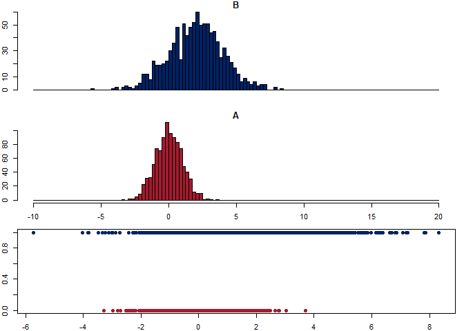

This code and functions are based on lessons from Harvard Statistical Learning class [see references]. I expanded the material with my own scripts, notes and R documentation and I plan to continue adding examples overtime.

This vignette focuses on logistic regression based on the Generalized Linear Models from the "stats" library.


# Load the libraries


```r
library(dplyr)
```

```
## 
## Attaching package: 'dplyr'
```

```
## The following objects are masked from 'package:stats':
## 
##     filter, lag
```

```
## The following objects are masked from 'package:base':
## 
##     intersect, setdiff, setequal, union
```

```r
library(tidyr)
library(ggplot2)
library(ggExtra)

library(stats)                # Stats contains glm for logistic regression
library(MASS)                 # LDA and QDA
```

```
## 
## Attaching package: 'MASS'
```

```
## The following object is masked from 'package:dplyr':
## 
##     select
```

```r
library(caret)
```

```
## Warning: package 'caret' was built under R version 4.2.3
```

```
## Loading required package: lattice
```

```
## Warning: package 'lattice' was built under R version 4.2.3
```

```r
library(pROC)
```

```
## Warning: package 'pROC' was built under R version 4.2.3
```

```
## Type 'citation("pROC")' for a citation.
```

```
## 
## Attaching package: 'pROC'
```

```
## The following objects are masked from 'package:stats':
## 
##     cov, smooth, var
```

# Functions

Adapted from R functions shared by faculty in Harvard data science class (2021). See references at the bottom of this notebook.


```r
###
#
# prediction.metrics function -- to return a list with all the metrics values
#
# Based on R functions shared by faculty in Harvard data science class (2021). See references.
#
# Input: truth and predicted lists.
#
# Returns a list with:
# [1] OBS = Observations or truth cases
# [2] Accuracy. ACC = sum(truth == predicted) * 100/length(truth)
# [3] Sensitivity. TPR True Positive Rate = TP/(TP + FN) = TP/P
# [4] Specificity. TNR True Negative Rate = TN/(FP + TN) = TN/N
# [5] Precision. Positive Predictive Value. PPV = TP/(TP + FP)
# [6] Negative Predictive Value. NPV = TN/(TN + FN)
# [7] False Discovery Rate. FDR = FP/(TP + FP)
# [8] False Positive Rate. FPR = FP/(FP + TN) = FP/N
# [9] True Positives. TP = sum(truth == 1 & predicted == 1)
# [10] True Negatives. TN = sum(truth == 0 & predicted == 0)
# [11] False Positives. FP = sum(truth == 0 & predicted == 1)
# [12] False Negatives. FN = sum(truth == 1 & predicted == 0)
# [13] Positives. P = TP + FN  # total number positives in the truth data
# [14] Negatives. N = FP + TN  # total number of negatives
#
prediction.metrics = function(truth, predicted) {
    # same length:
    if (length(truth) != length(predicted)) {
        stop("truth and predicted must be same length!")
    }
    # check for missing values (we are going to compute metrics on non-missing
    # values only)
    bKeep = !is.na(truth) & !is.na(predicted)
    predicted = predicted[bKeep]
    truth = truth[bKeep]
    # only 0 and 1:
    if (sum(truth %in% c(0, 1)) + sum(predicted %in% c(0, 1)) != 2 * length(truth)) {
        stop("only zeroes and ones are allowed!")
    }
    # how predictions align against known training/testing outcomes: TP/FP=
    # true/false positives, TN/FN=true/false negatives
    TP = sum(truth == 1 & predicted == 1)
    TN = sum(truth == 0 & predicted == 0)
    FP = sum(truth == 0 & predicted == 1)
    FN = sum(truth == 1 & predicted == 0)
    P = TP + FN  # total number of positives in the truth data
    N = FP + TN  # total number of negatives
    # Add the following output to return (OAT 11/9/2021)
    OBS = length(truth)
    ACC = sum(truth == predicted)/length(truth)
    TPR = TP/P
    TNR = TN/N
    PPV = TP/(TP + FP)
    NPV = TN/(TN + FN)
    FDR = FP/(TP + FP)
    FPR = FP/N
    
    # Returned a named list
    output <- list(OBS=OBS, ACC=ACC, TPR=TPR, TNR=TNR, PPV=PPV, 
                   NPV=NPV, FDR=FDR, FPR=FPR, TP=TP, 
                   TN=TN, FP=FP, FN=FN, P=P, N=N)
    return(output)
}

print.the.metrics = function(metrics){
  cat(' OBS = ', metrics$OBS, '...................number of observations')
  cat('\n ACC = ', metrics$ACC, '..................Accuracy')
  cat('\n TPR = ', metrics$TPR, '..................True Positive Rate')
  cat('\n TNR = ', metrics$TNR, '..................True Negative Rate')
  cat('\n PPV = ', metrics$PPV, '..................Positive Predictive Value (Precision)')
  cat('\n NPV = ', metrics$NPV, '..................Negative Predictive Value')
  cat('\n FDR = ', metrics$FDR, '..................False Discover Rate')
  cat('\n FPR = ', metrics$FPR, '..................False Positive Rate')
  cat('\n TP  = ', metrics$FP, '..................True Positives')
  cat('\n TN  = ', metrics$TN, '..................True Negatives')
  cat('\n FP  = ', metrics$TN, '..................False Positives')
  cat('\n FN  = ', metrics$FN, '..................False Negatives')
  cat('\n P   = ', metrics$P, '..................Positives')
  cat('\n N   = ', metrics$N, '..................Negatives')

  
}
# Logistic regression
lgr.pred.ftn = function(formula, df.train, df.test){
  glm.fit <- glm(formula, data = df.train, family = binomial)
  glm.probs <- predict(glm.fit, newdata = df.test, type = "response")
  glm.pred <- rep(0, dim(df.test)[1])
  glm.pred[glm.probs>0.5]=1
  return(glm.pred)
}

# Linear Discriminant Analysis (LDA)
lda.pred.ftn = function(formula, df.train, df.test){
  lda.fit <- lda(formula, data = df.train)
  lda.pred <- predict(lda.fit, df.test)
  lda.class <- lda.pred$class
  return(lda.class)
}

# Quadratic Discriminant Analysis (QDA)
qda.pred.ftn = function(formula, df.train, df.test){
  qda.fit <- qda(formula, data = df.train)
  qda.pred <- predict(qda.fit, df.test)
  qda.class <- qda.pred$class
  return(qda.class)
}
```


# Simulate the data

Play with two sets of Normally distributed sets of data with different means.
We can change the number of samples and we can move the means around.


```r
# From Harvard data science class (see references at the end of this notebook)

set.seed(11)

N = 1000
mu = 2

# Our measuring variable is continuous, numeric...
# ...it has two Normal distribution waves
# The first N observations has 0 mu, the second set has 4 mu
x <- c(rnorm(N), rnorm(N, mean=mu, sd = 2))

# Our outcome is categorical, A and B xxxx times each
# ...the idea is to match A and B to a number x
y <- rep(c("A", "B"), each=N)

# Make a data.frame with 1 and 0 values for Y
# The first column is Y the second column is X
df <- data.frame(Y=ifelse(y=="A",0, 1), X=x)
```


## Build train and test sets


```r
set.seed(12321)

# Get 2:1 random sample ratio for Train:Test sets
sampleTrain <- sample(c(TRUE,FALSE,TRUE), nrow(df), rep=TRUE)
df.train <- df[sampleTrain,]
df.test <- df[!sampleTrain,]
```

# Boxplot and histogram

In a boxplot, we want to have the categorical variable in the horizontal axis. 

That is why we see a formula x~y below.

The chart gives us more information if we plot it horizontally in this case.

The histogram adds information to visualize the behavior relationship 
between the outcome, categorical valuable, and predictor, numeric variable.


```r
# From Harvard data science class (see references)
# boxplot(x~y, col=c("lightblue","orange"), horizontal=T, las=1)
boxplot(x~y, col=c(crimson,royalblue), horizontal=T, las=1)
```

<!-- -->

```r
# Now place a histogram on top of another histogram

oldpar <- par(mfrow=c(3, 1), mar=c(2,2,1,1))

breaks <- seq(-10, 20, by=0.25)

# Histogram for 'B'
hist(x[y=="B"], breaks=breaks, col=royalblue, main="B", xaxt='n')

# Histogram for 'A'
hist(x[y=="A"], breaks=breaks, col=crimson, main="A")

plot(x, ifelse(y=="A", 0,1), 
     breaks=breaks, 
     col=ifelse(y=="A", crimson, royalblue), 
     pch=19)
```

```
## Warning in plot.window(...): "breaks" is not a graphical parameter
```

```
## Warning in plot.xy(xy, type, ...): "breaks" is not a graphical parameter
```

```
## Warning in axis(side = side, at = at, labels = labels, ...): "breaks" is not a
## graphical parameter

## Warning in axis(side = side, at = at, labels = labels, ...): "breaks" is not a
## graphical parameter
```

```
## Warning in box(...): "breaks" is not a graphical parameter
```

```
## Warning in title(...): "breaks" is not a graphical parameter
```

<!-- -->

```r
par(oldpar)
```


# Logistic regression (Generalized Linear Models GLM)

Needs library{stats}

## Fit the model


```r
##
#
# GLA from library{stats}
#
##
glm.fit <- glm(Y~X, data=df.train, family = binomial)
summary(glm.fit)
```

```
## 
## Call:
## glm(formula = Y ~ X, family = binomial, data = df.train)
## 
## Deviance Residuals: 
##     Min       1Q   Median       3Q      Max  
## -2.2412  -0.8567  -0.3845   0.7624   3.4313  
## 
## Coefficients:
##             Estimate Std. Error z value Pr(>|z|)    
## (Intercept) -0.83635    0.07802  -10.72   <2e-16 ***
## X            0.88206    0.05239   16.84   <2e-16 ***
## ---
## Signif. codes:  0 '***' 0.001 '**' 0.01 '*' 0.05 '.' 0.1 ' ' 1
## 
## (Dispersion parameter for binomial family taken to be 1)
## 
##     Null deviance: 1837.5  on 1325  degrees of freedom
## Residual deviance: 1359.6  on 1324  degrees of freedom
## AIC: 1363.6
## 
## Number of Fisher Scoring iterations: 5
```

## Predict

* Make predictions using the test dataset.


```r
##
#
# predict{stats}
#
# Continued based on ISLR 4.6.2 p.156-158
#

glm.probs <- predict(glm.fit, newdata = df.test, type = "response")

# Per ISLR, we need contrasts() and use the variable as a logical vector.
# Note, I already had converted Room as.factor
# contrasts(df$Y)

# Initiated glm.pred vector 
glm.pred = rep(0, dim(df.test)[1])
# Adjust the probability. Here is something one can play with after looking at the 'table' that follows
glm.pred[glm.probs>0.5]=1
```

## Confusion matrix


```r
##
#
# Continued based on ISLR 4.6.2 p.156-158
#
# Numbers outside of the diagonal are either false positives or false negatives
#

table(glm.pred, df.test$Y)
```

```
##         
## glm.pred   0   1
##        0 269 105
##        1  53 247
```

```r
mean(glm.pred == df.test$Y)
```

```
## [1] 0.7655786
```

## Prediction metrics (function)

* Now I will use the function calculate accuracy, sensitivity, and specificity


```r
##
#
# Based on functions from above
#

lgr.pred <- lgr.pred.ftn(Y~X, df.train, df.test)

lgr.metrics <- prediction.metrics(df.test$Y, lgr.pred)

print.the.metrics(lgr.metrics)
```

```
##  OBS =  674 ...................number of observations
##  ACC =  0.7655786 ..................Accuracy
##  TPR =  0.7017045 ..................True Positive Rate
##  TNR =  0.8354037 ..................True Negative Rate
##  PPV =  0.8233333 ..................Positive Predictive Value (Precision)
##  NPV =  0.7192513 ..................Negative Predictive Value
##  FDR =  0.1766667 ..................False Discover Rate
##  FPR =  0.1645963 ..................False Positive Rate
##  TP  =  53 ..................True Positives
##  TN  =  269 ..................True Negatives
##  FP  =  269 ..................False Positives
##  FN  =  105 ..................False Negatives
##  P   =  352 ..................Positives
##  N   =  322 ..................Negatives
```
## Prediction performance {carat}


```r
confusionMatrix(factor(lgr.pred), factor(df.test$Y))
```

```
## Confusion Matrix and Statistics
## 
##           Reference
## Prediction   0   1
##          0 269 105
##          1  53 247
##                                           
##                Accuracy : 0.7656          
##                  95% CI : (0.7317, 0.7971)
##     No Information Rate : 0.5223          
##     P-Value [Acc > NIR] : < 2.2e-16       
##                                           
##                   Kappa : 0.5334          
##                                           
##  Mcnemar's Test P-Value : 4.963e-05       
##                                           
##             Sensitivity : 0.8354          
##             Specificity : 0.7017          
##          Pos Pred Value : 0.7193          
##          Neg Pred Value : 0.8233          
##              Prevalence : 0.4777          
##          Detection Rate : 0.3991          
##    Detection Prevalence : 0.5549          
##       Balanced Accuracy : 0.7686          
##                                           
##        'Positive' Class : 0               
## 
```
## ROC


```r
# re-mdel but use 'terms'
p1 <- predict(glm.fit, newdata = df.test, type = 'terms')
r <- roc(df.test$Y, p1, percent = TRUE)
```

```
## Setting levels: control = 0, case = 1
```

```
## Warning in roc.default(df.test$Y, p1, percent = TRUE): Deprecated use a matrix
## as predictor. Unexpected results may be produced, please pass a numeric vector.
```

```
## Setting direction: controls < cases
```

```r
plot.roc(r,
         print.auc=TRUE, 
         auc.polygon=TRUE, 
         grid=c(0.1, 0.2),
         grid.col=c("green", "red"), 
         max.auc.polygon=TRUE,
         auc.polygon.col="lightblue", 
         print.thres=TRUE, 
         main= 'ROC Curve')
```

<!-- -->

```r
AUC <- as.numeric(r[['auc']])
```

# Linear Discriminant Analysis (LDA)

Needs library{MASS}

## Fit the model


```r
##
#
# LDA from library{MASS}
#
##
lda.fit <- lda(Y~X, data = df.train)
summary(lda.fit)
```

```
##         Length Class  Mode     
## prior   2      -none- numeric  
## counts  2      -none- numeric  
## means   2      -none- numeric  
## scaling 1      -none- numeric  
## lev     2      -none- character
## svd     1      -none- numeric  
## N       1      -none- numeric  
## call    3      -none- call     
## terms   3      terms  call     
## xlevels 0      -none- list
```

## Predict


```r
lda.pred <- predict(lda.fit, df.test)

names(lda.pred)
```

```
## [1] "class"     "posterior" "x"
```


## Confusion matrix


```r
##
#
# Continued based on ISLR 4.6.3 p.161-162
#
#

lda.class <- lda.pred$class

table(lda.class, df.test$Y)
```

```
##          
## lda.class   0   1
##         0 279 114
##         1  43 238
```

```r
mean(lda.class == df.test$Y)
```

```
## [1] 0.7670623
```
* The confusion matrix is based on the test set.

* The confusion matrix indicates the number of observations correctly predicted not to be in Y.

* And it indicated the number of observations correctly predicted to be in Y.

* The `mean()` function calculates the diagonals over the total.

* These results parallel those from linear regression in Problem 1.


## Prediction metrics (function)

* Now I will use the function from from above


```r
##
#
# Based on functions from above
#

lda.pred <- lda.pred.ftn(Y~X, df.train, df.test)

lda.metrics <- prediction.metrics(df.test$Y, lda.pred)

print.the.metrics(lda.metrics)
```

```
##  OBS =  674 ...................number of observations
##  ACC =  0.7670623 ..................Accuracy
##  TPR =  0.6761364 ..................True Positive Rate
##  TNR =  0.8664596 ..................True Negative Rate
##  PPV =  0.8469751 ..................Positive Predictive Value (Precision)
##  NPV =  0.7099237 ..................Negative Predictive Value
##  FDR =  0.1530249 ..................False Discover Rate
##  FPR =  0.1335404 ..................False Positive Rate
##  TP  =  43 ..................True Positives
##  TN  =  279 ..................True Negatives
##  FP  =  279 ..................False Positives
##  FN  =  114 ..................False Negatives
##  P   =  352 ..................Positives
##  N   =  322 ..................Negatives
```

## Prediction performance {carat}


```r
confusionMatrix(factor(lda.pred), factor(df.test$Y))
```

```
## Confusion Matrix and Statistics
## 
##           Reference
## Prediction   0   1
##          0 279 114
##          1  43 238
##                                           
##                Accuracy : 0.7671          
##                  95% CI : (0.7333, 0.7985)
##     No Information Rate : 0.5223          
##     P-Value [Acc > NIR] : < 2.2e-16       
##                                           
##                   Kappa : 0.5375          
##                                           
##  Mcnemar's Test P-Value : 2.315e-08       
##                                           
##             Sensitivity : 0.8665          
##             Specificity : 0.6761          
##          Pos Pred Value : 0.7099          
##          Neg Pred Value : 0.8470          
##              Prevalence : 0.4777          
##          Detection Rate : 0.4139          
##    Detection Prevalence : 0.5831          
##       Balanced Accuracy : 0.7713          
##                                           
##        'Positive' Class : 0               
## 
```

## ROC


```r
p1 <- predict(lda.fit, newdata = df.test, type = 'terms')
r <- roc(df.test$Y, p1$x, percent = TRUE)
```

```
## Setting levels: control = 0, case = 1
```

```
## Warning in roc.default(df.test$Y, p1$x, percent = TRUE): Deprecated use a
## matrix as predictor. Unexpected results may be produced, please pass a numeric
## vector.
```

```
## Setting direction: controls < cases
```

```r
plot.roc(r,
         print.auc=TRUE, 
         auc.polygon=TRUE, 
         grid=c(0.1, 0.2),
         grid.col=c("green", "red"), 
         max.auc.polygon=TRUE,
         auc.polygon.col="lightblue", 
         print.thres=TRUE, 
         main= 'ROC Curve')
```

<!-- -->

```r
AUC <- as.numeric(r[['auc']])
```

# Quadratic Discriminant Analysis (QDA)

Needs library{MASS}

## Fit the model


```r
##
#
# QDA from library{MASS}
#
##
qda.fit <- qda(Y~X, data = df.train)
summary(qda.fit)
```

```
##         Length Class  Mode     
## prior   2      -none- numeric  
## counts  2      -none- numeric  
## means   2      -none- numeric  
## scaling 2      -none- numeric  
## ldet    2      -none- numeric  
## lev     2      -none- character
## N       1      -none- numeric  
## call    3      -none- call     
## terms   3      terms  call     
## xlevels 0      -none- list
```
## Predict

* Make predictions using the test dataset.


```r
##
#
# predict{stats}
#
# Continued based on ISLR 4.6.4 p.163
#

qda.pred <- predict(qda.fit, df.test)
```


## Confusion matrix


```r
##
#
# Continued based on ISLR 4.6.4 p.163
#
#

qda.class <- qda.pred$class

table(qda.class, df.test$Y)
```

```
##          
## qda.class   0   1
##         0 285 123
##         1  37 229
```

```r
mean(qda.class == df.test$Y)
```

```
## [1] 0.7626113
```

## Prediction metrics (function)

* Now I will use the function calculate accuracy, sensitivity, and specificity


```r
##
#
# Based on functions from above
#

qda.pred <- qda.pred.ftn(Y~X, df.train, df.test)

qda.metrics <- prediction.metrics(df.test$Y, qda.pred)

print.the.metrics(qda.metrics)
```

```
##  OBS =  674 ...................number of observations
##  ACC =  0.7626113 ..................Accuracy
##  TPR =  0.6505682 ..................True Positive Rate
##  TNR =  0.8850932 ..................True Negative Rate
##  PPV =  0.8609023 ..................Positive Predictive Value (Precision)
##  NPV =  0.6985294 ..................Negative Predictive Value
##  FDR =  0.1390977 ..................False Discover Rate
##  FPR =  0.1149068 ..................False Positive Rate
##  TP  =  37 ..................True Positives
##  TN  =  285 ..................True Negatives
##  FP  =  285 ..................False Positives
##  FN  =  123 ..................False Negatives
##  P   =  352 ..................Positives
##  N   =  322 ..................Negatives
```

## Prediction performance {carat}


```r
confusionMatrix(factor(qda.pred), factor(df.test$Y))
```

```
## Confusion Matrix and Statistics
## 
##           Reference
## Prediction   0   1
##          0 285 123
##          1  37 229
##                                           
##                Accuracy : 0.7626          
##                  95% CI : (0.7286, 0.7943)
##     No Information Rate : 0.5223          
##     P-Value [Acc > NIR] : < 2.2e-16       
##                                           
##                   Kappa : 0.5296          
##                                           
##  Mcnemar's Test P-Value : 1.819e-11       
##                                           
##             Sensitivity : 0.8851          
##             Specificity : 0.6506          
##          Pos Pred Value : 0.6985          
##          Neg Pred Value : 0.8609          
##              Prevalence : 0.4777          
##          Detection Rate : 0.4228          
##    Detection Prevalence : 0.6053          
##       Balanced Accuracy : 0.7678          
##                                           
##        'Positive' Class : 0               
## 
```

## ROC


```r
p1 <- predict(qda.fit, newdata = df.test, type = 'terms')
r <- roc(df.test$Y, p1$posterior[,1], percent = TRUE)
```

```
## Setting levels: control = 0, case = 1
```

```
## Setting direction: controls > cases
```

```r
plot.roc(r,
         print.auc=TRUE, 
         auc.polygon=TRUE, 
         grid=c(0.1, 0.2),
         grid.col=c("green", "red"), 
         max.auc.polygon=TRUE,
         auc.polygon.col="lightblue", 
         print.thres=TRUE, 
         main= 'ROC Curve')
```

<!-- -->

```r
AUC <- as.numeric(r[['auc']])
```

# References

* Harvard "Elements of Statistical Learning" (2021) taught by professors Dr. Sivachenko, Dr. Farutin
* Book “An Introduction to Statistical Learning with Applications in R” (ISLR) by Gareth James et al
