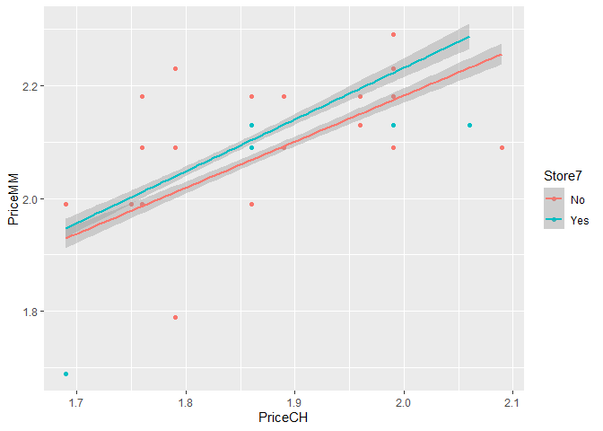
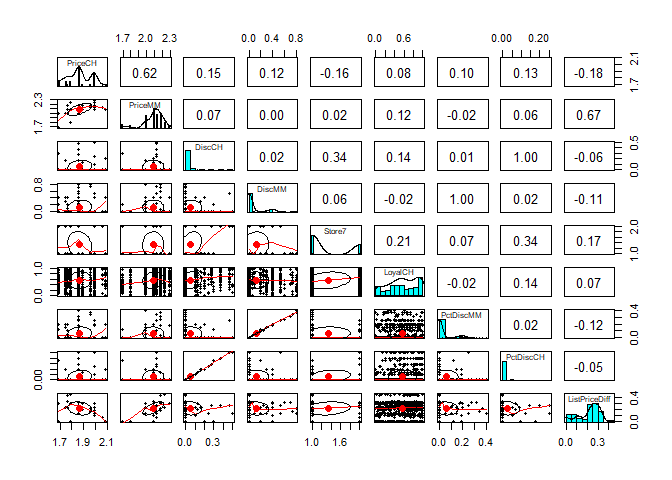
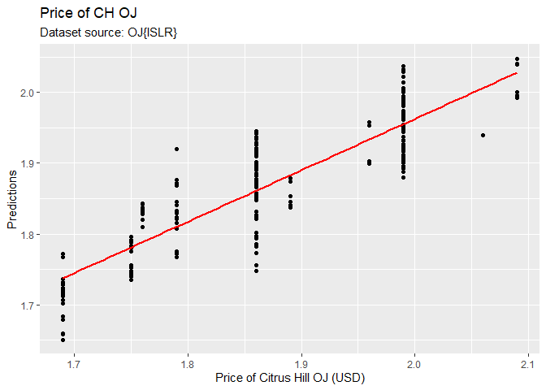
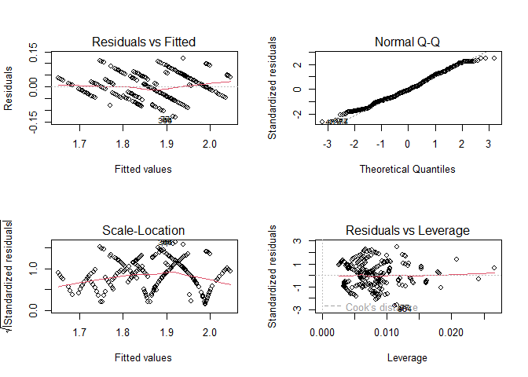
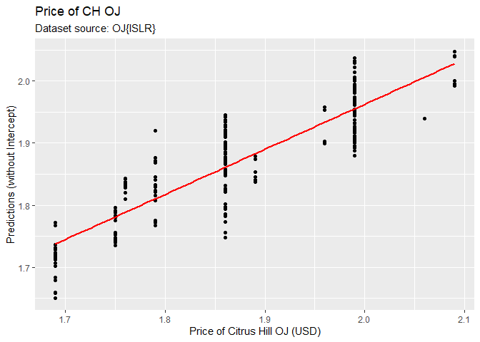
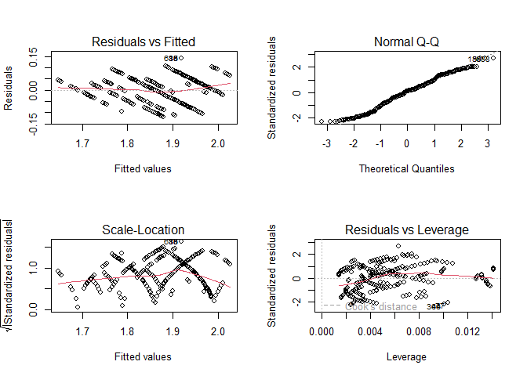
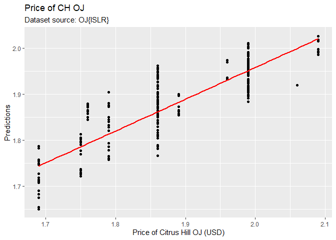
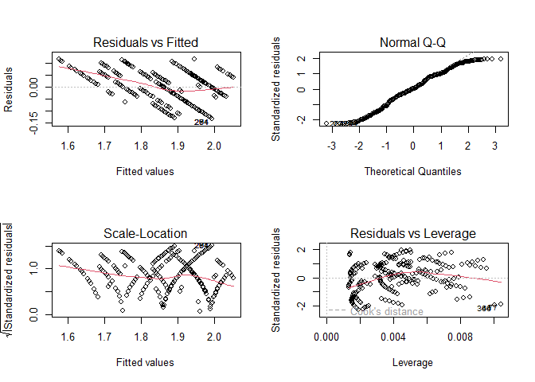
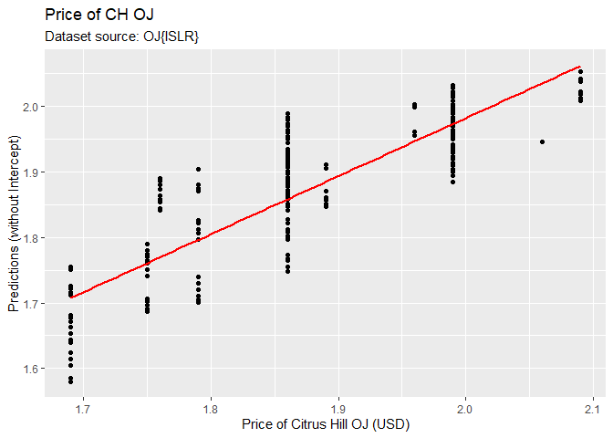

# Load the libraries


# Multiple Linear Regression, Model Coefficients, Measures.

# Load the data: OJ{ISLR}

Using dataset OJ from the ISLR library (see references).


```r
str(OJ)
```

```
## 'data.frame':	1070 obs. of  18 variables:
##  $ Purchase      : Factor w/ 2 levels "CH","MM": 1 1 1 2 1 1 1 1 1 1 ...
##  $ WeekofPurchase: num  237 239 245 227 228 230 232 234 235 238 ...
##  $ StoreID       : num  1 1 1 1 7 7 7 7 7 7 ...
##  $ PriceCH       : num  1.75 1.75 1.86 1.69 1.69 1.69 1.69 1.75 1.75 1.75 ...
##  $ PriceMM       : num  1.99 1.99 2.09 1.69 1.69 1.99 1.99 1.99 1.99 1.99 ...
##  $ DiscCH        : num  0 0 0.17 0 0 0 0 0 0 0 ...
##  $ DiscMM        : num  0 0.3 0 0 0 0 0.4 0.4 0.4 0.4 ...
##  $ SpecialCH     : num  0 0 0 0 0 0 1 1 0 0 ...
##  $ SpecialMM     : num  0 1 0 0 0 1 1 0 0 0 ...
##  $ LoyalCH       : num  0.5 0.6 0.68 0.4 0.957 ...
##  $ SalePriceMM   : num  1.99 1.69 2.09 1.69 1.69 1.99 1.59 1.59 1.59 1.59 ...
##  $ SalePriceCH   : num  1.75 1.75 1.69 1.69 1.69 1.69 1.69 1.75 1.75 1.75 ...
##  $ PriceDiff     : num  0.24 -0.06 0.4 0 0 0.3 -0.1 -0.16 -0.16 -0.16 ...
##  $ Store7        : Factor w/ 2 levels "No","Yes": 1 1 1 1 2 2 2 2 2 2 ...
##  $ PctDiscMM     : num  0 0.151 0 0 0 ...
##  $ PctDiscCH     : num  0 0 0.0914 0 0 ...
##  $ ListPriceDiff : num  0.24 0.24 0.23 0 0 0.3 0.3 0.24 0.24 0.24 ...
##  $ STORE         : num  1 1 1 1 0 0 0 0 0 0 ...
```

Note: There are 1070 observations. This infomation will be needed when calculating the degrees of freedom downstream.

### ggplot PriceCH vs. PriceMM


```r
OJ %>% ggplot(aes(x=PriceCH, y=PriceMM, col = Store7)) +
  geom_point() +
  geom_smooth(method = 'lm')
```

```
## `geom_smooth()` using formula = 'y ~ x'
```

<!-- -->


### pairs.panels


```r
OJ %>% dplyr::select(PriceCH, PriceMM, DiscCH, DiscMM, 
                     Store7, LoyalCH, PctDiscMM, PctDiscCH, ListPriceDiff) %>% 
  pairs.panels()
```

<!-- -->

# Train Test data split


```r
## Split the data: train / test datasets

set.seed(1234)
ind <- sample(2, nrow(OJ), replace = T, prob = c(0.7, 0.3))
train <- OJ[ind == 1,]
test <- OJ[ind == 2,]

dim(train)
```

```
## [1] 747  18
```

```r
dim(test)
```

```
## [1] 323  18
```

# Example 1: Combo numeric and factors

## Fit the model: Train set

Iterate to fit the model. See _anova()_ description a few chunks below.


```r
# You can start with a '+' on the first variable if you want to.
# I like to start with a '+' because it can flexibly add and delete variables
# as I go through the analysis process.
m <- lm(PriceCH ~ 
        +PriceMM 
        +WeekofPurchase
        +DiscCH
        +Store7 
        +STORE
        , train)

# Display the summary with the correlation of the coefficients.
# Put it in a variable to use it downstream.
(summary_m <- summary(m, corr = TRUE))
```

```
## 
## Call:
## lm(formula = PriceCH ~ +PriceMM + WeekofPurchase + DiscCH + Store7 + 
##     STORE, data = train)
## 
## Residuals:
##       Min        1Q    Median        3Q       Max 
## -0.129886 -0.036502 -0.006031  0.033945  0.120855 
## 
## Coefficients:
##                  Estimate Std. Error t value Pr(>|t|)    
## (Intercept)     0.4647322  0.0337556  13.768  < 2e-16 ***
## PriceMM         0.1367351  0.0174425   7.839 1.58e-14 ***
## WeekofPurchase  0.0039965  0.0001581  25.283  < 2e-16 ***
## DiscCH         -0.0247224  0.0179649  -1.376    0.169    
## Store7Yes       0.0721424  0.0068960  10.461  < 2e-16 ***
## STORE           0.0477692  0.0022143  21.573  < 2e-16 ***
## ---
## Signif. codes:  0 '***' 0.001 '**' 0.01 '*' 0.05 '.' 0.1 ' ' 1
## 
## Residual standard error: 0.04929 on 741 degrees of freedom
## Multiple R-squared:  0.7626,	Adjusted R-squared:  0.761 
## F-statistic: 476.1 on 5 and 741 DF,  p-value: < 2.2e-16
## 
## Correlation of Coefficients:
##                (Intercept) PriceMM WeekofPurchase DiscCH Store7Yes
## PriceMM        -0.32                                              
## WeekofPurchase -0.55       -0.61                                  
## DiscCH          0.26        0.22   -0.42                          
## Store7Yes      -0.07       -0.23    0.15          -0.28           
## STORE          -0.05       -0.25    0.13          -0.10   0.81
```

Note: Store7 is a factor variable, and it is quantified only once: Store7Yes. 
It is quantified once and not twice because Store7No would simply be the opposite
to Store7Yes. We only need one dummy variable, therefore.

Note: Residual error has 741 degrees of freedom. 
That is $=n-p-1$, when using the _Intercept_ as we did above.

- Observations in the train dataset: $n = 747$
- Explanatory variables: $p = 5$
- Residual error degrees of freedom: $DF = n - p - 1 = 747 - 5 - 1 = 741$

### Diagnostic plots


```r
par(mfrow = c(2,2))
plot(m)
```

<!-- -->

```r
par(mfrow = c(1,1))
```

### Test the model with anova()

Compare the Pr(>F) with the p-values from the summary of the model They should be comparable.


```r
anova(m)
```

```
## Analysis of Variance Table
## 
## Response: PriceCH
##                 Df  Sum Sq Mean Sq  F value    Pr(>F)    
## PriceMM          1 2.86102 2.86102 1177.841 < 2.2e-16 ***
## WeekofPurchase   1 1.42685 1.42685  587.417 < 2.2e-16 ***
## DiscCH           1 0.02749 0.02749   11.319 0.0008067 ***
## Store7           1 0.33601 0.33601  138.329 < 2.2e-16 ***
## STORE            1 1.13047 1.13047  465.401 < 2.2e-16 ***
## Residuals      741 1.79991 0.00243                       
## ---
## Signif. codes:  0 '***' 0.001 '**' 0.01 '*' 0.05 '.' 0.1 ' ' 1
```

### Predict on test dataset


```r
p <-  predict(m,  test)

# For ggplot we need a dataframe:
df <- data.frame(p, test)
```


### Plot predictions vs actuals


```r
df %>% ggplot(aes(x = PriceCH, y = p)) +
  geom_point() +
  geom_smooth(method = 'lm', col = 'red', se=FALSE) +
  scale_y_continuous('Predictions') +
  scale_x_continuous('Price of Citrus Hill OJ (USD)') +
  ggtitle('Price of CH OJ', 'Dataset source: OJ{ISLR}')
```

```
## `geom_smooth()` using formula = 'y ~ x'
```

<!-- -->

### Assess performance: RMSE and R^2

- Root Mean Squared Error
- R-squared


```r
# RMSE
sqrt(mean((test$PriceCH - p)^2))
```

```
## [1] 0.05199303
```

```r
# R squared
cor(test$PriceCH, p)^2 ## R-Squared
```

```
## [1] 0.7539842
```

# How to get model information

## How to get the attributes


```r
attributes(m)
```

```
## $names
##  [1] "coefficients"  "residuals"     "effects"       "rank"         
##  [5] "fitted.values" "assign"        "qr"            "df.residual"  
##  [9] "contrasts"     "xlevels"       "call"          "terms"        
## [13] "model"        
## 
## $class
## [1] "lm"
```

## Pull the coefficients


```r
m$coefficients
```

```
##    (Intercept)        PriceMM WeekofPurchase         DiscCH      Store7Yes 
##    0.464732187    0.136735099    0.003996492   -0.024722414    0.072142374 
##          STORE 
##    0.047769212
```


## How to get more info: Pull the attributes from summary model


```r
attributes(summary_m)
```

```
## $names
##  [1] "call"          "terms"         "residuals"     "coefficients" 
##  [5] "aliased"       "sigma"         "df"            "r.squared"    
##  [9] "adj.r.squared" "fstatistic"    "cov.unscaled"  "correlation"  
## [13] "symbolic.cor" 
## 
## $class
## [1] "summary.lm"
```

## Get the degrees of freedom: Regression, Residual Error


```r
summary_m$df
```

```
## [1]   6 741   6
```
It's giving us the degrees of freedom with $p + the intercept = 6$.

Worth repeating:

Regression degrees of freedom for the Residual error based on train dataset $= n - p - 1 = 747 - 5 - 1 = 741$

[Reference DAAG page 171]

## Get the model Std. Errors

Statology: "And to only extract the standard errors for each of the individual regression coefficients, we can use the following syntax:"

extract standard error of individual regression coefficients

sqrt(diag(vcov(model)))


```r
# From: https://www.statology.org/extract-standard-error-from-lm-in-r/
# extract standard error of individual regression coefficients
# sqrt(diag(vcov(model)))

sqrt(diag(vcov(m)))
```

```
##    (Intercept)        PriceMM WeekofPurchase         DiscCH      Store7Yes 
##   0.0337555941   0.0174424980   0.0001580674   0.0179648907   0.0068960344 
##          STORE 
##   0.0022142893
```


## Get the Confidence Intervals


```r
# Put it in a variable to get more information later on.
ci_m <- confint(m)
ci_m
```

```
##                       2.5 %      97.5 %
## (Intercept)     0.398464198 0.531000176
## PriceMM         0.102492501 0.170977698
## WeekofPurchase  0.003686178 0.004306805
## DiscCH         -0.059990559 0.010545731
## Store7Yes       0.058604283 0.085680466
## STORE           0.043422185 0.052116240
```

Good to see that the confidence intervals did not cross _zero_.

## Get more information on the C.I.


```r
attributes(ci_m)
```

```
## $dim
## [1] 6 2
## 
## $dimnames
## $dimnames[[1]]
## [1] "(Intercept)"    "PriceMM"        "WeekofPurchase" "DiscCH"        
## [5] "Store7Yes"      "STORE"         
## 
## $dimnames[[2]]
## [1] "2.5 %"  "97.5 %"
```


95% confidence interval for volume:

0.708 ± 2.18×0.0611

Where:

- 0.708 = the average between the two two CI numbers (lower , higher)
- And notice how the coefficient is also the average between the CI,
- 0.708 = Volume coefficient
- 2.18 = t-value for 12 DF from qt(0.975, 12)
- 0.0611 = Standard error found from sqrt(diag(vcov(m)))[2]


### Get the C.I. mean for the 2nd variable: PriceMM


```r
ci_mu <- mean(c(ci_m[2,1], ci_m[2,2]))
ci_mu
```

```
## [1] 0.1367351
```
## t-distribution 95% level: the formula

Reference DAAG page 171.


```r
qt(0.975, 12)
```

```
## [1] 2.178813
```


# Example 2: Without Intercept

## Fit the model without Intercept


```r
# Remove the Intercept by asdding a -1
m_noi <- lm(PriceCH ~ -1
        +PriceMM 
        +WeekofPurchase
        +DiscCH
        +Store7 
        +STORE
        , train)

summary(m_noi)
```

```
## 
## Call:
## lm(formula = PriceCH ~ -1 + PriceMM + WeekofPurchase + DiscCH + 
##     Store7 + STORE, data = train)
## 
## Residuals:
##       Min        1Q    Median        3Q       Max 
## -0.129886 -0.036502 -0.006031  0.033945  0.120855 
## 
## Coefficients:
##                  Estimate Std. Error t value Pr(>|t|)    
## PriceMM         0.1367351  0.0174425   7.839 1.58e-14 ***
## WeekofPurchase  0.0039965  0.0001581  25.283  < 2e-16 ***
## DiscCH         -0.0247224  0.0179649  -1.376    0.169    
## Store7No        0.4647322  0.0337556  13.768  < 2e-16 ***
## Store7Yes       0.5368746  0.0339465  15.815  < 2e-16 ***
## STORE           0.0477692  0.0022143  21.573  < 2e-16 ***
## ---
## Signif. codes:  0 '***' 0.001 '**' 0.01 '*' 0.05 '.' 0.1 ' ' 1
## 
## Residual standard error: 0.04929 on 741 degrees of freedom
## Multiple R-squared:  0.9993,	Adjusted R-squared:  0.9993 
## F-statistic: 1.792e+05 on 6 and 741 DF,  p-value: < 2.2e-16
```
Now, here pay close attention to what the model did with the factor variable.

It created a two dummy variable, one for each level: Store7No and Store7Yes.

### Plots


```r
par(mfrow = c(2,2))
plot(m_noi)
```

<!-- -->

```r
par(mfrow = c(1,1))
```

### Predict on test dataset


```r
p_noi <-  predict(m_noi,  test)

# For ggplot we need a dataframe:
df_noi <- data.frame(p_noi, test)
```

### Plot predictions vs actuals


```r
df_noi %>% ggplot(aes(x = PriceCH, y = p_noi)) +
  geom_point() +
  geom_smooth(method = 'lm', col = 'red', se=FALSE) +
  scale_y_continuous('Predictions (without Intercept)') +
  scale_x_continuous('Price of Citrus Hill OJ (USD)') +
  ggtitle('Price of CH OJ', 'Dataset source: OJ{ISLR}')
```

```
## `geom_smooth()` using formula = 'y ~ x'
```

<!-- -->

### Assess performance: RMSE and R^2

- Root Mean Squared Error
- R-squared


```r
# RMSE
sqrt(mean((test$PriceCH - p_noi)^2))
```

```
## [1] 0.05199303
```

```r
# R squared
cor(test$PriceCH, p_noi)^2 ## R-Squared
```

```
## [1] 0.7539842
```
Interesting same results with or without Intercept.


# Example 3: Numeric explanatory variables (3 of them)

## Fit the model: Train set

Iterate to fit the model. See _anova()_ description a few chunks below.


```r
# You can start with a '+' on the first variable if you want to.
# I like to start with a '+' because it can flexibly add and delete variables
# as I go through the analysis process.
m <- lm(PriceCH ~ 
        +PriceMM 
        +WeekofPurchase
        +STORE
        , train)

# Display the summary with the correlation of the coefficients.
# Put it in a variable to use it downstream.
(summary_m <- summary(m, corr = TRUE))
```

```
## 
## Call:
## lm(formula = PriceCH ~ +PriceMM + WeekofPurchase + STORE, data = train)
## 
## Residuals:
##       Min        1Q    Median        3Q       Max 
## -0.119608 -0.034881  0.005149  0.034250  0.140745 
## 
## Coefficients:
##                 Estimate Std. Error t value Pr(>|t|)    
## (Intercept)    0.4773809  0.0349423  13.662   <2e-16 ***
## PriceMM        0.1745687  0.0179144   9.745   <2e-16 ***
## WeekofPurchase 0.0038491  0.0001538  25.021   <2e-16 ***
## STORE          0.0286057  0.0013668  20.929   <2e-16 ***
## ---
## Signif. codes:  0 '***' 0.001 '**' 0.01 '*' 0.05 '.' 0.1 ' ' 1
## 
## Residual standard error: 0.05281 on 743 degrees of freedom
## Multiple R-squared:  0.7267,	Adjusted R-squared:  0.7256 
## F-statistic: 658.5 on 3 and 743 DF,  p-value: < 2.2e-16
## 
## Correlation of Coefficients:
##                (Intercept) PriceMM WeekofPurchase
## PriceMM        -0.40                             
## WeekofPurchase -0.50       -0.59                 
## STORE          -0.04       -0.15    0.12
```


Note: Degrees of freedom $=n-p-1$, when using the _Intercept_ as we did above.

- Observations in the train dataset: $n = 747$
- Explanatory variables: $p = 3$
- Residual error degrees of freedom: $DF = n - p - 1 = 747 - 3 - 1 = 743$

### Diagnostic plots


```r
par(mfrow = c(2,2))
plot(m)
```

<!-- -->

```r
par(mfrow = c(1,1))
```

### Test the model with anova()

Compare the Pr(>F) with the p-values from the summary of the model They should be comparable.


```r
anova(m)
```

```
## Analysis of Variance Table
## 
## Response: PriceCH
##                 Df Sum Sq Mean Sq F value    Pr(>F)    
## PriceMM          1 2.8610 2.86102 1025.83 < 2.2e-16 ***
## WeekofPurchase   1 1.4268 1.42685  511.60 < 2.2e-16 ***
## STORE            1 1.2217 1.22168  438.04 < 2.2e-16 ***
## Residuals      743 2.0722 0.00279                      
## ---
## Signif. codes:  0 '***' 0.001 '**' 0.01 '*' 0.05 '.' 0.1 ' ' 1
```

### Predict on test dataset


```r
p <-  predict(m,  test)

# For ggplot we need a dataframe:
df <- data.frame(p, test)
```


### Plot predictions vs actuals


```r
df %>% ggplot(aes(x = PriceCH, y = p)) +
  geom_point() +
  geom_smooth(method = 'lm', col = 'red', se=FALSE) +
  scale_y_continuous('Predictions') +
  scale_x_continuous('Price of Citrus Hill OJ (USD)') +
  ggtitle('Price of CH OJ', 'Dataset source: OJ{ISLR}')
```

```
## `geom_smooth()` using formula = 'y ~ x'
```

<!-- -->

### Assess performance: RMSE and R^2

- Root Mean Squared Error
- R-squared


```r
# RMSE
sqrt(mean((test$PriceCH - p)^2))
```

```
## [1] 0.05600214
```

```r
# R squared
cor(test$PriceCH, p)^2 ## R-Squared
```

```
## [1] 0.7140079
```
# Example 4: Without Intercept

## Fit the model without Intercept: Train set

Iterate to fit the model. See _anova()_ description a few chunks below.


```r
# You can start with a '+' on the first variable if you want to.
# I like to start with a '+' because it can flexibly add and delete variables
# as I go through the analysis process.
m_noi <- lm(PriceCH ~ -1
        +PriceMM 
        +WeekofPurchase
        +STORE
        , train)

# Display the summary with the correlation of the coefficients.
summary(m_noi, corr = TRUE)
```

```
## 
## Call:
## lm(formula = PriceCH ~ -1 + PriceMM + WeekofPurchase + STORE, 
##     data = train)
## 
## Residuals:
##       Min        1Q    Median        3Q       Max 
## -0.133496 -0.034634  0.001591  0.049256  0.114761 
## 
## Coefficients:
##                 Estimate Std. Error t value Pr(>|t|)    
## PriceMM        0.2735939  0.0183128   14.94   <2e-16 ***
## WeekofPurchase 0.0049025  0.0001488   32.95   <2e-16 ***
## STORE          0.0293412  0.0015266   19.22   <2e-16 ***
## ---
## Signif. codes:  0 '***' 0.001 '**' 0.01 '*' 0.05 '.' 0.1 ' ' 1
## 
## Residual standard error: 0.05903 on 744 degrees of freedom
## Multiple R-squared:  0.999,	Adjusted R-squared:  0.999 
## F-statistic: 2.497e+05 on 3 and 744 DF,  p-value: < 2.2e-16
## 
## Correlation of Coefficients:
##                PriceMM WeekofPurchase
## WeekofPurchase -1.00                 
## STORE          -0.18    0.12
```

Note: Degrees of freedom $=n-p-1$, when using the _Intercept_ as we did above.

- Observations in the train dataset: $n = 747$
- Explanatory variables: $p = 3$
- Intercept = NO, think of it as $=0$
- Residual error degrees of freedom: $DF = n - p - 0 = 747 - 3 - 0 = 744$

### Plots


```r
par(mfrow = c(2,2))
plot(m_noi)
```

<!-- -->

```r
par(mfrow = c(1,1))
```

### Predict on test dataset


```r
p_noi <-  predict(m_noi,  test)

# For ggplot we need a dataframe:
df_noi <- data.frame(p_noi, test)
```

### Plot predictions vs actuals


```r
df_noi %>% ggplot(aes(x = PriceCH, y = p_noi)) +
  geom_point() +
  geom_smooth(method = 'lm', col = 'red', se=FALSE) +
  scale_y_continuous('Predictions (without Intercept)') +
  scale_x_continuous('Price of Citrus Hill OJ (USD)') +
  ggtitle('Price of CH OJ', 'Dataset source: OJ{ISLR}')
```

```
## `geom_smooth()` using formula = 'y ~ x'
```

<!-- -->

### Assess performance: RMSE and R^2

- Root Mean Squared Error
- R-squared


```r
# RMSE
sqrt(mean((test$PriceCH - p_noi)^2))
```

```
## [1] 0.06115975
```

```r
# R squared
cor(test$PriceCH, p_noi)^2 ## R-Squared
```

```
## [1] 0.7050249
```
Here the performance went down by a little bit only.

# References

1. Harvard STAT 109 2023. Weekly slides by Dr. Bharatendra Rai.
1. Dr. Bharatendra Rai.YouTube channel. https://youtu.be/cW59Yh_GfNk
1. John Maindonald and W. John Braun. "Data Analysis and Graphics Using R". Cambridge. Third Ed. ISBN 978-0-521-76293-9. 5th printing 2016.
1. Gareth James, et al. "And Introduction to Statistical Learning with Applications in R." Springer Science. ISBN 978-1-4614-7137-0. 8th printing 2017. 


