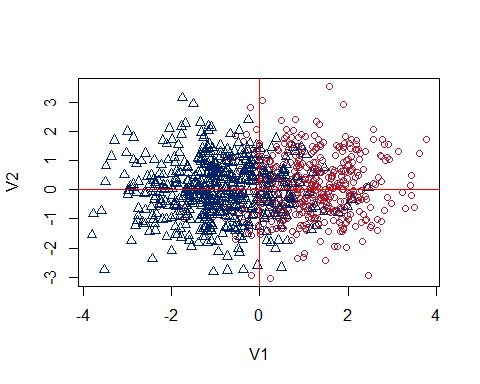
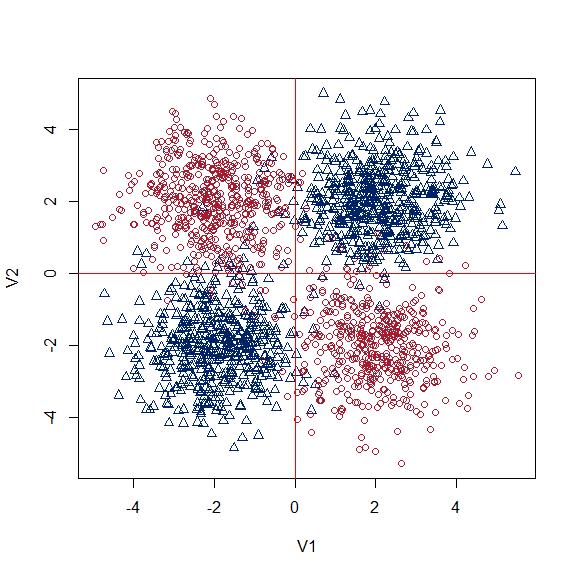
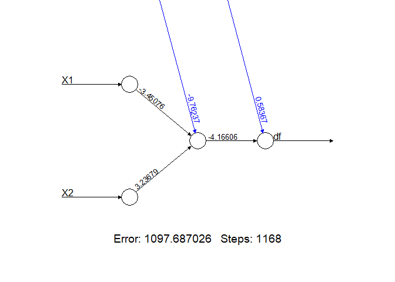
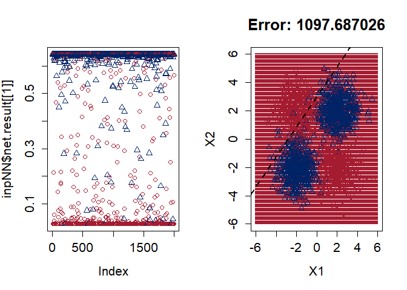
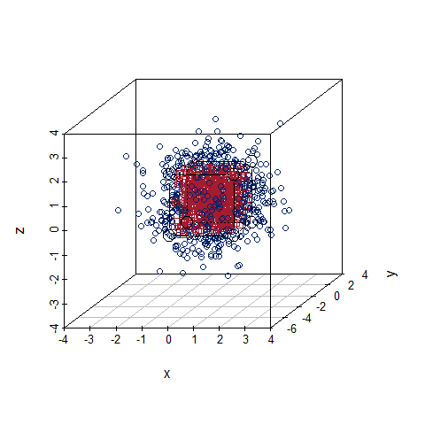
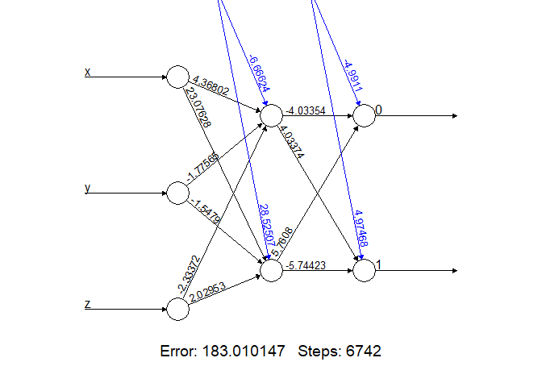
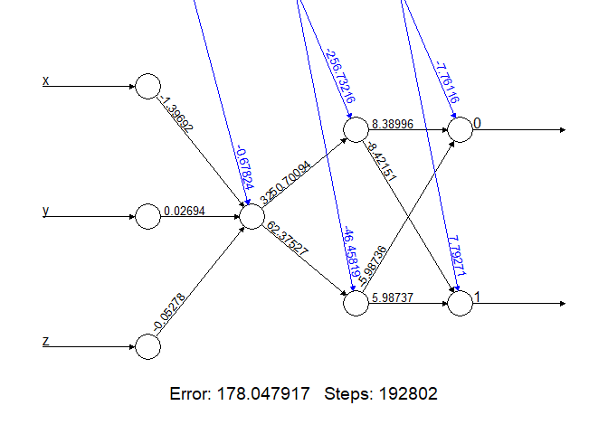

Neural networks on 2D and 3D datasets
================
Oscar A. Trevizo
2023-05-20

- <a href="#load-the-libraries" id="toc-load-the-libraries">Load the
  libraries</a>
- <a href="#functions" id="toc-functions">Functions</a>
  - <a href="#3d-dataset-and-plotting" id="toc-3d-dataset-and-plotting">3D
    dataset and plotting</a>
  - <a href="#nueral-net-functions" id="toc-nueral-net-functions">Nueral Net
    functions</a>
- <a href="#preface-functions" id="toc-preface-functions">Preface
  functions</a>
- <a href="#nn-on-2d-dataset-2-centers-2-category-side-by-side"
  id="toc-nn-on-2d-dataset-2-centers-2-category-side-by-side">NN on 2D
  dataset: 2 centers 2 category side by side</a>
  - <a href="#build-the-dataset" id="toc-build-the-dataset">Build the
    dataset</a>
  - <a href="#fit-the-model" id="toc-fit-the-model">Fit the model</a>
  - <a href="#plot-the-nn" id="toc-plot-the-nn">Plot the NN</a>
- <a href="#2d-dataset-4-centers-2-category"
  id="toc-2d-dataset-4-centers-2-category">2D dataset: 4 centers 2
  category</a>
  - <a href="#build-the-dataset-1" id="toc-build-the-dataset-1">Build the
    dataset</a>
  - <a href="#fit-the-model-1" id="toc-fit-the-model-1">Fit the model</a>
  - <a href="#predict" id="toc-predict">Predict</a>
  - <a href="#plot-predictions" id="toc-plot-predictions">Plot
    predictions</a>
- <a href="#3d-dataset-1-center-2-category-within-our-outside-a-cube"
  id="toc-3d-dataset-1-center-2-category-within-our-outside-a-cube">3D
  dataset: 1 center 2 category within our outside a cube</a>
  - <a href="#build-the-dataset-2" id="toc-build-the-dataset-2">Build the
    dataset</a>
  - <a href="#fit-the-model-1-hidden-node"
    id="toc-fit-the-model-1-hidden-node">Fit the model: 1 hidden node</a>
  - <a href="#system-time-example" id="toc-system-time-example">System time
    example</a>
  - <a href="#fit-the-model-c1-2-hidden-node"
    id="toc-fit-the-model-c1-2-hidden-node">Fit the model: c(1, 2) hidden
    node</a>
  - <a href="#predict-1" id="toc-predict-1">Predict</a>

# Load the libraries

``` r
library(neuralnet)
```

    ## Warning: package 'neuralnet' was built under R version 4.2.3

``` r
library(scatterplot3d)
```

    ## Warning: package 'scatterplot3d' was built under R version 4.2.3

``` r
library(grid)
```

# Functions

## 3D dataset and plotting

``` r
##
#
# 3D dataset with 2 categories: 0 and 1
# Each observation has three variables x, y, z.
# The function creates 3 columns (x, y, z) normally distributed N(0,1) values.
# Category 0 occurs if all x, y, z data point are within a cube. Otherwise category 1.
#
# Arguments:
#   n: Number of observations (rows)
#   b: Cube boundary (float)
#
#
bld_3d_2c <- function(n = 1000, b = 1.25){

  # generate a matrix with normally distributed values N(0,1)
  xyz <- matrix(rnorm(3*n), ncol=3)
  
  # Create a vector of n observations init to 0, for class 0
  cl <- rep(0, n)

  # Test each xyz term to see if any value falls out of its limit
  # If the value falls out of its limit, assign class 1
  for(i in 1:n){
    if (xyz[i,1] > b) cl[i] = 1
    if (xyz[i,2] > b) cl[i] = 1
    if (xyz[i,3] > b) cl[i] = 1
    if (xyz[i,1] < -b) cl[i] = 1
    if (xyz[i,2] < -b) cl[i] = 1
    if (xyz[i,3] < -b) cl[i] = 1
  }

  # Now bind the columns to return all in one matrix
  xyz <- cbind(cl,xyz)
  
  colnames(xyz) <- c("cl", "x", "y", "z")
  
  # Returns a matrix and then one can change to dataframe downstream
  # xyz <- as.data.frame(xyz)
  # 
  # xyz$cl <- as.factor(xyz$cl)

  return(xyz)
}

## 
#
# From help(scatterplot3D) example 6; by Martin Maechler
#
cubedraw <- function(res3d, min = 0, max = 255, cex = 2, text. = FALSE)
{
  ## Purpose: Draw nice cube with corners
  cube01 <- rbind(c(0,0,1), 0, c(1,0,0), c(1,1,0), 1, c(0,1,1), # < 6 outer
                  c(1,0,1), c(0,1,0)) # <- "inner": fore- & back-ground
  cub <- min + (max-min)* cube01
  ## visibile corners + lines:
  res3d$points3d(cub[c(1:6,1,7,3,7,5) ,], cex = cex, type = 'b', lty = 1)
  ## hidden corner + lines
  res3d$points3d(cub[c(2,8,4,8,6),     ], cex = cex, type = 'b', lty = 3)
  if(text.)## debug
      text(res3d$xyz.convert(cub), labels=1:nrow(cub), col=crimson, cex=2)
}
```

## Nueral Net functions

Credit for this funcitons goes to Harvard statistical learning class by
professors Andrey Sivachenko, PhD and Victor A. Farutin, PhD.

# Preface functions

# NN on 2D dataset: 2 centers 2 category side by side

## Build the dataset

``` r
set.seed(1234321)

# Number of observations per category
n <- 1000

# Init a matrix with random samples
# Categories a and b will be placed in two different centers.
ab2d2c <- matrix(rnorm(2*n), ncol=2)

ctr_positions <- 1

# Randomly pull either a -1 or a +1
ab_ctrs_right <- matrix(sample(+1*ctr_positions, n, replace=TRUE), ncol=2)
ab_ctrs_left <- matrix(sample(-1*ctr_positions, n, replace=TRUE), ncol=2)

# Add to the ab random 2D variable to move the centers
ab2d2c[1:(n/2), 1] <- ab2d2c[1:(n/2), 1] + ctr_positions

beg <- n/2 + 1
ab2d2c[beg:n, 1] <-  ab2d2c[beg:n, 1] - ctr_positions

# categories
category <- vector(mode = 'numeric', 1000)
category[1:n/2] <- 'cat0' 
category[((n/2)+1):1000] <- 'cat1' 

# Plot with my colors
plot(ab2d2c ,col=as.numeric(factor(category)), pch=as.numeric(factor(category)), 
     xlab="V1", ylab="V2")
abline(h=0, col = 'red')
abline(v=0, col = 'red')
```

<!-- -->

## Fit the model

``` r
nn2d2c <- neuralnet(df ~ ., data.frame(df = as.numeric(factor(category)), ab2d2c))
```

## Plot the NN

``` r
plot(nn2d2c)
```

<!-- -->
\## Predict

Model predictions recalculated from input variables from field
‘covariate’ and model field ‘weights’. Needs activation function (fields
`weights` and `act.fct`):

``` r
head(nn2d2c$net.result[[1]])
```

    ##          [,1]
    ## [1,] 1.017580
    ## [2,] 1.011511
    ## [3,] 1.009400
    ## [4,] 1.076962
    ## [5,] 1.021115
    ## [6,] 1.577887

``` r
cbind(rep(1,6), nn2d2c$act.fct(cbind(rep(1,6), nn2d2c$covariate[1:6,]) %*% 
                              nn2d2c$weights[[1]][[1]]))%*%nn2d2c$weights[[1]][[2]]
```

    ##          [,1]
    ## [1,] 1.017580
    ## [2,] 1.011511
    ## [3,] 1.009400
    ## [4,] 1.076962
    ## [5,] 1.021115
    ## [6,] 1.577887

# 2D dataset: 4 centers 2 category

## Build the dataset

``` r
set.seed(1234321)

# Number of observations per category
n <- 1000

# Init a matrix with random samples
# Categories a and b will be placed in two different centers.
ab2d4c <- matrix(rnorm(4*n), ncol=2)

ctr_positions <- 2

# Randomly pull either a -1 or a +1
ab_centers <- matrix(sample(c(-1,1)*2, n*4, replace=TRUE), ncol=2)

# We get a mix os +/+, +/-, -/- -/+ times the number of observations
# Use them as locations for each of the sampled dataset observations.
ab2d4c <- ab2d4c + ab_centers

# Apply this formula to classify
# Based on script from Harvard Statistical Learnin by Dr. Sivachenko, Dr. Farutin
# It concatenates a zero or a 1 to the strig 'cat' for category
category <- paste0("cat", (1 + sign(apply(ab_centers, 1, prod)))/2)


# Plot it
plot(ab2d4c ,col=as.numeric(factor(category)), pch=as.numeric(factor(category)), 
     xlab="V1", ylab="V2")
abline(h=0, col = 'red')
abline(v=0, col = 'red')
```

<!-- -->

## Fit the model

``` r
nn2d4c <- neuralnet(df ~ ., data.frame(df = as.numeric(factor(category))-1, ab2d4c),
                    linear.output = FALSE, err.fct="ce")
plot(nn2d4c)
```

<!-- -->

## Predict

Model predictions recalculated from input variables from field
‘covariate’ and model field ‘weights’. Needs activation function (fields
`weights` and `act.fct`):

``` r
head(nn2d4c$net.result[[1]])
```

    ##           [,1]
    ## [1,] 0.6419117
    ## [2,] 0.6419116
    ## [3,] 0.6416252
    ## [4,] 0.6418986
    ## [5,] 0.6419115
    ## [6,] 0.6418916

``` r
quantile(nn2d4c$net.result[[1]])
```

    ##         0%        25%        50%        75%       100% 
    ## 0.02705681 0.50717040 0.64184314 0.64191167 0.64191174

``` r
cbind(rep(1,6), nn2d4c$act.fct(cbind(rep(1,6), nn2d4c$covariate[1:6,]) %*% 
                              nn2d4c$weights[[1]][[1]]))%*%nn2d4c$weights[[1]][[2]]
```

    ##           [,1]
    ## [1,] 0.5836713
    ## [2,] 0.5836707
    ## [3,] 0.5824252
    ## [4,] 0.5836140
    ## [5,] 0.5836703
    ## [6,] 0.5835837

## Plot predictions

``` r
old.par <- par(mfrow=c(1,2),ps=16)
plotNNpreds2D2class(nn2d4c,1.3)
```

<!-- -->

``` r
par(old.par)
```

# 3D dataset: 1 center 2 category within our outside a cube

## Build the dataset

``` r
##
#
# Call the function defined above to return our dataset.
# Then plot using scatterplot3d
# and insert a box based on help(scatterplot3d) function by Martin Maechler
#

# default values are n observations = 1000, x, y, z, limit is 1.25
set.seed(123321)

xyz <- bld_3d_2c()
class(xyz)
```

    ## [1] "matrix" "array"

``` r
dim(xyz)
```

    ## [1] 1000    4

``` r
summary(xyz)
```

    ##        cl              x                  y                  z            
    ##  Min.   :0.000   Min.   :-3.26890   Min.   :-4.24749   Min.   :-3.054616  
    ##  1st Qu.:0.000   1st Qu.:-0.64607   1st Qu.:-0.71121   1st Qu.:-0.660167  
    ##  Median :0.000   Median : 0.10213   Median :-0.05072   Median :-0.014138  
    ##  Mean   :0.498   Mean   : 0.05624   Mean   :-0.03680   Mean   : 0.000756  
    ##  3rd Qu.:1.000   3rd Qu.: 0.70019   3rd Qu.: 0.62941   3rd Qu.: 0.681671  
    ##  Max.   :1.000   Max.   : 3.14482   Max.   : 2.93870   Max.   : 3.409373

``` r
# Plot the cube

colors <- colors[as.numeric(factor(xyz[,1]))]

# http://www.sthda.com/english/wiki/scatterplot3d-3d-graphics-r-software-and-data-visualization
plot3d <- scatterplot3d(xyz[,2:4],
              color = colors,
              pch = xyz[,1])
cubedraw(plot3d, min = -1.25, max = 1.25, cex = 2)
```

<!-- -->

## Fit the model: 1 hidden node

``` r
df <- as.data.frame(xyz)
df$cl <- as.factor(df$cl)

nn3d1c_1h <- neuralnet(cl~., df, hidden=2, stepmax = 1e6,
                         linear.output = FALSE, err.fct = "sse")

# nn3d1c_12h <- neuralnet(cl~., df, hidden=c(1, 2), stepmax = 1e6,
#                          linear.output = FALSE, err.fct = "sse")
plot(nn3d1c_1h)
```

<!-- -->
\## Predict

``` r
head(nn3d1c_1h$net.result[[1]])
```

    ##            [,1]      [,2]
    ## [1,] 0.67135761 0.3286746
    ## [2,] 0.45556782 0.5444796
    ## [3,] 0.68158147 0.3184497
    ## [4,] 0.68199980 0.3180313
    ## [5,] 0.03422672 0.9653852
    ## [6,] 0.67826000 0.3217715

``` r
quantile(nn3d1c_1h$net.result[[1]])
```

    ##         0%        25%        50%        75%       100% 
    ## 0.00674667 0.31707850 0.50002275 0.68295249 0.99314237

## System time example

``` r
#
# Since this is a classification problem, use linear.oputput = FALSE
#
df <- as.data.frame(xyz)
df$cl <- as.factor(df$cl)

system.time(invisible(neuralnet(cl~., df, hidden=2, stepmax = 1e6,
                         linear.output = FALSE, err.fct = "sse")))
```

    ##    user  system elapsed 
    ##    2.00    0.27    2.27

``` r
system.time(invisible(neuralnet(cl~., df, hidden=c(1, 2), stepmax = 1e6,
                         linear.output = FALSE, err.fct = "sse")))
```

    ##    user  system elapsed 
    ##  235.83    2.00  242.30

``` r
# Code with "ce" took too long
# system.time(invisible(neuralnet(cl~., xyz.df, hidden=3, stepmax = 1e6,
#                          linear.output = FALSE, err.fct = "ce")))
```

## Fit the model: c(1, 2) hidden node

``` r
df <- as.data.frame(xyz)
df$cl <- as.factor(df$cl)

nn3d1c_12h <- neuralnet(cl~., df, hidden=c(1, 2), stepmax = 1e6,
                         linear.output = FALSE, err.fct = "sse")

plot(nn3d1c_12h)
```

<!-- -->

## Predict

``` r
head(nn3d1c_12h$net.result[[1]])
```

    ##              [,1]      [,2]
    ## [1,] 0.6522174077 0.3477814
    ## [2,] 0.6522174077 0.3477814
    ## [3,] 0.6522174077 0.3477814
    ## [4,] 0.0004257797 0.9995874
    ## [5,] 0.0560130708 0.9439868
    ## [6,] 0.6522174077 0.3477814

``` r
quantile(nn3d1c_12h$net.result[[1]])
```

    ##           0%          25%          50%          75%         100% 
    ## 0.0004257797 0.3477814299 0.4999994225 0.6522174077 0.9995874360
