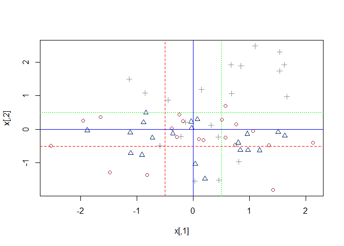
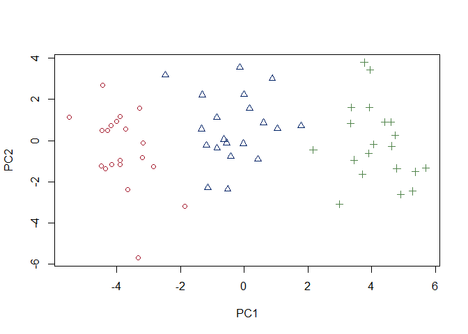

# Principal Components Analysis (PCA)

Function _train()_ "sets up a grid of tuning parameters for a number of classification and regression routines, fits each model and calculates a resampling based performance measure." [Rstudio doc]

This example uses _train()_ to fit a _Random Forest_ model using the OJ{ISLR} dataset.

Additional documentation:

http://topepo.github.io/caret/available-models.html

We will use _Random Forest_ in this example. Search for method value ' _rf_ '. 


# Libraries


# ISLR Chapter 10.7, Exercise10

_"In this problem, you will generate simulated data, and then perform PCA and K-means clustering on the data."_

* "(a) Generate a simulated data set with 20 observations in each of three classes (i.e. 60 observations total), and 50 variables."*

*** "Hint: There are a number of functions in R that you can use to generate data. One example is the `rnorm()` function; `runif()` is another option. Be sure to add a mean shift to the observations in each class so that there are three distinct classes."***

## Build the dataset


```r
# 60 observations with 50 variables. Use rnorm ot simulate the dataset
set.seed(1234321)
x <- matrix(rnorm(60*50),ncol=50)

# Separate 1/3 keep the values between 0 and 1
c <- c(rep(-0.5,20),rep(0,20),rep(0.5,20))

# Re-center
x <- x + c

# Plot the first two variables
plot(x, col=as.numeric(factor(c)), pch=as.numeric(factor(c)))

abline(h=0, col = 'blue',lty=1)
abline(v=0, col = 'blue',lty=1)

abline(h=-0.5, col = 'red',lty=2)
abline(v=-0.5, col = 'red',lty=2)

abline(h=0.5, col = 'green',lty=3)
abline(v=0.5, col = 'green',lty=3)
```

<!-- -->


## PCA: Plot the 1st 2 principal components

* "(b) Perform PCA on the 60 observations and plot the first two principal component score vectors. Use a different color to indicate the observations in each of the three classes. If the three classes appear separated in this plot, then continue on to part (c). If not, then return to part (a) and modify the simulation so that there is greater separation between the three classes. Do not continue to part (c) until the three classes show at least some separation in the first two principal component score vectors."*


```r
plot(prcomp(x)$x[,1:2],col=c(1,2,4)[as.numeric(factor(c))],pch=as.numeric(factor(c)))
```

<!-- -->

## K-means clustering

* "(c) Perform $K$-means clustering of the observations with $K = 3$. How well do the clusters that you obtained in $K$-means clustering compare to the true class labels?"*

*** "Hint: You can use the `table()` function in `R` to compare the true class labels to the class labels obtained by clustering. Be careful how you interpret the results: $K$-means clustering will arbitrarily number the clusters, so you cannot simply check whether the true class labels and clustering labels are the same."***


```r
k <- kmeans(x, 3, nstart=100)
table(k$cluster, c)
```

```
##    c
##     -0.5  0 0.5
##   1    0 20   0
##   2   20  0   0
##   3    0  0  20
```

* "(d) Perform $K$-means clustering with $K = 2$. Describe your results."*


```r
k <- kmeans(x, 2,nstart=100)
table(k$cluster,c)
```

```
##    c
##     -0.5  0 0.5
##   1    0  5  20
##   2   20 15   0
```


# References

* Harvard CSCI Statistical Learning material from Professors Andrey Sivachenko, PhD and Victor A. Farutin, PhD
* Harvard CSCI Statistical Learning material notes from Sihong Ma lecture
* “An Introduction to Statistical Learning with Applications in R” (ISLR) by Gareth James et al

