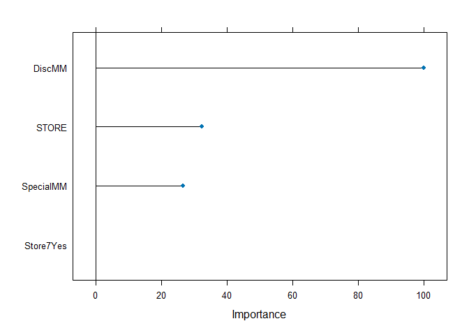
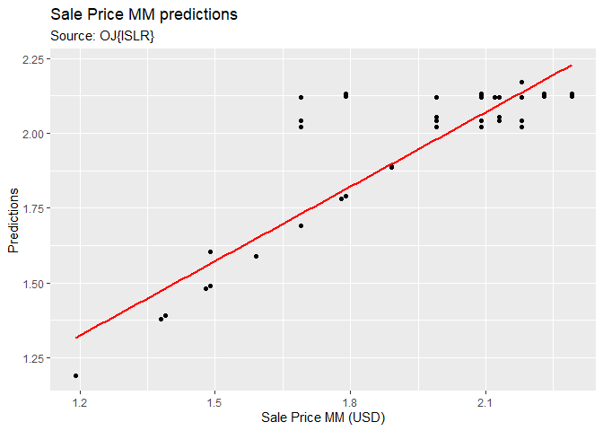

# Random Forest using train{caret}

Function _train()_ "sets up a grid of tuning parameters for a number of classification and regression routines, fits each model and calculates a resampling based performance measure." [Rstudio doc]

This example uses _train()_ to fit a _Random Forest_ model using the OJ{ISLR} dataset.

Additional documention:

http://topepo.github.io/caret/available-models.html

We will use _Random Forest_ in this example. Search for method value ' _rf_ '. 


# Libraries


# Tree-based regression using Random Forest on OJ{ISLR} dataset

Fit a Random Forest regression model for sale price of _Minute Made Orange Juice_ . 

Explore OJ using '?' Rstudio help:

\>?OJ

Orange Juice Data

Description

## Load the data


```r
# load the data:
data(OJ)
str(OJ)
```

```
## 'data.frame':	1070 obs. of  18 variables:
##  $ Purchase      : Factor w/ 2 levels "CH","MM": 1 1 1 2 1 1 1 1 1 1 ...
##  $ WeekofPurchase: num  237 239 245 227 228 230 232 234 235 238 ...
##  $ StoreID       : num  1 1 1 1 7 7 7 7 7 7 ...
##  $ PriceCH       : num  1.75 1.75 1.86 1.69 1.69 1.69 1.69 1.75 1.75 1.75 ...
##  $ PriceMM       : num  1.99 1.99 2.09 1.69 1.69 1.99 1.99 1.99 1.99 1.99 ...
##  $ DiscCH        : num  0 0 0.17 0 0 0 0 0 0 0 ...
##  $ DiscMM        : num  0 0.3 0 0 0 0 0.4 0.4 0.4 0.4 ...
##  $ SpecialCH     : num  0 0 0 0 0 0 1 1 0 0 ...
##  $ SpecialMM     : num  0 1 0 0 0 1 1 0 0 0 ...
##  $ LoyalCH       : num  0.5 0.6 0.68 0.4 0.957 ...
##  $ SalePriceMM   : num  1.99 1.69 2.09 1.69 1.69 1.99 1.59 1.59 1.59 1.59 ...
##  $ SalePriceCH   : num  1.75 1.75 1.69 1.69 1.69 1.69 1.69 1.75 1.75 1.75 ...
##  $ PriceDiff     : num  0.24 -0.06 0.4 0 0 0.3 -0.1 -0.16 -0.16 -0.16 ...
##  $ Store7        : Factor w/ 2 levels "No","Yes": 1 1 1 1 2 2 2 2 2 2 ...
##  $ PctDiscMM     : num  0 0.151 0 0 0 ...
##  $ PctDiscCH     : num  0 0 0.0914 0 0 ...
##  $ ListPriceDiff : num  0.24 0.24 0.23 0 0 0.3 0.3 0.24 0.24 0.24 ...
##  $ STORE         : num  1 1 1 1 0 0 0 0 0 0 ...
```

```r
head(OJ)
```

```
##   Purchase WeekofPurchase StoreID PriceCH PriceMM DiscCH DiscMM SpecialCH
## 1       CH            237       1    1.75    1.99   0.00    0.0         0
## 2       CH            239       1    1.75    1.99   0.00    0.3         0
## 3       CH            245       1    1.86    2.09   0.17    0.0         0
## 4       MM            227       1    1.69    1.69   0.00    0.0         0
## 5       CH            228       7    1.69    1.69   0.00    0.0         0
## 6       CH            230       7    1.69    1.99   0.00    0.0         0
##   SpecialMM  LoyalCH SalePriceMM SalePriceCH PriceDiff Store7 PctDiscMM
## 1         0 0.500000        1.99        1.75      0.24     No  0.000000
## 2         1 0.600000        1.69        1.75     -0.06     No  0.150754
## 3         0 0.680000        2.09        1.69      0.40     No  0.000000
## 4         0 0.400000        1.69        1.69      0.00     No  0.000000
## 5         0 0.956535        1.69        1.69      0.00    Yes  0.000000
## 6         1 0.965228        1.99        1.69      0.30    Yes  0.000000
##   PctDiscCH ListPriceDiff STORE
## 1  0.000000          0.24     1
## 2  0.000000          0.24     1
## 3  0.091398          0.23     1
## 4  0.000000          0.00     1
## 5  0.000000          0.00     0
## 6  0.000000          0.30     0
```

Notes about the dataset:

> Variable _Purchase_ is a 2-level factor with values _CH_ ($1$) or _MM_ ($2$).

> The dataset has separate columns for _sale prices_ of _CH_ and _MM_.

> We are interested in the _sale price_ of _MM_: _SalePriceMM_.We want to predict it, but
we do not want to take _PriceMM_, nor _PriceDiff_ into account.


## Split the data: train / test datasets


```r
set.seed(1234)
ind <- sample(2, nrow(OJ), replace = T, prob = c(0.7, 0.3))
train <- OJ[ind == 1,]
test <- OJ[ind == 2,]
```


## Fit the model: Sale price of MM vs some variables

To predict SalePriceMM, remove -PriceMM -PriceDiff, -ListPriceDiff from the formula. Otherwise, the accuracy will 
be too high. We want to challenge the model at least a little bit.


```r
set.seed(1234)
cvcontrol <- trainControl(method="repeatedcv",
                          number = 5,
                          repeats = 2,
                          allowParallel=TRUE)

set.seed(1234)
forest <- train(SalePriceMM ~ 
                +STORE
                +DiscMM
                +SpecialMM
                +Store7,
                data=OJ,
                method="rf",
                trControl=cvcontrol,
                importance=TRUE)
```

### Top contributors


```r
# Put the important variables in a dataframe for convenience
contributors <- varImp(forest)$importance

# Note, each contributor is a row. There is one column containing the importance score.
#(contributors_names <- rownames(contributors$importance))

# Arrange them top to bottom:
contributors %>% dplyr::select(Overall) %>% arrange(desc(Overall))
```

```
##             Overall
## DiscMM    100.00000
## STORE      32.43674
## SpecialMM  26.71921
## Store7Yes   0.00000
```

### plot the model


```r
plot(varImp(forest))
```

<!-- -->

### See what RF did on train dataset


```r
forest
```

```
## Random Forest 
## 
## 1070 samples
##    4 predictor
## 
## No pre-processing
## Resampling: Cross-Validated (5 fold, repeated 2 times) 
## Summary of sample sizes: 857, 856, 856, 855, 856, 856, ... 
## Resampling results across tuning parameters:
## 
##   mtry  RMSE       Rsquared   MAE       
##   2     0.1153483  0.7956248  0.07931460
##   3     0.1122843  0.8021685  0.06835454
##   4     0.1121406  0.8026898  0.06624390
## 
## RMSE was used to select the optimal model using the smallest value.
## The final value used for the model was mtry = 4.
```

### Predict on test dataset


```r
rf <-  predict(forest,  test)

# For ggplot we need a dataframe:
rf_df <- data.frame(rf, test)
```

### Plot predictions vs actuals


```r
rf_df %>% ggplot(aes(x = SalePriceMM, y = rf)) +
  geom_point() +
  geom_smooth(method = 'lm', col = 'red', se=FALSE) +
  scale_y_continuous('Predictions') +
  scale_x_continuous('Sale Price MM (USD)') +
  ggtitle('Sale Price MM predictions', 'Source: OJ{ISLR}')
```

```
## `geom_smooth()` using formula = 'y ~ x'
```

<!-- -->

### Prediction performance

- Root Mean Squared Error
- R-squared


```r
# RMSE
sqrt(mean((test$SalePriceMM - rf)^2))
```

```
## [1] 0.1043353
```

```r
# R squared
cor(test$SalePriceMM, rf)^2 ## R-Squared
```

```
## [1] 0.8376638
```


## Fine-tune the model: Change mtry

Model _rf_ from _train()_ has a tuning parameter _mtry_. Parameter _mtry_ is the number of predictors randomly selected by _rf_.

To change the value of _mtry_, use _train()_ parameter _tuneGrid_. Parameter _tuneGrid_ is a dataframe with possible tuning values.


### Verify tuning paramaters


```r
modelLookup('rf')
```

```
##   model parameter                         label forReg forClass probModel
## 1    rf      mtry #Randomly Selected Predictors   TRUE     TRUE      TRUE
```

### Get model information


```r
getModelInfo(model = 'rf')
```

```
## $qrf
## $qrf$label
## [1] "Quantile Random Forest"
## 
## $qrf$library
## [1] "quantregForest"
## 
## $qrf$loop
## NULL
## 
## $qrf$type
## [1] "Regression"
## 
## $qrf$parameters
##   parameter   class                         label
## 1      mtry numeric #Randomly Selected Predictors
## 
## $qrf$grid
## function (x, y, len = NULL, search = "grid") 
## {
##     if (search == "grid") {
##         out <- data.frame(mtry = caret::var_seq(p = ncol(x), 
##             classification = is.factor(y), len = len))
##     }
##     else {
##         out <- data.frame(mtry = unique(sample(1:ncol(x), size = len, 
##             replace = TRUE)))
##     }
##     out
## }
## 
## $qrf$fit
## function (x, y, wts, param, lev, last, classProbs, ...) 
## quantregForest::quantregForest(x, y, mtry = min(param$mtry, ncol(x)), 
##     ...)
## 
## $qrf$predict
## function (modelFit, newdata, submodels = NULL) 
## {
##     out <- predict(modelFit, newdata, what = 0.5)
##     if (is.matrix(out)) 
##         out <- out[, 1]
##     out
## }
## 
## $qrf$prob
## NULL
## 
## $qrf$tags
## [1] "Random Forest"              "Ensemble Model"            
## [3] "Bagging"                    "Implicit Feature Selection"
## [5] "Quantile Regression"        "Robust Model"              
## 
## $qrf$sort
## function (x) 
## x[order(x[, 1]), ]
## 
## 
## $rf
## $rf$label
## [1] "Random Forest"
## 
## $rf$library
## [1] "randomForest"
## 
## $rf$loop
## NULL
## 
## $rf$type
## [1] "Classification" "Regression"    
## 
## $rf$parameters
##   parameter   class                         label
## 1      mtry numeric #Randomly Selected Predictors
## 
## $rf$grid
## function (x, y, len = NULL, search = "grid") 
## {
##     if (search == "grid") {
##         out <- data.frame(mtry = caret::var_seq(p = ncol(x), 
##             classification = is.factor(y), len = len))
##     }
##     else {
##         out <- data.frame(mtry = unique(sample(1:ncol(x), size = len, 
##             replace = TRUE)))
##     }
## }
## 
## $rf$fit
## function (x, y, wts, param, lev, last, classProbs, ...) 
## randomForest::randomForest(x, y, mtry = param$mtry, ...)
## 
## $rf$predict
## function (modelFit, newdata, submodels = NULL) 
## if (!is.null(newdata)) predict(modelFit, newdata) else predict(modelFit)
## 
## $rf$prob
## function (modelFit, newdata, submodels = NULL) 
## if (!is.null(newdata)) predict(modelFit, newdata, type = "prob") else predict(modelFit, 
##     type = "prob")
## 
## $rf$predictors
## function (x, ...) 
## {
##     varIndex <- as.numeric(names(table(x$forest$bestvar)))
##     varIndex <- varIndex[varIndex > 0]
##     varsUsed <- names(x$forest$ncat)[varIndex]
##     varsUsed
## }
## 
## $rf$varImp
## function (object, ...) 
## {
##     varImp <- randomForest::importance(object, ...)
##     if (object$type == "regression") {
##         if ("%IncMSE" %in% colnames(varImp)) {
##             varImp <- data.frame(Overall = varImp[, "%IncMSE"])
##         }
##         else {
##             varImp <- data.frame(Overall = varImp[, 1])
##         }
##     }
##     else {
##         retainNames <- levels(object$y)
##         if (all(retainNames %in% colnames(varImp))) {
##             varImp <- varImp[, retainNames]
##         }
##         else {
##             varImp <- data.frame(Overall = varImp[, 1])
##         }
##     }
##     out <- as.data.frame(varImp, stringsAsFactors = TRUE)
##     if (dim(out)[2] == 2) {
##         tmp <- apply(out, 1, mean)
##         out[, 1] <- out[, 2] <- tmp
##     }
##     out
## }
## 
## $rf$levels
## function (x) 
## x$classes
## 
## $rf$tags
## [1] "Random Forest"              "Ensemble Model"            
## [3] "Bagging"                    "Implicit Feature Selection"
## 
## $rf$sort
## function (x) 
## x[order(x[, 1]), ]
## 
## $rf$oob
## function (x) 
## {
##     out <- switch(x$type, regression = c(sqrt(max(x$mse[length(x$mse)], 
##         0)), x$rsq[length(x$rsq)]), classification = c(1 - x$err.rate[x$ntree, 
##         "OOB"], e1071::classAgreement(x$confusion[, -dim(x$confusion)[2]])[["kappa"]]))
##     names(out) <- if (x$type == "regression") 
##         c("RMSE", "Rsquared")
##     else c("Accuracy", "Kappa")
##     out
## }
## 
## 
## $rfRules
## $rfRules$label
## [1] "Random Forest Rule-Based Model"
## 
## $rfRules$library
## [1] "randomForest" "inTrees"      "plyr"        
## 
## $rfRules$type
## [1] "Classification" "Regression"    
## 
## $rfRules$parameters
##   parameter   class                         label
## 1      mtry numeric #Randomly Selected Predictors
## 2  maxdepth numeric            Maximum Rule Depth
## 
## $rfRules$grid
## function (x, y, len = NULL, search = "grid") 
## {
##     if (search == "grid") {
##         out <- data.frame(mtry = caret::var_seq(p = ncol(x), 
##             classification = is.factor(y), len = len), maxdepth = (1:len) + 
##             1)
##     }
##     else {
##         out <- data.frame(mtry = sample(1:ncol(x), size = len, 
##             replace = TRUE), maxdepth = sample(1:15, size = len, 
##             replace = TRUE))
##     }
## }
## 
## $rfRules$loop
## function (grid) 
## {
##     loop <- plyr::ddply(grid, c("mtry"), function(x) c(maxdepth = max(x$maxdepth)))
##     submodels <- vector(mode = "list", length = nrow(loop))
##     for (i in seq(along = loop$maxdepth)) {
##         index <- which(grid$mtry == loop$mtry[i])
##         trees <- grid[index, "maxdepth"]
##         submodels[[i]] <- data.frame(maxdepth = trees[trees != 
##             loop$maxdepth[i]])
##     }
##     list(loop = loop, submodels = submodels)
## }
## 
## $rfRules$fit
## function (x, y, wts, param, lev, last, classProbs, ...) 
## {
##     if (!is.data.frame(x) | inherits(x, "tbl_df")) 
##         x <- as.data.frame(x, stringsAsFactors = TRUE)
##     RFor <- randomForest::randomForest(x, y, mtry = min(param$mtry, 
##         ncol(x)), ...)
##     treeList <- inTrees::RF2List(RFor)
##     exec <- inTrees::extractRules(treeList, x, maxdepth = param$maxdepth, 
##         ntree = RFor$ntree)
##     ruleMetric <- inTrees::getRuleMetric(exec, x, y)
##     ruleMetric <- inTrees::pruneRule(ruleMetric, x, y)
##     ruleMetric <- inTrees::selectRuleRRF(ruleMetric, x, y)
##     out <- list(model = inTrees::buildLearner(ruleMetric, x, 
##         y))
##     if (!last) {
##         out$rf <- treeList
##         out$x <- x
##         out$y <- y
##         out$trees <- RFor$ntree
##     }
##     out
## }
## 
## $rfRules$predict
## function (modelFit, newdata, submodels = NULL) 
## {
##     if (!is.data.frame(newdata) | inherits(newdata, "tbl_df")) 
##         newdata <- as.data.frame(newdata, stringsAsFactors = TRUE)
##     out <- inTrees::applyLearner(modelFit$model, newdata)
##     if (modelFit$problemType == "Regression") 
##         out <- as.numeric(out)
##     if (!is.null(submodels)) {
##         tmp <- vector(mode = "list", length = nrow(submodels) + 
##             1)
##         tmp[[1]] <- if (is.matrix(out)) 
##             out[, 1]
##         else out
##         for (i in seq(along = submodels$maxdepth)) {
##             exec <- inTrees::extractRules(modelFit$rf, modelFit$x, 
##                 maxdepth = submodels$maxdepth[i], ntree = modelFit$trees)
##             ruleMetric <- inTrees::getRuleMetric(exec, modelFit$x, 
##                 modelFit$y)
##             ruleMetric <- inTrees::pruneRule(ruleMetric, modelFit$x, 
##                 modelFit$y)
##             ruleMetric <- inTrees::selectRuleRRF(ruleMetric, 
##                 modelFit$x, modelFit$y)
##             mod <- inTrees::buildLearner(ruleMetric, modelFit$x, 
##                 modelFit$y)
##             tmp[[i + 1]] <- inTrees::applyLearner(mod, newdata)
##             if (modelFit$problemType == "Regression") 
##                 tmp[[i + 1]] <- as.numeric(tmp[[i + 1]])
##         }
##         out <- tmp
##     }
##     out
## }
## 
## $rfRules$prob
## NULL
## 
## $rfRules$predictors
## function (x, ...) 
## {
##     split_up <- strsplit(x$model[, "condition"], "&")
##     isolate <- function(x) {
##         index <- gregexpr("]", x, fixed = TRUE)
##         out <- NULL
##         for (i in seq_along(index)) {
##             if (all(index[[i]] > 0)) {
##                 tmp <- substring(x[i], 1, index[[i]][1])
##                 tmp <- gsub("(X)|(\\[)|(\\])|(,)|( )", "", tmp)
##                 tmp <- tmp[tmp != ""]
##                 out <- c(out, as.numeric(tmp))
##             }
##         }
##         as.numeric(unique(out))
##     }
##     var_index <- unique(unlist(lapply(split_up, isolate)))
##     if (length(var_index) > 0) 
##         x$xNames[var_index]
##     else NULL
## }
## 
## $rfRules$varImp
## function (object, ...) 
## {
##     split_up <- strsplit(object$model[, "condition"], "&")
##     isolate <- function(x) {
##         index <- gregexpr("]", x, fixed = TRUE)
##         out <- NULL
##         for (i in seq_along(index)) {
##             if (all(index[[i]] > 0)) {
##                 tmp <- substring(x[i], 1, index[[i]][1])
##                 tmp <- gsub("(X)|(\\[)|(\\])|(,)|( )", "", tmp)
##                 tmp <- tmp[tmp != ""]
##                 out <- c(out, as.numeric(tmp))
##             }
##         }
##         as.numeric(unique(out))
##     }
##     var_index <- lapply(split_up, isolate)
##     vars_dat <- lapply(var_index, function(x, p) {
##         out <- rep(0, p)
##         if (length(x) > 0) 
##             out[x] <- 1
##         out
##     }, p = length(object$xNames))
##     vars_dat <- do.call("rbind", vars_dat)
##     colnames(vars_dat) <- object$xNames
##     freqs <- as.numeric(object$model[, "freq"])
##     vars_dat <- vars_dat * freqs
##     var_imp <- apply(vars_dat, 2, sum)
##     out <- data.frame(Overall = as.vector(var_imp))
##     rownames(out) <- names(var_imp)
##     out
## }
## 
## $rfRules$levels
## function (x) 
## x$obsLevels
## 
## $rfRules$tags
## [1] "Random Forest"              "Ensemble Model"            
## [3] "Bagging"                    "Implicit Feature Selection"
## [5] "Rule-Based Model"          
## 
## $rfRules$sort
## function (x) 
## x[order(x[, "maxdepth"]), ]
## 
## 
## $wsrf
## $wsrf$label
## [1] "Weighted Subspace Random Forest"
## 
## $wsrf$library
## [1] "wsrf"
## 
## $wsrf$loop
## NULL
## 
## $wsrf$type
## [1] "Classification"
## 
## $wsrf$parameters
##   parameter   class                         label
## 1      mtry numeric #Randomly Selected Predictors
## 
## $wsrf$grid
## function (x, y, len = NULL, search = "grid") 
## {
##     if (search == "grid") {
##         out <- data.frame(mtry = caret::var_seq(p = ncol(x), 
##             classification = is.factor(y), len = len))
##     }
##     else {
##         out <- data.frame(mtry = unique(sample(1:ncol(x), size = len, 
##             replace = TRUE)))
##     }
##     out
## }
## 
## $wsrf$fit
## function (x, y, wts, param, lev, last, classProbs, ...) 
## {
##     dat <- if (is.data.frame(x)) 
##         x
##     else as.data.frame(x, stringsAsFactors = TRUE)
##     dat$.outcome <- y
##     wsrf::wsrf(.outcome ~ ., data = dat, mtry = min(param$mtry, 
##         ncol(x)), ...)
## }
## 
## $wsrf$predict
## function (modelFit, newdata, submodels = NULL) 
## {
##     if (!is.data.frame(newdata)) 
##         newdata <- as.data.frame(newdata, stringsAsFactors = TRUE)
##     predict(modelFit, newdata)$class
## }
## 
## $wsrf$prob
## function (modelFit, newdata, submodels = NULL) 
## {
##     if (!is.data.frame(newdata)) 
##         newdata <- as.data.frame(newdata, stringsAsFactors = TRUE)
##     predict(modelFit, newdata, type = "prob")$prob
## }
## 
## $wsrf$predictors
## function (x, ...) 
## x$xNames
## 
## $wsrf$varImp
## NULL
## 
## $wsrf$levels
## function (x) 
## x$obsLevels
## 
## $wsrf$tags
## [1] "Random Forest"              "Ensemble Model"            
## [3] "Bagging"                    "Implicit Feature Selection"
## 
## $wsrf$sort
## function (x) 
## x[order(x[, 1]), ]
```

See example online:

Examples for tuning _RF_:
https://rpubs.com/phamdinhkhanh/389752

Another interesting use case is:
https://machinelearningmastery.com/tune-machine-learning-algorithms-in-r/

### Fit the mode using mtry = 9


```r
# Typically mtry is based on the number of variables
# mtry <- sqrt(ncol(NUMBER_OF_VARIABLES))

# In this example we will force to be 5
mtry = 4
tunegrid <- expand.grid(.mtry=mtry)

set.seed(1234)
forest <- train(SalePriceMM ~ 
                +STORE
                +DiscMM
                +SpecialMM
                +Store7,
                data=OJ,
                method="rf",
                tuneGrid = tunegrid,
                trControl=cvcontrol,
                importance=TRUE)
```

### Verify top contributors in updated model


```r
# Put the important variables in a dataframe for convenience
contributors <- varImp(forest)$importance

# Note, each contributor is a row. There is one column containing the importance score.
#(contributors_names <- rownames(contributors$importance))

# Arrange them top to bottom:
contributors %>% dplyr::select(Overall) %>% arrange(desc(Overall))
```

```
##             Overall
## DiscMM    100.00000
## STORE      34.16202
## SpecialMM  31.91219
## Store7Yes   0.00000
```

Some numbers did change.


### See what RF did on train dataset


```r
forest
```

```
## Random Forest 
## 
## 1070 samples
##    4 predictor
## 
## No pre-processing
## Resampling: Cross-Validated (5 fold, repeated 2 times) 
## Summary of sample sizes: 857, 856, 856, 855, 856, 856, ... 
## Resampling results:
## 
##   RMSE       Rsquared   MAE       
##   0.1121741  0.8025847  0.06623864
## 
## Tuning parameter 'mtry' was held constant at a value of 4
```

### Predict on test dataset


```r
rf <-  predict(forest,  test)

# For ggplot we need a dataframe:
rf_df <- data.frame(rf, test)
```

### Plot predictions vs actuals


```r
rf_df %>% ggplot(aes(x = SalePriceMM, y = rf)) +
  geom_point() +
  geom_smooth(method = 'lm', col = 'red', se=FALSE) +
  scale_y_continuous('Predictions') +
  scale_x_continuous('Sale Price MM (USD)') +
  ggtitle('Sale Price MM predictions', 'Source: OJ{ISLR}')
```

```
## `geom_smooth()` using formula = 'y ~ x'
```

<!-- -->

### Prediction performance

- Root Mean Squared Error
- R-squared


```r
# RMSE
sqrt(mean((test$SalePriceMM - rf)^2))
```

```
## [1] 0.104345
```

```r
# R squared
cor(test$SalePriceMM, rf)^2 ## R-Squared
```

```
## [1] 0.837615
```


