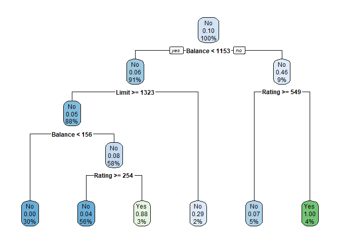
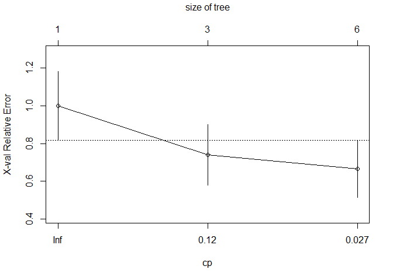
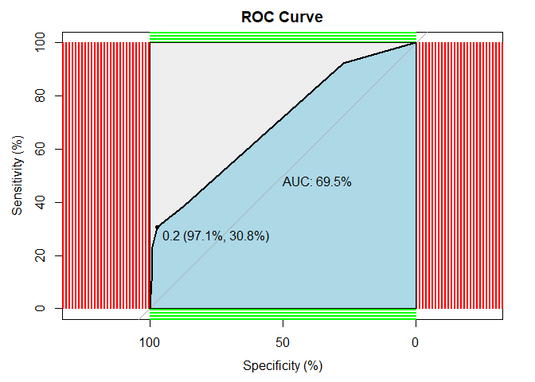

# Random Forest using train{caret}

Function _train()_ "sets up a grid of tuning parameters for a number of classification and regression routines, fits each model and calculates a resampling based performance measure." [Rstudio doc]

This example uses _train()_ to fit a _Random Forest_ model using the OJ{ISLR} dataset.

Additional documention:

http://topepo.github.io/caret/available-models.html

We will use _Random Forest_ in this example. Search for method value ' _rf_ '. 


# Libraries


# Classification Tree. Credit{ISLR}

## EDA


```r
str(Credit)
```

```
## 'data.frame':	400 obs. of  12 variables:
##  $ ID       : int  1 2 3 4 5 6 7 8 9 10 ...
##  $ Income   : num  14.9 106 104.6 148.9 55.9 ...
##  $ Limit    : int  3606 6645 7075 9504 4897 8047 3388 7114 3300 6819 ...
##  $ Rating   : int  283 483 514 681 357 569 259 512 266 491 ...
##  $ Cards    : int  2 3 4 3 2 4 2 2 5 3 ...
##  $ Age      : int  34 82 71 36 68 77 37 87 66 41 ...
##  $ Education: int  11 15 11 11 16 10 12 9 13 19 ...
##  $ Gender   : Factor w/ 2 levels " Male","Female": 1 2 1 2 1 1 2 1 2 2 ...
##  $ Student  : Factor w/ 2 levels "No","Yes": 1 2 1 1 1 1 1 1 1 2 ...
##  $ Married  : Factor w/ 2 levels "No","Yes": 2 2 1 1 2 1 1 1 1 2 ...
##  $ Ethnicity: Factor w/ 3 levels "African American",..: 3 2 2 2 3 3 1 2 3 1 ...
##  $ Balance  : int  333 903 580 964 331 1151 203 872 279 1350 ...
```

```r
head(Credit)
```

```
##   ID  Income Limit Rating Cards Age Education Gender Student Married Ethnicity
## 1  1  14.891  3606    283     2  34        11   Male      No     Yes Caucasian
## 2  2 106.025  6645    483     3  82        15 Female     Yes     Yes     Asian
## 3  3 104.593  7075    514     4  71        11   Male      No      No     Asian
## 4  4 148.924  9504    681     3  36        11 Female      No      No     Asian
## 5  5  55.882  4897    357     2  68        16   Male      No     Yes Caucasian
## 6  6  80.180  8047    569     4  77        10   Male      No      No Caucasian
##   Balance
## 1     333
## 2     903
## 3     580
## 4     964
## 5     331
## 6    1151
```

```r
summary(Credit)
```

```
##        ID            Income           Limit           Rating     
##  Min.   :  1.0   Min.   : 10.35   Min.   :  855   Min.   : 93.0  
##  1st Qu.:100.8   1st Qu.: 21.01   1st Qu.: 3088   1st Qu.:247.2  
##  Median :200.5   Median : 33.12   Median : 4622   Median :344.0  
##  Mean   :200.5   Mean   : 45.22   Mean   : 4736   Mean   :354.9  
##  3rd Qu.:300.2   3rd Qu.: 57.47   3rd Qu.: 5873   3rd Qu.:437.2  
##  Max.   :400.0   Max.   :186.63   Max.   :13913   Max.   :982.0  
##      Cards            Age          Education        Gender    Student  
##  Min.   :1.000   Min.   :23.00   Min.   : 5.00    Male :193   No :360  
##  1st Qu.:2.000   1st Qu.:41.75   1st Qu.:11.00   Female:207   Yes: 40  
##  Median :3.000   Median :56.00   Median :14.00                         
##  Mean   :2.958   Mean   :55.67   Mean   :13.45                         
##  3rd Qu.:4.000   3rd Qu.:70.00   3rd Qu.:16.00                         
##  Max.   :9.000   Max.   :98.00   Max.   :20.00                         
##  Married              Ethnicity      Balance       
##  No :155   African American: 99   Min.   :   0.00  
##  Yes:245   Asian           :102   1st Qu.:  68.75  
##            Caucasian       :199   Median : 459.50  
##                                   Mean   : 520.01  
##                                   3rd Qu.: 863.00  
##                                   Max.   :1999.00
```

## Split the data: train / test datasets


```r
set.seed(1234)
ind <- sample(2, nrow(Credit), replace = T, prob = c(0.7, 0.3))
train <- Credit[ind == 1,]
test <- Credit[ind == 2,]
```


### Fit the model 


```r
# regression tree
set.seed(12321)
tree <- rpart(Student ~
              +Income
              +Limit
              +Rating
              +Gender
              +Age
              +Balance
              , data = train)
```

### Plotthe model


```r
rpart.plot(tree)
```

<!-- -->

```r
printcp(tree)
```

```
## 
## Classification tree:
## rpart(formula = Student ~ +Income + Limit + Rating + Gender + 
##     Age + Balance, data = train)
## 
## Variables actually used in tree construction:
## [1] Balance Limit   Rating 
## 
## Root node error: 27/284 = 0.09507
## 
## n= 284 
## 
##         CP nsplit rel error  xerror    xstd
## 1 0.203704      0   1.00000 1.00000 0.18307
## 2 0.074074      2   0.59259 0.74074 0.15970
## 3 0.010000      5   0.37037 0.66667 0.15207
```

```r
plotcp(tree)
```

<!-- -->

### Predict


```r
p <- predict(tree, test, type = 'class')

p_df <- data.frame(p, test)
```

### Prediction performance

#### Confusion matrix: Test dataset


```r
confusionMatrix(p, test$Student)
```

```
## Confusion Matrix and Statistics
## 
##           Reference
## Prediction  No Yes
##        No  102  10
##        Yes   1   3
##                                           
##                Accuracy : 0.9052          
##                  95% CI : (0.8367, 0.9517)
##     No Information Rate : 0.8879          
##     P-Value [Acc > NIR] : 0.34097         
##                                           
##                   Kappa : 0.3169          
##                                           
##  Mcnemar's Test P-Value : 0.01586         
##                                           
##             Sensitivity : 0.9903          
##             Specificity : 0.2308          
##          Pos Pred Value : 0.9107          
##          Neg Pred Value : 0.7500          
##              Prevalence : 0.8879          
##          Detection Rate : 0.8793          
##    Detection Prevalence : 0.9655          
##       Balanced Accuracy : 0.6105          
##                                           
##        'Positive' Class : No              
## 
```

#### ROC


```r
#### ROC
p1 <- predict(tree, test, type = 'prob')
p1 <- p1[,2]
r <- multiclass.roc(test$Student, p1, percent = TRUE)
```

```
## Setting direction: controls < cases
```

```r
roc <- r[['rocs']]
r1 <- roc[[1]]
plot.roc(r1,
         print.auc=TRUE, 
         auc.polygon=TRUE, 
         grid=c(0.1, 0.2),
         grid.col=c("green", "red"), 
         max.auc.polygon=TRUE,
         auc.polygon.col="lightblue", 
         print.thres=TRUE, 
         main= 'ROC Curve')
```

<!-- -->

# References

1. Harvard STAT 109 2023. Weekly slides by Dr. Bharatendra Rai.
1. Dr. Bharatendra Rai.YouTube channel. https://youtu.be/cW59Yh_GfNk
1. John Maindonald and W. John Braun. "Data Analysis and Graphics Using R". Cambridge. Third Ed. ISBN 978-0-521-76293-9. 5th printing 2016.
1. Gareth James, et al. "And Introduction to Statistical Learning with Applications in R." Springer Science. ISBN 978-1-4614-7137-0. 8th printing 2017. 
