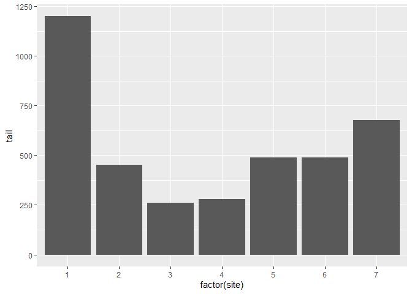
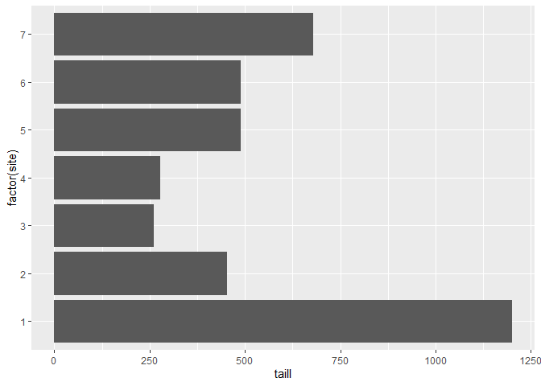
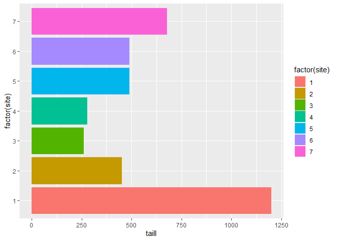

# Bar plot vignette

Based on Dr. Bharatendra https://www.youtube.com/watch?v=BPR_Dkll17Y&list=PL34t5iLfZddtUUABMikey6NtL05hPAp42&index=8 

Done here for learning purposes.

# Basic

## Vertical (default)


```r
ggplot(possum, aes(x=factor(site), y=taill)) +
  geom_col()
```

<!-- -->

## Horizontal


```r
ggplot(possum, aes(x=factor(site), y=taill)) +
  geom_col() +
  coord_flip()
```

<!-- -->


```r
ggplot(possum, aes(x=factor(site), y=taill, fill=factor(site))) +
  geom_col() +
  coord_flip()
```

<!-- -->
