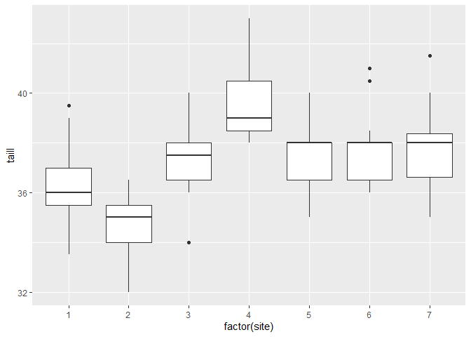
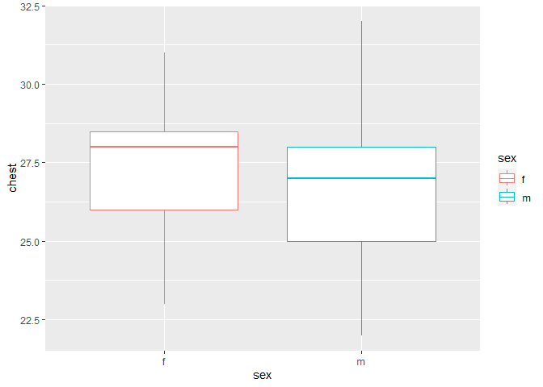
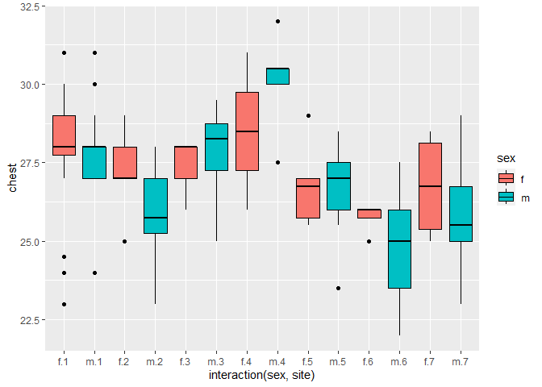

# Bar plot vignette

Based on Dr. Bharatendra https://www.youtube.com/watch?v=BPR_Dkll17Y&list=PL34t5iLfZddtUUABMikey6NtL05hPAp42&index=8 

Done here for learning purposes.

# Basic

## Example 1


```r
ggplot(possum, aes(x=factor(site), y=taill)) +
  geom_boxplot()
```

<!-- -->

## Example 2


```r
ggplot(possum, aes(x=sex, y=chest, col=sex)) +
  geom_boxplot()
```

<!-- -->


## With interaction


```r
ggplot(possum, aes(x=interaction(sex, site), y=chest, col=sex, fill=sex)) +
  geom_boxplot(color='black')
```

<!-- -->


