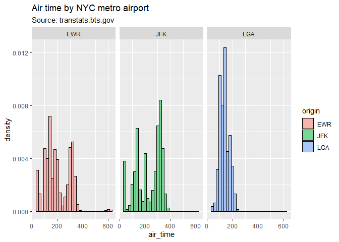
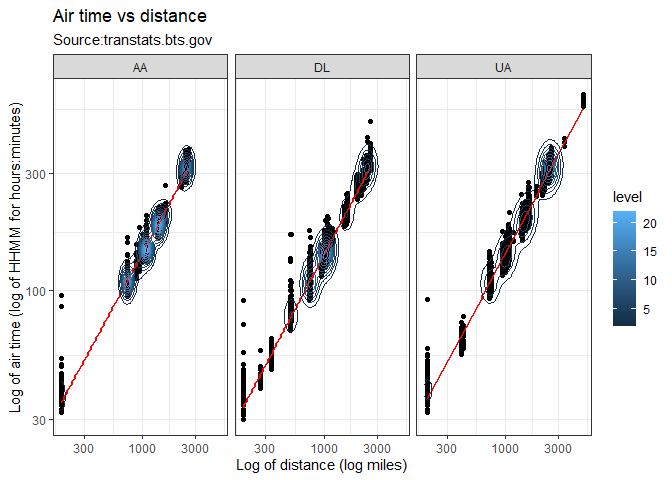
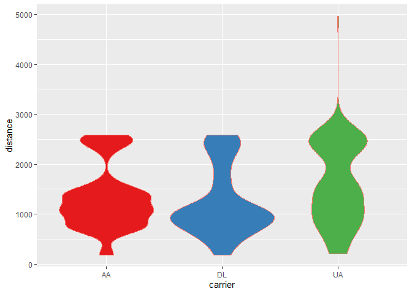

Most of this code came from Harvard STAT 109 class, Prof. Bharatendra Rai. Material used here for educational purposes. It is available in YouTube and GitHub. See links under references. I expanded the material with my own notes and R documentation and I plan to continue adding examples overtime.


# Exploratory Data Analysis

From Harvard STAT 109 class, Prof. Bharatendra Rai described the _"Process of Visualization"_ through the following steps. Material used here for educational purposes.

1. Business question 
1. Data
1. Choose visualization
1. Data preparation
1. Develop visualization
1. Develop insights
1. Next steps


This study focuses on the data. That is the _Visualization_ step. We do this study using the ggplot library from R, to create:

1. Histograms (*)
1. Bar plots (*)
1. Pie chart (*)
1. Polar plot (*)
1. Boxplots
1. Violin plots
1. Dot plots
1. Scatter plot
1. 2D Density
1. Marginal plot

(*) _Univariate_ visualiztion.

Another Rmarkdown follows Exploratory Data Analysis (EDA) _dplyr_ Rmarkdown file.

# GGPLOT2 

GGPLOT stand for Grammar of Graphics. It is characterized by the following 7 elements:

1. Data
1. Aesthetics
1. Geometry
1. Facets
1. Statistics
1. Coordinates
1. Themes

With a _+_ sign we can add features to our visual.

# Load the libraries


```r
# The EDA functionality from dplyr (dee-plier).
library(dplyr, warn.conflicts = FALSE)
library (ggplot2)
library(ggExtra)    # For marginal plots

# Use NYC Flights 2013 library to demo EDA in this study.
# https://www.transtats.bts.gov/Homepage.asp
library(nycflights13)
```

# Load the data

Display its documentation from the console:

\>?flights


```r
# From doc: "On-time data for all flights that departed NYC (i.e. JFK, LGA or EWR) in 2013."
data('flights')
str(flights)
```

```
## tibble [336,776 × 19] (S3: tbl_df/tbl/data.frame)
##  $ year          : int [1:336776] 2013 2013 2013 2013 2013 2013 2013 2013 2013 2013 ...
##  $ month         : int [1:336776] 1 1 1 1 1 1 1 1 1 1 ...
##  $ day           : int [1:336776] 1 1 1 1 1 1 1 1 1 1 ...
##  $ dep_time      : int [1:336776] 517 533 542 544 554 554 555 557 557 558 ...
##  $ sched_dep_time: int [1:336776] 515 529 540 545 600 558 600 600 600 600 ...
##  $ dep_delay     : num [1:336776] 2 4 2 -1 -6 -4 -5 -3 -3 -2 ...
##  $ arr_time      : int [1:336776] 830 850 923 1004 812 740 913 709 838 753 ...
##  $ sched_arr_time: int [1:336776] 819 830 850 1022 837 728 854 723 846 745 ...
##  $ arr_delay     : num [1:336776] 11 20 33 -18 -25 12 19 -14 -8 8 ...
##  $ carrier       : chr [1:336776] "UA" "UA" "AA" "B6" ...
##  $ flight        : int [1:336776] 1545 1714 1141 725 461 1696 507 5708 79 301 ...
##  $ tailnum       : chr [1:336776] "N14228" "N24211" "N619AA" "N804JB" ...
##  $ origin        : chr [1:336776] "EWR" "LGA" "JFK" "JFK" ...
##  $ dest          : chr [1:336776] "IAH" "IAH" "MIA" "BQN" ...
##  $ air_time      : num [1:336776] 227 227 160 183 116 150 158 53 140 138 ...
##  $ distance      : num [1:336776] 1400 1416 1089 1576 762 ...
##  $ hour          : num [1:336776] 5 5 5 5 6 5 6 6 6 6 ...
##  $ minute        : num [1:336776] 15 29 40 45 0 58 0 0 0 0 ...
##  $ time_hour     : POSIXct[1:336776], format: "2013-01-01 05:00:00" "2013-01-01 05:00:00" ...
```

```r
head(flights)
```

```
## # A tibble: 6 × 19
##    year month   day dep_time sched_dep…¹ dep_d…² arr_t…³ sched…⁴ arr_d…⁵ carrier
##   <int> <int> <int>    <int>       <int>   <dbl>   <int>   <int>   <dbl> <chr>  
## 1  2013     1     1      517         515       2     830     819      11 UA     
## 2  2013     1     1      533         529       4     850     830      20 UA     
## 3  2013     1     1      542         540       2     923     850      33 AA     
## 4  2013     1     1      544         545      -1    1004    1022     -18 B6     
## 5  2013     1     1      554         600      -6     812     837     -25 DL     
## 6  2013     1     1      554         558      -4     740     728      12 UA     
## # … with 9 more variables: flight <int>, tailnum <chr>, origin <chr>,
## #   dest <chr>, air_time <dbl>, distance <dbl>, hour <dbl>, minute <dbl>,
## #   time_hour <dttm>, and abbreviated variable names ¹​sched_dep_time,
## #   ²​dep_delay, ³​arr_time, ⁴​sched_arr_time, ⁵​arr_delay
```

# Data Preparation

Since the _flights_ dataset is so big, let's cut it down and filter only carriers UA, AA, and DL.

And I will do only the month of July.


```r
flt <- flights %>% filter((carrier=='UA' | carrier=='AA' | carrier=='DL') & month == 7)
dim(flt)
```

```
## [1] 12199    19
```

# Histogram

These are uni-variate plots.

Histograms help us to determine the skewness of our data.

## Histogram example 1

In this example: 

1. Data is _flt_ in this example and it is passed on to _ggplot_ through a _dplyr %>%_ pipe.
1. Aesthetics is _air_time_: It takes the name of the variable, in this example _air_time_.
1. Geometry is _geom_histogram()_: _alpha_ refers to opacity, binwidth refers to the value of the width of each bin, color refers to the countour line for each histogram bar.


```r
flt %>% ggplot(aes(x = air_time)) +
  geom_histogram(alpha = 0.5, binwidth = 20, color = 'black')
```

```
## Warning: Removed 276 rows containing non-finite values (`stat_bin()`).
```

<!-- -->

## Histogram example 2

In this example we will address the question:

How is the airtime distributed in the three major airports from the NYC metro area? Newark, La Guardia, and JFK.

1. Data is _flt_ in this example and it is passed on to _ggplot_ through a _dplyr %>%_ pipe.
1. Aesthetics has our variabe x = _air_time_: It takes the name of the variable, in this example _air_time_. And we will add _fill_ to separate the three different airports in the NYC metro area.
1. Geometry is _geom_histogram()_: _alpha_ refers to opacity, binwidth refers to the value of the width of each bin, color refers to the countour line for each histogram bar.
1. Facet wrap based on _origin_ (i.e. the airport of origin)
1. And let's add a title with ggtitle


```r
flt %>% ggplot(aes(x = air_time, fill = origin)) +
  geom_histogram(alpha = 0.5, binwidth = 20, color = 'black') +
  facet_wrap(~origin) +
  ggtitle('Air time by NYC metro airport', 'Source: transtats.bts.gov')
```

```
## Warning: Removed 276 rows containing non-finite values (`stat_bin()`).
```

<!-- -->

## Histogram example 3

Use the _density_ feature under a new _aes()_ funciton within _geom_histogram()_.

Now the plot does not have a value count of air time, but a value between 0 and 1 for the density function.


```r
flt %>% ggplot(aes(x = air_time, fill = origin)) +
  geom_histogram(alpha = 0.5, binwidth = 20, color = 'black',
                 aes(y = ..density..)) +
  facet_wrap(~origin) +
  ggtitle('Air time by NYC metro airport', 'Source: transtats.bts.gov')
```

```
## Warning: The dot-dot notation (`..density..`) was deprecated in ggplot2 3.4.0.
## ℹ Please use `after_stat(density)` instead.
```

```
## Warning: Removed 276 rows containing non-finite values (`stat_bin()`).
```

<!-- -->


## Histogram example 4

Add _scale_fill_brewer()_ to specify the palette.

Add the geometry of the density with an alpha value small enought to make it transparent.

Make the bins a bit bigger to avoid oversampling.


```r
flt %>% ggplot(aes(x = air_time, fill = origin)) +
  geom_histogram(alpha = 0.5, binwidth = 50, color = 'black',
                 aes(y = ..density..)) +
  facet_wrap(~origin) +
  ggtitle('Air time by NYC metro airport', 'Source: transtats.bts.gov') +
  scale_fill_brewer(palette = 'Set1') +
  geom_density(alpha=0.2)
```

```
## Warning: Removed 276 rows containing non-finite values (`stat_bin()`).
```

```
## Warning: Removed 276 rows containing non-finite values (`stat_density()`).
```

<!-- -->


## Histogram example 5

Now let's do a _facet_grid()_ for the top three airlines: UA, AA, DL.

We will need to filter on those three carriers first.

Let's not use the density feature here to see the totals.


```r
flt %>% filter(carrier == 'UA' | carrier == 'AA' | carrier == 'DL') %>% 
  ggplot(aes(x = air_time, fill = origin)) +
  geom_histogram(alpha = 0.5, binwidth = 50, color = 'black') +
  facet_grid(origin ~ carrier) +
  ggtitle('Air time by NYC metro airport and carrier', 'Source: transtats.bts.gov') +
  scale_fill_brewer(palette = 'Set1')
```

```
## Warning: Removed 276 rows containing non-finite values (`stat_bin()`).
```

<!-- -->

## Histogram example 6

Now we want to add vertical lines to the basic histogram


```r
flt %>% ggplot(aes(x = air_time)) +
  geom_histogram(alpha = 0.5, binwidth = 20, color = 'black', fill='lightgreen') +
  ggtitle('Flight air time by NYC metro airport', 'Source: transtats.bts.gov') +
  geom_vline(xintercept = mean(flt$air_time, na.rm = TRUE), 
             color='red', size=1.5)
```

```
## Warning: Using `size` aesthetic for lines was deprecated in ggplot2 3.4.0.
## ℹ Please use `linewidth` instead.
```

```
## Warning: Removed 276 rows containing non-finite values (`stat_bin()`).
```

<!-- -->

## Histogram example 6

Now we want to add vertical lines to the basic histogram


```r
flt %>% ggplot(aes(x = distance)) +
  geom_histogram(alpha = 0.5, binwidth = 100, color = 'black', fill='lightgreen') +
  ggtitle('Flight distance by NYC metro airport', 'Source: transtats.bts.gov') +
  geom_vline(xintercept = mean(flt$distance, na.rm = TRUE), 
             color='red', size=1.5)
```

<!-- -->


# Density

Instead of _geom_histogram()_ we will use _geom_density()_.

We should remove parameter _binwidth_ (otherwise it will ignore it, so no worries).


```r
flt %>% ggplot(aes(x = air_time, fill = origin)) +
  geom_density(alpha = 0.5, color = 'black') +
  facet_wrap(~origin) +
  ggtitle('Air time by NYC metro airport', 'Source: transtats.bts.gov')
```

```
## Warning: Removed 276 rows containing non-finite values (`stat_density()`).
```

<!-- -->

# Polar plots

Polar plots address questions related to patterns.

Polar plots are histograms on a polar coordinate.

It modifies the _coordinates_ element of a _ggplot()_.

## Polar plots example 1

Take a histogram from above and add _coord_polar()_.

We get a good amount of information. La Guardia for example has more value for shorter distances than for Newark and JFK. Newark is a mix of short and long flights. JFK has a pattern that favors long flights.


```r
flt %>% ggplot(aes(x = air_time, fill = origin)) +
  geom_histogram(alpha = 0.5, binwidth = 20, color = 'black',
                 aes(y = ..density..)) +
  facet_wrap(~origin) +
  coord_polar() +
  ggtitle('Air time by NYC metro airport', 'Source: transtats.bts.gov')
```

```
## Warning: Removed 276 rows containing non-finite values (`stat_bin()`).
```

<!-- -->

# Scatterplot

How are two variables related.

Uses _geom_point()_.

# Scatterplot example 1

Here we will use all the elements of grammar of graphics:

1. **Data** _flights derived flt_ comes from flt (derived from flights).
1. **Aesthetics** _aes()_ describes the variables we will plot.
1. **Geometry** _geom_histogram()_ o define the type of chart, here being a histogram.
1. **Facets** _facet_wrap()_ to breakdown the scatter plots into three plots, for the carriers in the sub-dataset.
1. **Statistics** _geom_smooth()_ to see the linear methods of the trend line.
1. **Coordinates** _scale_x and y_ is incorporated by describing each coordinate x and y.
1. **Theme* _theme_bw()_ is the 7th element we are using here to select the looks, the theme of the plot.


```r
flt %>% ggplot(aes(x = distance, y=air_time)) +
  geom_point() +
  facet_wrap(~carrier) +
  ggtitle('Air time vs distance', 'Source:transtats.bts.gov') +
  geom_smooth(method = 'lm', col='red', fill='lightblue', se=TRUE) +
  scale_x_continuous('Distance (miles)', limits = c(0, 5100)) +
  scale_y_continuous('Air time (HHMM for hours:minutes)') +
  theme_bw()
```

```
## `geom_smooth()` using formula = 'y ~ x'
```

```
## Warning: Removed 276 rows containing non-finite values (`stat_smooth()`).
```

```
## Warning: Removed 276 rows containing missing values (`geom_point()`).
```

<!-- -->

# Scatterplot example 2

Same as in the previous example, except let's spread the data over a log scale.


```r
flt %>% ggplot(aes(x = distance, y=air_time)) +
  geom_point() +
  facet_wrap(~carrier) +
  geom_smooth(method = 'lm', col='red', fill='lightblue', se=TRUE) +
  scale_x_log10('Log of distance (log miles)') +
  scale_y_log10('Log of air time (log of HHMM for hours:minutes)') +
  ggtitle('Air time vs distance', 'Source:transtats.bts.gov') +
  theme_bw()
```

```
## `geom_smooth()` using formula = 'y ~ x'
```

```
## Warning: Removed 276 rows containing non-finite values (`stat_smooth()`).
```

```
## Warning: Removed 276 rows containing missing values (`geom_point()`).
```

<!-- -->

# 2D Density plot

The 2D density plot follows the geometry of a scatterplot, and it add lines that represent the density of the data.

It specifies the _statistics_ elemebt of _ggplot()_ to be _stat_density2d()_ as follows.

## 2D Density plot example 1

Use _stat_density2d() aes color_.


```r
flt %>% ggplot(aes(x = distance, y=air_time)) +
  geom_point() +
  facet_wrap(~carrier) +
  geom_smooth(method = 'lm', col='red', fill='lightblue', se=TRUE) +
  scale_x_log10('Log of distance (log miles)') +
  scale_y_log10('Log of air time (log of HHMM for hours:minutes)') +
  stat_density2d(aes(color=..level..)) +
  ggtitle('Air time vs distance', 'Source:transtats.bts.gov') +
  theme_bw()
```

```
## `geom_smooth()` using formula = 'y ~ x'
```

```
## Warning: Removed 276 rows containing non-finite values (`stat_smooth()`).
```

```
## Warning: Removed 276 rows containing non-finite values (`stat_density2d()`).
```

```
## Warning: Removed 276 rows containing missing values (`geom_point()`).
```

<!-- -->

## 2D Density plot example 2

Instead of _stat_density2d() aes color_, use _fill_ with _geom raster_ and _contour FALSE_.


```r
flt %>% ggplot(aes(x = distance, y=air_time)) +
  geom_point() +
  facet_wrap(~carrier) +
  geom_smooth(method = 'lm', col='red', fill='lightblue', se=TRUE) +
  scale_x_log10('Log of distance (log miles)') +
  scale_y_log10('Log of air time (log of HHMM for hours:minutes)') +
  stat_density2d(aes(fill=..density..), geom = 'raster', contour = FALSE) +
  ggtitle('Air time vs distance', 'Source:transtats.bts.gov') +
  theme_bw()
```

```
## `geom_smooth()` using formula = 'y ~ x'
```

```
## Warning: Removed 276 rows containing non-finite values (`stat_smooth()`).
```

```
## Warning: Removed 276 rows containing non-finite values (`stat_density2d()`).
```

```
## Warning: Removed 276 rows containing missing values (`geom_point()`).
```

<!-- -->

# Barplot 

A barplot is called with _geom_col()_. First it requires a numeric variable to depend on a categorical value. The categorical value could be actually numeric, like cylinders in a car, but it would still need t have a finite number of integers.

## Barplot example 1

Let us first _group_by()_ be followed by a _summarize()_. At the end add _arrange()_ to capture our table in a certain order.

It works best when we create a summary that contains certain calculations or statistics. Here the _group_by()_ is done by origin, one of the three major airports in the NYC area. The data is already filtered for the three major carriers as well.


```r
flt_grpby_origin <- flt %>% group_by(origin, carrier) %>% 
  summarize(AVG_air_time = mean(air_time, na.rm = TRUE),
            SD_air_time = sd(air_time, na.rm = TRUE),
            AVG_distance = mean(distance, na.rm = TRUE),
            SD_distance = sd(distance, na.rm=TRUE),
            No_of_flights = n()) %>% 
  arrange(desc(AVG_air_time))
```

```
## `summarise()` has grouped output by 'origin'. You can override using the
## `.groups` argument.
```

```r
str(flt_grpby_origin)
```

```
## gropd_df [9 × 7] (S3: grouped_df/tbl_df/tbl/data.frame)
##  $ origin       : chr [1:9] "JFK" "JFK" "JFK" "EWR" ...
##  $ carrier      : chr [1:9] "UA" "DL" "AA" "UA" ...
##  $ AVG_air_time : num [1:9] 323 217 216 205 186 ...
##  $ SD_air_time  : num [1:9] 20.8 98.4 97.1 99.9 48.8 ...
##  $ AVG_distance : num [1:9] 2534 1649 1651 1561 1395 ...
##  $ SD_distance  : num [1:9] 55.5 791 797.5 828.4 380.8 ...
##  $ No_of_flights: int [1:9] 368 1929 1203 4046 303 652 1376 340 1982
##  - attr(*, "groups")= tibble [3 × 2] (S3: tbl_df/tbl/data.frame)
##   ..$ origin: chr [1:3] "EWR" "JFK" "LGA"
##   ..$ .rows : list<int> [1:3] 
##   .. ..$ : int [1:3] 4 5 8
##   .. ..$ : int [1:3] 1 2 3
##   .. ..$ : int [1:3] 6 7 9
##   .. ..@ ptype: int(0) 
##   ..- attr(*, ".drop")= logi TRUE
```

```r
flt_grpby_origin
```

```
## # A tibble: 9 × 7
## # Groups:   origin [3]
##   origin carrier AVG_air_time SD_air_time AVG_distance SD_distance No_of_flights
##   <chr>  <chr>          <dbl>       <dbl>        <dbl>       <dbl>         <int>
## 1 JFK    UA              323.        20.8        2534.        55.5           368
## 2 JFK    DL              217.        98.4        1649.       791.           1929
## 3 JFK    AA              216.        97.1        1651.       797.           1203
## 4 EWR    UA              205.        99.9        1561.       828.           4046
## 5 EWR    AA              186.        48.8        1395.       381.            303
## 6 LGA    UA              159.        47.6        1168.       398.            652
## 7 LGA    AA              142.        32.8        1023.       275.           1376
## 8 EWR    DL              127.        45.4         898.       348.            340
## 9 LGA    DL              126.        31.9         896.       253.           1982
```

```r
# Now barplot it
flt_grpby_origin %>% ggplot(aes(x=factor(origin), y=No_of_flights, fill=origin)) +
  geom_col(show.legend = FALSE) +
  facet_wrap(~carrier)  +
  scale_fill_brewer(palette = 'Set1')
```

<!-- -->

# Barplot example 2

Now base it on the other variable, carrier, and facet wrap on origin (airport).


```r
flt_grpby_origin %>% ggplot(aes(x=factor(carrier), y=No_of_flights, fill=carrier)) +
  geom_col(show.legend = FALSE) +
  facet_wrap(~origin)  +
  scale_fill_brewer(palette = 'Set1')
```

<!-- -->

# Dot plots

Answer the question on a specific value. It plots like a barplot, but it puts a dot instead of the bar or column.

It uses _geom_point()_. You can assign a color to the dots.

You can also manage the _coordinates_ element of the plot by assigning _scale_y_discrete()_ instead of continuous.

## Dot plot example 1

Include a function for _y_ called _reorder()_ to sort the display.

You can reorder the y vs the x. It is only a visual.

Also add a _theme()_

You can also manage the _coordinates_ element of the plot by assigning _scale_y_discrete()_ instead of continuous, to label it.


```r
flt_no_of_flights <- flt %>% 
  group_by(dest) %>% 
  summarize(no_of_flights = n())

flt_no_of_flights %>% ggplot(aes(x=no_of_flights, y=reorder(dest, no_of_flights))) +
  geom_point(color = 'red') +
  scale_y_discrete('Destination airport') +
  theme_bw()
```

<!-- -->

## Dot plot example 2

Add a variable.


```r
flt_no_of_flights <- flt %>% 
  group_by(dest) %>% 
  summarize(DIST = mean(distance), no_of_flights = n())

flt_no_of_flights %>% ggplot(aes(x=DIST, y=reorder(dest, DIST))) +
  geom_point(color = 'red') +
  scale_y_discrete('Distance to the airport') +
  scale_x_continuous('Distance to the airport') +
  theme_bw()
```

<!-- -->

# Pie charts

Pie charts are simply bar plots on a polar coordinate. 

It modifies the _cooridnates_ element of _ggplot()_.

## Pie chart example 1

Take the last set of bar plots and add a _coord_polar()_ element.


```r
# Let's make some data
grpby_origin <- flt %>% group_by(origin, carrier) %>% 
  summarize(AVG_air_time = mean(air_time, na.rm = TRUE),
            SD_air_time = sd(air_time, na.rm = TRUE),
            AVG_distance = mean(distance, na.rm = TRUE),
            SD_distance = sd(distance, na.rm=TRUE),
            No_of_flights = n()) %>% 
  arrange(desc(AVG_air_time))
```

```
## `summarise()` has grouped output by 'origin'. You can override using the
## `.groups` argument.
```

```r
grpby_origin %>% ggplot(aes(x="", y=No_of_flights, fill=reorder(origin, No_of_flights))) +
  geom_col() +
  facet_grid(~carrier) +
  coord_polar(theta='y') +
  scale_fill_brewer(palette = 'Set1')
```

<!-- -->


## Pie chart example 2

Take the last set of bar plots and add a _coord_polar()_ element.


```r
flt_grpby_carrier <- flt %>% group_by(carrier, origin) %>% 
  summarize(AVG_air_time = mean(air_time, na.rm = TRUE),
            SD_air_time = sd(air_time, na.rm = TRUE),
            AVG_distance = mean(distance, na.rm = TRUE),
            SD_distance = sd(distance, na.rm=TRUE),
            No_of_flights = n()) %>% 
  arrange(desc(carrier))
```

```
## `summarise()` has grouped output by 'carrier'. You can override using the
## `.groups` argument.
```

```r
flt_grpby_carrier
```

```
## # A tibble: 9 × 7
## # Groups:   carrier [3]
##   carrier origin AVG_air_time SD_air_time AVG_distance SD_distance No_of_flights
##   <chr>   <chr>         <dbl>       <dbl>        <dbl>       <dbl>         <int>
## 1 UA      EWR            205.        99.9        1561.       828.           4046
## 2 UA      JFK            323.        20.8        2534.        55.5           368
## 3 UA      LGA            159.        47.6        1168.       398.            652
## 4 DL      EWR            127.        45.4         898.       348.            340
## 5 DL      JFK            217.        98.4        1649.       791.           1929
## 6 DL      LGA            126.        31.9         896.       253.           1982
## 7 AA      EWR            186.        48.8        1395.       381.            303
## 8 AA      JFK            216.        97.1        1651.       797.           1203
## 9 AA      LGA            142.        32.8        1023.       275.           1376
```

```r
flt_grpby_carrier %>% ggplot(aes(x="", y=No_of_flights, fill=reorder(carrier, No_of_flights))) +
  geom_col(show.legend = TRUE) +
  facet_wrap(~origin)  +
  coord_polar(theta='y') +
  scale_fill_brewer(palette = 'Set1')
```

<!-- -->


# Boxplot

It answer the question, how are the variables distributed?

## Boxplot example 1

The assumptions is that its data varies. For examples, flight delays varies.

We want to send the whole data.frame (the flt, for the 3 carriers in July).


```r
flt %>% ggplot(aes(x=carrier, y=dep_delay, col=carrier)) +
  geom_boxplot(show.legend = FALSE) +
  facet_wrap(~origin)  +
  scale_fill_brewer(palette = 'Set1')
```

```
## Warning: Removed 201 rows containing non-finite values (`stat_boxplot()`).
```

<!-- -->


## Boxplot example 2 (interacton)

Instead of the facet_wrap. interaction accomplishes something similar.


```r
flt %>% ggplot(aes(x=interaction(carrier, origin), y=dep_delay, col=carrier)) +
  geom_boxplot(show.legend = FALSE) +
  scale_fill_brewer(palette = 'Set1')
```

```
## Warning: Removed 201 rows containing non-finite values (`stat_boxplot()`).
```

<!-- -->

# Violin plot

This is a bivariate plot.

It addresses the question on distribution of a variables.

It uses _geom_violin()_. You can pass a parameter _adjust_ to adjust the variability of the curve shape.

## Violin example 1


```r
flt %>% ggplot(aes(x=carrier, y=distance, col='black', fill=carrier)) +
  geom_violin(adjust=2, show.legend = FALSE) +
  scale_fill_brewer(palette = 'Set1')
```

<!-- -->

## Violin example 2

Add a _facet_wrap()_.


```r
flt %>% ggplot(aes(x=carrier, y=distance, col='black', fill=carrier)) +
  geom_violin(adjust=2, show.legend = FALSE) +
  facet_wrap(~origin)  +
  scale_fill_brewer(palette = 'Set1')
```

<!-- -->
## Violin example 3 (intersection)


```r
flt %>% ggplot(aes(x=interaction(carrier, origin), y=distance, col='black', fill=carrier)) +
  geom_violin(adjust=2, show.legend = FALSE) +
  scale_fill_brewer(palette = 'Set1')
```

<!-- -->


# Marginal plot

It comes from _library(ggExtra)_.

How individual variables are distributed when studying the relationship between two variables.

## Marginal plot example 1 (histogram)


```r
# Here we want to contain the plot within a variable, instantiated object actually.
p <- flt %>% ggplot(aes(x = distance, y=air_time)) +
  geom_point() +
  geom_smooth(method = 'lm', col='red', fill='lightblue', se=TRUE) +
  scale_x_log10('Log of distance (log miles)') +
  scale_y_log10('Log of air time (log of HHMM for hours:minutes)') +
  ggtitle('Air time vs distance', 'Source:transtats.bts.gov') +
  theme_bw()

# Now pass the plot to ggMarginal
ggMarginal(p, type = 'histogram', fill='lightgreen')
```

```
## `geom_smooth()` using formula = 'y ~ x'
```

```
## Warning: Removed 276 rows containing non-finite values (`stat_smooth()`).
```

```
## `geom_smooth()` using formula = 'y ~ x'
```

```
## Warning: Removed 276 rows containing non-finite values (`stat_smooth()`).
```

```
## Warning: Removed 276 rows containing missing values (`geom_point()`).
```

```
## `geom_smooth()` using formula = 'y ~ x'
```

```
## Warning: Removed 276 rows containing non-finite values (`stat_smooth()`).
## Removed 276 rows containing missing values (`geom_point()`).
```

<!-- -->

## Marginal plot example 2 (density)


```r
ggMarginal(p, type = 'density', fill='lightgreen')
```

```
## `geom_smooth()` using formula = 'y ~ x'
```

```
## Warning: Removed 276 rows containing non-finite values (`stat_smooth()`).
```

```
## `geom_smooth()` using formula = 'y ~ x'
```

```
## Warning: Removed 276 rows containing non-finite values (`stat_smooth()`).
```

```
## Warning: Removed 276 rows containing missing values (`geom_point()`).
```

```
## `geom_smooth()` using formula = 'y ~ x'
```

```
## Warning: Removed 276 rows containing non-finite values (`stat_smooth()`).
## Removed 276 rows containing missing values (`geom_point()`).
```

<!-- -->


# References
1. Dr. Bharatendra YouTube Channel (accessed Jan. 22, 2023) https://www.youtube.com/watch?v=BPR_Dkll17Y&list=PL34t5iLfZddtUUABMikey6NtL05hPAp42
1. Harvard STAT 109 slides by Dr. Bharatendra Rai


