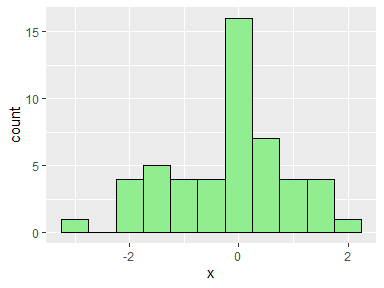
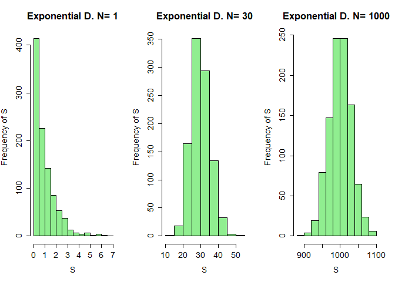
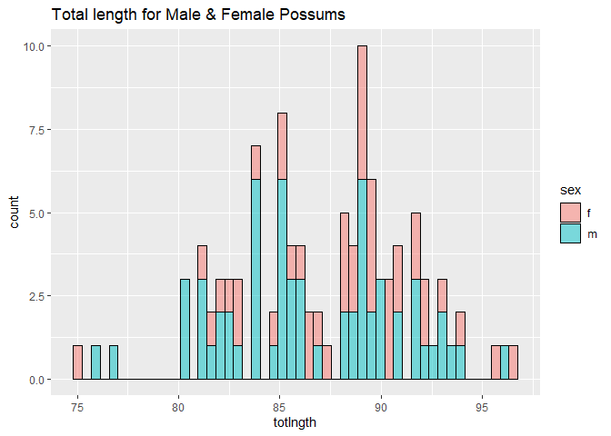
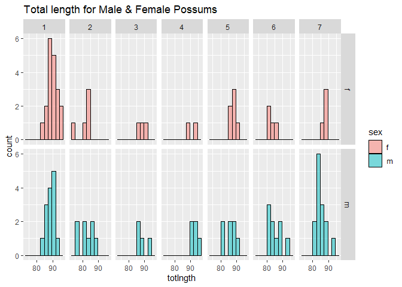
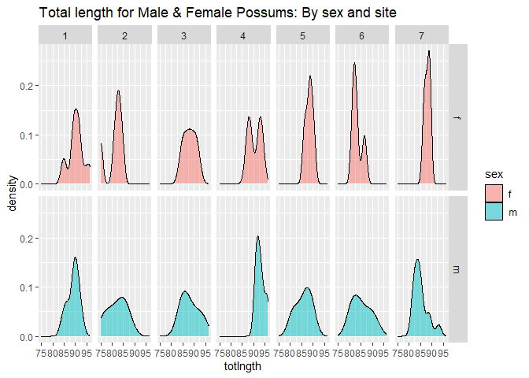
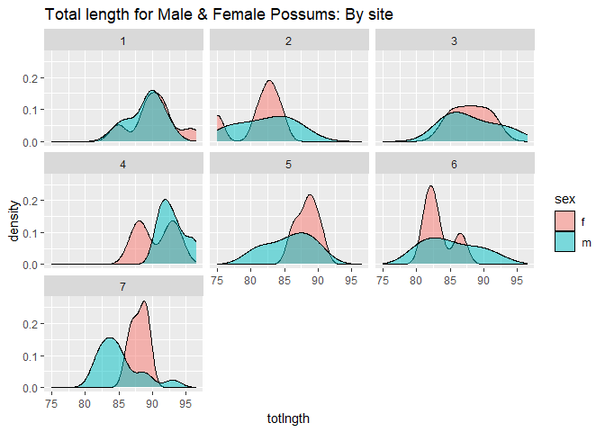
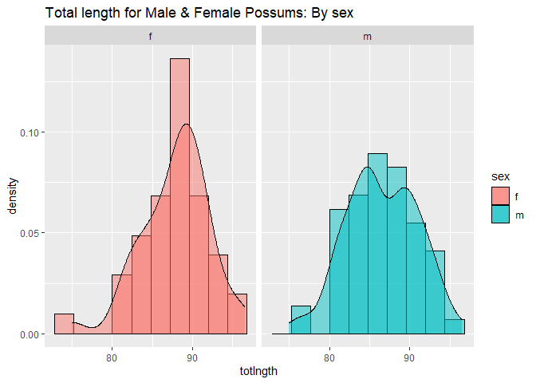
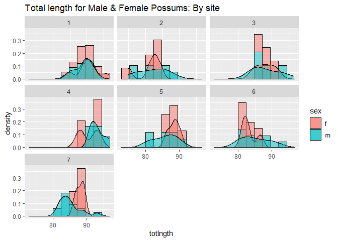
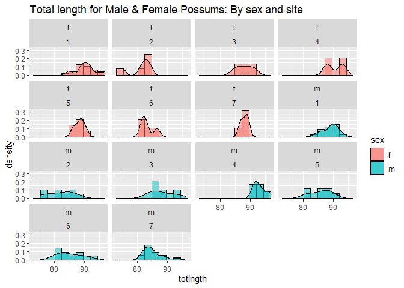

Based on notes from Harvard STAT 109, copied here for learning purposes.

# Histograms (hist function)


```r
##
#
# Plot three histograms
#
##

# old.par for 1 row and 3 columns (three charts in a row)
old.par <- par(mfrow=c(1, 3),ps=16)

# Loop through the 3 histogram (the 3 charts)
for ( iTry in 1:3 ) {
  
  # Get a sample 
  #Standard Normal, 50 samples, zero mean, unit variance.
  sample <- rnorm(50, mean=0, sd=1)
  
  # Plot its histogram of the sample
  hist(sample, breaks=10, col='lightgreen', main=paste("Average =",signif(mean(sample), 3)))
}
```

<!-- -->

```r
# Close the old.par setting
par(old.par)
```

# Histograms (ggplot)

## Simple example


```r
##
#
# Now use ggplot()
#
# ggplot will use data.frame
#
##

# make a data.frame
sample_df <- data.frame(x=rnorm(50, mean=0, sd=1), y=1:50)
  
# Plot its histogram of the sample
ggplot(sample_df, aes(x=x)) +
  geom_histogram(binwidth=0.5, colour="black", fill='lightgreen')
```

<!-- -->

## Iterative example


```r
##
#
# Now use ggplot()
#
# ggplot will use data.frame
#
##

# Here we create the sample using transform

sample_xform <- transform(data.frame(x=rnorm(150), y=rep(1:3,50)), y=paste("Average =", signif(unlist(lapply(unstack(data.frame(x,y)),mean))[y],3)))

ggplot(sample_xform, aes(x=x)) +
  geom_histogram(binwidth=0.5, colour="black", fill='lightgreen') +
  facet_wrap(~y)
```

<!-- -->


# Central Limit Theorem (CLT)

The distribution of a sum of $N$ independent, identically distributed (i.i.d.) random variables $X_i$ has normal distribution in the limit of large $N$, regardless of the distribution of the variables $X_i$. 

Let us now calculate the sum $s=\sum_1^Nx_i=x_1+\ldots+x_N$ and call *this* an "experiment". 
Clearly, $s$ is a realization of some random variable: if we repeat the experiment (i.e. draw $N$ random values from the distribution again) we will get a completely new realization $x_1, \ldots, x_N$ and the sum will thus take a new value too! Using our notations, we can also describe the situation outlined above as

$$S=X_1+X_2+\ldots+X_N, \;\; X_i \;\; \text{i.i.d.}$$


```r
# N is the number of i.i.d. variables X that I am going to sum.
# I will repeat my analysis using different values of N.
N <- c(1, 30, 1000)
N.names <- c("Small", "Intermediate", "Large")

# The number of times we will repeat the experiment, number s values.
n.repeats <- 1000

# The following code is needed to build three histograms in a row at the end.
old.par <- par(mfrow=c(1,3),ps=16)

# I will use a matrix structure to capture the s values for the entire analysis.
# A matrix data structure gives me a chance to better study the results.
# The number of columns is the number of N's that I will use: length(N).
# The number of rows is the number of experiments per s = n.repeats.
# Think of each column as if it were a vector for s.values.
# Initiate the the matrix. The experiments will fill in the matrix with values.
s.values <- matrix(0, ncol = length(N), nrow = n.repeats)

# Outer Loop: Goes through the matrix columns, one column for each value of N.
# Call them "j" columns.
for (j in 1:length(N)) {
  
  # Inner Loop: Goes through the matrix rows, one column at a time.
  # Create s.values for each row 1 to n.repeats.
  # Call them "i.exp" rows.
  for (i.exp in 1:n.repeats){
    
    # Exponential distribution using default paramter rate = 1
    # Expected value = 1/rate, and variance = 1 / rate^2
    # Therefore in these simulations the expected value = 1, var = 1, sd = 1
    sampling.ftn <- c("Exponential D.")
    x <- rexp(N[j])

    
    # Now sum all the x values drawn and create the next s[i.exp, j].
    # Draw column by column to fill the matrix (n.repeats x length(N))
    s.values[i.exp,j] = sum(x)
  }
  
  # Build the histogram. I will have 
  hist(s.values[,j], breaks=10, col='lightgreen',
       main=paste(sampling.ftn, "N=", N[j]), 
       xlab=paste("S"),
       ylab=paste("Frequency of S"))
  
}
```

<!-- -->

## Histogram of DAAG db possum


```r
# New variable TR
# mytable <- possum %>% group_by(site) %>%
#   summarise(TR = sum(taill) / sum(totlngth),
#             count = n()) %>%
#   arrange(desc(TR))

# Histogram. Use the + sign
possum %>% ggplot(aes(x=totlngth, fill=sex)) +
  geom_histogram(alpha=0.5, color='black', bins=50) +
  # scale_color_brewer(palette="Set2") +
  ggtitle('Total length for Male & Female Possums')
```

<!-- -->

## Separate histograms with facet_grid()


```r
# New variable TR
# mytable <- possum %>% group_by(site) %>%
#   summarise(TR = sum(taill) / sum(totlngth),
#             count = n()) %>%
#   arrange(desc(TR))

# Histogram. Use the + sign. Use sqrt number of values for number of bins
possum %>% ggplot(aes(x=totlngth, fill=sex)) +
  geom_histogram(alpha=0.5, color='black', bins=10) +
  ggtitle('Total length for Male & Female Possums') +
  facet_grid(vars(sex), vars(site))
```

<!-- -->


# Density

```r
# Histogram. Use the + sign. Use sqrt number of values for number of bins
possum %>% ggplot(aes(x=totlngth, fill=sex)) +
  geom_density(alpha=0.5, color='black') +
  ggtitle('Total length for Male & Female Possums: By sex and site') +
  facet_grid(vars(sex), vars(site))
```

<!-- -->

## Density with face_wrap


```r
# Histogram. Use the + sign. Use sqrt number of values for number of bins
possum %>% ggplot(aes(x=totlngth, fill=sex)) +
  geom_density(alpha=0.5, color='black') +
  ggtitle('Total length for Male & Female Possums: By site') +
  facet_wrap(~site)
```

<!-- -->

## Histogrm with density

Scale is a challenge here. Therefore, we need to scale the histogram (based on counts) down to a percentage type value, as the density. Add an aes for y=stat(density) to make it work.


```r
# Histogram. Use the + sign. Use sqrt number of values for number of bins
possum %>% ggplot(aes(x=totlngth, fill=sex)) +
  geom_histogram(alpha=0.5, color='black', bins=10, aes(y = stat(density))) +
  geom_density(alpha=0.5, color='black') +
  ggtitle('Total length for Male & Female Possums: By sex') +
  facet_wrap(~sex)
```

```
## Warning: `stat(density)` was deprecated in ggplot2 3.4.0.
## ℹ Please use `after_stat(density)` instead.
```

<!-- -->


```r
# Histogram. Use the + sign. Use sqrt number of values for number of bins
possum %>% ggplot(aes(x=totlngth, fill=sex)) +
  geom_histogram(alpha=0.5, color='black', bins=10, aes(y = stat(density))) +
  geom_density(alpha=0.5, color='black') +
  ggtitle('Total length for Male & Female Possums: By site') +
  facet_wrap(~site)
```

<!-- -->


```r
# Histogram. Use the + sign. Use sqrt number of values for number of bins
possum %>% ggplot(aes(x=totlngth, fill=sex)) +
  geom_histogram(alpha=0.5, color='black', bins=10, aes(y = stat(density))) +
  geom_density(alpha=0.5, color='black') +
  ggtitle('Total length for Male & Female Possums: By sex and site') +
  facet_wrap(~sex+site)
```

<!-- -->
