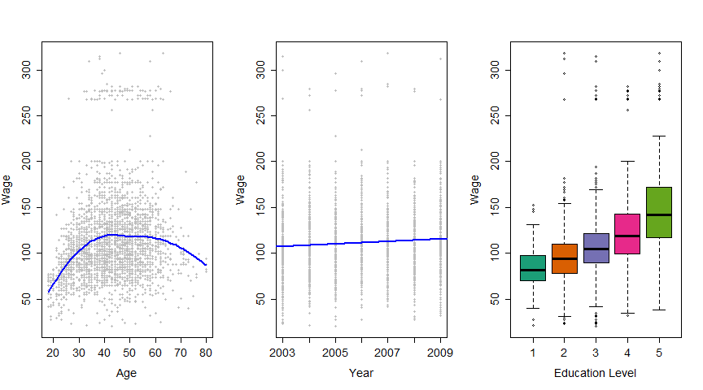
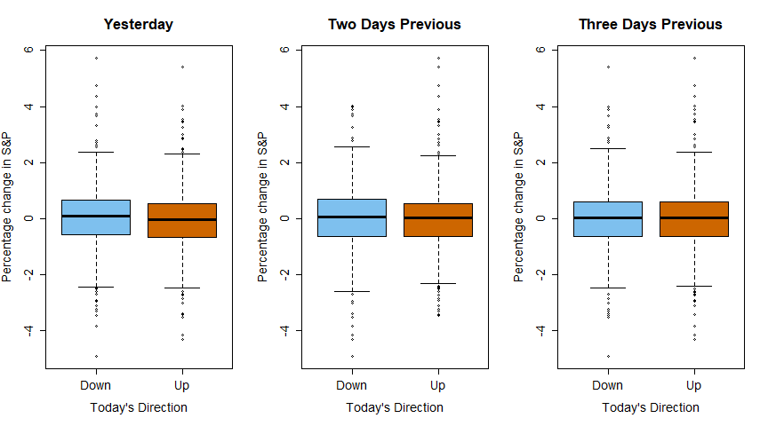
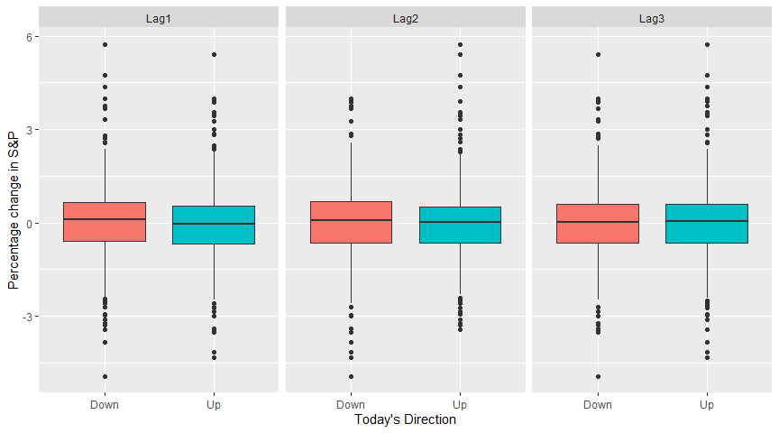

```r
library(ISLR)
library(RColorBrewer)
library(reshape2)
library(ggplot2)
knitr::opts_chunk$set(echo = TRUE)
```


# Vectorization


```r
##
#
# See how long it takes to do something
#
##

# Create some data

# Assign a matrix to variable x. Fill with normally distr random numbers
# Make it 10 columns by 50000 rows
x <- matrix(rnorm(50000*10), ncol=10)

# Make y numeric (coerse)
y <- numeric()

# Time stamp
pt1 <- proc.time()

# Iterate
for ( i in 1:dim(x)[1] ) y[i] <- mean(x[i,])

# Time stamp and then calculate how long it tok between pt1 and pt2
pt2 <- proc.time(); pt2-pt1; y[1:3]
```

```
##    user  system elapsed 
##    0.39    0.01    0.41
```

```
## [1] -0.07091686  0.25672443  0.05858189
```

```r
# apply() is like Python lambda. Here, calculate the mean
y <- apply(x, 1, mean)

# Stamp time again, and measure the difference
pt3 <- proc.time(); pt3 - pt2; y[1:3]
```

```
##    user  system elapsed 
##    0.47    0.03    0.50
```

```
## [1] -0.07091686  0.25672443  0.05858189
```

```r
y <- rowMeans(x)
proc.time() - pt3; y[1:3]
```

```
##    user  system elapsed 
##       0       0       0
```

```
## [1] -0.07091686  0.25672443  0.05858189
```

# ISLR Ch. 1

Datasets documentation https://www.rdocumentation.org/packages/ISLR/versions/1.4

## Fig.1.1


```r
##
#
# Run various plots for dataset Wage
#
##

# Wage is one of the datasets from ISLR library
class(Wage)
```

```
## [1] "data.frame"
```

```r
dim(Wage)
```

```
## [1] 3000   11
```

```r
nrow(Wage)
```

```
## [1] 3000
```

```r
ncol(Wage)
```

```
## [1] 11
```

```r
head(Wage)
```

```
##        year age           maritl     race       education             region
## 231655 2006  18 1. Never Married 1. White    1. < HS Grad 2. Middle Atlantic
## 86582  2004  24 1. Never Married 1. White 4. College Grad 2. Middle Atlantic
## 161300 2003  45       2. Married 1. White 3. Some College 2. Middle Atlantic
## 155159 2003  43       2. Married 3. Asian 4. College Grad 2. Middle Atlantic
## 11443  2005  50      4. Divorced 1. White      2. HS Grad 2. Middle Atlantic
## 376662 2008  54       2. Married 1. White 4. College Grad 2. Middle Atlantic
##              jobclass         health health_ins  logwage      wage
## 231655  1. Industrial      1. <=Good      2. No 4.318063  75.04315
## 86582  2. Information 2. >=Very Good      2. No 4.255273  70.47602
## 161300  1. Industrial      1. <=Good     1. Yes 4.875061 130.98218
## 155159 2. Information 2. >=Very Good     1. Yes 5.041393 154.68529
## 11443  2. Information      1. <=Good     1. Yes 4.318063  75.04315
## 376662 2. Information 2. >=Very Good     1. Yes 4.845098 127.11574
```

```r
# Set old.par to plot 1 row and 3 charts
old.par <- par(mfrow=c(1, 3), ps=16)

# Start with wage vs age
plot(Wage[,c("age", "wage")], xlab="Age", ylab="Wage", pch=20, col="gray")
# Add points
points(min(Wage$age):max(Wage$age),
       predict(loess(wage~age, Wage), newdata=data.frame(age=min(Wage$age):max(Wage$age))),
       col="blue",type="l",lwd=2)

# Now plot wage vs year
plot(Wage[,c("year","wage")],xlab="Year",ylab="Wage",pch=20,col="gray")
# Draw a regression line
abline(lm(wage~year,Wage),col="blue",lwd=2)

# Lastly a boxplot
boxplot(wage~substring(education,1,1),Wage,col=brewer.pal(5,"Dark2"),xlab="Education Level",ylab="Wage")  #YlGnBu RdYlGn Accent
```

<!-- -->

```r
par(old.par)
```

## Fig.1.2


```
## [1] "data.frame"
```

```
## [1] 1250    9
```

```
##       Year           Lag1                Lag2                Lag3          
##  Min.   :2001   Min.   :-4.922000   Min.   :-4.922000   Min.   :-4.922000  
##  1st Qu.:2002   1st Qu.:-0.639500   1st Qu.:-0.639500   1st Qu.:-0.640000  
##  Median :2003   Median : 0.039000   Median : 0.039000   Median : 0.038500  
##  Mean   :2003   Mean   : 0.003834   Mean   : 0.003919   Mean   : 0.001716  
##  3rd Qu.:2004   3rd Qu.: 0.596750   3rd Qu.: 0.596750   3rd Qu.: 0.596750  
##  Max.   :2005   Max.   : 5.733000   Max.   : 5.733000   Max.   : 5.733000  
##       Lag4                Lag5              Volume           Today          
##  Min.   :-4.922000   Min.   :-4.92200   Min.   :0.3561   Min.   :-4.922000  
##  1st Qu.:-0.640000   1st Qu.:-0.64000   1st Qu.:1.2574   1st Qu.:-0.639500  
##  Median : 0.038500   Median : 0.03850   Median :1.4229   Median : 0.038500  
##  Mean   : 0.001636   Mean   : 0.00561   Mean   :1.4783   Mean   : 0.003138  
##  3rd Qu.: 0.596750   3rd Qu.: 0.59700   3rd Qu.:1.6417   3rd Qu.: 0.596750  
##  Max.   : 5.733000   Max.   : 5.73300   Max.   :3.1525   Max.   : 5.733000  
##  Direction 
##  Down:602  
##  Up  :648  
##            
##            
##            
## 
```

```
##   Year   Lag1   Lag2   Lag3   Lag4   Lag5 Volume  Today Direction
## 1 2001  0.381 -0.192 -2.624 -1.055  5.010 1.1913  0.959        Up
## 2 2001  0.959  0.381 -0.192 -2.624 -1.055 1.2965  1.032        Up
## 3 2001  1.032  0.959  0.381 -0.192 -2.624 1.4112 -0.623      Down
## 4 2001 -0.623  1.032  0.959  0.381 -0.192 1.2760  0.614        Up
## 5 2001  0.614 -0.623  1.032  0.959  0.381 1.2057  0.213        Up
## 6 2001  0.213  0.614 -0.623  1.032  0.959 1.3491  1.392        Up
```

<!-- -->

Similar plots by `ggplot`:


```r
##
#
# With ggplot()
#
##
ggplot(melt(Smarket[,c("Direction", paste0("Lag", 1:3))]), aes(x=Direction, y=value, fill=Direction)) +
  geom_boxplot() +
  facet_wrap(~variable) +
  theme(legend.position="none") +
  xlab("Today's Direction") +
  ylab("Percentage change in S&P")
```

```
## Using Direction as id variables
```

<!-- -->

