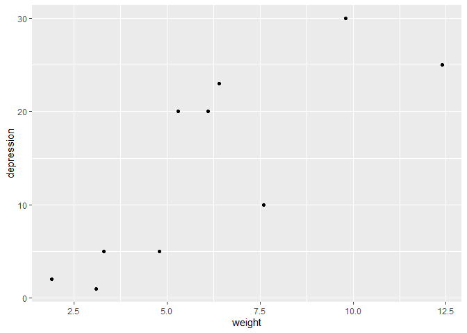
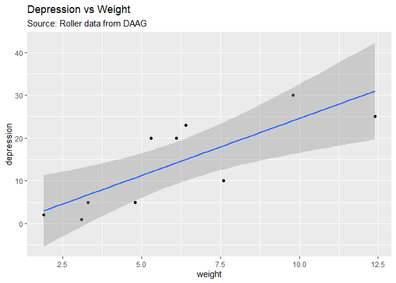
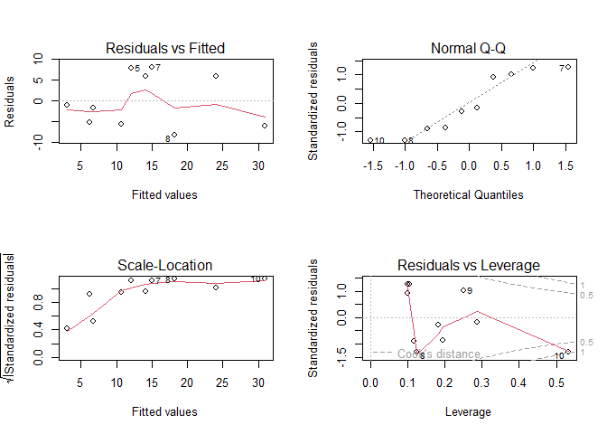
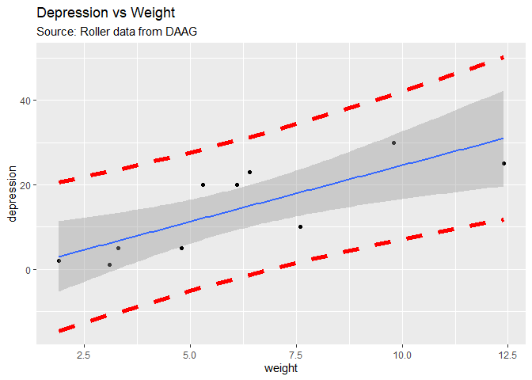

# Purpose

This vignette aims to introduce you liner models using R.

# Reference

Dr. Bharatendra https://www.youtube.com/watch?v=rsfV57N7Uns&list=PL34t5iLfZddtUUABMikey6NtL05hPAp42&index=7 

# Libraries


# Load some data

Look at 'roller' dataset from DAAG library.


```r
# Example the roller dataset
str(roller)
```

```
## 'data.frame':	10 obs. of  2 variables:
##  $ weight    : num  1.9 3.1 3.3 4.8 5.3 6.1 6.4 7.6 9.8 12.4
##  $ depression: num  2 1 5 5 20 20 23 10 30 25
```

# Plot it (scatter plot)


```r
ggplot(roller, aes(x=weight, y=depression)) +
  geom_point()
```

<!-- -->
# Linear model lm{stats}

Reference: Dr. Bharatendra https://youtube.com/watch?v=utjaosw7wi0&si=EnSIkaIECMiOmarE 


```r
# lm model, with formula y ~ x..., and dataset name
# here dependent var will be depression, inde varialbe weight from dataset roller
model <- lm(depression ~ weight, roller)

# Get the summary
summary(model)
```

```
## 
## Call:
## lm(formula = depression ~ weight, data = roller)
## 
## Residuals:
##    Min     1Q Median     3Q    Max 
## -8.180 -5.580 -1.346  5.920  8.020 
## 
## Coefficients:
##             Estimate Std. Error t value Pr(>|t|)   
## (Intercept)  -2.0871     4.7543  -0.439  0.67227   
## weight        2.6667     0.7002   3.808  0.00518 **
## ---
## Signif. codes:  0 '***' 0.001 '**' 0.01 '*' 0.05 '.' 0.1 ' ' 1
## 
## Residual standard error: 6.735 on 8 degrees of freedom
## Multiple R-squared:  0.6445,	Adjusted R-squared:  0.6001 
## F-statistic:  14.5 on 1 and 8 DF,  p-value: 0.005175
```
## Explore the model

### What the model has


```r
names(model)
```

```
##  [1] "coefficients"  "residuals"     "effects"       "rank"         
##  [5] "fitted.values" "assign"        "qr"            "df.residual"  
##  [9] "xlevels"       "call"          "terms"         "model"
```
### Look at coefficients only


```r
coef(model)
```

```
## (Intercept)      weight 
##   -2.087148    2.666746
```

### look at the residuals

Residuals = Observed - Predicted


```r
residuals(model)
```

```
##          1          2          3          4          5          6          7 
## -0.9796695 -5.1797646 -1.7131138 -5.7132327  7.9533944  5.8199976  8.0199738 
##          8          9         10 
## -8.1801213  5.9530377 -5.9805017
```

### Look at predictions (i.e. the fitted model)

In stats terms we say the 'fitted model' while in machine learning we say 'prediciton', same thing.


```r
f <- fitted.values(model)
print(f)
```

```
##         1         2         3         4         5         6         7         8 
##  2.979669  6.179765  6.713114 10.713233 12.046606 14.180002 14.980026 18.180121 
##         9        10 
## 24.046962 30.980502
```


### What that means

Look at the prediction (fit) and calculate the residual by hand. Compare.


```r
# Residual from the first prediction
r1 <- residuals(model)[1]

# Actual number
a1 <- roller[1,]

# This result must be zero (or super close to zero)
residual_test = (a1[2] - f[1]) - r1
```


# Linear Model in scatter plot

Shows the 95% confidence intervals.


```r
ggplot(roller, aes(x=weight, y=depression)) +
  geom_point() +
  geom_smooth(method = 'lm') +
  ggtitle('Depression vs Weight', 'Source: Roller data from DAAG')
```

```
## `geom_smooth()` using formula = 'y ~ x'
```

<!-- -->

# Diagnostics


```r
par(mfrow=c(2, 2))

plot(model)
```

<!-- -->

# Predictions

## One prediction


```r
# Here the independent variable is 'weight'

predict(model, data.frame(weight=7))
```

```
##        1 
## 16.58007
```

## Many predictions


```r
predict(model, data.frame(weight=c(7, 8, 9)))
```

```
##        1        2        3 
## 16.58007 19.24682 21.91357
```

### Confidence intervals


```r
# Confidence interval default is 95%
predict(model, 
        data.frame(weight=c(7, 8, 9)),
        interval = 'confidence')
```

```
##        fit      lwr      upr
## 1 16.58007 11.44396 21.71619
## 2 19.24682 13.42986 25.06378
## 3 21.91357 15.09380 28.73333
```

### Prediction intervals


```r
# Prediction interval is wider than confidence interval
# That is because it is focused on individual values,
# while confidence intervals are focused on averages.
predict(model, 
        data.frame(weight=c(7, 8, 9)),
        interval = 'prediction')
```

```
##        fit       lwr      upr
## 1 16.58007 0.2208492 32.93930
## 2 19.24682 2.6612368 35.83240
## 3 21.91357 4.9502581 38.87687
```

Some time confidence intervals are called narrow intervals, 
while prediction intervals are called wider intervals.

You use it depending on the context.

If the context is about a single value then use prediciton interval, and if the context
is about a wider average then use confidence interval.


## Plots for confidence and prediction intervals

### Plot for prediction interval

#### make a data.frame


```r
# First make a dataset

p <- predict(model, interval = 'prediction')
```

```
## Warning in predict.lm(model, interval = "prediction"): predictions on current data refer to _future_ responses
```

```r
# combine data
data <- cbind(roller, p)

str(data)
```

```
## 'data.frame':	10 obs. of  5 variables:
##  $ weight    : num  1.9 3.1 3.3 4.8 5.3 6.1 6.4 7.6 9.8 12.4
##  $ depression: num  2 1 5 5 20 20 23 10 30 25
##  $ fit       : num  2.98 6.18 6.71 10.71 12.05 ...
##  $ lwr       : num  -14.65 -10.8 -10.18 -5.71 -4.29 ...
##  $ upr       : num  20.6 23.2 23.6 27.1 28.4 ...
```


#### Plot it


```r
# Add the prediction intervals with geom_line()
ggplot(data, aes(x=weight, y=depression)) +
  geom_point() +
  geom_smooth(method = 'lm') +
  ggtitle('Depression vs Weight', 'Source: Roller data from DAAG') +
  geom_line(aes(y=lwr), color='red', linetype='dashed', lwd=2) +
  geom_line(aes(y=upr), color='red', linetype='dashed', lwd=2)
```

```
## `geom_smooth()` using formula = 'y ~ x'
```

<!-- -->


# Quadratic term

A way to help the model


```r
model1 <- lm(depression ~ weight + I(weight^2), roller)
summary(model1)
```

```
## 
## Call:
## lm(formula = depression ~ weight + I(weight^2), data = roller)
## 
## Residuals:
##     Min      1Q  Median      3Q     Max 
## -10.699  -3.192   1.244   4.792   6.163 
## 
## Coefficients:
##             Estimate Std. Error t value Pr(>|t|)  
## (Intercept) -12.1247     9.3821  -1.292   0.2373  
## weight        6.2337     2.9822   2.090   0.0749 .
## I(weight^2)  -0.2519     0.2051  -1.228   0.2590  
## ---
## Signif. codes:  0 '***' 0.001 '**' 0.01 '*' 0.05 '.' 0.1 ' ' 1
## 
## Residual standard error: 6.531 on 7 degrees of freedom
## Multiple R-squared:  0.7075,	Adjusted R-squared:  0.624 
## F-statistic: 8.467 on 2 and 7 DF,  p-value: 0.01353
```

