```r
# library(ISLR)
# library(RColorBrewer)
# library(reshape2)
# library(ggplot2)
knitr::opts_chunk$set(echo = TRUE)

# The following tip shows how to force the creation of ONLY and md file.
# https://stackoverflow.com/questions/39814916/how-can-i-see-output-of-rmd-in-github
```

# Basics

Create chunck with Ctrl+Alt+I (Windows) Ctrl+Option+I (Mac)


```r
# Assign data to a variable

a <- 8

b <- 4

a + b
```

```
## [1] 12
```

```r
# Patterned data
2:8
```

```
## [1] 2 3 4 5 6 7 8
```

```r
1:7
```

```
## [1] 1 2 3 4 5 6 7
```

# Data types

* Vector, 
* Matrix, 
* Array, 
* List, 
* Data Frame

## Vector


```r
##
#
# Vector
#
# Atomic types:
# logical, integer, numeric, complex, character
#
# All the values must have a consistent data type within a vector
#
##

vtr_logical = c(TRUE, TRUE, FALSE, FALSE, TRUE)
vtr_logical
```

```
## [1]  TRUE  TRUE FALSE FALSE  TRUE
```

```r
vtr_integer = c(256L, 1024L, 16L)
vtr_integer
```

```
## [1]  256 1024   16
```

```r
vtr_numeric = c(2.718, 3.1416, 0.7071)
vtr_numeric
```

```
## [1] 2.7180 3.1416 0.7071
```

```r
vtr_char = c("hello, world", "now i'm here", "now i'm there")
vtr_char
```

```
## [1] "hello, world"  "now i'm here"  "now i'm there"
```

## Operations on vectors


```r
##
#
# Let's play with vectors (it is like NumPy arrays)
#
##

a <- c(1, 2, 3)

a + 1
```

```
## [1] 2 3 4
```

```r
a / 2
```

```
## [1] 0.5 1.0 1.5
```

```r
a * 2
```

```
## [1] 2 4 6
```

```r
b <- c(4,5,6)

a + b
```

```
## [1] 5 7 9
```

```r
a - b
```

```
## [1] -3 -3 -3
```
## Plot vectors

The plot function takes two vectors, one for X values and one for Y values, and draws a graph of them


```r
x <- seq(1, 20, 0.1)
y <- sin(x)

plot(x, y)
```

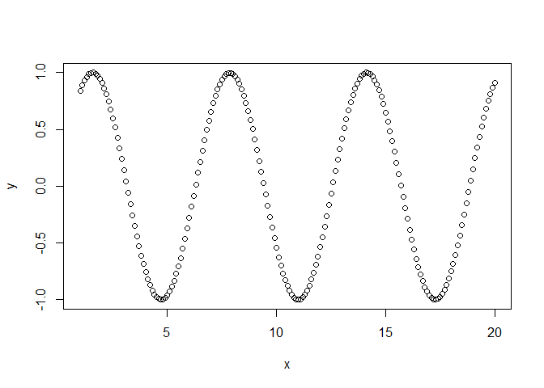<!-- -->

## Another plot example


```r
values <- -10:10
absolutes <- abs(values)

plot(values, absolutes)
```

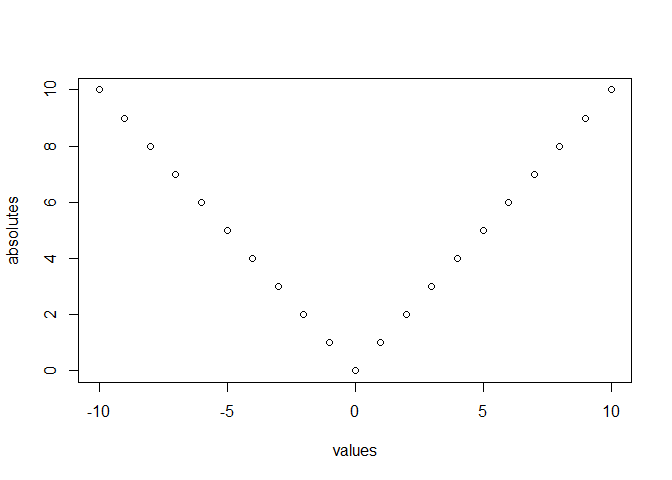<!-- -->

## NA values


```r
a <- c(1, 3, NA, 7, 9)

# Here we will get a NA
sum(a)
```

```
## [1] NA
```

```r
# Try calling sum again, with na.rm set to TRUE:
sum(a, na.rm=TRUE)
```

```
## [1] 20
```
# Matrix


```r
#
# Matrix
#

mtx1 = matrix(c(1:25), 5, 5)
mtx1
```

```
##      [,1] [,2] [,3] [,4] [,5]
## [1,]    1    6   11   16   21
## [2,]    2    7   12   17   22
## [3,]    3    8   13   18   23
## [4,]    4    9   14   19   24
## [5,]    5   10   15   20   25
```

```r
mtx2 = matrix(c(1:6), 2, 3)
mtx2
```

```
##      [,1] [,2] [,3]
## [1,]    1    3    5
## [2,]    2    4    6
```

## Array


```r
#
# Array
#

# This is an array of matrices

# Six values (1:6), then 2 rows x 3 columns matrices, 
# Then each matrix is identified by x, y (4x2), that is 8 of them
arr1 = array(c(1:6), dim=c(2, 3, 4, 2))
arr1
```

```
## , , 1, 1
## 
##      [,1] [,2] [,3]
## [1,]    1    3    5
## [2,]    2    4    6
## 
## , , 2, 1
## 
##      [,1] [,2] [,3]
## [1,]    1    3    5
## [2,]    2    4    6
## 
## , , 3, 1
## 
##      [,1] [,2] [,3]
## [1,]    1    3    5
## [2,]    2    4    6
## 
## , , 4, 1
## 
##      [,1] [,2] [,3]
## [1,]    1    3    5
## [2,]    2    4    6
## 
## , , 1, 2
## 
##      [,1] [,2] [,3]
## [1,]    1    3    5
## [2,]    2    4    6
## 
## , , 2, 2
## 
##      [,1] [,2] [,3]
## [1,]    1    3    5
## [2,]    2    4    6
## 
## , , 3, 2
## 
##      [,1] [,2] [,3]
## [1,]    1    3    5
## [2,]    2    4    6
## 
## , , 4, 2
## 
##      [,1] [,2] [,3]
## [1,]    1    3    5
## [2,]    2    4    6
```

# Lists


```r
#
# Lists
#

list1 = list(vtr_char, vtr_integer, vtr_logical, vtr_numeric)
list1
```

```
## [[1]]
## [1] "hello, world"  "now i'm here"  "now i'm there"
## 
## [[2]]
## [1]  256 1024   16
## 
## [[3]]
## [1]  TRUE  TRUE FALSE FALSE  TRUE
## 
## [[4]]
## [1] 2.7180 3.1416 0.7071
```

## Data Frame


```r
#
# Data Frame
#

vtr_char_names = c("Jay", "Julie", "John")

# Some vectors define in previos cells
data.frame(vtr_char_names, vtr_integer, vtr_numeric, vtr_char)
```

```
##   vtr_char_names vtr_integer vtr_numeric      vtr_char
## 1            Jay         256      2.7180  hello, world
## 2          Julie        1024      3.1416  now i'm here
## 3           John          16      0.7071 now i'm there
```

```r
# Another dataframe
grades <- c(90, 85, 92, 75, 88)
students <- c('Joe', 'Mary', 'Gina', 'Vijay', 'Jay')

st_data <- data.frame(students, grades)

# To get the stucture of the data, the metadata
str(st_data)
```

```
## 'data.frame':	5 obs. of  2 variables:
##  $ students: chr  "Joe" "Mary" "Gina" "Vijay" ...
##  $ grades  : num  90 85 92 75 88
```

# Built-in datasets


```r
data()
head(iris)
```

```
##   Sepal.Length Sepal.Width Petal.Length Petal.Width Species
## 1          5.1         3.5          1.4         0.2  setosa
## 2          4.9         3.0          1.4         0.2  setosa
## 3          4.7         3.2          1.3         0.2  setosa
## 4          4.6         3.1          1.5         0.2  setosa
## 5          5.0         3.6          1.4         0.2  setosa
## 6          5.4         3.9          1.7         0.4  setosa
```

```r
iris[2:4, 4:5]
```

```
##   Petal.Width Species
## 2         0.2  setosa
## 3         0.2  setosa
## 4         0.2  setosa
```

```r
is = iris

summary(is)
```

```
##   Sepal.Length    Sepal.Width     Petal.Length    Petal.Width   
##  Min.   :4.300   Min.   :2.000   Min.   :1.000   Min.   :0.100  
##  1st Qu.:5.100   1st Qu.:2.800   1st Qu.:1.600   1st Qu.:0.300  
##  Median :5.800   Median :3.000   Median :4.350   Median :1.300  
##  Mean   :5.843   Mean   :3.057   Mean   :3.758   Mean   :1.199  
##  3rd Qu.:6.400   3rd Qu.:3.300   3rd Qu.:5.100   3rd Qu.:1.800  
##  Max.   :7.900   Max.   :4.400   Max.   :6.900   Max.   :2.500  
##        Species  
##  setosa    :50  
##  versicolor:50  
##  virginica :50  
##                 
##                 
## 
```

```r
# Standard deviation of a particular column
sd(iris$Sepal.Length)
```

```
## [1] 0.8280661
```

```r
# airquality is a table already built in. let's use it
aq = data.frame(airquality)
```

# Vectorization / time stamps


```r
##
#
# See how long it takes to do something
#
##

# Create some data

# Assign a matrix to variable x. Fill with normally distr random numbers
# Make it 10 columns by 50000 rows
x <- matrix(rnorm(50000*10), ncol=10)

# Make y numeric (coerse)
y <- numeric()

# Time stamp
pt1 <- proc.time()

# Iterate
for ( i in 1:dim(x)[1] ) y[i] <- mean(x[i,])

# Time stamp and then calculate how long it tok between pt1 and pt2
pt2 <- proc.time(); pt2-pt1; y[1:3]
```

```
##    user  system elapsed 
##    0.39    0.08    0.47
```

```
## [1] -0.4319978 -0.2128917 -0.3007810
```

```r
# apply() is like Python lambda. Here, calculate the mean
y <- apply(x, 1, mean)

# Stamp time again, and measure the difference
pt3 <- proc.time(); pt3 - pt2; y[1:3]
```

```
##    user  system elapsed 
##    0.43    0.03    0.46
```

```
## [1] -0.4319978 -0.2128917 -0.3007810
```

```r
y <- rowMeans(x)
proc.time() - pt3; y[1:3]
```

```
##    user  system elapsed 
##       0       0       0
```

```
## [1] -0.4319978 -0.2128917 -0.3007810
```

# Operators


```r
##
#
# Operators
#
# Arithmetic, Assignment, Relational, Logical
#

# Artithmetic
#
cat('3+5.5 = ', 3+5.5, '\n')
```

```
## 3+5.5 =  8.5
```

```r
print(15/3)
```

```
## [1] 5
```

```r
print(2^7)
```

```
## [1] 128
```

```r
print(22/7)
```

```
## [1] 3.142857
```

```r
# modular division
print(22%%7)
```

```
## [1] 1
```

```r
# flow division rounds up to previous whole number
print(22%/%7)
```

```
## [1] 3
```

```r
# Relational opertors
# (compares)
#

var1 = 5
var2 = 12
print(var1 > var2) #the result is FALSE
```

```
## [1] FALSE
```

```r
print(var1 == var2) #the result is FALSE
```

```
## [1] FALSE
```

```r
print(var1 != var2) #the result is TRUE
```

```
## [1] TRUE
```

```r
print(var1 < var2) #the result is TRUE
```

```
## [1] TRUE
```

```r
# Assignment operators = or <- or -> left or right either way
#
# examples of assigning a value to x
#

x <- 15
x
```

```
## [1] 15
```

```r
x <- 4
x
```

```
## [1] 4
```

```r
x = 8
x
```

```
## [1] 8
```

```r
25 -> x
x
```

```
## [1] 25
```

```r
# Logical operators
#
# &, |, !

vtr2_logical = c(TRUE, FALSE,TRUE, FALSE, TRUE)
vtr3_logical = c(TRUE, TRUE, TRUE, TRUE, TRUE)
vtr4_logical = c(FALSE, FALSE, FALSE, FALSE, FALSE)

print(vtr2_logical & vtr3_logical)
```

```
## [1]  TRUE FALSE  TRUE FALSE  TRUE
```

```r
print(vtr2_logical | vtr3_logical)
```

```
## [1] TRUE TRUE TRUE TRUE TRUE
```

```r
print(!vtr2_logical)
```

```
## [1] FALSE  TRUE FALSE  TRUE FALSE
```

```r
print(vtr2_logical && vtr3_logical)
```

```
## Warning in vtr2_logical && vtr3_logical: 'length(x) = 5 > 1' in coercion to
## 'logical(1)'

## Warning in vtr2_logical && vtr3_logical: 'length(x) = 5 > 1' in coercion to
## 'logical(1)'
```

```
## [1] TRUE
```

```r
print(vtr2_logical || vtr3_logical)
```

```
## Warning in vtr2_logical || vtr3_logical: 'length(x) = 5 > 1' in coercion to
## 'logical(1)'
```

```
## [1] TRUE
```

# Conditional statements


```r
##
#
# Conditional Statemets
#
##

#
# if, else if
#

x = 3
if(x==5)
{
  print("x is equal to 5")
} else if(x > 5)
{
  print("x is greater than 5")
} else if(x<5)
{
  print("x is smaller than 5")  
}
```

```
## [1] "x is smaller than 5"
```

```r
#
# Switch Case Statement
#

x = 4   # it will look for the xth item
switch(x,
'1' = print("It's one"),
'2' = print("It's two"),
'3' = print("It's three"),
'4' = print("It's four"),
'5' = print("It's five"),
'6' = print("It's six"),
'7' = print("It's seven"),
'8' = print("It's eight"),
'9' = print("It's nine"),
'?' = print("I don't know, what is it?")
)
```

```
## [1] "It's four"
```


# Repeat Loop


```r
# repeat{}

i = 0
repeat
{
  print(i)
  i = i + 1
  if(i > 9)
  {
    break
  }
}
```

```
## [1] 0
## [1] 1
## [1] 2
## [1] 3
## [1] 4
## [1] 5
## [1] 6
## [1] 7
## [1] 8
## [1] 9
```


# While Loop


```r
i = 0
while(i < 10)
{
  print(i)
  i = i + 1
}
```

```
## [1] 0
## [1] 1
## [1] 2
## [1] 3
## [1] 4
## [1] 5
## [1] 6
## [1] 7
## [1] 8
## [1] 9
```


# For Loop

Run over an iterator

## Example 1: Basic for loop


```r
for (i in 0:9)
{
  print(i)
}
```

```
## [1] 0
## [1] 1
## [1] 2
## [1] 3
## [1] 4
## [1] 5
## [1] 6
## [1] 7
## [1] 8
## [1] 9
```


## Example 2: Loop a normal distribution

Reference: Dr. Bharatendra https://www.youtube.com/watch?v=_hHQZP7_52Y&list=PL34t5iLfZddtUUABMikey6NtL05hPAp42


```r
N <- 4

# Plot control, 2 x 2
par(mfrow=c(2, 2))

for (i in 1:N){
  x <- rnorm(10)
  qqnorm(x)
  qqline(x)
}
```

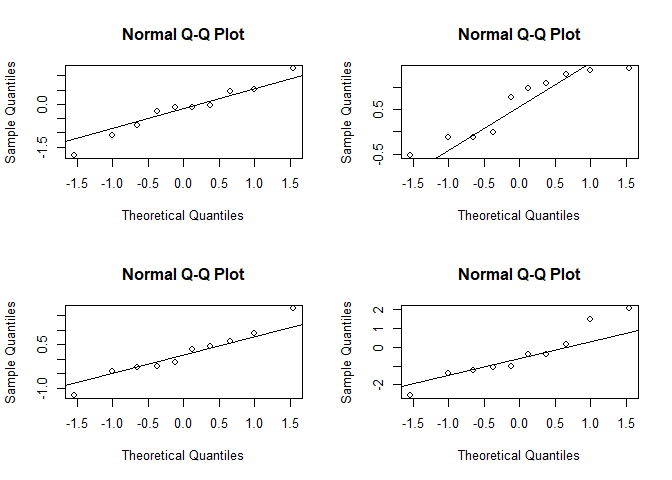<!-- -->
## Example 3:

Reference: Dr. Bharatendra https://www.youtube.com/watch?v=_hHQZP7_52Y&list=PL34t5iLfZddtUUABMikey6NtL05hPAp42


```r
# Generate 50 means
M <- 50
# Coerce object M to type numeric
AVG <- numeric()

# Plot control, 1 x 1
par(mfrow=c(1, 1))

for (i in 1:M) {
  AVG[i] <- mean(rnorm(30))
}

# Display it
AVG
```

```
##  [1] -0.11652248  0.28650326 -0.31897028  0.11687404 -0.10275651 -0.16235531
##  [7] -0.36528666 -0.10294524  0.11630003  0.24861271 -0.39555948  0.34633827
## [13]  0.06936006 -0.37799742 -0.02934937 -0.29729249 -0.12207511 -0.36074551
## [19] -0.12664163  0.06285265  0.05816869  0.10536870  0.09152646 -0.11266829
## [25] -0.04296173 -0.30015119  0.25829780 -0.45193074 -0.36529549 -0.04698677
## [31] -0.04728280  0.16829296 -0.19994989  0.30399877 -0.09125513  0.12770251
## [37] -0.05888037 -0.16435162  0.17760024 -0.22977473 -0.05348298 -0.25600599
## [43] -0.33583017 -0.03915841 -0.06908432 -0.25090528  0.19852911 -0.02799169
## [49] -0.04690127 -0.21821214
```

```r
# Show histogram
hist(AVG)
```

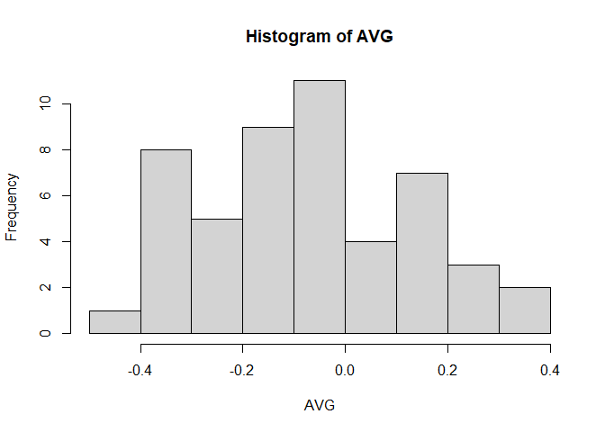<!-- -->


# Strings


```r
##
#
# String
#
##

str1 <- "How're you doing?"
print(str1)
```

```
## [1] "How're you doing?"
```

```r
nchar(str1)
```

```
## [1] 17
```

```r
str2 <- "Doing fine."
print(str2)
```

```
## [1] "Doing fine."
```

```r
nchar(str2)
```

```
## [1] 11
```

```r
str3 = paste(str1, str2)
print(str3)
```

```
## [1] "How're you doing? Doing fine."
```

```r
nchar(str3)
```

```
## [1] 29
```

# Functions


```r
##
#
# Functions
#
# Predefined and User Define
#
##

ftn1 <- function(x)
{
  x2 = x^2
  print(x)
  print(x2)
}

ftn1(3)
```

```
## [1] 3
## [1] 9
```

# Visualization


```r
##
#
# Visualization
#
# Pie Charts, Bar Chart, Boxplot, Histogram, Line Graph, Scatterplot
#
##

pie(vtr_numeric, vtr_char_names)   # very plain piechart
```

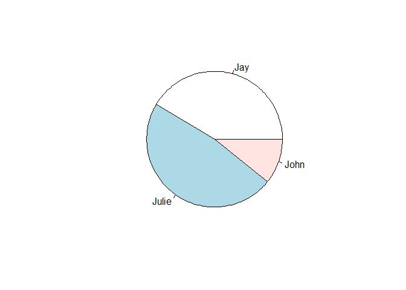<!-- -->

```r
pie(vtr_numeric, vtr_char_names, col = rainbow(length(vtr_numeric)))
```

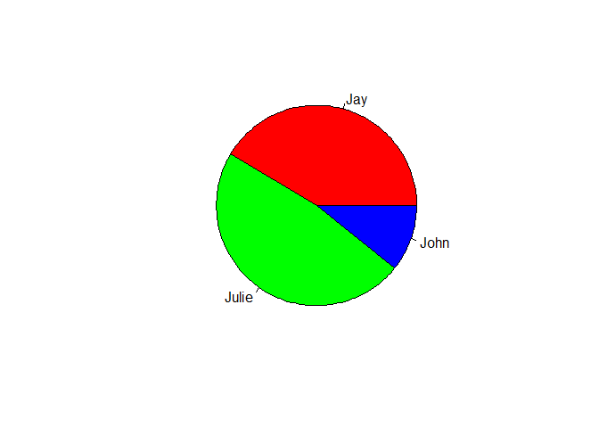<!-- -->

```r
barplot(vtr_numeric)
```

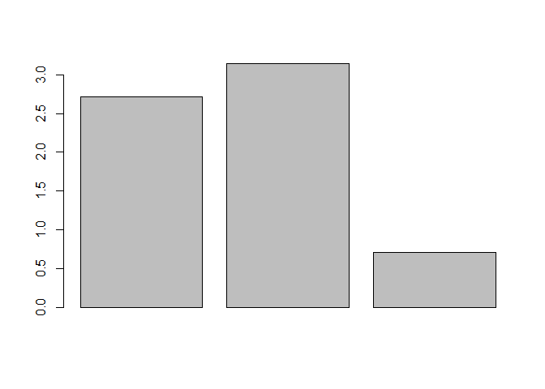<!-- -->

```r
# mtcars is a built in dataset

boxplot(mpg ~ cyl, data = mtcars, xlab = "Number of Cylinders", 
        ylab = "Miles per Galon", main = "Milage Data",
        col=c("red", "yellow", "blue"))
```

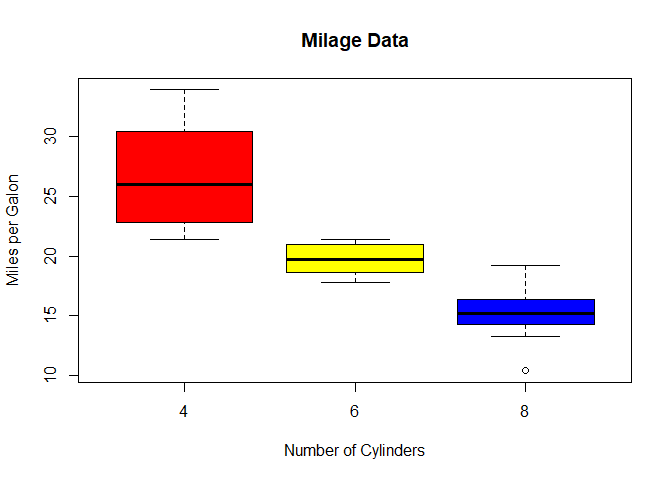<!-- -->

```r
vtr5_numberic = c(1,3,5,2,8,8,5,6,6,5,2,9,2,9,8)

hist(vtr5_numberic)
```

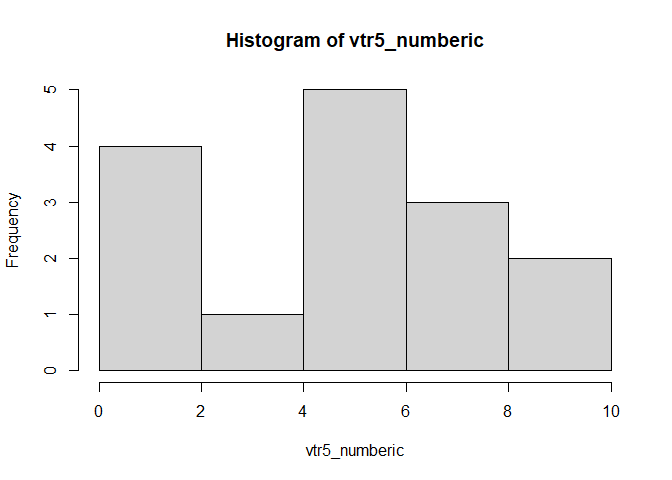<!-- -->

```r
length(vtr5_numberic)
```

```
## [1] 15
```

```r
vtr6_numberic = c(1:length(vtr5_numberic))
vtr6_numberic
```

```
##  [1]  1  2  3  4  5  6  7  8  9 10 11 12 13 14 15
```

```r
plot(vtr6_numberic, vtr5_numberic)
```

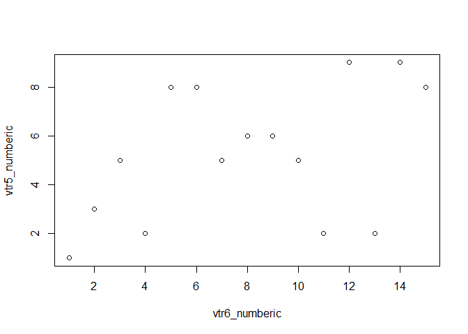<!-- -->

## pair plots


```r
is = data(iris)

pairs(iris[,c(1:4)])
```

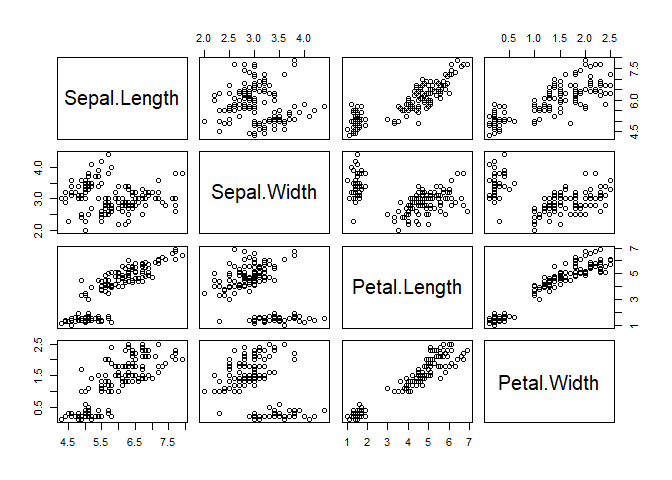<!-- -->


# Load data -- Read CSV


```r
df <- read.csv("../data/fifa_cleaned.csv")
```


