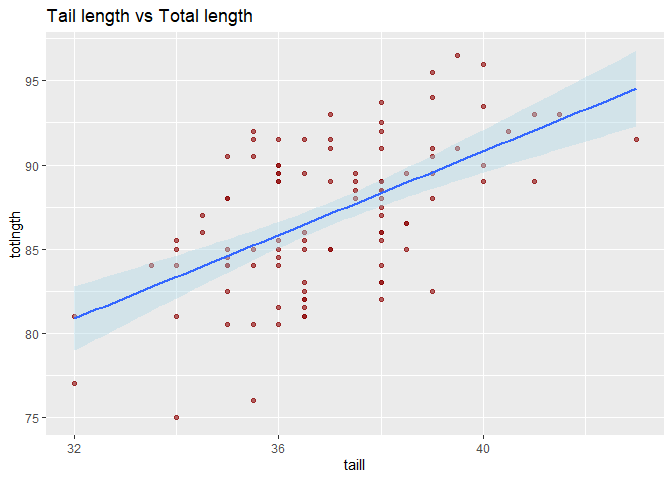
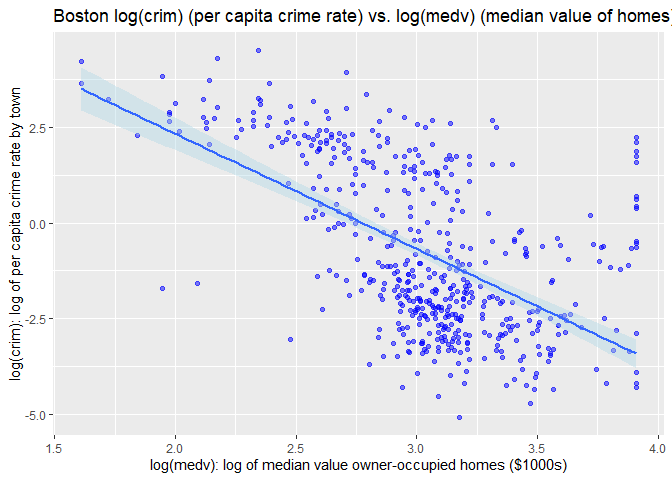

# Scatter plot vignette

Reference Dr. Bharatendra https://www.youtube.com/watch?v=BPR_Dkll17Y&list=PL34t5iLfZddtUUABMikey6NtL05hPAp42&index=8 

Done here for learning purposes.

## Basic


```r
ggplot(possum, aes(x=taill, y=totlngth)) +
  geom_point()
```

<!-- -->


## Trend line with default (LOESS and y ~ x)

- With geom_smooth() we get a trendline with confidence levels


```r
ggplot(possum, aes(x=taill, y=totlngth)) +
  geom_point(color='darkred', alpha=0.6) +
  ggtitle('Tail length vs Total length') + 
  geom_smooth()
```

```
## `geom_smooth()` using method = 'loess' and formula = 'y ~ x'
```

<!-- -->


## Trend line with 'lm' method

- Here the trendline uses linear regression.
- The command includes confidence levels
- The 'se' argument in geom_smooth() controls the trendline


```r
ggplot(possum, aes(x=taill, y=totlngth)) +
  geom_point(color='darkred', alpha=0.6) +
  ggtitle('Tail length vs Total length') + 
  geom_smooth(method='lm', fill="lightblue", se=TRUE)
```

```
## `geom_smooth()` using formula = 'y ~ x'
```

<!-- -->


## Two trend lines


```r
ggplot(possum, aes(x=taill, y=totlngth, col=sex)) +
  geom_point(color='darkred', alpha=0.6) +
  ggtitle('Tail length vs Total length') + 
  geom_smooth(method='lm', fill="lightblue", se=TRUE)
```

```
## `geom_smooth()` using formula = 'y ~ x'
```

<!-- -->

## Two trend lines and bubble size

- Here I changed geom_smooth(... se=FALSE)


```r
ggplot(possum, aes(x=taill, y=totlngth, col=sex, size=eye)) +
  geom_point(color='darkred', alpha=0.6) +
  ggtitle('Tail length vs Total length') + 
  geom_smooth(method='lm', se=FALSE)
```

```
## Warning: Using `size` aesthetic for lines was deprecated in ggplot2 3.4.0.
## ℹ Please use `linewidth` instead.
```

```
## `geom_smooth()` using formula = 'y ~ x'
```

```
## Warning: The following aesthetics were dropped during statistical transformation: size
## ℹ This can happen when ggplot fails to infer the correct grouping structure in
##   the data.
## ℹ Did you forget to specify a `group` aesthetic or to convert a numerical
##   variable into a factor?
```

<!-- -->

## Add facet_wrap


```r
ggplot(possum, aes(x=taill, y=totlngth, col=sex, size=eye)) +
  geom_point(color='darkred', alpha=0.6) +
  ggtitle('Tail length vs Total length') + 
  geom_smooth(method='lm', fill="lightblue", se=TRUE) +
  facet_wrap(~sex)
```

```
## `geom_smooth()` using formula = 'y ~ x'
```

```
## Warning: The following aesthetics were dropped during statistical transformation: size
## ℹ This can happen when ggplot fails to infer the correct grouping structure in
##   the data.
## ℹ Did you forget to specify a `group` aesthetic or to convert a numerical
##   variable into a factor?
## The following aesthetics were dropped during statistical transformation: size
## ℹ This can happen when ggplot fails to infer the correct grouping structure in
##   the data.
## ℹ Did you forget to specify a `group` aesthetic or to convert a numerical
##   variable into a factor?
```

<!-- -->

## With log scale

Swtich to the Animals from the MASS dataset. It lends itself to demo the log feature.

### First demo without log


```r
ggplot(Animals, aes(x=body, y=brain)) +
  geom_point()
```

<!-- -->

### Now with log


```r
ggplot(Animals, aes(x=body, y=brain)) +
  geom_point() +
  scale_x_log10() +
  scale_y_log10()
```

<!-- -->

# Scatterplot for large file

- Here we will use a very large data.frame.
- If you knit to PDF, it will tend to create a very large PDF file as well with all the points.
- Therefore, we need to force it to create a png file instead and manage its size.


## Load nycflights13

- Enter commands as indicated in the instructions above.


```r
library(nycflights13)
data('flights')
str(flights)
```

```
## tibble [336,776 × 19] (S3: tbl_df/tbl/data.frame)
##  $ year          : int [1:336776] 2013 2013 2013 2013 2013 2013 2013 2013 2013 2013 ...
##  $ month         : int [1:336776] 1 1 1 1 1 1 1 1 1 1 ...
##  $ day           : int [1:336776] 1 1 1 1 1 1 1 1 1 1 ...
##  $ dep_time      : int [1:336776] 517 533 542 544 554 554 555 557 557 558 ...
##  $ sched_dep_time: int [1:336776] 515 529 540 545 600 558 600 600 600 600 ...
##  $ dep_delay     : num [1:336776] 2 4 2 -1 -6 -4 -5 -3 -3 -2 ...
##  $ arr_time      : int [1:336776] 830 850 923 1004 812 740 913 709 838 753 ...
##  $ sched_arr_time: int [1:336776] 819 830 850 1022 837 728 854 723 846 745 ...
##  $ arr_delay     : num [1:336776] 11 20 33 -18 -25 12 19 -14 -8 8 ...
##  $ carrier       : chr [1:336776] "UA" "UA" "AA" "B6" ...
##  $ flight        : int [1:336776] 1545 1714 1141 725 461 1696 507 5708 79 301 ...
##  $ tailnum       : chr [1:336776] "N14228" "N24211" "N619AA" "N804JB" ...
##  $ origin        : chr [1:336776] "EWR" "LGA" "JFK" "JFK" ...
##  $ dest          : chr [1:336776] "IAH" "IAH" "MIA" "BQN" ...
##  $ air_time      : num [1:336776] 227 227 160 183 116 150 158 53 140 138 ...
##  $ distance      : num [1:336776] 1400 1416 1089 1576 762 ...
##  $ hour          : num [1:336776] 5 5 5 5 6 5 6 6 6 6 ...
##  $ minute        : num [1:336776] 15 29 40 45 0 58 0 0 0 0 ...
##  $ time_hour     : POSIXct[1:336776], format: "2013-01-01 05:00:00" "2013-01-01 05:00:00" ...
```

## Plot arr_delay vs distance


- To reduce the size of the image, I am forcing the Rmd chunk to create a _png_ image with specific resolution of $200$ _dpi_. That is done by specifying $dev='png'$, $dpi=200'$ in the chunk command. I chose $200$ for _dpi_ after experimenting with _Knit_ and and _PDF_ file that it rendered.


```r
# Apply the ggplot() approach.
#
# There are many NA point. Remove them when plotting geom_point() using na.rm=TRUE.
#
ggplot(flights, aes(x=distance, y=arr_delay)) +
  geom_point(color='blue', alpha=0.1, na.rm=TRUE) +
  ggtitle('Scatterplot of flights data.frame, arr_delay vs. distance') +
  labs(y='arr_delay: arrivals delay (minutes)',
       x='distance: between airports (miles)')
```

<!-- -->

## Plot arr_delay vs log(distance)

- For this exercise, I will apply the natural log to _flights$distance_.
- I will apply the _log()_ command directly within the _ggplot()_ and _hist()_ commands, for simplicity.
- Again, I will force Knit to render a _png_ image as described previously to reduce the size of the _PDF_ at the end.


```r
# I will use thee natural log, base e, the default base.
#
ggplot(flights, aes(x=log(distance), y=arr_delay)) +
  geom_point(color='blue', alpha=0.1, na.rm=TRUE) +
  ggtitle('Scatterplot of flights data.frame, array_delay vs. log_distance') +
  labs(y='arr_delay: arrivals delay (minutes)',
       x='log of distance: between airports (log of miles)')
```

<!-- -->


# Marginal

## Density plots (default)


```r
# put the plot in p
p <- ggplot(possum, aes(x=taill, y=totlngth)) +
  geom_point(color='darkred', alpha=0.6) +
  ggtitle('Tail length vs Total length') + 
  geom_smooth(method='lm', fill="lightblue", se=TRUE)

ggMarginal(p)
```

```
## `geom_smooth()` using formula = 'y ~ x'
## `geom_smooth()` using formula = 'y ~ x'
## `geom_smooth()` using formula = 'y ~ x'
```

<!-- -->


## Add fill with ggmarginal()


```r
# put the plot in p
p <- ggplot(possum, aes(x=taill, y=totlngth)) +
  geom_point(color='darkred', alpha=0.6) +
  ggtitle('Tail length vs Total length') + 
  geom_smooth(method='lm', fill="lightblue", se=TRUE)

ggMarginal(p, fill='lightgreen')
```

```
## `geom_smooth()` using formula = 'y ~ x'
## `geom_smooth()` using formula = 'y ~ x'
## `geom_smooth()` using formula = 'y ~ x'
```

<!-- -->


## with histogram in ggMarginal


```r
# put the plot in p
p <- ggplot(possum, aes(x=taill, y=totlngth)) +
  geom_point(color='darkred', alpha=0.6) +
  ggtitle('Tail length vs Total length') + 
  geom_smooth(method='lm', fill="lightblue", se=TRUE)

ggMarginal(p, fill='lightgreen', type='histogram')
```

```
## `geom_smooth()` using formula = 'y ~ x'
## `geom_smooth()` using formula = 'y ~ x'
## `geom_smooth()` using formula = 'y ~ x'
```

<!-- -->


## Specify density


```r
# put the plot in p
p <- ggplot(possum, aes(x=taill, y=totlngth)) +
  geom_point(color='darkred', alpha=0.6) +
  ggtitle('Tail length vs Total length') + 
  geom_smooth(method='lm', fill="lightblue", se=TRUE)

ggMarginal(p, fill='lightgreen', type='density')
```

```
## `geom_smooth()` using formula = 'y ~ x'
## `geom_smooth()` using formula = 'y ~ x'
## `geom_smooth()` using formula = 'y ~ x'
```

<!-- -->


# Boston Example from MASS library

\> library (MASS) 

\> dataset Boston

Get documentation for this library:

\> ?Boston

## Load MASS

- Firstly, _?Boston_ gave us a complete documentation of the dataset, describing each variable.


```r
# Load library MASS
#
# including warn.conflicts = FALSE to suppress a known warning.
# There was a conflict in a function name, but it does not impact this assignment.
library(MASS, warn.conflicts = FALSE)
```

## Boston example set 1. Scatterplots with trendline and 95% confidence levels

- This time I will run _ggplot_ with _geom_point()_ to create the two meaningful scatterplots for this problem quesiton.
- As stated above, two meaningful scatterplots to me, for this exercise, are:
- _medv_ vs _rm_
- _medv_ vs _lstat_


```r
# Apply ggplot to create a scatterplot for medv ~ rm
#
ggplot(Boston, aes(x=rm, y=medv)) +
  geom_point(color='blue', alpha=0.5, na.rm=TRUE) +
  geom_smooth(method='lm', fill="lightblue", se=TRUE) +
  ggtitle('Boston medv (median value) vs. rm (no. of rooms)') +
  labs(y='medv: median value owner-occupied homes ($1000s)',
       x='rm: average number of rooms per dwelling')
```

```
## `geom_smooth()` using formula = 'y ~ x'
```

<!-- -->

```r
# Apply ggplot to create a scatterplot for medv ~ lstat
#
ggplot(Boston, aes(x=lstat, y=medv)) +
  geom_point(color='blue', alpha=0.5, na.rm=TRUE) +
  geom_smooth(method='lm', fill="lightblue", se=TRUE) +
  ggtitle('Boston medv (median value) vs. lstat (lower status %)') +
  labs(y='medv: median value owner-occupied homes ($1000s)',
       x='lstat: lower status of the population (%)')
```

```
## `geom_smooth()` using formula = 'y ~ x'
```

<!-- -->


- _medv_ vs _rm_ exhibit a strong positive relationship: The median value of the home increases as the number of rooms per dwelling increases.
- _medv_ vs _lstat_ exhit a strong negative relationship: The median value of the home decreases as the percentage of lower status of the population increases.
- The charts include a linear regression line and 95% confidence levels.
- In the case of _lstat_ the relation shows a tail. The visual from tail from _medv_ vs _lstat_ could be improved with a log transformation. It may straighten the line a bit more.
- Variable _lstat_ deserves more research. The documentation does not describe exactly what determines _lower status of population_, nor how the percentage is calculated. These demographics are also very dynamic and change over timer. As far as this exercise goes, the chart is certainly meaningful.


## Boston example set 2. Scatterplots with log() trendline and 95% confidence levels

- Focus on _crim_ vs _lstat_ and _crim_ vs _medv_.
- _crim_ is very skewed left. This chart would improve greatly by transforming its values, for example with a _log()_ scale.
- _medv_ and _lstat_ are also skewed left and will benefit from a log transformation.
- _medv_ shows some significant relationships, and that would be more obvious if we were to apply _log()_ transformations.
- _lstat_ may also benefit from log transformation. Its values may be a bit noisy, jumpy, more scattered. Those jumps could be tested with additional analysis (error rates for example). Nevertheless, the variable may offer value to predict _crim_.
- Therefore, apply a _log transformations to crim, lstat and mdev_ in the following charts.


```r
# Apply ggplot to create a scatterplot for log(crim) ~ log(lstat)
#
ggplot(Boston, aes(x=log(lstat), y=log(crim))) +
  geom_point(color='blue', alpha=0.5, na.rm=TRUE) +
  geom_smooth(method='lm', fill="lightblue", se=TRUE) +
  ggtitle('Boston log(crim) (per capita crime rate) vs. log(lstat) (lower status of pop. %)') +
  labs(y='log(crim): log of per capita crime rate by town',
       x='log(lstat): log of lower status of the population (%)')
```

```
## `geom_smooth()` using formula = 'y ~ x'
```

<!-- -->

```r
# Apply ggplot to create a scatterplot for log(crim) ~ log(medv)
#
ggplot(Boston, aes(x=log(medv), y=log(crim))) +
  geom_point(color='blue', alpha=0.5, na.rm=TRUE) +
  geom_smooth(method='lm', fill="lightblue", se=TRUE) +
  ggtitle('Boston log(crim) (per capita crime rate) vs. log(medv) (median value of homes)') +
  labs(y='log(crim): log of per capita crime rate by town',
       x='log(medv): log of median value owner-occupied homes ($1000s)')
```

```
## `geom_smooth()` using formula = 'y ~ x'
```

<!-- -->

- For outcome _log_crim_, both predictors _lstat_ and _medv_ offer a good amount of information.
- The charts include a linear regression line and 95% confidence levels.
- Of the two predictors chosen here, _lstat_ offers the nicest relationship, meaning, from the chart alone, the scatterplot.
- In the case of _log_lstat_, there is an interesting set of datapoints lined up vertically towards the higher end of the horizontal scale that will require further study.
- These two predictors of _log_crim_ (i.e., _log_lstat_ and _log_medv_) are not the only significant predictors from the dataset; other predictors may be very helpful to predict _crim_. Those are the two predictors that caught my attention from a regression perspective.

