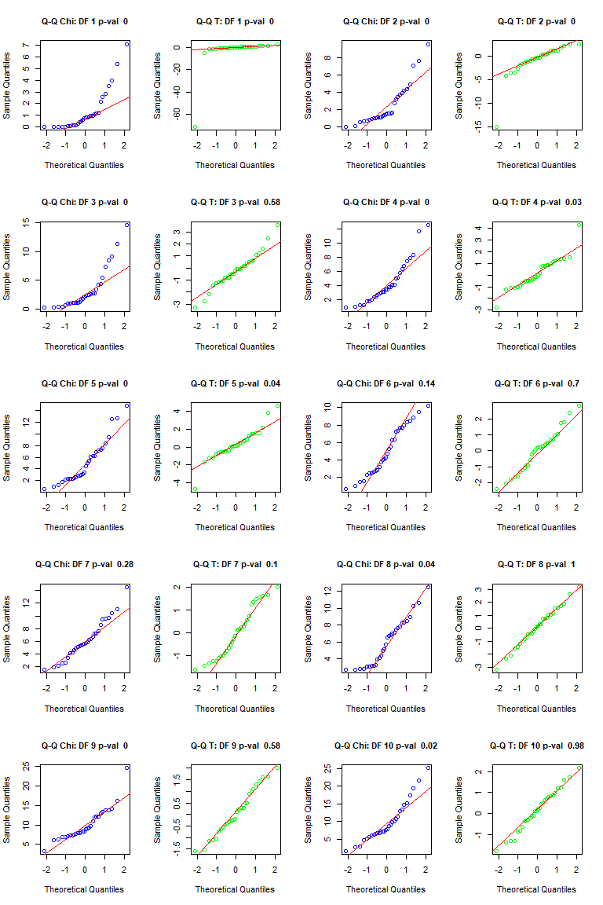
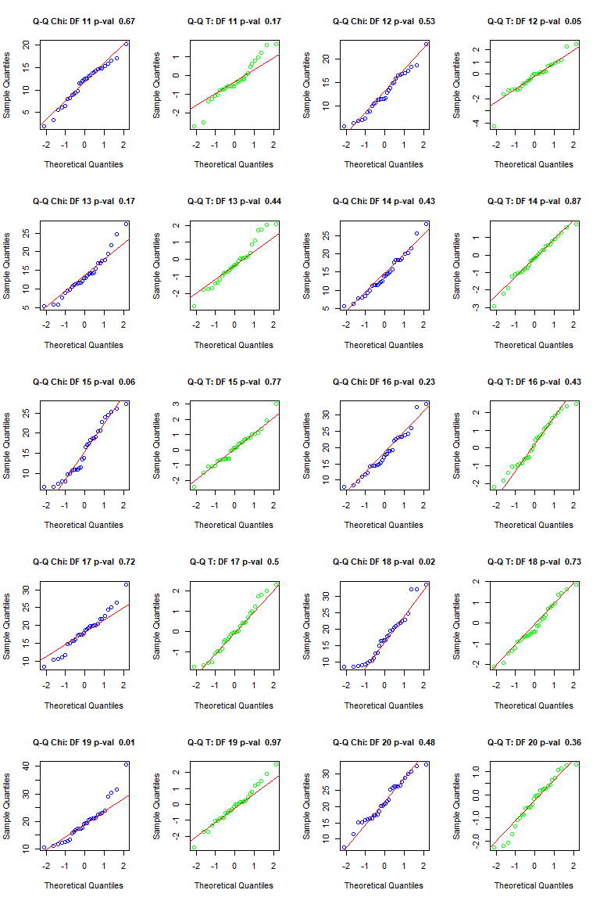
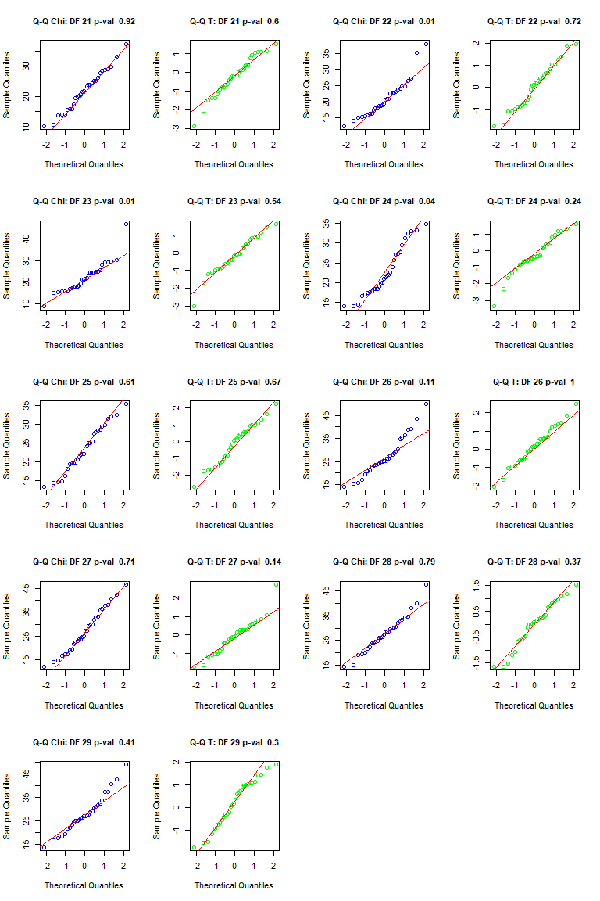
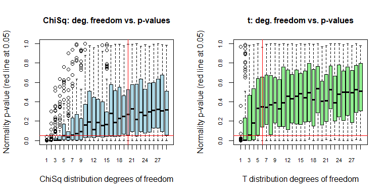

# Build Chi-Squared and t-distribution dataset

Running x <- rchisq(n, 1) creates n random values from a chi-squared distribution and one degree of freedom. 

Running x <- rt(n, 1) creates n random values from a t-distribution with one degree of freedom. 

Make normal probability plots using 30 random values for various degrees of freedom from each of these distributions. 

Calculate p-values using Shapiro-Wilk tests.

The $H_O$ null hypothesis is that the data are normally distributed.

The $H_A$ alternative hypothesis is that the data are not normally distributed.

$\therefore$ Therefore, if _p-value_ less than $0.05$, we reject the null hypothesis and 
state that the data are plausibly not normally distributed.

And if the _p-value_ is greater than $0.05$, we keep the null hypothesis and state that it is
plausible that the data are normally distributed.


```r
#R Code Here

# Sample size
N <- 30

# Let's bound our story to a maximum degrees of freedom
Max_D <- N-1

TRIALS <- 100
# Initialize two dataframes: one for chisq and one for t distribution
chi_p.value <- as.data.frame(matrix(NA, nrow = TRIALS*Max_D, ncol=3))
t_p.value <- as.data.frame(matrix(NA, nrow = TRIALS*Max_D, ncol=3))

par(mfrow = c(5, 4))

# Initialize observation number
obs <- 0

# Loop from 1 to S-1 degree of freedom experiments each.
# for (i in 1:(N-1)) {
for (i in 1:Max_D) {

  # Now I am going to run 100 trials for each experiment
  # To do multiple tests and plot a boxplot of p-values
  # Trials within an experiment
  for (j in 1:TRIALS) {
    
    obs <- obs + 1
    # Run Chi-Square distribution trials
    CHI_SAMPLE <- rchisq(N, i)
    CHI_SHAPIRO <- shapiro.test(CHI_SAMPLE)
    
    # Store it in the dataframe
    chi_p.value[obs, 1] <- i
    chi_p.value[obs, 2] <- CHI_SHAPIRO$p.value
    chi_p.value[obs, 3] <- 'chisq'
    
    # Run t-distribution trials.
    T_SAMPLE <- rt(N, i)
    T_SHAPIRO <- shapiro.test(T_SAMPLE)
    
    # Store it in the dataframe
    t_p.value[obs, 1] <- i
    t_p.value[obs, 2] <- T_SHAPIRO$p.value
    t_p.value[obs, 3] <- 't'
    
  }
  
  # Q-Q plot the last trial
  qqnorm(CHI_SAMPLE,
        #ylim=c(-2, 2),
        col='blue',
        main=paste('Q-Q Chi: DF', i, 'p-val ', round(CHI_SHAPIRO$p.value,2)),
        cex.main=1,)
  qqline(CHI_SAMPLE,
        #ylim=c(-2, 2),
        col='red')

  qqnorm(T_SAMPLE,
        #ylim=c(-2, 2),
        col='green',
        main=paste('Q-Q T: DF', i, 'p-val ', round(T_SHAPIRO$p.value,2)),
        cex.main=1,)
  qqline(T_SAMPLE,
        #ylim=c(-2, 2),
        col='red')

}
```

<!-- --><!-- --><!-- -->

## Boxplot: Visualize DF impact


```r
# BOxplot of p-values

#chi_p.value[complete.cases(chi_p.value,)]
colnames(chi_p.value) <- c('deg_of_freedom', 'p_value', 'distribution')
colnames(t_p.value) <- c('deg_of_freedom', 'p_value', 'distribution')

par(mfrow = c(1, 2))

boxplot(p_value~deg_of_freedom, chi_p.value, 
        col = 'lightblue',
        main='ChiSq: deg. freedom vs. p-values',
        ylab = 'Normality p-value (red line at 0.05)',
        xlab = 'ChiSq distribution degrees of freedom',
        cex.main=1,
        cex.axis=0.7)
abline(v=20, h=0.05, col='red')

boxplot(p_value~deg_of_freedom, t_p.value, 
        col = 'lightgreen',
        main = 't: deg. freedom vs. p-values',
        ylab = 'Normality p-value (red line at 0.05)',
        xlab = 'T distribution degrees of freedom',
        cex.main=1,
        cex.axis=0.7)
abline(v=6, h=0.05, col='red')
```

<!-- -->

- In both cases, _ChiSquare distribution and t-distribtution_, increasing the _number_ of _degrees of freedom_ makes the drawn distribution closer to a _Normally distributed_ distribution.
- The sample size is fixed at $30$ as stated in the problem.
- We can visually perceive _Q-Q plots_ with data points aligning closer to the diagonal as we increase the _number_ of _degrees of freedom_.
- Evidently, these are random samples. And as such, the random sample will varie from experiment to experiment.
- Therefore, I calculated the _Shapiro-Wilk Tests_ for multiple experiment to assess an acceptable value of _degrees of freedom_ for each distribution case.
- I store the _p-values_ of the _Shapiro-Wilk Tests_ in a _dataframe_. I ran $100$ trials for each _degree of freedom_ and for wach type of distribution.
- The $H_o$ _null hypothesis_ states that the sample likely came from a _Normal_ distribution. If the _p-value_ is higher than $0.05$ we keep the _null hypothesis_ stating that the same is _Normally distributed_.
- The$H_A$ _alternative hypothesis_ states the opporsite, the sample des not come from a _Normal_ distribution, and we reject and _null hypothesis_.
- Then I created _boxplots_ for each type of distribution, _ChiSquare and t distribution_.
- The chart shows a _boxplot_ for each _degrees of freedom_ value.
- We can observe an upward or positive trend as we increase the _degrees of freedom_, the _p-value_ increases.
- We also observe that the upward trend is more pronounced for the _t-distribution_ than for the _ChiSquare distribution_.
- Furthermore, I included a _red_ line on the key $0.05$ _p-value_ mark.
- And I included a vertical _red_ line where the _interquartile range_ of the _boxplots_ clear, and are above the $0.05$ _p-value_ mark.
- For a _ChiSquare distribution_, when we have _degrees of freedom_ greater than $20$ we have a  _p-values_ above the $0.05$ for the _interquartile range_ (the boxes from the boxplot).
- For a _t distribution_, when we have _degrees of freedom_ at least $6$ we have a  _p-values_ above the $0.05$ for the _interquartile range_ (the boxes from the boxplot).
- Therefore, to answer the question, for $30$ observations: _'Approximately how large degrees of freedom is necessary, in each instance, to obtain a consistent normal distribution shape?_
- The answer depends on how strict is the use case, the impact to people.
- For $ChiSquare$, I would use at least $20$ _degrees of freedom_ to have consistent draws of _Normally distributed_ data.
- For $t-distribution$, I would use at least $6$ _degrees of freedom_ to have consistent draws of _Normally distributed_ data.

