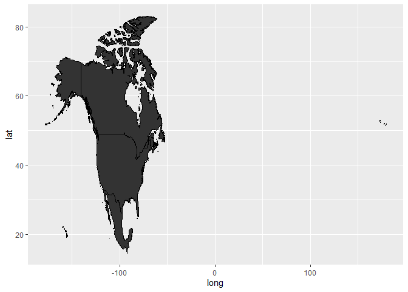
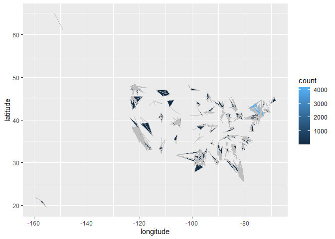

# Reference

Dr. Rai

https://www.youtube.com/watch?v=SW5o8B_xtH8&list=PL34t5iLfZddug6PqUszo1u8d9ndME_ub9&index=2

The purpose for this vignette is purely educational.

# Load the libraries


```r
# Libraries
library(leaflet)
```

```
## Warning: package 'leaflet' was built under R version 4.2.3
```

```r
library(tidyverse)
```

```
## ── Attaching core tidyverse packages ──────────────────────── tidyverse 2.0.0 ──
## ✔ dplyr     1.1.0     ✔ readr     2.1.4
## ✔ forcats   1.0.0     ✔ stringr   1.5.0
## ✔ ggplot2   3.4.1     ✔ tibble    3.1.8
## ✔ lubridate 1.9.2     ✔ tidyr     1.3.0
## ✔ purrr     1.0.1     
## ── Conflicts ────────────────────────────────────────── tidyverse_conflicts() ──
## ✖ dplyr::filter() masks stats::filter()
## ✖ dplyr::lag()    masks stats::lag()
## ℹ Use the ]8;;http://conflicted.r-lib.org/conflicted package]8;; to force all conflicts to become errors
```

```r
library(ggmap)
```

```
## Warning: package 'ggmap' was built under R version 4.2.3
```

```
## ℹ Google's Terms of Service: ]8;;https://mapsplatform.google.com<https://mapsplatform.google.com>]8;;
## ℹ Please cite ggmap if you use it! Use `citation("ggmap")` for details.
```

```r
library(leaflet.extras)
```

```
## Warning: package 'leaflet.extras' was built under R version 4.2.3
```

```r
library(htmltools)
library(ggplot2)
library(maps)
```

```
## Warning: package 'maps' was built under R version 4.2.3
```

```
## 
## Attaching package: 'maps'
## 
## The following object is masked from 'package:purrr':
## 
##     map
```

```r
library(mapproj)
```

```
## Warning: package 'mapproj' was built under R version 4.2.3
```

```r
library(mapdata)
```

```
## Warning: package 'mapdata' was built under R version 4.2.3
```


# World map


```r
w <- map_data('world')
icj <- map_data('world',
                region = c('Mexico', 'USA', 'Canada'))
ggplot(icj, aes(x = long, y = lat, group = group)) +
  geom_polygon(color = 'black') 
```

<!-- -->

# Covid

## Prepare the data


```r
c <- read.csv('../data/covid.csv', header = TRUE)
usa <- c %>% filter(country == 'United States')
usa <- usa %>% group_by(province) %>% 
  summarise(count = n()) %>% 
  arrange(desc(count))
```


## Merge the data


```r
# usa$province <- tolower(usa$province)
# c$province <- tolower(c$province)
data <- merge(c, usa,
              by.x = 'province',
              by.y = 'province')

ggplot(data, aes(x = longitude, y = latitude, 
                 group = province,
                 fill = count)) +
  geom_polygon(color = 'gray') 
```

<!-- -->


# Leaflet


```r
# Leaflet
leaflet() %>% addTiles()
```

```{=html}
<div class="leaflet html-widget html-fill-item-overflow-hidden html-fill-item" id="htmlwidget-93db2d09d9eebe166b5d" style="width:672px;height:480px;"></div>
<script type="application/json" data-for="htmlwidget-93db2d09d9eebe166b5d">{"x":{"options":{"crs":{"crsClass":"L.CRS.EPSG3857","code":null,"proj4def":null,"projectedBounds":null,"options":{}}},"calls":[{"method":"addTiles","args":["https://{s}.tile.openstreetmap.org/{z}/{x}/{y}.png",null,null,{"minZoom":0,"maxZoom":18,"tileSize":256,"subdomains":"abc","errorTileUrl":"","tms":false,"noWrap":false,"zoomOffset":0,"zoomReverse":false,"opacity":1,"zIndex":1,"detectRetina":false,"attribution":"&copy; <a href=\"https://openstreetmap.org\">OpenStreetMap<\/a> contributors, <a href=\"https://creativecommons.org/licenses/by-sa/2.0/\">CC-BY-SA<\/a>"}]}]},"evals":[],"jsHooks":[]}</script>
```

```r
# Allahabad, India
# leaflet() %>% addProviderTiles('CartoDB') %>% 
#   setView(lng = 81.878357, lat = 25.473034,
#           zoom = 10) 

# Harvard
leaflet() %>% addProviderTiles('CartoDB') %>% 
  setView(lng = -71.116943, lat = 42.374443,
          zoom = 15) 
```

```{=html}
<div class="leaflet html-widget html-fill-item-overflow-hidden html-fill-item" id="htmlwidget-aaaa528ef8c1d53640e0" style="width:672px;height:480px;"></div>
<script type="application/json" data-for="htmlwidget-aaaa528ef8c1d53640e0">{"x":{"options":{"crs":{"crsClass":"L.CRS.EPSG3857","code":null,"proj4def":null,"projectedBounds":null,"options":{}}},"calls":[{"method":"addProviderTiles","args":["CartoDB",null,null,{"errorTileUrl":"","noWrap":false,"detectRetina":false}]}],"setView":[[42.374443,-71.116943],15,[]]},"evals":[],"jsHooks":[]}</script>
```

# COVID data - leaflet map of US


```r
usa <- c %>% filter(country == 'United States')
usa <- usa %>% group_by(city, province, longitude, latitude) %>% 
  summarise(count = n()) %>% 
  arrange(desc(count))
```

```
## `summarise()` has grouped output by 'city', 'province', 'longitude'. You can
## override using the `.groups` argument.
```

```r
# US map for each county
mycolor <- colorNumeric(palette = 'RdBu',
                        domain = c(1:4000))

usa %>% 
  leaflet() %>% 
  addProviderTiles('CartoDB') %>% 
  addCircleMarkers(radius = 2,
                   color = ~mycolor(count),
                   popup = ~paste0(city)) 
```

```
## Assuming "longitude" and "latitude" are longitude and latitude, respectively
```

```
## Warning in validateCoords(lng, lat, funcName): Data contains 41 rows with
## either missing or invalid lat/lon values and will be ignored
```

```{=html}
<div class="leaflet html-widget html-fill-item-overflow-hidden html-fill-item" id="htmlwidget-183fbe56852bcf184cd3" style="width:672px;height:480px;"></div>
<script type="application/json" data-for="htmlwidget-183fbe56852bcf184cd3">{"x":{"options":{"crs":{"crsClass":"L.CRS.EPSG3857","code":null,"proj4def":null,"projectedBounds":null,"options":{}}},"calls":[{"method":"addProviderTiles","args":["CartoDB",null,null,{"errorTileUrl":"","noWrap":false,"detectRetina":false}]},{"method":"addCircleMarkers","args":[[40.661,41.1624921,47.49133,40.73994647,40.1672678,31.09583488,48.04818,28.67906773,37.38020024,40.96031581,40.87683837,30.06923,37.23166,47.40498985,42.66081808,41.27362703,42.48609196,39.02762631,40.20301015,40.43800163,26.15218767,32.67587887,42.26077769,25.61359856,46.42071168,40.78765375,36.16977654,42.696325,36.21921388,40.7402348,34.32402027,33.03577,41.15234991,41.40221114,43.00989416,42.33170089,32.81785427,40.21122015,47.02357632,40.25901401,42.16118,39.05990867,38.90867252,39.94505063,35.55061155,35.59939316,42.60048105,41.03404579,32.77916612,40.49739684,31.56894921,37.42222232,37.91727452,41.42464273,39.90962163,40.00826241,36.03642498,39.13748574,38.90867251,41.76569778,29.83975,41.67672221,39.75909189,39.62837984,40.66728279,40.6587608,38.45354,39.41502214,42.76280368,43.14656766,33.79076629,40.86212212,43.84843083,38.39820373,45.5601,35.89432895,33.3520462,38.83324914,43.6987299,43.06868588,41.41114848,35.7905,40.56360946,33.94158342,32.76827137,41.29556771,33.55493842,null,44.46854641,37.64681081,41.84368402,26.64712136,34.33691475,39.64894526,41.8781,41.80701906,45.00652234,34.33967981,43.10810418,42.81814691,40.86951655,42.0921259,43.97072899,42.37182695,44.48950195,38.500845,45.40465376,40.47017942,39.25178235,41.67180992,47.46887296,48.16381557,40.28388709,41.05851592,39.57784451,44.95907384,38.87875126,39.44719107,35.05211207,39.87875675,39.91745099,42.67259231,39.58574402,37.7775,37.75538058,42.28443266,37.53400719,39.80511608,26.11598906,30.33295292,38.84023192,43.75392898,37.32583576,35.24914332,33.70329,42.98656903,42.25323991,34.91679031,34.46201915,40.33902796,40.1649009,27.92983925,34.05,40.67692559,20.25690603,39.97435142,33.77185434,29.85893327,32.26823338,26.57955075,39.78153802,32.905945,27.92895182,39.21730177,47.60972,38.62722,41.88878753,42.35295002,39.36556608,34.23807867,29.5271845,38.88362378,38.07227897,28.51449796,37.05671494,29.05730729,39.01283729,39.87349593,39.2904,null,39.33073203,43.04503199,38.66618936,40.56833348,42.59711279,38.18712682,27.47160807,28.06323072,null,33.74607879,48.47971094,null,29.67525737,34.24407618,33.18969065,38.04265052,39.96962212,47.20918621,43.0316322,33.55147907,41.79364703,39.06467181,45.01977974,28.71726452,30.3336109,47.07388905,29.4484436,39.43865195,45.1890785,40.98946879,43.91642499,31.53336912,38.83209302,38.44207206,41.29649226,31.552443,32.09808163,42.71228713,38.27924603,null,48.82612882,65.00564304,42.3601,41.80158083,37.37994043,33.54220452,44.67284514,33.41395402,39.71862143,43.94185668,33.96147883,30.51308905,21.45845587,null,47.7,null,39.09349607,43.67524719,40.90861,40.75456194,43.00737083,41.9520959,41.42610559,32.37492709,null,null,32.77084935,46.92044719,42.45181724,34.45795413,43.02061326,40.55765961,44.06934152,46.45848635,43.01408736,null,39.00670062,44.41539855,32.38863642,32.58258,45.78498644,29.98451778,33.20559803,37.25999569,35.36916683,39.76960626,42.91561627,42.57950931,44.90372993,41.11771423,44.00667841,30.7689846,38.70497172,29.90058266,30.40684,36.6064,35.50925306,27.18101649,43.72131132,33.26485675,35.18493569,44.79124517,47.62249307,null,null,41.12582893,41.85554338,41.26998387,39.11382886,44.16620958,39.48221732,40.09208772,35.70272339,44.46112346,28.85010474,33.95142776,41.68414092,31.76918664,34.26257121,31.18959988,39.56270717,19.59887904,30.05745938,34.26953632,47.74755422,39.49029405,41.9401479,44.40968349,47.6116276,47.12498581,41.41615591,33.90280889,44.07416241,33.76833,30.83276702,41.01466942,28.86604502,41.46336961,47.03749904,30.30135289,35.41356939,30.70679859,28.30925984,41.33297656,35.38874049,37.35444,38.52944732,37.5603096,40.81419933,41.71664968,29.42585,36.2215292,36.1218632,33.29030954,45.59429,40.85824753,40.33272245,40.1916495,43.48100317,43.28554544,42.25781166,45.27517535,null,41.72731985,41.6147,40.68462921,40.01572711,43.03588837,44.49393888,33.79558784,29.19125316,42.1601686,44.45277733,46.97795156,41.72405842,38.20523429,39.56285186,38.64641219,38.50748692,32.83741466,null,47.87206045,42.49314073,36.97002061,39.68782195,44.74680195,34.23006777,35.84815793,31.8691069,40.30186337,33.35359531,null,42.59603536,32.59764321,null,38.31843007,36.13082335,39.41487478,36.76062701,45.54534003,29.39618182,34.57672434,null,34.50360997,42.27756173,36.07966353,40.07281656,43.66231215,42.13530184,30.41731891,null,37.5396677,33.45353763,40.48388638,33.04113181,null,35.8107035,30.54323811,42.4330519,32.37889099,35.51835001,22.0396132,42.63780677,35.99385999,41.43899278,29.57593,28.76932003,42.3259331,41.69640813,40.04353302,34.68722714,41.30833738,40.66847296,31.77945325,46.57764985,39.98333,null,null,20.85891283,41.92915166,32.22166063,38.03382062,42.90105109,45.54691,null,35.55093117,43.24238519,45.02093546,43.3854192,41.87556,40.48676338,29.91338,35.69079601,39.75851221,null,null,null,38.42123595,45.55386531,39.6336923,36.47033131,41.13899865,27.96806,null,41.31714604,40.12120161,48.222589,43.36998668,36.23068719,40.31157287,null,30.64889568,35.70599923,41.83113362,42.70255521,45.93759739,38.6872042,39.92104411,44.08424284,43.4512629,41.33013627,40.74585177,39.87191287,61.2181,61.15101024,30.20416,40.8467159,30.73744285,39.20615997,43.70770207,31.0389189,45.69953633,37.87167,40.41679305,42.46974738,43.4131808,44.03616821,42.98853102,40.05168491,38.99200848,32.6801,38.20697573,33.44663877,30.66116949,28.26467975,46.33383148,34.07378493,37.78278781,35.39021416,33.6747582,38.55175466,null,null,36.40411585,35.54273713,39.15143352,42.03572033,39.15107851,44.82183528,40.90971286,46.93364813,37.36168636,43.20773318,45.30253191,26.90638581,30.78310096,36.26197332,38.4772509,37.97133975,35.53829842,35.20297432,null,42.9443157,38.50725755,46.29880039,46.19499104,35.12942736,39.27379645,40.13388326,43.67507145,29.08162115,42.19866034,40.27848283,34.8771553,38.88562313,43.28123745,41.85272809,30.70220662,44.11856745,39.64082086,37.69361817,34.22547489,38.71974,null,38.56474513,42.5830611,46.53541993,39.47333658,43.1135803,30.57983744,39.60006942,35.29492587,41.49976363,43.00135123,37.72203214,44.66932651,34.28990613,47.1517825,34.8957035,32.48174386,34.31702452,35.18166052,44.67312228,37.76128384,41.68272213,38.38603835,43.42053444,35.01676195,33.92292716,40.70305,41.14654952,43.64070237,39.00838322,34.58705952,44.04210855,36.05138784,39.30963427,38.99708871,null,36.81831856,42.69361481,45.87481848,43.90719507,41.54685256,42.5430332,29.3839429,40.36807125,32.60157271,44.93888134,40.61212261,30.45865095,34.81058153,41.04928597,35.4875481,47.57649923,42.60360153,41.62116006,41.17817585,37.01960425,37.21901241,43.08491,34.76386363,43.78498572,40.16183896,32.63369147,47.35176084,43.67535424,42.32697483,29.35358405,39.01927637,43.64676957,33.89426017,43.31118379,35.30994463,30.61157413,37.80513424,39.30220938,33.55511463,43.20206418,41.39944018,null,41.22778,34.73819517,42.85218586,44.00545703,42.95965711,44.41624387,44.5039162,44.52289656,33.91956214,36.07771908,45.40615355,31.17295114,44.71969891,34.21158,27.9492929,34.00115127,41.68460903,44.90323415,41.33583488,37.2255832,38.1722929,34.77004489,42.74955711,39.52722,47.486667,44.72751802,34.02204267,36.52682026,32.1101226,35.84359608,29.87286,30.1128,41.61742895,34.6464201,34.99062055,34.84724823,32.715,37.93482609,34.67393753,30.73308176,41.11253373,42.58774079,35.78547004,null,40.76442471,42,null,38.18591989,37.209,null,null,36.5131771,28.70496589,38.66131312,38.77620238,36.57903246,33.41278,43.76062491,42.17052038,40.45088716,33.03349125,40.44119568,34.98782546,42.67148658,43.56178934,45.03767191,43.31636189,44.27378191,30.85355,null,43.15583082,35.36381042,41.64838729,27.75912581,null,42.29639,40.72986026,null,null,43.58026091,44.45588071,40.78837446,45.17560382,45.2325786,34.9746039,37.2368725],[-73.944,-73.75696583,-121.804,-73.58825355,-89.14767476,-92.01767261,-121.696,-82.50596405,-119.6778784,-74.07497372,-72.85859507,-89.9312,-121.693,-120.4380484,-83.38565035,-73.38967969,-71.39239708,-105.5478448,-74.67119722,-74.41264015,-80.48771463,-83.45597416,-71.81478858,-80.56596316,-94.19551232,-74.24872939,-86.78477633,-82.93246069,-115.0185742,-74.07398741,-118.2265977,-116.732,-74.02337886,-74.30575582,-87.9676915,-71.07343455,-86.8272198,-75.36693918,-122.1021305,-74.22507469,-71.2101,-76.80351955,-77.01539026,-86.27918972,-79.38794004,-97.51493013,-73.97286419,-74.30106432,-89.66379986,-82.6207447,-99.37254515,-122.3302662,-121.9256384,-81.65878238,-74.29778659,-75.1354419,-78.87677997,-77.20252273,-77.01539026,-73.74366264,-90.1382,-71.55440889,-104.8761799,-106.6953457,-111.9214533,-74.31204334,-121.339,-116.6671614,-78.73025753,-77.69739865,-84.46678675,-74.54382072,-70.40837299,-92.48765588,-123.099,-86.89947535,-112.489233,-76.84541021,-71.57668909,-89.41753105,-72.93220723,-78.652,-74.6168881,-84.57636689,-96.77933271,-96.15382716,-86.89626324,null,-114.6840282,-121.8872713,-87.81673673,-80.46689725,-111.6660558,-104.3366105,-87.6298,-72.7328143,-93.47836029,-80.59100706,-73.86667465,-74.05842006,-110.953326,-93.50231508,-120.5507654,-73.20721759,-122.5339067,-98.3814675,-69.22302775,-79.98108787,-76.93123255,-91.58862202,-100.4714292,-122.5479116,-74.70147386,-75.33787891,-75.63770785,-85.76983027,-77.10001007,-76.6393171,-106.6656831,-74.66835303,-75.39947394,-70.95615369,-105.2483919,-122.416,-122.4433467,-83.28778947,-85.28339593,-74.95992532,-81.34283574,-81.6709398,-77.28025141,-88.48833483,-76.78276973,-80.83351092,-117.761,-71.12922845,-83.83943886,-92.43766184,-106.105791,-75.10792661,-77.2650709,-82.30899165,-118.25,-119.6637063,-156.3564127,-75.74850769,-84.22683762,-95.39707324,-90.44395175,-81.82734485,-86.13874629,-111.3436998,-82.72178993,-106.9152836,-122.333,-90.1978,-74.25877139,-71.90817234,-111.6825481,-84.84077287,-95.77118101,-94.82234639,-122.7183404,-81.32371698,-122.0015436,-81.18413567,-75.50702181,-104.3381815,-76.6122,null,-104.9278659,-108.6322727,-107.0295176,-74.91207363,-84.37514545,-85.65815232,-82.30022041,-81.1497095,null,-115.9927055,-121.7273941,null,-82.357707,-84.4760543,-96.57407474,-84.45891174,-83.01058229,-119.450231,-85.55047378,-90.30225936,-73.24588918,-120.7156477,-93.09952775,-81.23638217,-97.78038519,-109.6515765,-98.5200992,-84.5755015,-122.2204889,-112.1107585,-121.2279415,-84.21636058,-104.5261325,-84.33169087,-82.15075015,-97.20152633,-111.7873201,-73.5098507,-121.9292725,null,-121.7192928,-152.4073179,-71.0589,-71.11475372,-77.58694957,-84.35763816,-93.06756945,-84.49427844,-75.14125286,-71.82009048,-84.02347974,-89.1169132,-157.9731552,null,-122.19,null,-77.6358915,-96.79205871,-73.7819,-75.30777053,-76.19458383,-70.8124537,-73.74974356,-95.26889657,null,null,-97.29204358,-122.8307066,-76.47394135,-119.0853878,-88.30461314,-104.391363,-88.64456397,-120.7382513,-75.64645699,null,-76.61160113,-98.27734335,-80.73666707,-93.8838,-122.4805559,-81.85208424,-97.11691968,-93.34164615,-78.87013911,-86.50933303,-71.7165645,-88.04068424,-122.584311,-81.89940215,-92.40303566,-89.58971168,-77.48342443,-81.43570262,-89.9643,-121.074,-105.9738467,-82.32284655,-87.94580618,-86.66184482,-89.89607245,-106.8761241,-117.404174,null,null,-81.53194864,-72.33656152,-111.9122122,-94.76536199,-70.20663187,-74.6749623,-105.3573482,-79.25606172,-73.08158052,-82.47213039,-83.36715787,-94.04072474,-106.2363578,-85.21456645,-89.25807291,-76.31897213,-155.5183988,-98.03281797,-91.93177867,-123.5980819,-86.10066338,-88.42930227,-69.76737978,-122.6762113,-120.6789689,-87.38201637,-81.27165291,-69.54183817,-118.196,-83.26800864,-80.77564716,-95.98626487,-72.53418463,-113.923501,-95.50545527,-110.3207188,-86.59723567,-82.39213624,-75.03351688,-120.406654,-121.969,-122.888016,-120.9967468,-81.36560546,-74.76881748,-90.873,-118.8014938,-95.94271198,-87.52480395,-118.739,-74.99693473,-111.1667428,-80.24867551,-70.71536264,-91.37815463,-78.0274803,-93.24713004,null,-70.29715015,-112.1266,-80.34926904,-80.98785836,-73.0937669,-123.4284642,-90.88048878,-95.45506648,-75.81910698,-88.00414103,-100.4689719,-111.7420498,-120.5516764,-77.02238246,-94.35586992,-76.98965983,-79.95494981,null,-120.6183963,-75.61039074,-93.18728514,-105.6421274,-73.68051786,-90.60308517,-111.7710787,-90.44905366,-81.9201391,-84.76355183,null,-84.83911106,-86.14885235,null,-85.90572892,-80.25857832,-85.06103813,-119.6494237,-111.1696942,-94.96489136,-93.15063637,null,-84.87560269,-74.12168545,-79.78760322,-86.05171678,-74.49963095,-72.63155244,-89.48849147,null,-77.40694788,-84.15523054,-86.11665943,-115.3636645,null,-80.87334294,-88.63635944,-122.7279476,-97.3666488,-78.366583,-159.602502,-97.89157796,-83.93674156,-75.60889496,-90.4432,-81.70934576,-88.00277493,-81.23783521,-76.2476898,-80.70652405,-104.6875266,-105.4612334,-84.14125452,-122.3924889,-75.2664,null,null,-156.5638523,-83.54095287,-86.20797553,-83.91344776,-74.44035491,-122.4149,null,-97.40905203,-75.43625162,-84.60109428,-87.95055494,-71.3761,-106.9905213,-90.3576,-106.8626291,-89.65874614,null,null,null,-77.4605527,-94.61265959,-106.1160203,-86.46035733,-74.69068963,-82.4764,null,-80.76084268,-111.669313,-101.5418209,-88.23050088,-81.69627186,-79.46675705,null,-97.6035177,-77.9198671,-71.98763116,-78.2230302,-108.273918,-121.9023979,-76.72699732,-72.66217372,-116.2404519,-94.4721489,-84.93705259,-77.21805511,-149.9003,-149.1095625,-90.9112,-82.27078129,-87.72504572,-85.89820169,-83.99333053,-97.47899221,-93.99913996,-122.273,-75.92708491,-92.3096574,-113.9804195,-94.06702036,-97.88377695,-86.46798149,-92.31079504,-93.6061,-84.21713525,-94.42433823,-96.30476813,-80.74305519,-111.4957949,-78.2454133,-96.83879442,-80.55173987,-80.78038899,-76.56716722,null,null,-84.14991658,-97.98339002,-74.80664409,-94.86128637,-119.7479547,-93.80284469,-96.14085427,-97.24878347,-77.06121242,-98.58839049,-85.12931541,-81.89890344,-82.13828477,-87.0878522,-85.70763303,-84.14858258,-92.02614783,-97.32728986,null,-84.60316696,-92.28043728,-117.9087714,-122.6770701,-77.09575317,-88.24071899,-84.62034053,-98.14500148,-97.35634825,-74.96531462,-83.00467895,-89.99086336,-95.29401458,-123.1673383,-88.08513226,-87.37670673,-73.77416842,-85.17898712,-99.88843811,-84.1250615,-77.1546,null,-95.28642653,-72.59095641,-118.89924,-77.39725435,-74.4254817,-84.61353467,-107.9069849,-81.17970681,-81.17851596,-78.19430255,-77.91862811,-85.56075593,-92.42363048,-123.7725407,-82.36948774,-94.81788012,-83.81963543,-85.1650054,-68.3566363,-77.49293992,-95.81592621,-93.79237617,-74.96348225,-79.24037077,-78.99755702,-123.873,-82.59772945,-84.84706885,-94.3485504,-99.41568492,-75.9127427,-83.44620056,-77.8621217,-85.62803823,null,-97.14499007,-121.6504087,-120.7885513,-91.11507169,-86.73990606,-82.75372885,-96.9302418,-76.45965342,-85.35559788,-85.81345085,-75.59278985,-84.27757875,-86.98138379,-100.744332,-81.2252337,-118.4188142,-83.91305899,-83.65602046,-75.98827824,-88.0833125,-119.7624445,-89.5465,-86.55054955,-111.6565441,-85.71985369,-90.03536597,-123.1973949,-97.36796895,-88.45141711,-99.10926621,-108.4650147,-84.3892544,-88.48080433,-85.1540696,-79.48280646,-81.80400465,-85.46625178,-120.7652859,-83.85042027,-78.74219167,-85.41860462,null,-111.961,-77.4336137,-77.29965058,-72.37704927,-85.99681912,-88.46543601,-70.75717446,-109.5883802,-84.86636255,-96.97725877,-68.64869375,-88.99202687,-92.42193804,-92.0178,-81.69781112,-85.1887486,-93.57483376,-123.4145084,-95.54226311,-78.4452578,-104.5118323,-92.31201229,-88.05942127,-119.822,-122.195278,-94.94429616,-80.90277018,-86.87040044,-94.76261888,-86.41602777,-89.6004,-90.5079,-86.28981804,-92.67676509,-78.37319191,-116.1805731,-117.163,-121.2705152,-120.0183251,-87.01789697,-96.11142321,-74.44251895,-83.52375669,null,-122.0406394,-70.75,null,-77.65675054,-93.2923,null,null,-82.30432453,-82.08107849,-75.39802072,-76.08892949,-105.6306105,-111.943,-111.2070689,-76.30697457,-113.1312463,-85.02893554,-81.4736783,-80.53098097,-88.53911636,-73.85243614,-92.88438733,-73.43542222,-72.61508433,-90.041,null,-77.03048918,-78.00501329,-75.30336927,-99.3321988,null,-71.2931,-85.22092451,null,null,-72.5853646,-90.04154256,-89.21063612,-93.96427035,-123.3100821,-81.18473379,-76.56263189],2,null,null,{"interactive":true,"className":"","stroke":true,"color":["#C7DFED","#D55F4C","#BC3034","#AC162A","#AC162A","#A01228","#970F27","#8D0B25","#8C0B25","#8B0A25","#870924","#7C0523","#7B0522","#7A0422","#7A0422","#790422","#790422","#780422","#760322","#760322","#750321","#750321","#750321","#750321","#740321","#720221","#710221","#710221","#710221","#710221","#710221","#710221","#700221","#700221","#6F0220","#6F0220","#6F0220","#6F0220","#6F0220","#6F0220","#6F0220","#6E0120","#6E0120","#6E0120","#6E0120","#6E0120","#6E0120","#6E0120","#6D0120","#6D0120","#6D0120","#6D0120","#6D0120","#6D0120","#6D0120","#6D0120","#6D0120","#6D0120","#6C0120","#6C0120","#6C0120","#6C0120","#6C0120","#6C0120","#6C0120","#6C0120","#6C0120","#6C0120","#6C0120","#6C0120","#6B0120","#6B0120","#6B0120","#6B0120","#6B0120","#6B0120","#6B0120","#6B0120","#6B0120","#6B0120","#6B0120","#6B0120","#6B0120","#6A0120","#6A0120","#6A0120","#6A0120","#6A0120","#6A0120","#6A0120","#6A0120","#6A0120","#6A0120","#6A0120","#6A0120","#6A0120","#6A0120","#6A0120","#6A0120","#6A0120","#6A0120","#6A0120","#6A0120","#6A0120","#6A0120","#6A011F","#6A011F","#6A011F","#6A011F","#6A011F","#6A001F","#6A001F","#6A001F","#6A001F","#6A001F","#69001F","#69001F","#69001F","#69001F","#69001F","#69001F","#69001F","#69001F","#69001F","#69001F","#69001F","#69001F","#69001F","#69001F","#69001F","#69001F","#69001F","#69001F","#69001F","#69001F","#69001F","#69001F","#69001F","#69001F","#69001F","#69001F","#69001F","#69001F","#69001F","#69001F","#69001F","#69001F","#69001F","#69001F","#69001F","#69001F","#69001F","#69001F","#69001F","#69001F","#69001F","#69001F","#69001F","#68001F","#68001F","#68001F","#68001F","#68001F","#68001F","#68001F","#68001F","#68001F","#68001F","#68001F","#68001F","#68001F","#68001F","#68001F","#68001F","#68001F","#68001F","#68001F","#68001F","#68001F","#68001F","#68001F","#68001F","#68001F","#68001F","#68001F","#68001F","#68001F","#68001F","#68001F","#68001F","#68001F","#68001F","#68001F","#68001F","#68001F","#68001F","#68001F","#68001F","#68001F","#68001F","#68001F","#68001F","#68001F","#68001F","#68001F","#68001F","#68001F","#68001F","#68001F","#68001F","#68001F","#68001F","#68001F","#68001F","#68001F","#68001F","#68001F","#68001F","#68001F","#68001F","#68001F","#68001F","#68001F","#68001F","#68001F","#68001F","#68001F","#68001F","#68001F","#68001F","#68001F","#68001F","#68001F","#68001F","#68001F","#68001F","#68001F","#68001F","#68001F","#68001F","#68001F","#68001F","#68001F","#68001F","#68001F","#68001F","#68001F","#68001F","#68001F","#68001F","#68001F","#68001F","#68001F","#68001F","#68001F","#68001F","#68001F","#68001F","#68001F","#68001F","#68001F","#68001F","#68001F","#68001F","#68001F","#68001F","#68001F","#68001F","#68001F","#68001F","#68001F","#68001F","#68001F","#68001F","#68001F","#68001F","#68001F","#68001F","#68001F","#67001F","#67001F","#67001F","#67001F","#67001F","#67001F","#67001F","#67001F","#67001F","#67001F","#67001F","#67001F","#67001F","#67001F","#67001F","#67001F","#67001F","#67001F","#67001F","#67001F","#67001F","#67001F","#67001F","#67001F","#67001F","#67001F","#67001F","#67001F","#67001F","#67001F","#67001F","#67001F","#67001F","#67001F","#67001F","#67001F","#67001F","#67001F","#67001F","#67001F","#67001F","#67001F","#67001F","#67001F","#67001F","#67001F","#67001F","#67001F","#67001F","#67001F","#67001F","#67001F","#67001F","#67001F","#67001F","#67001F","#67001F","#67001F","#67001F","#67001F","#67001F","#67001F","#67001F","#67001F","#67001F","#67001F","#67001F","#67001F","#67001F","#67001F","#67001F","#67001F","#67001F","#67001F","#67001F","#67001F","#67001F","#67001F","#67001F","#67001F","#67001F","#67001F","#67001F","#67001F","#67001F","#67001F","#67001F","#67001F","#67001F","#67001F","#67001F","#67001F","#67001F","#67001F","#67001F","#67001F","#67001F","#67001F","#67001F","#67001F","#67001F","#67001F","#67001F","#67001F","#67001F","#67001F","#67001F","#67001F","#67001F","#67001F","#67001F","#67001F","#67001F","#67001F","#67001F","#67001F","#67001F","#67001F","#67001F","#67001F","#67001F","#67001F","#67001F","#67001F","#67001F","#67001F","#67001F","#67001F","#67001F","#67001F","#67001F","#67001F","#67001F","#67001F","#67001F","#67001F","#67001F","#67001F","#67001F","#67001F","#67001F","#67001F","#67001F","#67001F","#67001F","#67001F","#67001F","#67001F","#67001F","#67001F","#67001F","#67001F","#67001F","#67001F","#67001F","#67001F","#67001F","#67001F","#67001F","#67001F","#67001F","#67001F","#67001F","#67001F","#67001F","#67001F","#67001F","#67001F","#67001F","#67001F","#67001F","#67001F","#67001F","#67001F","#67001F","#67001F","#67001F","#67001F","#67001F","#67001F","#67001F","#67001F","#67001F","#67001F","#67001F","#67001F","#67001F","#67001F","#67001F","#67001F","#67001F","#67001F","#67001F","#67001F","#67001F","#67001F","#67001F","#67001F","#67001F","#67001F","#67001F","#67001F","#67001F","#67001F","#67001F","#67001F","#67001F","#67001F","#67001F","#67001F","#67001F","#67001F","#67001F","#67001F","#67001F","#67001F","#67001F","#67001F","#67001F","#67001F","#67001F","#67001F","#67001F","#67001F","#67001F","#67001F","#67001F","#67001F","#67001F","#67001F","#67001F","#67001F","#67001F","#67001F","#67001F","#67001F","#67001F","#67001F","#67001F","#67001F","#67001F","#67001F","#67001F","#67001F","#67001F","#67001F","#67001F","#67001F","#67001F","#67001F","#67001F","#67001F","#67001F","#67001F","#67001F","#67001F","#67001F","#67001F","#67001F","#67001F","#67001F","#67001F","#67001F","#67001F","#67001F","#67001F","#67001F","#67001F","#67001F","#67001F","#67001F","#67001F","#67001F","#67001F","#67001F","#67001F","#67001F","#67001F","#67001F","#67001F","#67001F","#67001F","#67001F","#67001F","#67001F","#67001F","#67001F","#67001F","#67001F","#67001F","#67001F","#67001F","#67001F","#67001F","#67001F","#67001F","#67001F","#67001F","#67001F","#67001F","#67001F","#67001F","#67001F","#67001F","#67001F","#67001F","#67001F","#67001F","#67001F","#67001F","#67001F","#67001F","#67001F","#67001F","#67001F","#67001F","#67001F","#67001F","#67001F","#67001F","#67001F","#67001F","#67001F","#67001F","#67001F","#67001F","#67001F","#67001F","#67001F","#67001F","#67001F","#67001F","#67001F","#67001F","#67001F","#67001F","#67001F","#67001F","#67001F","#67001F","#67001F","#67001F","#67001F","#67001F","#67001F","#67001F","#67001F","#67001F","#67001F","#67001F","#67001F","#67001F","#67001F","#67001F","#67001F","#67001F","#67001F","#67001F","#67001F","#67001F","#67001F","#67001F","#67001F","#67001F","#67001F","#67001F","#67001F","#67001F","#67001F","#67001F","#67001F","#67001F","#67001F","#67001F","#67001F","#67001F","#67001F","#67001F","#67001F","#67001F","#67001F","#67001F","#67001F","#67001F","#67001F","#67001F","#67001F","#67001F","#67001F","#67001F","#67001F","#67001F","#67001F","#67001F","#67001F","#67001F","#67001F","#67001F","#67001F","#67001F","#67001F","#67001F","#67001F","#67001F","#67001F","#67001F","#67001F","#67001F"],"weight":5,"opacity":0.5,"fill":true,"fillColor":["#C7DFED","#D55F4C","#BC3034","#AC162A","#AC162A","#A01228","#970F27","#8D0B25","#8C0B25","#8B0A25","#870924","#7C0523","#7B0522","#7A0422","#7A0422","#790422","#790422","#780422","#760322","#760322","#750321","#750321","#750321","#750321","#740321","#720221","#710221","#710221","#710221","#710221","#710221","#710221","#700221","#700221","#6F0220","#6F0220","#6F0220","#6F0220","#6F0220","#6F0220","#6F0220","#6E0120","#6E0120","#6E0120","#6E0120","#6E0120","#6E0120","#6E0120","#6D0120","#6D0120","#6D0120","#6D0120","#6D0120","#6D0120","#6D0120","#6D0120","#6D0120","#6D0120","#6C0120","#6C0120","#6C0120","#6C0120","#6C0120","#6C0120","#6C0120","#6C0120","#6C0120","#6C0120","#6C0120","#6C0120","#6B0120","#6B0120","#6B0120","#6B0120","#6B0120","#6B0120","#6B0120","#6B0120","#6B0120","#6B0120","#6B0120","#6B0120","#6B0120","#6A0120","#6A0120","#6A0120","#6A0120","#6A0120","#6A0120","#6A0120","#6A0120","#6A0120","#6A0120","#6A0120","#6A0120","#6A0120","#6A0120","#6A0120","#6A0120","#6A0120","#6A0120","#6A0120","#6A0120","#6A0120","#6A0120","#6A011F","#6A011F","#6A011F","#6A011F","#6A011F","#6A001F","#6A001F","#6A001F","#6A001F","#6A001F","#69001F","#69001F","#69001F","#69001F","#69001F","#69001F","#69001F","#69001F","#69001F","#69001F","#69001F","#69001F","#69001F","#69001F","#69001F","#69001F","#69001F","#69001F","#69001F","#69001F","#69001F","#69001F","#69001F","#69001F","#69001F","#69001F","#69001F","#69001F","#69001F","#69001F","#69001F","#69001F","#69001F","#69001F","#69001F","#69001F","#69001F","#69001F","#69001F","#69001F","#69001F","#69001F","#69001F","#68001F","#68001F","#68001F","#68001F","#68001F","#68001F","#68001F","#68001F","#68001F","#68001F","#68001F","#68001F","#68001F","#68001F","#68001F","#68001F","#68001F","#68001F","#68001F","#68001F","#68001F","#68001F","#68001F","#68001F","#68001F","#68001F","#68001F","#68001F","#68001F","#68001F","#68001F","#68001F","#68001F","#68001F","#68001F","#68001F","#68001F","#68001F","#68001F","#68001F","#68001F","#68001F","#68001F","#68001F","#68001F","#68001F","#68001F","#68001F","#68001F","#68001F","#68001F","#68001F","#68001F","#68001F","#68001F","#68001F","#68001F","#68001F","#68001F","#68001F","#68001F","#68001F","#68001F","#68001F","#68001F","#68001F","#68001F","#68001F","#68001F","#68001F","#68001F","#68001F","#68001F","#68001F","#68001F","#68001F","#68001F","#68001F","#68001F","#68001F","#68001F","#68001F","#68001F","#68001F","#68001F","#68001F","#68001F","#68001F","#68001F","#68001F","#68001F","#68001F","#68001F","#68001F","#68001F","#68001F","#68001F","#68001F","#68001F","#68001F","#68001F","#68001F","#68001F","#68001F","#68001F","#68001F","#68001F","#68001F","#68001F","#68001F","#68001F","#68001F","#68001F","#68001F","#68001F","#68001F","#68001F","#68001F","#68001F","#68001F","#68001F","#67001F","#67001F","#67001F","#67001F","#67001F","#67001F","#67001F","#67001F","#67001F","#67001F","#67001F","#67001F","#67001F","#67001F","#67001F","#67001F","#67001F","#67001F","#67001F","#67001F","#67001F","#67001F","#67001F","#67001F","#67001F","#67001F","#67001F","#67001F","#67001F","#67001F","#67001F","#67001F","#67001F","#67001F","#67001F","#67001F","#67001F","#67001F","#67001F","#67001F","#67001F","#67001F","#67001F","#67001F","#67001F","#67001F","#67001F","#67001F","#67001F","#67001F","#67001F","#67001F","#67001F","#67001F","#67001F","#67001F","#67001F","#67001F","#67001F","#67001F","#67001F","#67001F","#67001F","#67001F","#67001F","#67001F","#67001F","#67001F","#67001F","#67001F","#67001F","#67001F","#67001F","#67001F","#67001F","#67001F","#67001F","#67001F","#67001F","#67001F","#67001F","#67001F","#67001F","#67001F","#67001F","#67001F","#67001F","#67001F","#67001F","#67001F","#67001F","#67001F","#67001F","#67001F","#67001F","#67001F","#67001F","#67001F","#67001F","#67001F","#67001F","#67001F","#67001F","#67001F","#67001F","#67001F","#67001F","#67001F","#67001F","#67001F","#67001F","#67001F","#67001F","#67001F","#67001F","#67001F","#67001F","#67001F","#67001F","#67001F","#67001F","#67001F","#67001F","#67001F","#67001F","#67001F","#67001F","#67001F","#67001F","#67001F","#67001F","#67001F","#67001F","#67001F","#67001F","#67001F","#67001F","#67001F","#67001F","#67001F","#67001F","#67001F","#67001F","#67001F","#67001F","#67001F","#67001F","#67001F","#67001F","#67001F","#67001F","#67001F","#67001F","#67001F","#67001F","#67001F","#67001F","#67001F","#67001F","#67001F","#67001F","#67001F","#67001F","#67001F","#67001F","#67001F","#67001F","#67001F","#67001F","#67001F","#67001F","#67001F","#67001F","#67001F","#67001F","#67001F","#67001F","#67001F","#67001F","#67001F","#67001F","#67001F","#67001F","#67001F","#67001F","#67001F","#67001F","#67001F","#67001F","#67001F","#67001F","#67001F","#67001F","#67001F","#67001F","#67001F","#67001F","#67001F","#67001F","#67001F","#67001F","#67001F","#67001F","#67001F","#67001F","#67001F","#67001F","#67001F","#67001F","#67001F","#67001F","#67001F","#67001F","#67001F","#67001F","#67001F","#67001F","#67001F","#67001F","#67001F","#67001F","#67001F","#67001F","#67001F","#67001F","#67001F","#67001F","#67001F","#67001F","#67001F","#67001F","#67001F","#67001F","#67001F","#67001F","#67001F","#67001F","#67001F","#67001F","#67001F","#67001F","#67001F","#67001F","#67001F","#67001F","#67001F","#67001F","#67001F","#67001F","#67001F","#67001F","#67001F","#67001F","#67001F","#67001F","#67001F","#67001F","#67001F","#67001F","#67001F","#67001F","#67001F","#67001F","#67001F","#67001F","#67001F","#67001F","#67001F","#67001F","#67001F","#67001F","#67001F","#67001F","#67001F","#67001F","#67001F","#67001F","#67001F","#67001F","#67001F","#67001F","#67001F","#67001F","#67001F","#67001F","#67001F","#67001F","#67001F","#67001F","#67001F","#67001F","#67001F","#67001F","#67001F","#67001F","#67001F","#67001F","#67001F","#67001F","#67001F","#67001F","#67001F","#67001F","#67001F","#67001F","#67001F","#67001F","#67001F","#67001F","#67001F","#67001F","#67001F","#67001F","#67001F","#67001F","#67001F","#67001F","#67001F","#67001F","#67001F","#67001F","#67001F","#67001F","#67001F","#67001F","#67001F","#67001F","#67001F","#67001F","#67001F","#67001F","#67001F","#67001F","#67001F","#67001F","#67001F","#67001F","#67001F","#67001F","#67001F","#67001F","#67001F","#67001F","#67001F","#67001F","#67001F","#67001F","#67001F","#67001F","#67001F","#67001F","#67001F","#67001F","#67001F","#67001F","#67001F","#67001F","#67001F","#67001F","#67001F","#67001F","#67001F","#67001F","#67001F","#67001F","#67001F","#67001F","#67001F","#67001F","#67001F","#67001F","#67001F","#67001F","#67001F","#67001F","#67001F","#67001F","#67001F","#67001F","#67001F","#67001F","#67001F","#67001F","#67001F","#67001F","#67001F","#67001F","#67001F","#67001F","#67001F","#67001F","#67001F","#67001F","#67001F","#67001F","#67001F","#67001F","#67001F","#67001F","#67001F","#67001F","#67001F","#67001F","#67001F","#67001F","#67001F","#67001F","#67001F"],"fillOpacity":0.2},null,null,["New York City","Westchester County","King County","Nassau County","","","Snohomish County","","","Bergen County","Suffolk County","Orleans Parish","Santa Clara County","","Oakland County","Fairfield County","Middlesex County","","","Middlesex County","Broward County","","","Miami-Dade County","","Essex County","Davidson County","Macomb County","Clark County","Hudson County","Los Angeles County","San Diego County","Rockland County","Orange County","Milwaukee County","Suffolk County","","Montgomery County","Pierce County","Monmouth County","Norfolk County","","","","","","Albany County","Passaic County","","","","San Mateo County","Contra Costa County","Cuyahoga County","Ocean County","Philadelphia County","Durham County","Montgomery County","District of Columbia County","Dutchess County","Jefferson Parish","","Denver County","Eagle County","Salt Lake County","Union County","Sacramento County","","Erie County","Monroe County","Fulton County","Morris County","Cumberland County","","Washington County","Williamson County","Maricopa County","Prince George's County","","Dane County","New Haven County","Wake County","Somerset County","Cobb County","Dallas County","Douglas County","Jefferson County","Not Reported","","Alameda County","Cook County","Palm Beach County","","Arapahoe County","Chicago","Hartford County","Hennepin County","Kershaw County","Saratoga County","Schenectady County","Summit County","","","Berkshire County","Linn County","","","Allegheny County","Howard County","Johnson County","","Island County","Mercer County","Monroe County","New Castle County","","Arlington County","Baltimore County","Bernalillo County","Burlington County","Delaware County","Essex County","Jefferson County","San Francisco","San Francisco County","Wayne County","","Camden County","Collier County","Duval County","Fairfax County","Fond du Lac County","James City County","Mecklenburg County","Orange County","Rockingham County","Washtenaw County","","","Bucks County","Cumberland County","Hillsborough County","Los Angeles","Washoe County","","Chester County","DeKalb County","Harris County","Hinds County","Lee County","Marion County","Pinal County","Pinellas County","Pitkin County","Seattle","St Louis","Ulster County","Worcester County","","Bartow County","Fort Bend County","Johnson County","Marin County","Orange County","Santa Cruz County","Volusia County","","Adams County","Baltimore City","Detroit","Douglas County","Fremont County","Gunnison County","Hunterdon County","Ingham County","Jefferson County","Manatee County","Osceola County","Richmond City","Riverside County","Skagit County","Virginia Beach City","Alachua County","Cherokee County","Collin County","Fayette County","Franklin County","Grant County","Kent County","Leflore County","Litchfield County","Placer County","Ramsey County","Seminole County","Travis County","","Bexar County","Butler County","Clackamas County","Davis County","Deschutes County","Dougherty County","El Paso County","Harrison County","Lorain County","McLennan County","Pima County","Rensselaer County","Solano County","St. Clair County","Whatcom County","","Boston","Bristol County","Chesterfield County","Clayton County","Dakota County","Fayette County","Gloucester County","Grafton County","Gwinnett County","Harrison County","Honolulu County","Interior County","Kirkland, Snohomish County","LeSeur County","Loudoun County","Minnehaha County","New Rochelle","Northampton County","Onondaga County","Plymouth County","Putnam County","Smith County","Southeast","Southwest Utah","Tarrant County","Thurston County","Tompkins County","Ventura County","Waukesha County","Weld County","Winnebago County","Yakima County","","Alexandria City","Anne Arundel County","Beadle County","Beaufort County","Caddo Parish","Clark County","Clay County","Denton County","Greene County","Harnett County","Hendricks County","Hillsborough County","Kenosha County","Marion County","Medina County","Olmsted County","Pearl River County","Prince William County","Saint Johns County","Saint Tammany Parish","San Benito County","Santa Fe County","Sarasota County","Sheboygan County","Shelby County","Shelby County","Sheridan County","Spokane County","St. Clair County","St. Tammany Parish","Summit County","Tolland County","Weber County","Wyandotte County","Androscoggin County","Atlantic County","Boulder County","Chatham County","Chittenden County","Citrus County","Clarke County","Dallas County","El Paso County","Floyd County","Forrest County","Harford County","Hawaii County","Hays County","Jefferson County","Jefferson County","Johnson County","Kane County","Kennebec County","Kitsap County","Kittitas County","Lake County","Lexington County","Lincoln County","Long Beach","Lowndes County","Mahoning County","Matagorda County","Middlesex County","Missoula County","Montgomery County","Navajo County","Okaloosa County","Pasco County","Pike County","San Luis Obispo County","Santa Clara","Sonoma County","Stanislaus County","Stark County","Sullivan County","Terrebonne Parish","Tulare County","Tulsa County","Tuscaloosa County","Umatilla County","Warren County","Wasatch County","Washington County","York County","Allamakee County","Allegany County","Anoka County","Appleton","Barnstable County","Bear River","Beaver County","Belmont County","Bennington County","Benton County","Bolivar County","Brazoria County","Broome County","Brown County","Burleigh County","Cache County","Calaveras County","Carroll County","Cass County","Charles County","Charleston County","Charlottesville City","Chelan County","Chenango County","Christian County","Clear Creek County","Clinton County","Coahoma County","Coconino County","Copiah County","Coshocton County","Coweta County","Dukes and Nantucket","Eaton County","Elmore County","Fairbanks","Floyd County","Forsyth County","Franklin County","Fresno County","Gallatin County","Galveston County","Garland County","Genessee County","Gordon County","Greene County","Guilford County","Hamilton County","Hamilton County","Hampden County","Hancock County","Harrisonburg City","Henrico County","Henry County","Howard County","Imperial County","Interior","Iredell County","Jackson County","Jackson County","Johnson County","Johnston County","Kauai County","Knox County","Knox County","Lackawanna County","Lafourche Parish","Lake County","Lake County","Lake County","Lancaster County","Lancaster County","Laramie County","Larimer County","Lee County","Lewis County","Lower Merion Township","Lower Merion Township","Matanuska-Susitna Valley","Maui County","Monroe County","Montgomery County","Montgomery County","Montgomery County","Multnomah County","Oahu","Oklahoma County","Oneida County","Otsego County","Ozaukee County","Pawtucket","Routt County","Saint Charles Parish","Sandoval County","Sangamon County","Southeast County","St. Bernard Parish","St. Charles Parish","Stafford County","Stearns County","Summit County","Sumner County","Sussex County","Tampa","Tompkins","Trumbull County","Utah County","Ward County","Washington County","Watauga County","Westmoreland County","Williamsburg City","Williamson County","Wilson County","Windham County","Wyoming County","Yellowstone County","Yolo County","York County","","Ada County","Adair County","Adams County","Adams County","Anchorage","Anchorage County","Ascension Parish","Ashland County","Baldwin County","Bartholomew County","Bay County","Bell County","Benton County","Berkeley","Berks County","Black Hawk County","Blaine County","Blue Earth County","Bon Homme County","Boone County","Boone County","Bossier Parish","Bourbon County","Bowie County","Brazos County","Brevard County","Broadwater County","Brunswick County","Butler County","Cabarrus County","Calhoun County","Calvert County","Camden","Camden, Kershaw County","Campbell County","Canadian County","Cape May County","Carroll County","Carson City County","Carver County","Cass County","Cass County","Charles City County","Charles Mix County","Charlevoix County","Charlotte County","Charlton County","Cheatham County","Clark County","Clark County","Cleburne County","Cleveland County","Clinton","Clinton County","Cole County","Columbia County","Cowlitz County","Craven County","Cumberland County","Darke County","Davison County","DeWitt County","Delaware County","Delaware County","Desoto County","Douglas County","Douglas County","Dupage County","Escambia County","Essex County","Fayette County","Ford County","Forsyth County","Fort Belvoir","Fort Belvoir","Franklin County","Franklin County","Franklin County","Frederick County","Fulton County","Gadsden County","Garfield County","Gaston County","Geauga County","Genesee County","Goochland County","Grand Traverse County","Grant County","Grays Harbor County","Greenville County","Gregg County","Hall County","Hamilton County","Hancock County","Hanover County","Harrison County","Henry County","Herkimer County","Hoke County","Horry County","Humboldt County","Huron County","Isabella County","Jackson County","Jackson County","Jefferson County","Jefferson County","Jefferson County","Jennings County","Kauai","Kay County","Klamath County","Klickitat County","La Crosse County","LaPorte County","Lake St. Clair County","Lavaca County","Lebanon County","Lee County","Leelanau County","Lehigh County","Leon County","Limestone County","Lincoln County","Lincoln County","Lincoln County","Livingston County","Lucas County","Luzerne County","Lyon County","Madera County","Madison","Madison County","Madison County","Madison County","Madison County","Mason County","McCook County","McHenry County","Medina County","Mesa County","Midland County","Monroe County","Montcalm County","Moore County","Nassau County","Nelson County","Nevada County","Newton County","Niagara County","Noble County","Norfolk","Ogden","Onslow County","Ontario County","Orange County","Ottawa County","Outagamie County","Oxford County","Park County","Paulding County","Payne County","Penobscot County","Perry County","Pierce County","Pine Bluff","Polk County","Polk County","Polk County","Polk County","Pottawattamie County","Prince Edward County","Pueblo County","Pulaski County","Racine County","Reno","Renton, King County","Renville County","Richland County","Robertson County","Rusk County","Rutherford County","Saint Bernard Parish","Saint John the Baptist Parish","Saint Joseph County","Saline County","Sampson County","San Bernardino County","San Diego","San Joaquin County","Santa Barbara County","Santa Rosa County","Sarpy County","Schoharie County","Sevier County","Seward","Shasta County","South Shore","South Shore","Spotsylvania County","Springfield","St. Clair County","St. Lawrence County","Sullivan County","Sumter County","Sussex County","Talbot County","Taos County","Tempe, Maricopa County","Teton County","Tioga County","Tooele County","Troup County","Tuscarawas County","Union County","Walworth County","Warren County","Washington County","Washington County","Washington County","Washington Parish","Wauwatosa","Wayne County","Wayne County","Wayne County","Webb County","Weber-Morgan County","Wellesley","Wells County","Westchester County","Wichita, Butler County","Windsor County","Wood County","Woodford County","Wright County","Yamhill County","York County","York County"],null,null,{"interactive":false,"permanent":false,"direction":"auto","opacity":1,"offset":[0,0],"textsize":"10px","textOnly":false,"className":"","sticky":true},null]}],"limits":{"lat":[19.59887904,65.00564304],"lng":[-159.602502,-68.3566363]}},"evals":[],"jsHooks":[]}</script>
```


# Map for MA & NY


```r
# USA or United States?
# Be careful with the upper case and lower case in the data too.
usa <- c %>% filter(country == 'United States',
                    province == 'Massachusetts' | province == 'New York')
usa <- usa %>% group_by(city, province, longitude, latitude) %>% 
  summarise(count = n()) %>% 
  arrange(desc(count))
```

```
## `summarise()` has grouped output by 'city', 'province', 'longitude'. You can
## override using the `.groups` argument.
```

```r
map <- usa  %>% leaflet()  %>% 
  addProviderTiles('OpenStreetMap') %>% 
  addCircleMarkers(radius = 2,
                   color = 'red',
                   popup = ~city)
```

```
## Assuming "longitude" and "latitude" are longitude and latitude, respectively
```

```
## Warning in validateCoords(lng, lat, funcName): Data contains 5 rows with either
## missing or invalid lat/lon values and will be ignored
```

```r
map %>% addMarkers()  
```

```
## Assuming "longitude" and "latitude" are longitude and latitude, respectively
```

```
## Warning in validateCoords(lng, lat, funcName): Data contains 5 rows with either
## missing or invalid lat/lon values and will be ignored
```

```{=html}
<div class="leaflet html-widget html-fill-item-overflow-hidden html-fill-item" id="htmlwidget-badef667566d725362e3" style="width:672px;height:480px;"></div>
<script type="application/json" data-for="htmlwidget-badef667566d725362e3">{"x":{"options":{"crs":{"crsClass":"L.CRS.EPSG3857","code":null,"proj4def":null,"projectedBounds":null,"options":{}}},"calls":[{"method":"addProviderTiles","args":["OpenStreetMap",null,null,{"errorTileUrl":"","noWrap":false,"detectRetina":false}]},{"method":"addCircleMarkers","args":[[40.661,41.1624921,40.73994647,40.87683837,42.48609196,42.26077769,41.15234991,41.40221114,42.33170089,42.16118,42.60048105,41.76569778,42.76280368,43.14656766,43.10810418,42.81814691,42.37182695,42.67259231,41.88878753,42.35295002,42.71228713,42.3601,41.80158083,40.90861,43.00737083,41.9520959,41.42610559,42.45181724,43.01408736,41.71664968,42.25781166,41.72731985,42.1601686,42.49314073,44.74680195,null,42.27756173,43.66231215,42.13530184,42.90105109,43.24238519,null,42.70255521,null,42.19866034,44.11856745,42.5830611,43.1135803,43.00135123,43.42053444,44.04210855,43.20206418,42.85218586,42.58774079,42,null,null,42.17052038,43.56178934,43.31636189,43.15583082,42.29639],[-73.944,-73.75696583,-73.58825355,-72.85859507,-71.39239708,-71.81478858,-74.02337886,-74.30575582,-71.07343455,-71.2101,-73.97286419,-73.74366264,-78.73025753,-77.69739865,-73.86667465,-74.05842006,-73.20721759,-70.95615369,-74.25877139,-71.90817234,-73.5098507,-71.0589,-71.11475372,-73.7819,-76.19458383,-70.8124537,-73.74974356,-76.47394135,-75.64645699,-74.76881748,-78.0274803,-70.29715015,-75.81910698,-75.61039074,-73.68051786,null,-74.12168545,-74.49963095,-72.63155244,-74.44035491,-75.43625162,null,-78.2230302,null,-74.96531462,-73.77416842,-72.59095641,-74.4254817,-78.19430255,-74.96348225,-75.9127427,-78.74219167,-77.29965058,-74.44251895,-70.75,null,null,-76.30697457,-73.85243614,-73.43542222,-77.03048918,-71.2931],2,null,null,{"interactive":true,"className":"","stroke":true,"color":"red","weight":5,"opacity":0.5,"fill":true,"fillColor":"red","fillOpacity":0.2},null,null,["New York City","Westchester County","Nassau County","Suffolk County","Middlesex County","","Rockland County","Orange County","Suffolk County","Norfolk County","Albany County","Dutchess County","Erie County","Monroe County","Saratoga County","Schenectady County","Berkshire County","Essex County","Ulster County","Worcester County","Rensselaer County","Boston","Bristol County","New Rochelle","Onondaga County","Plymouth County","Putnam County","Tompkins County","","Sullivan County","Allegany County","Barnstable County","Broome County","Chenango County","Clinton County","Dukes and Nantucket","Greene County","Hamilton County","Hampden County","Montgomery County","Oneida County","Tompkins","Wyoming County","Clinton","Delaware County","Essex County","Franklin County","Fulton County","Genesee County","Herkimer County","Jefferson County","Niagara County","Ontario County","Schoharie County","South Shore","South Shore","St. Lawrence County","Tioga County","Warren County","Washington County","Wayne County","Wellesley"],null,null,{"interactive":false,"permanent":false,"direction":"auto","opacity":1,"offset":[0,0],"textsize":"10px","textOnly":false,"className":"","sticky":true},null]},{"method":"addMarkers","args":[[40.661,41.1624921,40.73994647,40.87683837,42.48609196,42.26077769,41.15234991,41.40221114,42.33170089,42.16118,42.60048105,41.76569778,42.76280368,43.14656766,43.10810418,42.81814691,42.37182695,42.67259231,41.88878753,42.35295002,42.71228713,42.3601,41.80158083,40.90861,43.00737083,41.9520959,41.42610559,42.45181724,43.01408736,41.71664968,42.25781166,41.72731985,42.1601686,42.49314073,44.74680195,null,42.27756173,43.66231215,42.13530184,42.90105109,43.24238519,null,42.70255521,null,42.19866034,44.11856745,42.5830611,43.1135803,43.00135123,43.42053444,44.04210855,43.20206418,42.85218586,42.58774079,42,null,null,42.17052038,43.56178934,43.31636189,43.15583082,42.29639],[-73.944,-73.75696583,-73.58825355,-72.85859507,-71.39239708,-71.81478858,-74.02337886,-74.30575582,-71.07343455,-71.2101,-73.97286419,-73.74366264,-78.73025753,-77.69739865,-73.86667465,-74.05842006,-73.20721759,-70.95615369,-74.25877139,-71.90817234,-73.5098507,-71.0589,-71.11475372,-73.7819,-76.19458383,-70.8124537,-73.74974356,-76.47394135,-75.64645699,-74.76881748,-78.0274803,-70.29715015,-75.81910698,-75.61039074,-73.68051786,null,-74.12168545,-74.49963095,-72.63155244,-74.44035491,-75.43625162,null,-78.2230302,null,-74.96531462,-73.77416842,-72.59095641,-74.4254817,-78.19430255,-74.96348225,-75.9127427,-78.74219167,-77.29965058,-74.44251895,-70.75,null,null,-76.30697457,-73.85243614,-73.43542222,-77.03048918,-71.2931],null,null,null,{"interactive":true,"draggable":false,"keyboard":true,"title":"","alt":"","zIndexOffset":0,"opacity":1,"riseOnHover":false,"riseOffset":250},null,null,null,null,null,{"interactive":false,"permanent":false,"direction":"auto","opacity":1,"offset":[0,0],"textsize":"10px","textOnly":false,"className":"","sticky":true},null]}],"limits":{"lat":[40.661,44.74680195],"lng":[-78.74219167,-70.29715015]}},"evals":[],"jsHooks":[]}</script>
```


```r
# Color factor variable
mycolor <- colorFactor(palette = c('red', 'blue'),
                       levels = c('Massachusetts', 'New York'))
map %>% 
  addCircleMarkers(data = usa,
                   radius = 2,
                   color = ~mycolor(province),
                   label = ~paste0(city, "(", province, ")"))
```

```
## Assuming "longitude" and "latitude" are longitude and latitude, respectively
```

```
## Warning in validateCoords(lng, lat, funcName): Data contains 5 rows with either
## missing or invalid lat/lon values and will be ignored
```

```{=html}
<div class="leaflet html-widget html-fill-item-overflow-hidden html-fill-item" id="htmlwidget-77a50af205642c7674f6" style="width:672px;height:480px;"></div>
<script type="application/json" data-for="htmlwidget-77a50af205642c7674f6">{"x":{"options":{"crs":{"crsClass":"L.CRS.EPSG3857","code":null,"proj4def":null,"projectedBounds":null,"options":{}}},"calls":[{"method":"addProviderTiles","args":["OpenStreetMap",null,null,{"errorTileUrl":"","noWrap":false,"detectRetina":false}]},{"method":"addCircleMarkers","args":[[40.661,41.1624921,40.73994647,40.87683837,42.48609196,42.26077769,41.15234991,41.40221114,42.33170089,42.16118,42.60048105,41.76569778,42.76280368,43.14656766,43.10810418,42.81814691,42.37182695,42.67259231,41.88878753,42.35295002,42.71228713,42.3601,41.80158083,40.90861,43.00737083,41.9520959,41.42610559,42.45181724,43.01408736,41.71664968,42.25781166,41.72731985,42.1601686,42.49314073,44.74680195,null,42.27756173,43.66231215,42.13530184,42.90105109,43.24238519,null,42.70255521,null,42.19866034,44.11856745,42.5830611,43.1135803,43.00135123,43.42053444,44.04210855,43.20206418,42.85218586,42.58774079,42,null,null,42.17052038,43.56178934,43.31636189,43.15583082,42.29639],[-73.944,-73.75696583,-73.58825355,-72.85859507,-71.39239708,-71.81478858,-74.02337886,-74.30575582,-71.07343455,-71.2101,-73.97286419,-73.74366264,-78.73025753,-77.69739865,-73.86667465,-74.05842006,-73.20721759,-70.95615369,-74.25877139,-71.90817234,-73.5098507,-71.0589,-71.11475372,-73.7819,-76.19458383,-70.8124537,-73.74974356,-76.47394135,-75.64645699,-74.76881748,-78.0274803,-70.29715015,-75.81910698,-75.61039074,-73.68051786,null,-74.12168545,-74.49963095,-72.63155244,-74.44035491,-75.43625162,null,-78.2230302,null,-74.96531462,-73.77416842,-72.59095641,-74.4254817,-78.19430255,-74.96348225,-75.9127427,-78.74219167,-77.29965058,-74.44251895,-70.75,null,null,-76.30697457,-73.85243614,-73.43542222,-77.03048918,-71.2931],2,null,null,{"interactive":true,"className":"","stroke":true,"color":"red","weight":5,"opacity":0.5,"fill":true,"fillColor":"red","fillOpacity":0.2},null,null,["New York City","Westchester County","Nassau County","Suffolk County","Middlesex County","","Rockland County","Orange County","Suffolk County","Norfolk County","Albany County","Dutchess County","Erie County","Monroe County","Saratoga County","Schenectady County","Berkshire County","Essex County","Ulster County","Worcester County","Rensselaer County","Boston","Bristol County","New Rochelle","Onondaga County","Plymouth County","Putnam County","Tompkins County","","Sullivan County","Allegany County","Barnstable County","Broome County","Chenango County","Clinton County","Dukes and Nantucket","Greene County","Hamilton County","Hampden County","Montgomery County","Oneida County","Tompkins","Wyoming County","Clinton","Delaware County","Essex County","Franklin County","Fulton County","Genesee County","Herkimer County","Jefferson County","Niagara County","Ontario County","Schoharie County","South Shore","South Shore","St. Lawrence County","Tioga County","Warren County","Washington County","Wayne County","Wellesley"],null,null,{"interactive":false,"permanent":false,"direction":"auto","opacity":1,"offset":[0,0],"textsize":"10px","textOnly":false,"className":"","sticky":true},null]},{"method":"addCircleMarkers","args":[[40.661,41.1624921,40.73994647,40.87683837,42.48609196,42.26077769,41.15234991,41.40221114,42.33170089,42.16118,42.60048105,41.76569778,42.76280368,43.14656766,43.10810418,42.81814691,42.37182695,42.67259231,41.88878753,42.35295002,42.71228713,42.3601,41.80158083,40.90861,43.00737083,41.9520959,41.42610559,42.45181724,43.01408736,41.71664968,42.25781166,41.72731985,42.1601686,42.49314073,44.74680195,null,42.27756173,43.66231215,42.13530184,42.90105109,43.24238519,null,42.70255521,null,42.19866034,44.11856745,42.5830611,43.1135803,43.00135123,43.42053444,44.04210855,43.20206418,42.85218586,42.58774079,42,null,null,42.17052038,43.56178934,43.31636189,43.15583082,42.29639],[-73.944,-73.75696583,-73.58825355,-72.85859507,-71.39239708,-71.81478858,-74.02337886,-74.30575582,-71.07343455,-71.2101,-73.97286419,-73.74366264,-78.73025753,-77.69739865,-73.86667465,-74.05842006,-73.20721759,-70.95615369,-74.25877139,-71.90817234,-73.5098507,-71.0589,-71.11475372,-73.7819,-76.19458383,-70.8124537,-73.74974356,-76.47394135,-75.64645699,-74.76881748,-78.0274803,-70.29715015,-75.81910698,-75.61039074,-73.68051786,null,-74.12168545,-74.49963095,-72.63155244,-74.44035491,-75.43625162,null,-78.2230302,null,-74.96531462,-73.77416842,-72.59095641,-74.4254817,-78.19430255,-74.96348225,-75.9127427,-78.74219167,-77.29965058,-74.44251895,-70.75,null,null,-76.30697457,-73.85243614,-73.43542222,-77.03048918,-71.2931],2,null,null,{"interactive":true,"className":"","stroke":true,"color":["#0000FF","#0000FF","#0000FF","#0000FF","#FF0000","#FF0000","#0000FF","#0000FF","#FF0000","#FF0000","#0000FF","#0000FF","#0000FF","#0000FF","#0000FF","#0000FF","#FF0000","#FF0000","#0000FF","#FF0000","#0000FF","#FF0000","#FF0000","#0000FF","#0000FF","#FF0000","#0000FF","#0000FF","#0000FF","#0000FF","#0000FF","#FF0000","#0000FF","#0000FF","#0000FF","#FF0000","#0000FF","#0000FF","#FF0000","#0000FF","#0000FF","#0000FF","#0000FF","#0000FF","#0000FF","#0000FF","#FF0000","#0000FF","#0000FF","#0000FF","#0000FF","#0000FF","#0000FF","#0000FF","#FF0000","#FF0000","#0000FF","#0000FF","#0000FF","#0000FF","#0000FF","#FF0000"],"weight":5,"opacity":0.5,"fill":true,"fillColor":["#0000FF","#0000FF","#0000FF","#0000FF","#FF0000","#FF0000","#0000FF","#0000FF","#FF0000","#FF0000","#0000FF","#0000FF","#0000FF","#0000FF","#0000FF","#0000FF","#FF0000","#FF0000","#0000FF","#FF0000","#0000FF","#FF0000","#FF0000","#0000FF","#0000FF","#FF0000","#0000FF","#0000FF","#0000FF","#0000FF","#0000FF","#FF0000","#0000FF","#0000FF","#0000FF","#FF0000","#0000FF","#0000FF","#FF0000","#0000FF","#0000FF","#0000FF","#0000FF","#0000FF","#0000FF","#0000FF","#FF0000","#0000FF","#0000FF","#0000FF","#0000FF","#0000FF","#0000FF","#0000FF","#FF0000","#FF0000","#0000FF","#0000FF","#0000FF","#0000FF","#0000FF","#FF0000"],"fillOpacity":0.2},null,null,null,null,["New York City(New York)","Westchester County(New York)","Nassau County(New York)","Suffolk County(New York)","Middlesex County(Massachusetts)","(Massachusetts)","Rockland County(New York)","Orange County(New York)","Suffolk County(Massachusetts)","Norfolk County(Massachusetts)","Albany County(New York)","Dutchess County(New York)","Erie County(New York)","Monroe County(New York)","Saratoga County(New York)","Schenectady County(New York)","Berkshire County(Massachusetts)","Essex County(Massachusetts)","Ulster County(New York)","Worcester County(Massachusetts)","Rensselaer County(New York)","Boston(Massachusetts)","Bristol County(Massachusetts)","New Rochelle(New York)","Onondaga County(New York)","Plymouth County(Massachusetts)","Putnam County(New York)","Tompkins County(New York)","(New York)","Sullivan County(New York)","Allegany County(New York)","Barnstable County(Massachusetts)","Broome County(New York)","Chenango County(New York)","Clinton County(New York)","Dukes and Nantucket(Massachusetts)","Greene County(New York)","Hamilton County(New York)","Hampden County(Massachusetts)","Montgomery County(New York)","Oneida County(New York)","Tompkins(New York)","Wyoming County(New York)","Clinton(New York)","Delaware County(New York)","Essex County(New York)","Franklin County(Massachusetts)","Fulton County(New York)","Genesee County(New York)","Herkimer County(New York)","Jefferson County(New York)","Niagara County(New York)","Ontario County(New York)","Schoharie County(New York)","South Shore(Massachusetts)","South Shore(Massachusetts)","St. Lawrence County(New York)","Tioga County(New York)","Warren County(New York)","Washington County(New York)","Wayne County(New York)","Wellesley(Massachusetts)"],{"interactive":false,"permanent":false,"direction":"auto","opacity":1,"offset":[0,0],"textsize":"10px","textOnly":false,"className":"","sticky":true},null]}],"limits":{"lat":[40.661,44.74680195],"lng":[-78.74219167,-70.29715015]}},"evals":[],"jsHooks":[]}</script>
```


# Toggle between states

```r
MA <- filter(usa, province == 'Massachusetts')
m <- leaflet() %>% 
  addProviderTiles('CartoDB') %>% 
  addCircleMarkers(data = MA,
                   radius = 5,
                   label = ~htmlEscape(city),
                   color = 'blue',
                   group = 'Massachusetts')
```

```
## Assuming "longitude" and "latitude" are longitude and latitude, respectively
```

```
## Warning in validateCoords(lng, lat, funcName): Data contains 2 rows with either
## missing or invalid lat/lon values and will be ignored
```

```r
NY <- filter(usa, province == 'New York')
m <- m %>% 
  addCircleMarkers(data = NY,
                   radius = 5,
                   label = ~htmlEscape(city),
                   color = 'red',
                   group = 'New York') %>% 
  addLayersControl(overlayGroups = 
                     c('Massachusetts', 'New York'))
```

```
## Assuming "longitude" and "latitude" are longitude and latitude, respectively
```

```
## Warning in validateCoords(lng, lat, funcName): Data contains 3 rows with either
## missing or invalid lat/lon values and will be ignored
```

```r
m
```

```{=html}
<div class="leaflet html-widget html-fill-item-overflow-hidden html-fill-item" id="htmlwidget-d5d1d4d50c8a1239f283" style="width:672px;height:480px;"></div>
<script type="application/json" data-for="htmlwidget-d5d1d4d50c8a1239f283">{"x":{"options":{"crs":{"crsClass":"L.CRS.EPSG3857","code":null,"proj4def":null,"projectedBounds":null,"options":{}}},"calls":[{"method":"addProviderTiles","args":["CartoDB",null,null,{"errorTileUrl":"","noWrap":false,"detectRetina":false}]},{"method":"addCircleMarkers","args":[[42.48609196,42.26077769,42.33170089,42.16118,42.37182695,42.67259231,42.35295002,42.3601,41.80158083,41.9520959,41.72731985,null,42.13530184,42.5830611,42,null,42.29639],[-71.39239708,-71.81478858,-71.07343455,-71.2101,-73.20721759,-70.95615369,-71.90817234,-71.0589,-71.11475372,-70.8124537,-70.29715015,null,-72.63155244,-72.59095641,-70.75,null,-71.2931],5,null,"Massachusetts",{"interactive":true,"className":"","stroke":true,"color":"blue","weight":5,"opacity":0.5,"fill":true,"fillColor":"blue","fillOpacity":0.2},null,null,null,null,["Middlesex County","","Suffolk County","Norfolk County","Berkshire County","Essex County","Worcester County","Boston","Bristol County","Plymouth County","Barnstable County","Dukes and Nantucket","Hampden County","Franklin County","South Shore","South Shore","Wellesley"],{"interactive":false,"permanent":false,"direction":"auto","opacity":1,"offset":[0,0],"textsize":"10px","textOnly":false,"className":"","sticky":true},null]},{"method":"addCircleMarkers","args":[[40.661,41.1624921,40.73994647,40.87683837,41.15234991,41.40221114,42.60048105,41.76569778,42.76280368,43.14656766,43.10810418,42.81814691,41.88878753,42.71228713,40.90861,43.00737083,41.42610559,42.45181724,43.01408736,41.71664968,42.25781166,42.1601686,42.49314073,44.74680195,42.27756173,43.66231215,42.90105109,43.24238519,null,42.70255521,null,42.19866034,44.11856745,43.1135803,43.00135123,43.42053444,44.04210855,43.20206418,42.85218586,42.58774079,null,42.17052038,43.56178934,43.31636189,43.15583082],[-73.944,-73.75696583,-73.58825355,-72.85859507,-74.02337886,-74.30575582,-73.97286419,-73.74366264,-78.73025753,-77.69739865,-73.86667465,-74.05842006,-74.25877139,-73.5098507,-73.7819,-76.19458383,-73.74974356,-76.47394135,-75.64645699,-74.76881748,-78.0274803,-75.81910698,-75.61039074,-73.68051786,-74.12168545,-74.49963095,-74.44035491,-75.43625162,null,-78.2230302,null,-74.96531462,-73.77416842,-74.4254817,-78.19430255,-74.96348225,-75.9127427,-78.74219167,-77.29965058,-74.44251895,null,-76.30697457,-73.85243614,-73.43542222,-77.03048918],5,null,"New York",{"interactive":true,"className":"","stroke":true,"color":"red","weight":5,"opacity":0.5,"fill":true,"fillColor":"red","fillOpacity":0.2},null,null,null,null,["New York City","Westchester County","Nassau County","Suffolk County","Rockland County","Orange County","Albany County","Dutchess County","Erie County","Monroe County","Saratoga County","Schenectady County","Ulster County","Rensselaer County","New Rochelle","Onondaga County","Putnam County","Tompkins County","","Sullivan County","Allegany County","Broome County","Chenango County","Clinton County","Greene County","Hamilton County","Montgomery County","Oneida County","Tompkins","Wyoming County","Clinton","Delaware County","Essex County","Fulton County","Genesee County","Herkimer County","Jefferson County","Niagara County","Ontario County","Schoharie County","St. Lawrence County","Tioga County","Warren County","Washington County","Wayne County"],{"interactive":false,"permanent":false,"direction":"auto","opacity":1,"offset":[0,0],"textsize":"10px","textOnly":false,"className":"","sticky":true},null]},{"method":"addLayersControl","args":[[],["Massachusetts","New York"],{"collapsed":true,"autoZIndex":true,"position":"topright"}]}],"limits":{"lat":[40.661,44.74680195],"lng":[-78.74219167,-70.29715015]}},"evals":[],"jsHooks":[]}</script>
```

# Cluster counties


```r
usa %>% 
  leaflet() %>% 
  addTiles() %>% 
  addCircleMarkers(radius = 10,
                   label = ~htmlEscape(city),
                   color = 'red',
                   clusterOptions = markerClusterOptions())
```

```
## Assuming "longitude" and "latitude" are longitude and latitude, respectively
```

```
## Warning in validateCoords(lng, lat, funcName): Data contains 5 rows with either
## missing or invalid lat/lon values and will be ignored
```

```{=html}
<div class="leaflet html-widget html-fill-item-overflow-hidden html-fill-item" id="htmlwidget-3814e50172cc38a45585" style="width:672px;height:480px;"></div>
<script type="application/json" data-for="htmlwidget-3814e50172cc38a45585">{"x":{"options":{"crs":{"crsClass":"L.CRS.EPSG3857","code":null,"proj4def":null,"projectedBounds":null,"options":{}}},"calls":[{"method":"addTiles","args":["https://{s}.tile.openstreetmap.org/{z}/{x}/{y}.png",null,null,{"minZoom":0,"maxZoom":18,"tileSize":256,"subdomains":"abc","errorTileUrl":"","tms":false,"noWrap":false,"zoomOffset":0,"zoomReverse":false,"opacity":1,"zIndex":1,"detectRetina":false,"attribution":"&copy; <a href=\"https://openstreetmap.org\">OpenStreetMap<\/a> contributors, <a href=\"https://creativecommons.org/licenses/by-sa/2.0/\">CC-BY-SA<\/a>"}]},{"method":"addCircleMarkers","args":[[40.661,41.1624921,40.73994647,40.87683837,42.48609196,42.26077769,41.15234991,41.40221114,42.33170089,42.16118,42.60048105,41.76569778,42.76280368,43.14656766,43.10810418,42.81814691,42.37182695,42.67259231,41.88878753,42.35295002,42.71228713,42.3601,41.80158083,40.90861,43.00737083,41.9520959,41.42610559,42.45181724,43.01408736,41.71664968,42.25781166,41.72731985,42.1601686,42.49314073,44.74680195,null,42.27756173,43.66231215,42.13530184,42.90105109,43.24238519,null,42.70255521,null,42.19866034,44.11856745,42.5830611,43.1135803,43.00135123,43.42053444,44.04210855,43.20206418,42.85218586,42.58774079,42,null,null,42.17052038,43.56178934,43.31636189,43.15583082,42.29639],[-73.944,-73.75696583,-73.58825355,-72.85859507,-71.39239708,-71.81478858,-74.02337886,-74.30575582,-71.07343455,-71.2101,-73.97286419,-73.74366264,-78.73025753,-77.69739865,-73.86667465,-74.05842006,-73.20721759,-70.95615369,-74.25877139,-71.90817234,-73.5098507,-71.0589,-71.11475372,-73.7819,-76.19458383,-70.8124537,-73.74974356,-76.47394135,-75.64645699,-74.76881748,-78.0274803,-70.29715015,-75.81910698,-75.61039074,-73.68051786,null,-74.12168545,-74.49963095,-72.63155244,-74.44035491,-75.43625162,null,-78.2230302,null,-74.96531462,-73.77416842,-72.59095641,-74.4254817,-78.19430255,-74.96348225,-75.9127427,-78.74219167,-77.29965058,-74.44251895,-70.75,null,null,-76.30697457,-73.85243614,-73.43542222,-77.03048918,-71.2931],10,null,null,{"interactive":true,"className":"","stroke":true,"color":"red","weight":5,"opacity":0.5,"fill":true,"fillColor":"red","fillOpacity":0.2},{"showCoverageOnHover":true,"zoomToBoundsOnClick":true,"spiderfyOnMaxZoom":true,"removeOutsideVisibleBounds":true,"spiderLegPolylineOptions":{"weight":1.5,"color":"#222","opacity":0.5},"freezeAtZoom":false},null,null,null,["New York City","Westchester County","Nassau County","Suffolk County","Middlesex County","","Rockland County","Orange County","Suffolk County","Norfolk County","Albany County","Dutchess County","Erie County","Monroe County","Saratoga County","Schenectady County","Berkshire County","Essex County","Ulster County","Worcester County","Rensselaer County","Boston","Bristol County","New Rochelle","Onondaga County","Plymouth County","Putnam County","Tompkins County","","Sullivan County","Allegany County","Barnstable County","Broome County","Chenango County","Clinton County","Dukes and Nantucket","Greene County","Hamilton County","Hampden County","Montgomery County","Oneida County","Tompkins","Wyoming County","Clinton","Delaware County","Essex County","Franklin County","Fulton County","Genesee County","Herkimer County","Jefferson County","Niagara County","Ontario County","Schoharie County","South Shore","South Shore","St. Lawrence County","Tioga County","Warren County","Washington County","Wayne County","Wellesley"],{"interactive":false,"permanent":false,"direction":"auto","opacity":1,"offset":[0,0],"textsize":"10px","textOnly":false,"className":"","sticky":true},null]}],"limits":{"lat":[40.661,44.74680195],"lng":[-78.74219167,-70.29715015]}},"evals":[],"jsHooks":[]}</script>
```


