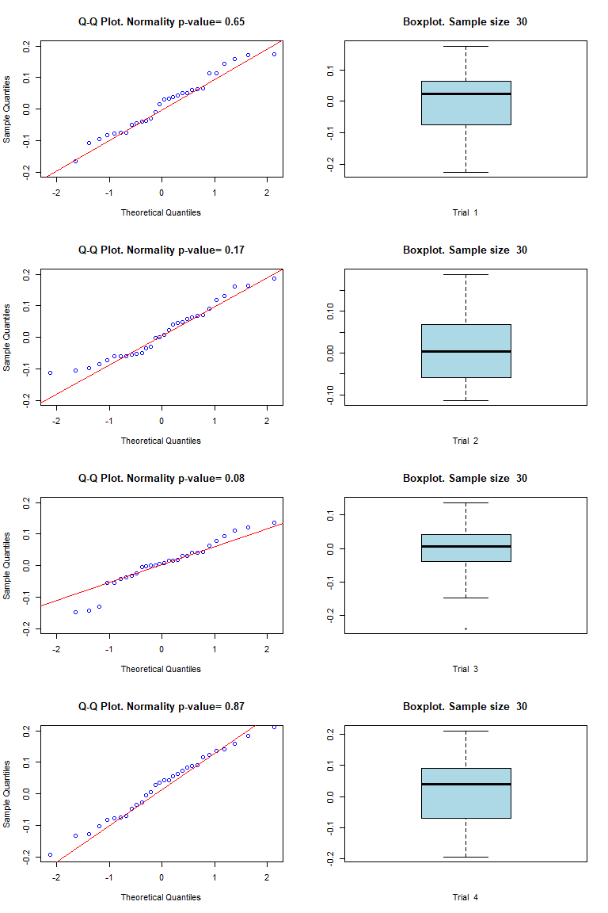
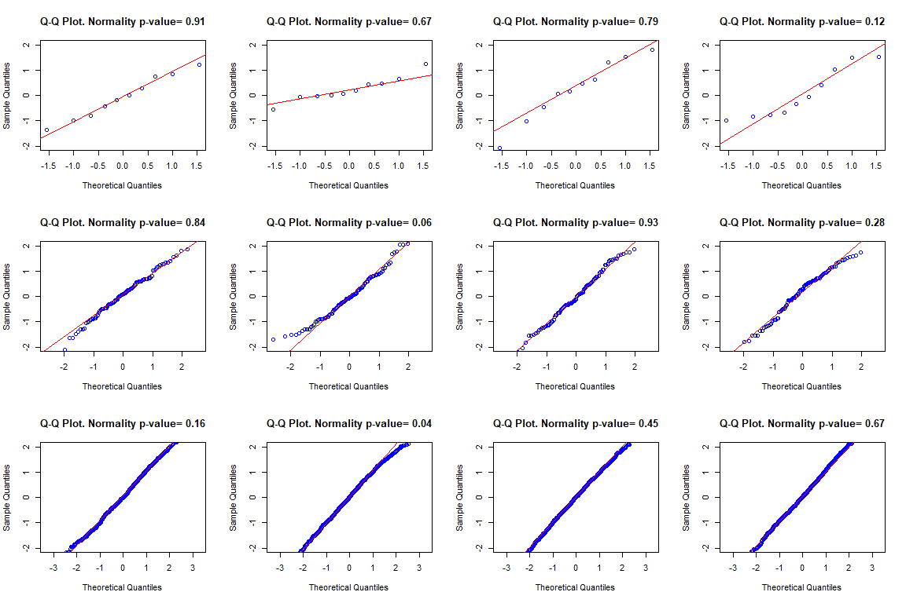

# Build a normally distributed dataset

Use y <- rnorm(100) to generate a random sample of size 100 from a normal distribution. 


```r
#R Code here

# Lets assign the sample size of 100 to variable "S" to reuse it in this assignment.
S <- 100

# Now get S number of Normally distributed random numbers.
y <- rnorm(S)
```

# Calculate mean and sd


```r
#R code here

# Mean and Std. Deviation funcitons:
mu <- mean(y)
sigma <- sd(y)

# Let's print them using the paste() function.
# Keep the display to 2 decimal points.
paste(' Mean of y = ', round(mu, digits=2))
```

```
## [1] " Mean of y =  0.12"
```

```r
paste(' Standard deviation of y = ', round(sigma, digits=2))
```

```
## [1] " Standard deviation of y =  1.1"
```

- The _rnorm(100)_ function generates $100$ Normally distributed random numbers with $mean=0$ and standard deviation $sd=1$. 
- While the theoretical _mean_ and _standard deviation_ in _rnorm()_ are $0$ and $1$ respectively, 
the experiments (each try or trial) do not result in those exact values due to randomness.
- Therefore, the resulting _mean_ is close to $0$, and the resulting _standard deviation_ is close to $1$, but not necessarily exactly $0$ and $1$ respectively due to randomness.
- The  _paste()_ function printed two results of the _mean_ and _standard deviation_.
- Note: I will be using the notation _sigma_ to refer to the standard deviation in much of my code.

Run it N times (make it 30 for this vignette). Store the N means in a vector. Verify the standard deviation of the values.


```r
#R code here

# Let's assign our 30 experiments to a variable "N".
N <- 30

# Initialize vector MEAN of size 30
MEAN <- numeric(N)

# Run a loop that gets a new data sample, calculates the mean and sd, and stores the result in MEAN.
for (i in 1:N) {
  # MEAN is an indexed vector that will take values from A[1] to A[30] as we loop through.
  # Store the mean of a Normally distributed sample of size S into MEAN[i]. It will happen N times.
  MEAN[i] <- mean(rnorm(S))
}

# Coming out of the loop, we have a vector MEAN with 30 values.
# Calculate the standard deviation of MEAN.
SIGMA <- sd(MEAN)

# Display SD below
paste('The standard deviation of AGG is ', round(SIGMA, 2))
```

```
## [1] "The standard deviation of AGG is  0.09"
```

- _MEAN_ is a vector with $30$ values. Each value in the vector is the _mean_ of $100$ Normally distributed random numbers generated by _rnorm()_.
- _SIGMA_ is a numeric variable that contains the _standard deviation_ of those $30$ values from vector _MEAN_.
- The result, the _standard deviation_ of the _means_ from those $30$ _means_ (the experiments or trials), is displayed above by the code.
- Notice how _SIGMA_ is much smaller than the _standard deviation_ obtained in the previous question where we were calculating the sigma of $100$ Normally distributed random numbers.
- This time, _SIGMA_ is calculated on the _means_, so it results in a smaller number, more narrow value.
- The reason _SIGMA_ is so small is, the _means_ tend to be close to $0$, over and over. We are no longer measuring the _standard deviation_ on the $100$ random numbers, but on the _mean_ of those numbers.


Run it multiple times (4 times in this vignette), showing each of the distributions of 30 means in a normal probability plot and box plot.


```r
#R code here

par(mfrow = c(4, 2))

# Loop through the trial runs, or experiments.
for (i in 1:4) {
  # Run a loop that gets a new data sample, calculates the mean and sd, and stores the result in MEAN.
  # First get an N vector MEAN with the means of random numbers
  for (j in 1:N) {
    # MEAN is an indexed vector that will take values from A[1] to A[30] as we loop through.
    # Store the mean of a Normally distributed sample of size S into MEAN[i]. It will happen N times.
    MEAN[j] <- mean(rnorm(S))
  }
  SHAPIRO <- shapiro.test(MEAN)
  qqnorm(MEAN, 
         ylim=c(-0.2, 0.2), 
         col='blue', 
         main=paste('Q-Q Plot. Normality p-value=', round(SHAPIRO$p.value, 2)))
  qqline(MEAN, 
         ylim=c(-0.2, 0.2), 
         col='red')
  boxplot(MEAN, 
          col='lightblue',
          main=paste('Boxplot. Sample size ', N),
          xlab=paste('Trial ', i))
}
```

<!-- -->

**Takeaways:**

- The results provide $4$ sets of $2$ plots each: A _Normal Probability Plot (a.k.a. Q-Q Plot)_ and a _boxplot_ for each of the $4$ experiments.
- I added a straight diagonal line to the _Q-Q plot_ to help us visualize the results.
- In addition, I included _Shapiro-Wilk Tests_ to test the $H_o$ _null hypothesis_ for each experiment run.
- The _null hypothesis_ $H_o$ of a _Shapiro-Wilk Test_ states that the sample was generated from a _Normal distribution_. The $H_A$ _alternate hypothesis_ rejects the _null hypothesis_ stating that the same did not come from a _Normal distribution_.
- We want to know if we should _reject_ the _null hypothesis_, or keep the _null hypothesis_. 
- The _null hypothesis_ test has a key parameter called the _p-value_.
- If the _p-value_ is smaller than $0.05$ then we will reject the $H_o$ _null hypothesis_ and will propose that our sample does not come from a _Normal distribution_.
- And if the _p-value_ is greater than $0.05$, then we will keep the $H_o$ _null_hypothesis_, stating that the _null hypothesis_ is possible, and we propose the sample comes from a _Normally distribution_.
- If the distribution were to be Normal, the _Q-Q plot_ would have the data points ( _the dots_ ) aligned close to the straight diagonal line.
- We would also want to see _Shapiro-Wilk Test_ _p-value_ smaller than $0.05$.

- **Results:**
- We do see a tendency of the dots following the _Q-Q line_, even though the dots are not exactly on top of the line in all four experiments. 
- In fact, some experiments exhibit _tails_ either at the start or at the end of the _Q-Q plot_. So we want to know more about the distribution.
- We will not get _all_ of the points lined up directly on top pf the _Q-Q line_ because there is always some noise or unexplained variation in the observations (hence being a _random_ sample).
- The _Shapiro-Wilk Test_ _p-values_, included on the title of each _Q-Q plot_, are all greater than $0.05$. Therefore, we will keep the $H_o$ _null hypothesis_ and state that the samples came from a _Normal distribution_.
- The _boxplots_ provide another visual to help us assess or form an opinion on whether the data may follow a _Normal_ distribution or not.
- The _boxplots_ are very consistent. The range between 1st and 3rd quartiles is _narrow_ based on an observation: The _boxplots_ have those quartiles between approximately $-0.1$ and $0.1$ in all cases, sometimes even closer.
- Therefore, the _boxplots_ support the notion that these sampes came from _Normal distributions_. 
- In conclusion, these sample came from _Normal distributions_. 


# Calc. p-values with Shapiro-Wilk tests

## Plot mltiple Q-Q plots multiple sample sizes

Show normal probability plots for multiple random samples (make it 4 here) of a size 10 for example.


```r
#R Code Here

par(mfrow = c(3, 4))

# S is a vector that contains the different sample sizes 10, 100, and 1000.
S <- c(10, 100, 1000)

# Now we loop through the 3 sets of 4 experiments each.
for (i in 1:3) {
  # Now run the 4 experiments
  for (j in 1:4) {
    # Run a trial sample size S[i] based on the S vector above.
    SAMPLE <- rnorm(S[i])
    SHAPIRO <- shapiro.test(SAMPLE)
    # ntest.p.value[i] <- SHAPIRO$p.value
    qqnorm(SAMPLE, 
          ylim=c(-2, 2), 
          col='blue', 
          main=paste('Q-Q Plot. Normality p-value=', round(SHAPIRO$p.value, 2)))
    qqline(SAMPLE, 
          ylim=c(-2, 2), 
          col='red')
  }
}
```

<!-- -->

- In all cases, _Shapiro-Wilk Tests_ indicates that we should _keep_ the _null Hypotheis_ that our sample comes from a _Normal distribution_ and it does. But the degree in which it proposes such _null hypothesis_, based on the _p-value_ varies as we increase the _sample size_.
- WE can see the impact from the _Central Limit Theorem (CLT)_. As we increase the _sample size_ we get values that get closer to a _Normal distribution_.
- The top panel of $4$ plots with _sample size_ of $10$ exhibits irregularity. We can see that in how the _data points_ follow (or not follow) the _Q-Q line_. The _Q-Q line_ is also irregular (notice the difference in slopes).
- The middle panel of $4$ plots with _sample size_ of $100$ is an improvement over the first panel. But it still exhibits irregularities. We tend to have _tails_ in either end of the plot. 
- The bottom panel of $4$ plots with _sample size_ of $1000$ offers a very evident _Normal distribution_. We can be highly confient that the samples came from a _Normal distribution_, without a question.

