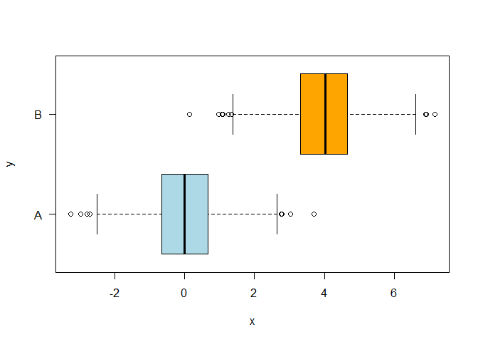
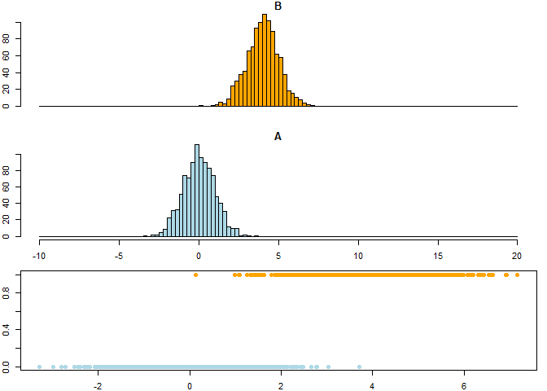

# Purpose

A function that assesses predictions by providing accuracy metrics.

There are two sets of metrics: One set for regression and one set for classification.

This notebook focuses on *classification metrics*.

Use this terminology:

* Prediction accuracy: Refers to regression
* Prediction metrics: Refers to classification

In this notebook, we fit a logistic regression model and evaluate performance of LDA, QDA and KNN classifiers.

There are various acronyms in the literature describing the same metrics. I am following the nomenclature from ISLR (see references below):

Formulas:

* OBS = Observations or truth cases
* Accuracy. ACC = sum(truth == predicted) * 100/length(truth)
* Sensitivity. TPR True Positive Rate = TP/(TP + FN) = TP/P
* Specificity. TNR True Negative Rate = TN/(FP + TN) = TN/N
* Precision. Positive Predictive Value. PPV = TP/(TP + FP)
* Negative Predictive Value. NPV = TN/(TN + FN)
* False Discovery Rate. FDR = FP/(TP + FP)
* False Positive Rate. FPR = FP/(FP + TN) = FP/N
* True Positives. TP = sum(truth == 1 & predicted == 1)
* True Negatives. TN = sum(truth == 0 & predicted == 0)
* False Positives. FP = sum(truth == 0 & predicted == 1)
* False Negatives. FN = sum(truth == 1 & predicted == 0)
* Positives. P = TP + FN  # total number positives in the truth data
* Negatives. N = FP + TN  # total number of negatives

# Libraries


# Functions

Adapted from R functions shared by faculty in Harvard data science class (2021). See references at the bottom of this notebook.


```r
###
#
# prediction.metrics function -- to return a list with all the metrics values
#
# Based on R functions shared by faculty in Harvard data science class (2021). See references.
#
# Input: truth and predicted lists.
#
# Returns a list with:
# [1] OBS = Observations or truth cases
# [2] Accuracy. ACC = sum(truth == predicted) * 100/length(truth)
# [3] Sensitivity. TPR True Positive Rate = TP/(TP + FN) = TP/P
# [4] Specificity. TNR True Negative Rate = TN/(FP + TN) = TN/N
# [5] Precision. Positive Predictive Value. PPV = TP/(TP + FP)
# [6] Negative Predictive Value. NPV = TN/(TN + FN)
# [7] False Discovery Rate. FDR = FP/(TP + FP)
# [8] False Positive Rate. FPR = FP/(FP + TN) = FP/N
# [9] True Positives. TP = sum(truth == 1 & predicted == 1)
# [10] True Negatives. TN = sum(truth == 0 & predicted == 0)
# [11] False Positives. FP = sum(truth == 0 & predicted == 1)
# [12] False Negatives. FN = sum(truth == 1 & predicted == 0)
# [13] Positives. P = TP + FN  # total number positives in the truth data
# [14] Negatives. N = FP + TN  # total number of negatives
#
prediction.metrics = function(truth, predicted) {
    # same length:
    if (length(truth) != length(predicted)) {
        stop("truth and predicted must be same length!")
    }
    # check for missing values (we are going to compute metrics on non-missing
    # values only)
    bKeep = !is.na(truth) & !is.na(predicted)
    predicted = predicted[bKeep]
    truth = truth[bKeep]
    # only 0 and 1:
    if (sum(truth %in% c(0, 1)) + sum(predicted %in% c(0, 1)) != 2 * length(truth)) {
        stop("only zeroes and ones are allowed!")
    }
    # how predictions align against known training/testing outcomes: TP/FP=
    # true/false positives, TN/FN=true/false negatives
    TP = sum(truth == 1 & predicted == 1)
    TN = sum(truth == 0 & predicted == 0)
    FP = sum(truth == 0 & predicted == 1)
    FN = sum(truth == 1 & predicted == 0)
    P = TP + FN  # total number of positives in the truth data
    N = FP + TN  # total number of negatives
    # Add the following output to return (OAT 11/9/2021)
    OBS = length(truth)
    ACC = sum(truth == predicted)/length(truth)
    TPR = TP/P
    TNR = TN/N
    PPV = TP/(TP + FP)
    NPV = TN/(TN + FN)
    FDR = FP/(TP + FP)
    FPR = FP/N
    
    # Returned a named list
    output <- list(OBS=OBS, ACC=ACC, TPR=TPR, TNR=TNR, PPV=PPV, 
                   NPV=NPV, FDR=FDR, FPR=FPR, TP=TP, 
                   TN=TN, FP=FP, FN=FN, P=P, N=N)
    return(output)
}

print.the.metrics = function(metrics){
  cat(' OBS = ', metrics$OBS, '...................number of observations')
  cat('\n ACC = ', metrics$ACC, '..................Accuracy')
  cat('\n TPR = ', metrics$TPR, '..................True Positive Rate')
  cat('\n TNR = ', metrics$TNR, '..................True Negative Rate')
  cat('\n PPV = ', metrics$PPV, '..................Positive Predictive Value (Precision)')
  cat('\n NPV = ', metrics$NPV, '..................Negative Predictive Value')
  cat('\n FDR = ', metrics$FDR, '..................False Discover Rate')
  cat('\n FPR = ', metrics$FPR, '..................False Positive Rate')
  cat('\n TP  = ', metrics$FP, '..................True Positives')
  cat('\n TN  = ', metrics$TN, '..................True Negatives')
  cat('\n FP  = ', metrics$TN, '..................False Positives')
  cat('\n FN  = ', metrics$FN, '..................False Negatives')
  cat('\n P   = ', metrics$P, '..................Positives')
  cat('\n N   = ', metrics$N, '..................Negatives')

  
}
```


# Simulate the data

Play with two sets of Normally distributed sets of data with different means.
We can change the number of samples and we can move the means around.


```r
# From Harvard data science class (see references at the end of this notebook)

set.seed(11)

N = 1000
mu = 4

# Our measuring variable is continuous, numeric...
# ...it has two Normal distribution waves
x <- c(rnorm(N), rnorm(N, mean=mu))

# Our outcome is categorical, A and B xxxx times each
# ...the idea is to match A and B to a number x
y <- rep(c("A", "B"), each=N)

# Make a data.frame with 1 and 0 values for Y
df <- data.frame(Y=ifelse(y=="A",0, 1), X=x)
```


# Boxplot and histogram

In a boxplot, we want to have the categorical variable in the horizontal axis. 

That is why we see a formula x~y below.

The chart gives us more information if we plot it horizontally in this case.

The histogram adds information to visualize the behavior relationship 
between the outcome, categorical valuable, and predictor, numeric variable.


```r
# From Harvard data science class (see references)
boxplot(x~y, col=c("lightblue","orange"), horizontal=T, las=1)
```

<!-- -->

```r
# Now place a histogram on top of another histogram

oldpar <- par(mfrow=c(3, 1), mar=c(2,2,1,1))

breaks <- seq(-10, 20, by=0.25)

# Histogram for 'B'
hist(x[y=="B"], breaks=breaks, col='orange', main="B", xaxt='n')

# Histogram for 'A'
hist(x[y=="A"], breaks=breaks, col='lightblue', main="A")

plot(x, ifelse(y=="A", 0,1), breaks=breaks, col=ifelse(y=="A", "lightblue","orange"), pch=19)
```

```
## Warning in plot.window(...): "breaks" is not a graphical parameter
```

```
## Warning in plot.xy(xy, type, ...): "breaks" is not a graphical parameter
```

```
## Warning in axis(side = side, at = at, labels = labels, ...): "breaks" is not a
## graphical parameter

## Warning in axis(side = side, at = at, labels = labels, ...): "breaks" is not a
## graphical parameter
```

```
## Warning in box(...): "breaks" is not a graphical parameter
```

```
## Warning in title(...): "breaks" is not a graphical parameter
```

<!-- -->

```r
par(oldpar)
```


# Linear Discriminant Analysis (LDA)

Needs library{MASS}

## Fit the model


```r
##
#
# LDA from library{MASS}
#
##
lda.m <- lda(Y~X, data = df)
summary(lda.m)
```

```
##         Length Class  Mode     
## prior   2      -none- numeric  
## counts  2      -none- numeric  
## means   2      -none- numeric  
## scaling 1      -none- numeric  
## lev     2      -none- character
## svd     1      -none- numeric  
## N       1      -none- numeric  
## call    3      -none- call     
## terms   3      terms  call     
## xlevels 0      -none- list
```

## Predict


```r
lda.p <- predict(lda.m)
```


## Confusion matrix


```r
lda.class = lda.p$class
table(lda.class, y)
```

```
##          y
## lda.class   A   B
##         0 975  20
##         1  25 980
```

```r
mean(lda.class == y)
```

```
## [1] 0
```


## Prediction metrics


```r
lda.metrics <- prediction.metrics(df$Y, lda.class)
print.the.metrics(lda.metrics)
```

```
##  OBS =  2000 ...................number of observations
##  ACC =  0.9775 ..................Accuracy
##  TPR =  0.98 ..................True Positive Rate
##  TNR =  0.975 ..................True Negative Rate
##  PPV =  0.9751244 ..................Positive Predictive Value (Precision)
##  NPV =  0.9798995 ..................Negative Predictive Value
##  FDR =  0.02487562 ..................False Discover Rate
##  FPR =  0.025 ..................False Positive Rate
##  TP  =  25 ..................True Positives
##  TN  =  975 ..................True Negatives
##  FP  =  975 ..................False Positives
##  FN  =  20 ..................False Negatives
##  P   =  1000 ..................Positives
##  N   =  1000 ..................Negatives
```


# References

* Harvard "Elements of Statistical Learning" (2021) taught by professors Dr. Sivachenko, Dr. Farutin
* Book “An Introduction to Statistical Learning with Applications in R” (ISLR) by Gareth James et al
