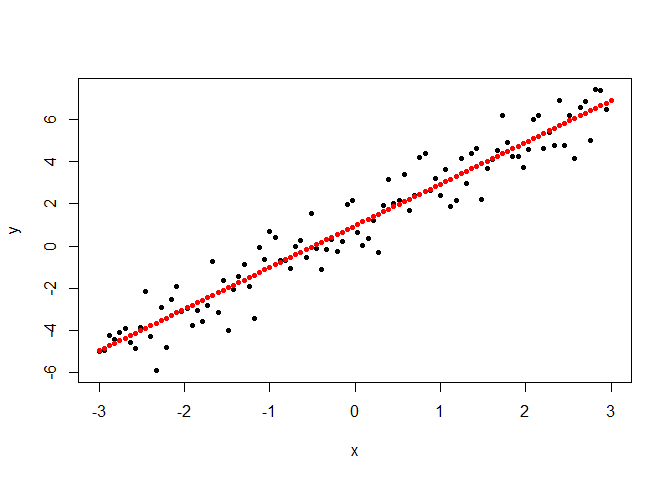

Much of this code came from Harvard Statistical Learning class as stated within the code comments and the references. I expanded the material with my own scripts, notes and R documentation and I plan to continue adding examples overtime.

# Purpose

A function that assesses predictions by providing accuracy metrics.

There are two sets of metrics: One set for regression and one set for classification.

This notebook focuses on *regression metrics*. The key word is *accuracy*.

Use this terminology:

* Prediction accuracy: Refers to regression
* Prediction metrics: Refers to classification

There are various acronyms in the literature describing the same metrics. I am following the nomenclature from ISLR (see references below):

In the following formula, y has the true values, and yp has the predicted values.

* RSS <- sum((y - yp)^2)                # Sum of Squares Estimated (aka SSE) (ISLR p.62)
* RSE <- sqrt(RSS/(N-2))                # Residual Standard Error (ISLR p.66)
* TSS <- sum((y - mean(y))^2)           # Sum of Squares Total (aka SST) (ISLR p.70)
* SSR <- sum((yp - mean(y))^2)          # Sum of Squares Regression (= TSS - RSS)
* R_squared <- (TSS-RSS)/TSS            # R^2 Static (= SSR/TSS) (ISLR p.69)
* SE <- RSE/sqrt(sum((x-mean(x))^2))    # Standard Error


# Function


```r
###
# Regression.accuracy function -- to return a list with all the regression error values
#
# Based on R functions shared by faculty in Harvard data science class (2021). See references.
#
# Input: truth (y) and predicted (yp) lists.
#
# Return as list with:
# [1] RSS <- sum((y - yp)^2)                # Sum of Squares Estimated (aka SSE) (ISLR p.62)
# [2] RSE <- sqrt(RSS/(N-2))                # Residual Standard Error (ISLR p.66)
# [3] TSS <- sum((y - mean(y))^2)           # Sum of Squares Total (aka SST) (ISLR p.70)
# [4] SSR <- sum((yp - mean(y))^2)          # Sum of Squares Regression (= TSS - RSS)
# [5] R_squared <- (TSS-RSS)/TSS            # R^2 Static (= SSR/TSS) (ISLR p.69)
# [6] SE <- RSE/sqrt(sum((x-mean(x))^2))    # Standard Error

prediction.accuracy = function(truth, predicted) {
    # same length:
    if (length(truth) != length(predicted)) {
        stop("truth and predicted must be same length!")
    }
    # check for missing values (we are going to compute metrics on non-missing
    # values only)
    bKeep = !is.na(truth) & !is.na(predicted)
    predicted = predicted[bKeep]
    truth = truth[bKeep]
    
    # Switch to notation y and yp (y predicted)
    y = truth
    yp = predicted
    
    RSS <- sum((y - yp)^2)                # Sum of Squares Estimated (aka SSE) (ISLR p.62)
    RSE <- sqrt(RSS/(N-2))                # Residual Standard Error (ISLR p.66)
    TSS <- sum((y - mean(y))^2)           # Sum of Squares Total (aka SST) (ISLR p.70)
    SSR <- sum((yp - mean(y))^2)          # Sum of Squares Regression
    R_squared <- (TSS-RSS)/TSS            # R^2 Static (ISLR p.69)
    SE <- RSE/sqrt(sum((x-mean(x))^2))    # Standard Error

    output <- list(RSS=RSS, RSE=RSE, TSS=TSS, SSR=SSR, R_squared=R_squared, SE=SE)
    return(output)
}
```


In this approach, we will simulate data where we know the linear regression parameters.

# Simulate the data

Here we simulate X to be Uniformly distributed across a set of values. 

We simulate Y with a known intercept, pus a slope time X with a random variability.


```r
N = 100
sd_delta = 1
slope = 2
intersection = 1

# X has a uniform distribution over a sequence over a range
x <- seq(-3, 3, length=N)

# Y is based on X with a slope, an intercept and normal randomness
y <- intersection + slope*x+rnorm(100, sd=sd_delta)
```


# Linear regression model


```r
 m <- lm(y~x)
 summary(m)
```

```
## 
## Call:
## lm(formula = y ~ x)
## 
## Residuals:
##      Min       1Q   Median       3Q      Max 
## -2.27191 -0.53309 -0.01936  0.58656  1.82912 
## 
## Coefficients:
##             Estimate Std. Error t value Pr(>|t|)    
## (Intercept)  0.96432    0.09496   10.15   <2e-16 ***
## x            1.98326    0.05428   36.54   <2e-16 ***
## ---
## Signif. codes:  0 '***' 0.001 '**' 0.01 '*' 0.05 '.' 0.1 ' ' 1
## 
## Residual standard error: 0.9496 on 98 degrees of freedom
## Multiple R-squared:  0.9316,	Adjusted R-squared:  0.9309 
## F-statistic:  1335 on 1 and 98 DF,  p-value: < 2.2e-16
```
Notice the intercept is 1.01, while our empirical value was 1.

And the slope is 1.96, while our empirical value was 2.

# Predict


```r
yp <- predict(m)

# Plot the prediction. Replot and add prediction points:
plot(x, y, pch=19, cex=0.7)
points(x,yp,col="red",pch=19,cex=0.7)
```

<!-- -->
# Get accuracy metrics


```r
lm.accuracy <- prediction.accuracy(y, yp)

# output <- list(RSS=RSS, RSE=RSE, TSS=TSS, SSR=SSR, R_squared=R_squared, SE=SE)
# We can pull the list elements one by one like this with [[]]
# RSS <- lm.accuracy[[1]]
# Since it is a named list, we can use the $ notation as follows
RSS <- lm.accuracy$RSS                # Sum of Squares Estimated (aka SSE) (ISLR p.62)
RSE <- lm.accuracy$RSE                # Residual Standard Error (ISLR p.66)
TSS <- lm.accuracy$TSS           # Sum of Squares Total (aka SST) (ISLR p.70)
SSR <- lm.accuracy$SSR          # Sum of Squares Regression
R_squared <- lm.accuracy$R_squared            # R^2 Static (ISLR p.69)
SE <- lm.accuracy$SE    # Standard Error

cat(' RSS = ', RSS, '..............Sum of Squares Estimated (aka SSE) (ISLR p.62)')
```

```
##  RSS =  88.36708 ..............Sum of Squares Estimated (aka SSE) (ISLR p.62)
```

```r
cat('\n RSE = ', RSE, '.............Residual Standard Error (ISLR p.66)')
```

```
## 
##  RSE =  0.9495814 .............Residual Standard Error (ISLR p.66)
```

```r
cat('\n TSS = ', TSS, '..............Sum of Squares Total (aka SST) (ISLR p.70)')
```

```
## 
##  TSS =  1292.205 ..............Sum of Squares Total (aka SST) (ISLR p.70)
```

```r
cat('\n SSR = ', SSR, '..............Sum of Squares Regression (TSS-RSS)')
```

```
## 
##  SSR =  1203.838 ..............Sum of Squares Regression (TSS-RSS)
```

```r
cat('\n R^2 = ', R_squared, '.............R^2 Static (TSS-RSS)/TSS (ISLR p.69)')
```

```
## 
##  R^2 =  0.9316153 .............R^2 Static (TSS-RSS)/TSS (ISLR p.69)
```

```r
cat('\n SE = ', SE, '.............Standard Error')
```

```
## 
##  SE =  0.05427858 .............Standard Error
```


# References

* Harvard "Elements of Statistical Learning" (2021) taught by professors Dr. Sivachenko, Dr. Farutin
* Book “An Introduction to Statistical Learning with Applications in R” (ISLR) by Gareth James et al
