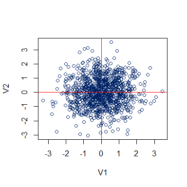
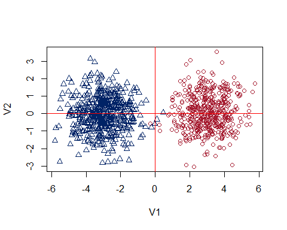
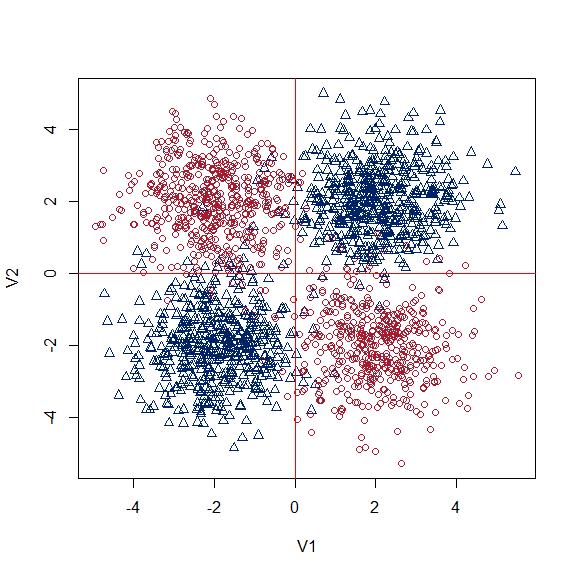
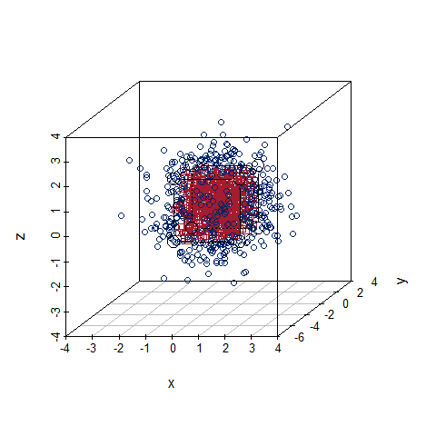

Dataset simulations with 2 categories 2D and 3D within a cube or outside
the cube
================
Oscar A. Trevizo
2023-05-19

- <a href="#load-the-libraries" id="toc-load-the-libraries">Load the
  libraries</a>
- <a href="#functions" id="toc-functions">Functions</a>
- <a href="#2d-dataset-1-center-1-category"
  id="toc-2d-dataset-1-center-1-category">2D dataset: 1 center 1
  category</a>
- <a href="#2d-dataset-2-centers-2-category-side-by-side"
  id="toc-2d-dataset-2-centers-2-category-side-by-side">2D dataset: 2
  centers 2 category side by side</a>
- <a href="#2d-dataset-4-centers-2-category"
  id="toc-2d-dataset-4-centers-2-category">2D dataset: 4 centers 2
  category</a>
- <a href="#3d-dataset-1-center-2-category-within-our-outside-a-cube"
  id="toc-3d-dataset-1-center-2-category-within-our-outside-a-cube">3D
  dataset: 1 center 2 category within our outside a cube</a>

# Load the libraries

``` r
library(scatterplot3d)
```

    ## Warning: package 'scatterplot3d' was built under R version 4.2.3

# Functions

``` r
##
#
# 3D dataset with 2 categories: 0 and 1
# Each observation has three variables x, y, z.
# The function creates 3 columns (x, y, z) normally distributed N(0,1) values.
# Category 0 occurs if all x, y, z data point are within a cube. Otherwise category 1.
#
# Arguments:
#   n: Number of observations (rows)
#   b: Cube boundary (float)
#
#
bld_3d_2c <- function(n = 1000, b = 1.25){

  # generate a matrix with normally distributed values N(0,1)
  xyz <- matrix(rnorm(3*n), ncol=3)
  
  # Create a vector of n observations init to 0, for class 0
  cl <- rep(0, n)

  # Test each xyz term to see if any value falls out of its limit
  # If the value falls out of its limit, assign class 1
  for(i in 1:n){
    if (xyz[i,1] > b) cl[i] = 1
    if (xyz[i,2] > b) cl[i] = 1
    if (xyz[i,3] > b) cl[i] = 1
    if (xyz[i,1] < -b) cl[i] = 1
    if (xyz[i,2] < -b) cl[i] = 1
    if (xyz[i,3] < -b) cl[i] = 1
  }

  # Now bind the columns to return all in one matrix
  xyz <- cbind(cl,xyz)
  
  colnames(xyz) <- c("cl", "x", "y", "z")
  
  # Returns a matrix and then one can change to dataframe downstream
  # xyz <- as.data.frame(xyz)
  # 
  # xyz$cl <- as.factor(xyz$cl)

  return(xyz)
}

## 
#
# From help(scatterplot3D) example 6; by Martin Maechler
#
cubedraw <- function(res3d, min = 0, max = 255, cex = 2, text. = FALSE)
{
  ## Purpose: Draw nice cube with corners
  cube01 <- rbind(c(0,0,1), 0, c(1,0,0), c(1,1,0), 1, c(0,1,1), # < 6 outer
                  c(1,0,1), c(0,1,0)) # <- "inner": fore- & back-ground
  cub <- min + (max-min)* cube01
  ## visibile corners + lines:
  res3d$points3d(cub[c(1:6,1,7,3,7,5) ,], cex = cex, type = 'b', lty = 1)
  ## hidden corner + lines
  res3d$points3d(cub[c(2,8,4,8,6),     ], cex = cex, type = 'b', lty = 3)
  if(text.)## debug
      text(res3d$xyz.convert(cub), labels=1:nrow(cub), col=crimson, cex=2)
}
```

# 2D dataset: 1 center 1 category

``` r
set.seed(1234321)

# Number of observations per cluster
n <- 1000

# Init a matrix with random samples (*2 for 2 columns)
a <- matrix(rnorm(n*2), ncol=2)

# Plot with my colors
plot(a ,col=royalblue, xlab="V1", ylab="V2")
abline(h=0, col = 'red')
abline(v=0, col = 'red')
```

<!-- -->

# 2D dataset: 2 centers 2 category side by side

``` r
set.seed(1234321)

# Number of observations per category
n <- 1000

# Init a matrix with random samples
# Categories a and b will be placed in two different centers.
ab <- matrix(rnorm(2*n), ncol=2)

ctr_positions <- 3

# Randomly pull either a -1 or a +1
ab_ctrs_right <- matrix(sample(+1*ctr_positions, n, replace=TRUE), ncol=2)
ab_ctrs_left <- matrix(sample(-1*ctr_positions, n, replace=TRUE), ncol=2)

# Add to the ab random 2D variable to move the centers
ab[1:(n/2), 1] <- ab[1:(n/2), 1] + ctr_positions

beg <- n/2 + 1
ab[beg:n, 1] <-  ab[beg:n, 1] - ctr_positions

# categories
category <- vector(mode = 'numeric', 1000)
category[1:n/2] <- 'cat0' 
category[((n/2)+1):1000] <- 'cat1' 

# Plot with my colors
plot(ab ,col=as.numeric(factor(category)), pch=as.numeric(factor(category)), 
     xlab="V1", ylab="V2")
abline(h=0, col = 'red')
abline(v=0, col = 'red')
```

<!-- -->

# 2D dataset: 4 centers 2 category

``` r
set.seed(1234321)

# Number of observations per category
n <- 1000

# Init a matrix with random samples
# Categories a and b will be placed in two different centers.
ab <- matrix(rnorm(4*n), ncol=2)

ctr_positions <- 2

# Randomly pull either a -1 or a +1
ab_centers <- matrix(sample(c(-1,1)*2, n*4, replace=TRUE), ncol=2)

# We get a mix os +/+, +/-, -/- -/+ times the number of observations
# Use them as locations for each of the sampled dataset observations.
ab <- ab + ab_centers

# Apply this formula to classify
# Based on script from Harvard Statistical Learnin by Dr. Sivachenko, Dr. Farutin
# It concatenates a zero or a 1 to the strig 'cat' for category
category <- paste0("cat", (1 + sign(apply(ab_centers, 1, prod)))/2)


# Plot it
plot(ab ,col=as.numeric(factor(category)), pch=as.numeric(factor(category)), 
     xlab="V1", ylab="V2")
abline(h=0, col = 'red')
abline(v=0, col = 'red')
```

<!-- -->

# 3D dataset: 1 center 2 category within our outside a cube

``` r
##
#
# Call the function defined above to return our dataset.
# Then plot using scatterplot3d
# and insert a box based on help(scatterplot3d) function by Martin Maechler
#

# default values are nObs = 1000, x, y, z, limit is 1.25
set.seed(123321)

xyz <- bld_3d_2c()
class(xyz)
```

    ## [1] "matrix" "array"

``` r
dim(xyz)
```

    ## [1] 1000    4

``` r
summary(xyz)
```

    ##        cl              x                  y                  z            
    ##  Min.   :0.000   Min.   :-3.26890   Min.   :-4.24749   Min.   :-3.054616  
    ##  1st Qu.:0.000   1st Qu.:-0.64607   1st Qu.:-0.71121   1st Qu.:-0.660167  
    ##  Median :0.000   Median : 0.10213   Median :-0.05072   Median :-0.014138  
    ##  Mean   :0.498   Mean   : 0.05624   Mean   :-0.03680   Mean   : 0.000756  
    ##  3rd Qu.:1.000   3rd Qu.: 0.70019   3rd Qu.: 0.62941   3rd Qu.: 0.681671  
    ##  Max.   :1.000   Max.   : 3.14482   Max.   : 2.93870   Max.   : 3.409373

``` r
# Plot the cube

colors <- colors[as.numeric(factor(xyz[,1]))]

# http://www.sthda.com/english/wiki/scatterplot3d-3d-graphics-r-software-and-data-visualization
plot3d <- scatterplot3d(xyz[,2:4],
              color = colors,
              pch = xyz[,1])
cubedraw(plot3d, min = -1.25, max = 1.25, cex = 2)
```

<!-- -->
