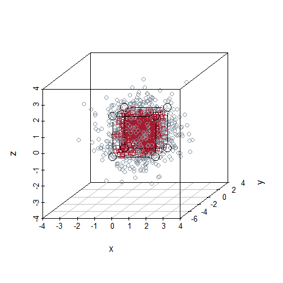

Dataset simulation with 2 categories either within a cube or outside the
cube
================
Oscar A. Trevizo
2023-05-18

- <a href="#load-the-libraries" id="toc-load-the-libraries">Load the
  libraries</a>
- <a href="#functions" id="toc-functions">Functions</a>
- <a href="#build-the-dataset" id="toc-build-the-dataset">Build the
  dataset</a>
- <a href="#plot-the-cube" id="toc-plot-the-cube">Plot the cube</a>

# Load the libraries

``` r
library(scatterplot3d)
```

    ## Warning: package 'scatterplot3d' was built under R version 4.2.3

# Functions

``` r
##
#
# 3D dataset with 2 categories: 0 and 1
# Each datapint has three variables x, y, z.
# The function creates 3 columns (x, y, z) normally distributed N(0,1) values.
# Category 0 occurs if all x, y, z data point are within a cube. Otherwise category 1.
#
# Arguments:
#   n: Number of observations (rows)
#   b: Cube boundary (float)
#
#
bld.3d.2cl.dat <- function(n = 1000, b = 1.25){

  # generate a matrix with normally distributed values N(0,1)
  xyz <- matrix(rnorm(3*n), ncol=3)
  
  # Create a vector of n observations init to 0, for class 0
  cl <- rep(0, n)

  # Test each xyz term to see if any value falls out of its limit
  # If the value falls out of its limit, assign class 1
  for(i in 1:n){
    if (xyz[i,1] > b) cl[i] = 1
    if (xyz[i,2] > b) cl[i] = 1
    if (xyz[i,3] > b) cl[i] = 1
    if (xyz[i,1] < -b) cl[i] = 1
    if (xyz[i,2] < -b) cl[i] = 1
    if (xyz[i,3] < -b) cl[i] = 1
  }

  # Now bind the columns to return all in one matrix
  xyz <- cbind(cl,xyz)
  
  colnames(xyz) <- c("cl", "x", "y", "z")
  
  # Returns a matrix and then one can change to dataframe downstream
  # xyz <- as.data.frame(xyz)
  # 
  # xyz$cl <- as.factor(xyz$cl)

  return(xyz)
}

## 
#
# From help(scatterplot3D) example 6; by Martin Maechler
#
cubedraw <- function(res3d, min = 0, max = 255, cex = 2, text. = FALSE)
{
  ## Purpose: Draw nice cube with corners
  cube01 <- rbind(c(0,0,1), 0, c(1,0,0), c(1,1,0), 1, c(0,1,1), # < 6 outer
                  c(1,0,1), c(0,1,0)) # <- "inner": fore- & back-ground
  cub <- min + (max-min)* cube01
  ## visibile corners + lines:
  res3d$points3d(cub[c(1:6,1,7,3,7,5) ,], cex = cex, type = 'b', lty = 1)
  ## hidden corner + lines
  res3d$points3d(cub[c(2,8,4,8,6),     ], cex = cex, type = 'b', lty = 3)
  if(text.)## debug
      text(res3d$xyz.convert(cub), labels=1:nrow(cub), col=crimson, cex=2)
}
```

# Build the dataset

``` r
##
#
# Call the function defined above to return our dataset.
# Then plot using scatterplot3d
# and insert a box based on help(scatterplot3d) function by Martin Maechler
#

# default values are nObs = 1000, x, y, z, limit is 1.25
set.seed(123321)
xyz <- bld.3d.2cl.dat()
class(xyz)
```

    ## [1] "matrix" "array"

``` r
dim(xyz)
```

    ## [1] 1000    4

``` r
summary(xyz)
```

    ##        cl              x                  y                  z            
    ##  Min.   :0.000   Min.   :-3.26890   Min.   :-4.24749   Min.   :-3.054616  
    ##  1st Qu.:0.000   1st Qu.:-0.64607   1st Qu.:-0.71121   1st Qu.:-0.660167  
    ##  Median :0.000   Median : 0.10213   Median :-0.05072   Median :-0.014138  
    ##  Mean   :0.498   Mean   : 0.05624   Mean   :-0.03680   Mean   : 0.000756  
    ##  3rd Qu.:1.000   3rd Qu.: 0.70019   3rd Qu.: 0.62941   3rd Qu.: 0.681671  
    ##  Max.   :1.000   Max.   : 3.14482   Max.   : 2.93870   Max.   : 3.409373

# Plot the cube

``` r
# https://data.library.virginia.edu/setting-up-color-palettes-in-r/
cc <- palette()
palette(c(crimson,slate))
#colors <- palette(rainbow_hcl(2))
colors <- palette()
colors <- colors[as.numeric(factor(xyz[,1]))]

# http://www.sthda.com/english/wiki/scatterplot3d-3d-graphics-r-software-and-data-visualization
plot3d <- scatterplot3d(xyz[,2:4],
              color = colors,
              pch = xyz[,1])
cubedraw(plot3d, min = -1.25, max = 1.25, cex = 2)
```

<!-- -->
