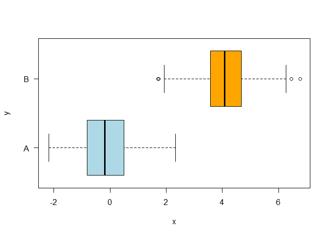
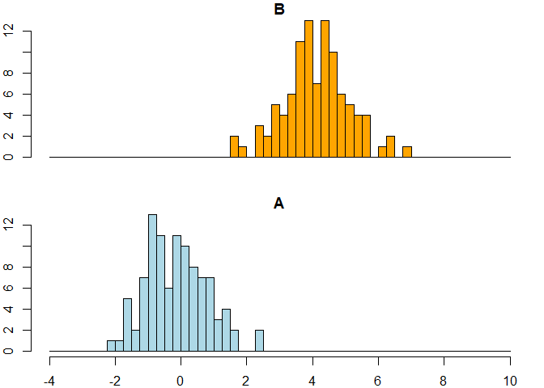

This code is based on lessons from Harvard Statistical Learning class [see references]. I expanded the material with my own scripts, notes and R documentation and I plan to continue adding examples overtime.

# Purpose

This script shows how to simulate a dataset that can be used in classification problems.

In classification, the variable that we are measuring is continuous, 
while the variable that we are predicting is categorical.

# Simulate the data

Play with two sets of Normally distributed sets of data with different means.
We can change the number of samples and we can move the means around.


```r
# From Harvard data science class (see references at the end of this notebook)

set.seed(11)

# Our measuring variable is continuous, numeric...
# ...it has two Normal distribution waves
x <- c(rnorm(100), rnorm(100, mean=4))

# Our outcome is categorical, A and B 300 times each
# ...the idea is to match A and B to a number x
y <- rep(c("A", "B"), each=100)
```

## Look at X

Notice it tends to be two waves


```r
# Look at x now
hist(x, col='lightgreen', breaks=10)
```

<!-- -->

# Boxplot and histogram

In a boxplot, we want to have the categorical variable in the horizontal axis. 

That is why we see a formula x~y below.

The chart gives us more information if we plot it horizontally in this case.

The histogram adds information to visualize the behavior relationship 
between the outcome, categorical valuable, and predictor, numeric variable.


```r
# From Harvard data science class (see references)
boxplot(x~y, col=c("lightblue","orange"), horizontal=T, las=1)
```

<!-- -->

```r
# Now place a histogram on top of another histogram

oldpar <- par(mfrow=c(2, 1), mar=c(2,2,1,1))

breaks <- seq(-4, 10, by=0.25)

# Histogram for 'B'
hist(x[y=="B"], breaks=breaks, col='orange', main="B", xaxt='n')

# Histogram for 'A'
hist(x[y=="A"], breaks=breaks, col='lightblue', main="A")
```

<!-- -->

```r
par(oldpar)
```

# References

* Harvard "Elements of Statistical Learning" (2021) taught by professors Dr. Sivachenko, Dr. Farutin
