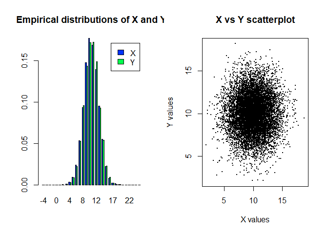

This code is based on lessons from Harvard Statistical Learning class [see references]. I expanded the material with my own scripts, notes and R documentation and I plan to continue adding examples overtime.

# Purpose

This script shows how to simulate a dataset that can be used in regression problems.

In regression, the variables that we are measuring are continuous, 
and the variable that we are predicting is continuous as well.


# Dependent variables

## Simulate the data

Create two Normally distributed datasets that have a relationship.

Play with the number of samples and we move the means around.


```r
# From Harvard data science class (see references at the end of this notebook)
N = 10000
mu_N = 10
sd_N = sqrt(5)
sd_delta = 2

x <- rnorm(N, mean=mu_N, sd=sd_N) 

# Initialize y with x...We would have a straight line if plotting y~x
y <- x

# Now inject variability to each, and we will not have a straight line exactly
x <- x + rnorm(N, sd=sd_delta) 
y <- y + rnorm(N, sd=sd_delta) 
```

## Plot histograms and scatterplot


```r
br<- -5:25 # set manually bins for histograms 
# save histograms for X and Y , don’t plot yet
hx <- hist(x, breaks=br, plot=F)
hy <- hist(y, breaks=br, plot=F) 

# prepare 2 panels in one plot: 
old.par <- par(mfrow=c(1,2)) 

# plot histograms side by side using rbind
barplot(rbind(hx$density,hy$density), 
        beside=T, 
        col=c(rgb(0,0.2,1), rgb(0,1,0.3)),
        legend=c('X','Y'), 
        main='Empirical distributions of X and Y',
        names=br[-1]) 

# Scatter plot 
plot(x,y,
     xlab='X values',
     ylab='Y values',
     main='X vs Y scatterplot',
     pch=19,
     cex=0.3) 
```

<!-- -->

```r
# restore graphical attributes to previous values:
par(old.par)
```

# Independent variables

## Simulate the data

Create two independent Normally distributed datasets x and y.

Play with the number of samples and we move the means around.


```r
# From Harvard data science class (see references at the end of this notebook)
# simulate sampling of 10000 values for X and for Y.
# We can play with the mean and sd. Should have same size to keep it balanced.
x <- rnorm(N, mean=mu_N, sd=sd_N) 
y <- rnorm(N, mean=mu_N, sd=sd_N)
```

## Plot histograms and scatterplot


```r
# Set manually bins for histograms 
br<- -5:25 
# Save histograms for X and Y , don’t plot yet
hx <- hist(x, breaks=br, plot=F)
hy <- hist(y, breaks=br, plot=F) 

# prepare 2 panels in one plot: 
old.par <- par(mfrow=c(1,2)) 

# plot histograms side by side using rbind
barplot(rbind(hx$density,hy$density), 
        beside=T, 
        col=c(rgb(0,0.2,1), rgb(0,1,0.3)),
        legend=c('X','Y'), 
        main='Empirical distributions of X and Y',
        names=br[-1]) 

# Scatter plot 
plot(x,y,
     xlab='X values',
     ylab='Y values',
     main='X vs Y scatterplot',
     pch=19,
     cex=0.3) 
```

<!-- -->

```r
# restore graphical attributes to previous values
par(old.par)
```

# Simulate known linear regression

In this approach, we will simulate data where we know the linear regression parameters.

## Simulate the data

Here we simulate X to be Uniformly distributed across a set of values. 

We simulate Y with a known intercept, pus a slope time X with a random variability.


```r
N = 100
sd_delta = 1
slope = 2
intersection = 1

# X has a uniform distribution over a sequence over a range
x <- seq(-3, 3, length=N)

# Y is based on X with a slope, an intercept and normal randomness
y <- intersection + slope*x+rnorm(100, sd=sd_delta)
```


## Scatter plots


```r
plot(x, y, pch=19, cex=0.7)
```

<!-- -->

## Apply linear regression model


```r
 m <- lm(y~x)
 summary(m)
```

```
## 
## Call:
## lm(formula = y ~ x)
## 
## Residuals:
##     Min      1Q  Median      3Q     Max 
## -2.1833 -0.7767 -0.1180  0.6711  3.3668 
## 
## Coefficients:
##             Estimate Std. Error t value Pr(>|t|)    
## (Intercept)  0.95042    0.10562   8.998  1.8e-14 ***
## x            1.96301    0.06037  32.514  < 2e-16 ***
## ---
## Signif. codes:  0 '***' 0.001 '**' 0.01 '*' 0.05 '.' 0.1 ' ' 1
## 
## Residual standard error: 1.056 on 98 degrees of freedom
## Multiple R-squared:  0.9152,	Adjusted R-squared:  0.9143 
## F-statistic:  1057 on 1 and 98 DF,  p-value: < 2.2e-16
```
Notice the intercept is 1.01, while our empirical value was 1.

And the slope is 1.96, while our empirical value was 2.

## Predict


```r
yp <- predict(m)

# Plot the prediction. Replot and add prediction points:
plot(x, y, pch=19, cex=0.7)
points(x,yp,col="red",pch=19,cex=0.7)
```

<!-- -->
## Prediction metrix


```r
RSS <- sum((y - yp)^2)                # Sum of Squares Estimated (aka SSE) (ISLR p.62)
RSE <- sqrt(RSS/(N-2))                # Residual Standard Error (ISLR p.66)
TSS <- sum((y - mean(y))^2)           # Sum of Squares Total (aka SST) (ISLR p.70)
SSR <- sum((yp - mean(y))^2)          # Sum of Squares Regression
SE <- RSE/sqrt(sum((x-mean(x))^2))    # Standard Error
R_squared <- (TSS-RSS)/TSS            # R^2 Static (ISLR p.69)
roh_squared <- SSR / TSS

cat(' RSS = ', RSS, '..............Sum of Squares Estimated (aka SSE) (ISLR p.62)')
```

```
##  RSS =  109.3299 ..............Sum of Squares Estimated (aka SSE) (ISLR p.62)
```

```r
cat('\n RSE = ', RSE, '.............Residual Standard Error (ISLR p.66)')
```

```
## 
##  RSE =  1.056225 .............Residual Standard Error (ISLR p.66)
```

```r
cat('\n TSS = ', TSS, '..............Sum of Squares Total (aka SST) (ISLR p.70)')
```

```
## 
##  TSS =  1288.702 ..............Sum of Squares Total (aka SST) (ISLR p.70)
```

```r
cat('\n SSR = ', SSR, '..............Sum of Squares Regression (TSS-RSS)')
```

```
## 
##  SSR =  1179.372 ..............Sum of Squares Regression (TSS-RSS)
```

```r
cat('\n R^2 = ', R_squared, '.............R^2 Static (TSS-RSS)/TSS (ISLR p.69)')
```

```
## 
##  R^2 =  0.9151627 .............R^2 Static (TSS-RSS)/TSS (ISLR p.69)
```

```r
cat('\n roh^2) = ', roh_squared, '..........Coefficient of determination (SSR/TSS)')
```

```
## 
##  roh^2) =  0.9151627 ..........Coefficient of determination (SSR/TSS)
```

```r
cat('\n roh = ', sqrt(roh_squared))
```

```
## 
##  roh =  0.9566414
```

```r
cat('\n SE = ', SE, '.............Standard Error')
```

```
## 
##  SE =  0.0603744 .............Standard Error
```


# References

* Harvard "Elements of Statistical Learning" (2021) taught by professors Dr. Sivachenko, Dr. Farutin
