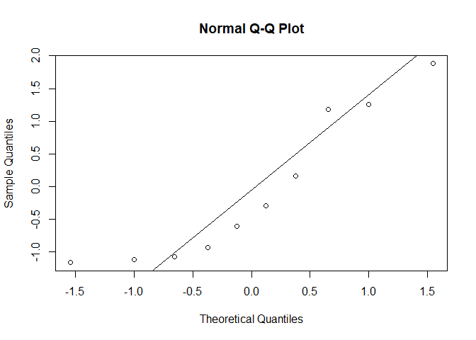
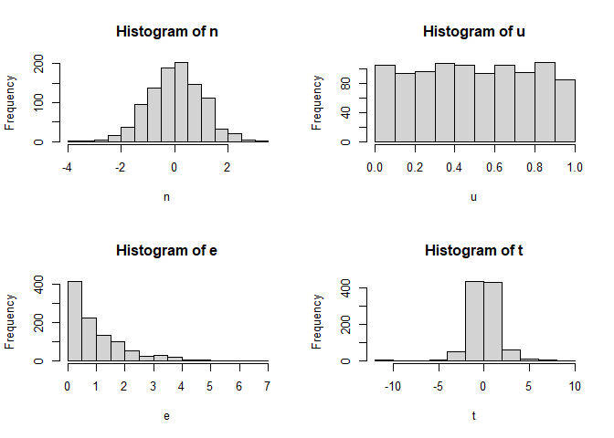

# Purpose

This vignette aims to introduce you statistical distributions using R.

# Reference

Dr. Bharatendra https://www.youtube.com/watch?v=rsfV57N7Uns&list=PL34t5iLfZddtUUABMikey6NtL05hPAp42&index=7 

# Libraries


# Normal distribution

## Generate the data


```r
z <- pretty(c(-5, 5), 100)

ht <- dnorm(z)

# plot type line
plot(z, ht, type='l')
```

<!-- -->

## prob (z < a certain point)


```r
# P(z < -2)
pnorm(-2)
```

```
## [1] 0.02275013
```

## Get point where prob = 0.95

At what point will I have 95%


```r
# P(z < ?) = 0.95
qnorm(.95)
```

```
## [1] 1.644854
```


## Now for a diff mean


```r
# Where mean is 0.2 and sigma is 0.5
qnorm(.95, 2, 0.5)
```

```
## [1] 2.822427
```

# t distribution

## Generate data


```r
t <- pretty(c(-5, 5), 100)

ht <- dt(t, 3)

# plot type line
plot(t, ht, type='l')
```

<!-- -->

## prob (t < a certain point)

With 3 degrees of freedom


```r
# P(z < -2)
pt(-2, 3)
```

```
## [1] 0.06966298
```

## Get point where prob = 0.95

At what point will I have 95%, with 3 degrees of freedom


```r
# P(z < ?) = 0.95
qt(.95, 3)
```

```
## [1] 2.353363
```


# Q-Q plot (Normal)

## Default


```r
x <- rnorm(10)
qqnorm(x)
```

<!-- -->


## Add a line


```r
qqnorm(x)
qqline(x)
```

<!-- -->

# Simulations: Normal, Uniform, Exponential, t distributions

Reference: Dr. Bharatendra https://www.youtube.com/watch?v=XyBfmm1pk8g&list=PL34t5iLfZddtUUABMikey6NtL05hPAp42&index=5


```r
n <- rnorm(1000)
u <- runif(1000)
e <- rexp(1000)
t <- rt(1000, 3)

# Plot 2 x 2 plots
par(mfrow=c(2, 2))
hist(n)
hist(u)
hist(e)
hist(t)
```

<!-- -->

# Normality tests

## Q-Q plot


```r
par(mfrow=c(1, 1))
x <- rnorm(10)
qqnorm(x)
qqline(x)
```

<!-- -->
The result is subjective. This is a small dataset. So how do we know if this is Normal?

## Shapiro test


```r
# Do a Null Hypothesis test with Shapiro tests.
# Look at the p-value. If p-value > 0.05 then accept the NULL hypothesis.
shapiro.test(x)
```

```
## 
## 	Shapiro-Wilk normality test
## 
## data:  x
## W = 0.94944, p-value = 0.6619
```

Now we can look at the p-value. 

If p-value > 0.05, then the distribution is NOT significantly different from a Normal distribution. That is the null hypothesis is possible.
