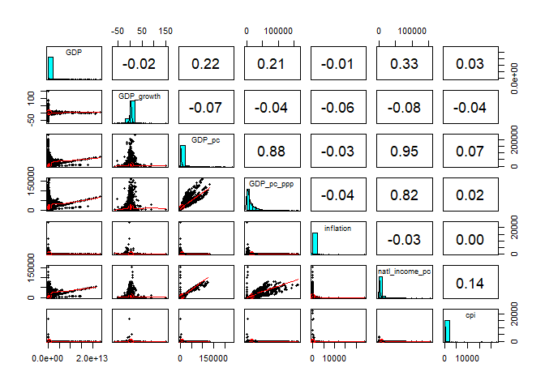
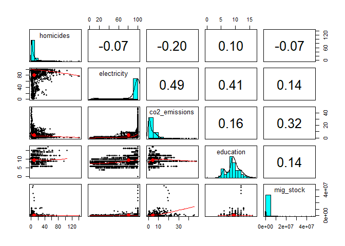
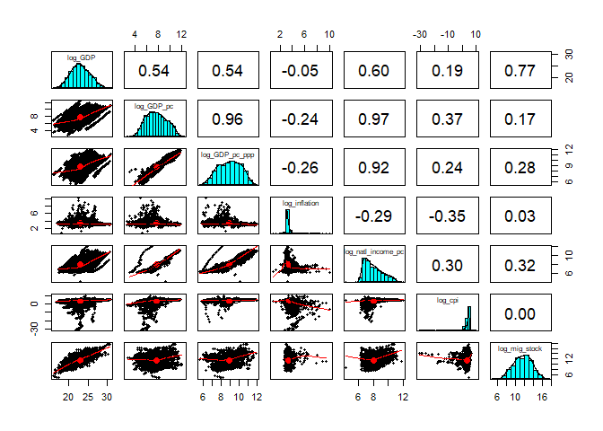
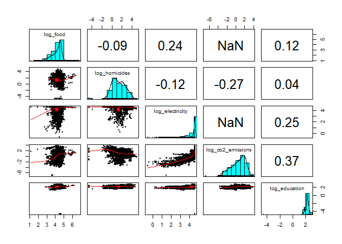

# Introduction

At the end of this use case, we will have a dataset built on sources from the United Nations and the World Bank to provide relationships between migration, demographics, socioeconomic, and development indicators.

# Load the libraries


```r
# Essential libraries
library(dplyr)
library(tidyr)
library(ggplot2)
library(psych)
library(GGally)
library(PerformanceAnalytics)
```

# United Nations WPP

## Load the data


```r
# https://population.un.org/wpp/Download/Files/1_Indicators%20(Standard)/\
# EXCEL_FILES/1_General/WPP2022_GEN_F01_DEMOGRAPHIC_INDICATORS_REV1.xlsx
# wpp_raw <- read_excel('data/wpp.xlsx',
#                  sheet = 'Estimates',
#                  skip = 16,
#                  col_types = 'text')

# Saved as CSV
wpp_raw <- read.csv('../data/WPP2022_GEN_F01_DEMOGRAPHIC_INDICATORS_REV1.csv', check.names=FALSE)
```


## Create WPP data set


```r
# The first 3 columns listed below are only informative.
# Total population is redundant. Keeping the July data.
# Notice, Year is class 'int'
wpp <- wpp_raw %>% filter((Type == 'Country/Area')) %>% 
  dplyr::select(-c('Variant',
            'Notes',
            'Location code',
            'SDMX code**',
            'Total Population, as of 1 January (thousands)'))

dim(wpp)
```

```
## [1] 17064    60
```

```r
head(wpp)
```

```
##   Index Region, subregion, country or area * ISO3 Alpha-code ISO2 Alpha-code
## 1  1733                              Burundi             BDI              BI
## 2  1734                              Burundi             BDI              BI
## 3  1735                              Burundi             BDI              BI
## 4  1736                              Burundi             BDI              BI
## 5  1737                              Burundi             BDI              BI
## 6  1738                              Burundi             BDI              BI
##           Type Parent code Year Total Population, as of 1 July (thousands)
## 1 Country/Area         910 1950                                      2 254
## 2 Country/Area         910 1951                                      2 303
## 3 Country/Area         910 1952                                      2 352
## 4 Country/Area         910 1953                                      2 399
## 5 Country/Area         910 1954                                      2 447
## 6 Country/Area         910 1955                                      2 495
##   Male Population, as of 1 July (thousands)
## 1                                     1 080
## 2                                     1 105
## 3                                     1 129
## 4                                     1 153
## 5                                     1 177
## 6                                     1 201
##   Female Population, as of 1 July (thousands)
## 1                                       1 174
## 2                                       1 199
## 3                                       1 223
## 4                                       1 246
## 5                                       1 270
## 6                                       1 294
##   Population Density, as of 1 July (persons per square km)
## 1                                                     86.9
## 2                                                     88.8
## 3                                                     90.6
## 4                                                     92.5
## 5                                                     94.3
## 6                                                     96.2
##   Population Sex Ratio, as of 1 July (males per 100 females)
## 1                                                       91.9
## 2                                                       92.1
## 3                                                       92.3
## 4                                                       92.5
## 5                                                       92.7
## 6                                                       92.8
##   Median Age, as of 1 July (years)
## 1                             18.3
## 2                             18.1
## 3                             17.9
## 4                             17.7
## 5                             17.5
## 6                             17.3
##   Natural Change, Births minus Deaths (thousands)
## 1                                              63
## 2                                              62
## 3                                              62
## 4                                              62
## 5                                              63
## 6                                              63
##   Rate of Natural Change (per 1,000 population) Population Change (thousands)
## 1                                          27.8                            50
## 2                                          26.8                            49
## 3                                          26.1                            48
## 4                                          25.8                            47
## 5                                          25.5                            48
## 6                                          25.4                            49
##   Population Growth Rate (percentage) Population Annual Doubling Time (years)
## 1                                2.20                                    31.5
## 2                                2.11                                    32.8
## 3                                2.04                                    34.0
## 4                                1.97                                    35.2
## 5                                1.97                                    35.3
## 6                                1.96                                    35.4
##   Births (thousands) Births by women aged 15 to 19 (thousands)
## 1                116                                        11
## 2                117                                        11
## 3                118                                        11
## 4                119                                        11
## 5                120                                        12
## 6                121                                        12
##   Crude Birth Rate (births per 1,000 population)
## 1                                           51.3
## 2                                           50.7
## 3                                           49.9
## 4                                           49.4
## 5                                           48.9
## 6                                           48.4
##   Total Fertility Rate (live births per woman)
## 1                                         6.92
## 2                                         6.91
## 3                                         6.90
## 4                                         6.92
## 5                                         6.92
## 6                                         6.93
##   Net Reproduction Rate (surviving daughters per woman)
## 1                                                  2.05
## 2                                                  2.06
## 3                                                  2.06
## 4                                                  2.08
## 5                                                  2.09
## 6                                                  2.11
##   Mean Age Childbearing (years)
## 1                          31.0
## 2                          31.0
## 3                          31.0
## 4                          31.0
## 5                          31.0
## 6                          31.1
##   Sex Ratio at Birth (males per 100 female births) Total Deaths (thousands)
## 1                                              103                       53
## 2                                              103                       55
## 3                                              103                       56
## 4                                              103                       57
## 5                                              103                       57
## 6                                              103                       58
##   Male Deaths (thousands) Female Deaths (thousands)
## 1                      27                        26
## 2                      28                        27
## 3                      29                        27
## 4                      29                        28
## 5                      29                        28
## 6                      29                        28
##   Crude Death Rate (deaths per 1,000 population)
## 1                                           23.5
## 2                                           23.9
## 3                                           23.8
## 4                                           23.6
## 5                                           23.3
## 6                                           23.0
##   Life Expectancy at Birth, both sexes (years)
## 1                                         40.6
## 2                                         40.8
## 3                                         41.0
## 4                                         41.3
## 5                                         41.6
## 6                                         41.9
##   Male Life Expectancy at Birth (years) Female Life Expectancy at Birth (years)
## 1                                  39.2                                    41.9
## 2                                  39.3                                    42.2
## 3                                  39.6                                    42.4
## 4                                  39.9                                    42.6
## 5                                  40.1                                    43.0
## 6                                  40.4                                    43.3
##   Life Expectancy at Age 15, both sexes (years)
## 1                                          44.9
## 2                                          45.1
## 3                                          45.1
## 4                                          45.2
## 5                                          45.3
## 6                                          45.5
##   Male Life Expectancy at Age 15 (years)
## 1                                   43.7
## 2                                   43.7
## 3                                   43.8
## 4                                   43.9
## 5                                   44.0
## 6                                   44.1
##   Female Life Expectancy at Age 15 (years)
## 1                                     46.0
## 2                                     46.3
## 3                                     46.3
## 4                                     46.4
## 5                                     46.5
## 6                                     46.7
##   Life Expectancy at Age 65, both sexes (years)
## 1                                          11.0
## 2                                          11.1
## 3                                          11.1
## 4                                          11.1
## 5                                          11.2
## 6                                          11.2
##   Male Life Expectancy at Age 65 (years)
## 1                                   10.6
## 2                                   10.6
## 3                                   10.6
## 4                                   10.7
## 5                                   10.7
## 6                                   10.7
##   Female Life Expectancy at Age 65 (years)
## 1                                     11.4
## 2                                     11.5
## 3                                     11.5
## 4                                     11.5
## 5                                     11.6
## 6                                     11.6
##   Life Expectancy at Age 80, both sexes (years)
## 1                                           4.7
## 2                                           4.8
## 3                                           4.8
## 4                                           4.8
## 5                                           4.8
## 6                                           4.8
##   Male Life Expectancy at Age 80 (years)
## 1                                    4.5
## 2                                    4.5
## 3                                    4.5
## 4                                    4.5
## 5                                    4.5
## 6                                    4.5
##   Female Life Expectancy at Age 80 (years)
## 1                                      4.9
## 2                                      5.0
## 3                                      5.0
## 4                                      5.0
## 5                                      5.0
## 6                                      5.0
##   Infant Deaths, under age 1 (thousands)
## 1                                     18
## 2                                     19
## 3                                     19
## 4                                     19
## 5                                     19
## 6                                     19
##   Infant Mortality Rate (infant deaths per 1,000 live births)
## 1                                                       166.9
## 2                                                       166.0
## 3                                                       164.0
## 4                                                       162.0
## 5                                                       160.1
## 6                                                       158.2
##   Live Births Surviving to Age 1 (thousands)
## 1                                    103.226
## 2                                    104.050
## 3                                    104.832
## 4                                    106.093
## 5                                    107.102
## 6                                    108.288
##   Under-Five Deaths, under age 5 (thousands)
## 1                                         29
## 2                                         31
## 3                                         31
## 4                                         32
## 5                                         32
## 6                                         32
##   Under-Five Mortality (deaths under age 5 per 1,000 live births)
## 1                                                             283
## 2                                                             281
## 3                                                             278
## 4                                                             274
## 5                                                             271
## 6                                                             268
##   Mortality before Age 40, both sexes (deaths under age 40 per 1,000 live births)
## 1                                                                             463
## 2                                                                             459
## 3                                                                             457
## 4                                                                             453
## 5                                                                             449
## 6                                                                             446
##   Male Mortality before Age 40 (deaths under age 40 per 1,000 male live births)
## 1                                                                           476
## 2                                                                           475
## 3                                                                           472
## 4                                                                           468
## 5                                                                           464
## 6                                                                           461
##   Female Mortality before Age 40 (deaths under age 40 per 1,000 female live births)
## 1                                                                               450
## 2                                                                               445
## 3                                                                               443
## 4                                                                               439
## 5                                                                               435
## 6                                                                               431
##   Mortality before Age 60, both sexes (deaths under age 60 per 1,000 live births)
## 1                                                                             618
## 2                                                                             614
## 3                                                                             612
## 4                                                                             609
## 5                                                                             605
## 6                                                                             601
##   Male Mortality before Age 60 (deaths under age 60 per 1,000 male live births)
## 1                                                                           642
## 2                                                                           641
## 3                                                                           638
## 4                                                                           635
## 5                                                                           632
## 6                                                                           628
##   Female Mortality before Age 60 (deaths under age 60 per 1,000 female live births)
## 1                                                                               595
## 2                                                                               589
## 3                                                                               588
## 4                                                                               584
## 5                                                                               580
## 6                                                                               576
##   Mortality between Age 15 and 50, both sexes (deaths under age 50 per 1,000 alive at age 15)
## 1                                                                                         291
## 2                                                                                         288
## 3                                                                                         288
## 4                                                                                         286
## 5                                                                                         284
## 6                                                                                         282
##   Male Mortality between Age 15 and 50 (deaths under age 50 per 1,000 males alive at age 15)
## 1                                                                                        308
## 2                                                                                        308
## 3                                                                                        307
## 4                                                                                        305
## 5                                                                                        304
## 6                                                                                        301
##   Female Mortality between Age 15 and 50 (deaths under age 50 per 1,000 females alive at age 15)
## 1                                                                                            275
## 2                                                                                            270
## 3                                                                                            271
## 4                                                                                            269
## 5                                                                                            266
## 6                                                                                            264
##   Mortality between Age 15 and 60, both sexes (deaths under age 60 per 1,000 alive at age 15)
## 1                                                                                         424
## 2                                                                                         421
## 3                                                                                         420
## 4                                                                                         418
## 5                                                                                         416
## 6                                                                                         413
##   Male Mortality between Age 15 and 60 (deaths under age 60 per 1,000 males alive at age 15)
## 1                                                                                        453
## 2                                                                                        452
## 3                                                                                        451
## 4                                                                                        449
## 5                                                                                        447
## 6                                                                                        444
##   Female Mortality between Age 15 and 60 (deaths under age 60 per 1,000 females alive at age 15)
## 1                                                                                            398
## 2                                                                                            392
## 3                                                                                            392
## 4                                                                                            390
## 5                                                                                            387
## 6                                                                                            384
##   Net Number of Migrants (thousands) Net Migration Rate (per 1,000 population)
## 1                             -   13                                      -5.9
## 2                             -   13                                      -5.7
## 3                             -   14                                      -5.8
## 4                             -   15                                      -6.2
## 5                             -   15                                      -5.9
## 6                             -   15                                      -5.9
```

## Add Columns Regions and Subregions


```r
# Get Subregions in a small table.... One year takes care of having one row per region.
# We need to include both Subregion and Region because the USA, Canada, Greenland,... 
# have NORTH AMERICA as Parent Code while the other countries have Subregion as
# Parent Code. Pick one year, any year like 2019 to create these temporary dataframe.
wpp_parent_code <- wpp_raw %>% filter((Type == 'Subregion' | Type == 'Region') 
                                     & Year == 2019) %>% 
  dplyr::select(c('Region, subregion, country or area *',
                  'Location code'))

# Rename columns in preparation for a merge that will be done based on 'Parent code'
colnames(wpp_parent_code) <- c('Subregion', 'Parent code')

# Now merge with wpp based on 'Parent code'
wpp <- wpp %>% left_join(wpp_parent_code)

# Now we have subregions.
# The next step is to add Region (COntinent / subcontinent). The problem there
# is NORTH AMERICA is Region but also Parent Code for USA and Canada.

wpp_subregions <- wpp_raw %>% filter(Type == 'Subregion'
                                     & Year == 2019) %>% 
  dplyr::select(c('Region, subregion, country or area *',
                  'Parent code'))

wpp_regions <- wpp_raw %>% filter(Type == 'Region'
                                     & Year == 2019) %>% 
  dplyr::select(c('Region, subregion, country or area *',
                  'Location code'))

# Rename columns in wpp_regions to match the column name 'Parent code'
# before left_join(). this way the function automatically will pick Parent code

colnames(wpp_regions) <- c('Region', 'Parent code')
colnames(wpp_subregions) <- c('Subregion', 'Parent code')

# now the join will automaticaly use 'Parent code' to join left.
wpp_subregions <- wpp_subregions %>% left_join(wpp_regions)

# Remove columns 'Parent Code' no longer needed
wpp_subregions <- wpp_subregions %>% dplyr::select(-c('Parent code'))

# But we need to add NORTH AMERICA... Let's follow the Upper Case Lower Case approach
wpp_subregions <- rbind(wpp_subregions, c('NORTHERN AMERICA', 'NORTHERN AMERICA'))


# Now merge with wpp based on 'Subregion'
wpp <- wpp %>% left_join(wpp_subregions)
```


## Rename and re-sort columns


### Save column names and create a table


```r
wpp_columns_orig <- colnames(wpp)
wpp_columns_new <- c('index', 'country', 'ISO3', 'ISO2', 'type', 'parent_code', 'year',
                     'pop', 'pop_m', 'pop_f', 'pop_density', 'pop_sex_ratio', 'med_age',
                     'natural_change', 'natural_change_rate', 'pop_change',
                     'pop_growth_rate', 'pop_doubling', 'births', 'births_w15to19',
                     'birth_rate', 'fertility_rate', 'net_reproduction_rate',
                     'mean_age_childbearing', 'sex_ratio_birth', 'tot_deaths',
                     'male_deaths', 'female_deaths', 'death_rate',
                     'life_exp', 'life_exp_m', 'life_exp_f',
                     'life_exp_15', 'life_exp_15_m', 'life_exp_15_f',
                     'life_exp_65', 'life_exp_65_m', 'life_exp_65_f',
                     'life_exp_80', 'life_exp_80_m', 'life_exp_80_f',
                     'infant_deaths', 'under_five_mortality',
                     'live_births', 'deaths_under_5', 'mortality_rate_under_5',
                     'mortality_40', 'mortality_40_m', 'mortality_40_f',
                     'mortality_60', 'mortality_60_m', 'mortality_60_f',
                     'mortality_15_50', 'mortality_15_50_m', 'mortality_15_50_f',
                     'mortality_15_60', 'mortality_15_60_m', 'mortality_15_60_f',
                      'net_migrants', 'net_mig_rate', 'subregion', 'region'
                     )
```

### Column definitions


```r
wpp_columns_table <- data.frame(wpp_columns_orig, wpp_columns_new)
wpp_columns_table
```

```
##                                                                                  wpp_columns_orig
## 1                                                                                           Index
## 2                                                            Region, subregion, country or area *
## 3                                                                                 ISO3 Alpha-code
## 4                                                                                 ISO2 Alpha-code
## 5                                                                                            Type
## 6                                                                                     Parent code
## 7                                                                                            Year
## 8                                                      Total Population, as of 1 July (thousands)
## 9                                                       Male Population, as of 1 July (thousands)
## 10                                                    Female Population, as of 1 July (thousands)
## 11                                       Population Density, as of 1 July (persons per square km)
## 12                                     Population Sex Ratio, as of 1 July (males per 100 females)
## 13                                                               Median Age, as of 1 July (years)
## 14                                                Natural Change, Births minus Deaths (thousands)
## 15                                                  Rate of Natural Change (per 1,000 population)
## 16                                                                  Population Change (thousands)
## 17                                                            Population Growth Rate (percentage)
## 18                                                        Population Annual Doubling Time (years)
## 19                                                                             Births (thousands)
## 20                                                      Births by women aged 15 to 19 (thousands)
## 21                                                 Crude Birth Rate (births per 1,000 population)
## 22                                                   Total Fertility Rate (live births per woman)
## 23                                          Net Reproduction Rate (surviving daughters per woman)
## 24                                                                  Mean Age Childbearing (years)
## 25                                               Sex Ratio at Birth (males per 100 female births)
## 26                                                                       Total Deaths (thousands)
## 27                                                                        Male Deaths (thousands)
## 28                                                                      Female Deaths (thousands)
## 29                                                 Crude Death Rate (deaths per 1,000 population)
## 30                                                   Life Expectancy at Birth, both sexes (years)
## 31                                                          Male Life Expectancy at Birth (years)
## 32                                                        Female Life Expectancy at Birth (years)
## 33                                                  Life Expectancy at Age 15, both sexes (years)
## 34                                                         Male Life Expectancy at Age 15 (years)
## 35                                                       Female Life Expectancy at Age 15 (years)
## 36                                                  Life Expectancy at Age 65, both sexes (years)
## 37                                                         Male Life Expectancy at Age 65 (years)
## 38                                                       Female Life Expectancy at Age 65 (years)
## 39                                                  Life Expectancy at Age 80, both sexes (years)
## 40                                                         Male Life Expectancy at Age 80 (years)
## 41                                                       Female Life Expectancy at Age 80 (years)
## 42                                                         Infant Deaths, under age 1 (thousands)
## 43                                    Infant Mortality Rate (infant deaths per 1,000 live births)
## 44                                                     Live Births Surviving to Age 1 (thousands)
## 45                                                     Under-Five Deaths, under age 5 (thousands)
## 46                                Under-Five Mortality (deaths under age 5 per 1,000 live births)
## 47                Mortality before Age 40, both sexes (deaths under age 40 per 1,000 live births)
## 48                  Male Mortality before Age 40 (deaths under age 40 per 1,000 male live births)
## 49              Female Mortality before Age 40 (deaths under age 40 per 1,000 female live births)
## 50                Mortality before Age 60, both sexes (deaths under age 60 per 1,000 live births)
## 51                  Male Mortality before Age 60 (deaths under age 60 per 1,000 male live births)
## 52              Female Mortality before Age 60 (deaths under age 60 per 1,000 female live births)
## 53    Mortality between Age 15 and 50, both sexes (deaths under age 50 per 1,000 alive at age 15)
## 54     Male Mortality between Age 15 and 50 (deaths under age 50 per 1,000 males alive at age 15)
## 55 Female Mortality between Age 15 and 50 (deaths under age 50 per 1,000 females alive at age 15)
## 56    Mortality between Age 15 and 60, both sexes (deaths under age 60 per 1,000 alive at age 15)
## 57     Male Mortality between Age 15 and 60 (deaths under age 60 per 1,000 males alive at age 15)
## 58 Female Mortality between Age 15 and 60 (deaths under age 60 per 1,000 females alive at age 15)
## 59                                                             Net Number of Migrants (thousands)
## 60                                                      Net Migration Rate (per 1,000 population)
## 61                                                                                      Subregion
## 62                                                                                         Region
##           wpp_columns_new
## 1                   index
## 2                 country
## 3                    ISO3
## 4                    ISO2
## 5                    type
## 6             parent_code
## 7                    year
## 8                     pop
## 9                   pop_m
## 10                  pop_f
## 11            pop_density
## 12          pop_sex_ratio
## 13                med_age
## 14         natural_change
## 15    natural_change_rate
## 16             pop_change
## 17        pop_growth_rate
## 18           pop_doubling
## 19                 births
## 20         births_w15to19
## 21             birth_rate
## 22         fertility_rate
## 23  net_reproduction_rate
## 24  mean_age_childbearing
## 25        sex_ratio_birth
## 26             tot_deaths
## 27            male_deaths
## 28          female_deaths
## 29             death_rate
## 30               life_exp
## 31             life_exp_m
## 32             life_exp_f
## 33            life_exp_15
## 34          life_exp_15_m
## 35          life_exp_15_f
## 36            life_exp_65
## 37          life_exp_65_m
## 38          life_exp_65_f
## 39            life_exp_80
## 40          life_exp_80_m
## 41          life_exp_80_f
## 42          infant_deaths
## 43   under_five_mortality
## 44            live_births
## 45         deaths_under_5
## 46 mortality_rate_under_5
## 47           mortality_40
## 48         mortality_40_m
## 49         mortality_40_f
## 50           mortality_60
## 51         mortality_60_m
## 52         mortality_60_f
## 53        mortality_15_50
## 54      mortality_15_50_m
## 55      mortality_15_50_f
## 56        mortality_15_60
## 57      mortality_15_60_m
## 58      mortality_15_60_f
## 59           net_migrants
## 60           net_mig_rate
## 61              subregion
## 62                 region
```


### Rename wpp columns


```r
# Rename dataframe columns
(colnames(wpp) <- wpp_columns_new)
```

```
##  [1] "index"                  "country"                "ISO3"                  
##  [4] "ISO2"                   "type"                   "parent_code"           
##  [7] "year"                   "pop"                    "pop_m"                 
## [10] "pop_f"                  "pop_density"            "pop_sex_ratio"         
## [13] "med_age"                "natural_change"         "natural_change_rate"   
## [16] "pop_change"             "pop_growth_rate"        "pop_doubling"          
## [19] "births"                 "births_w15to19"         "birth_rate"            
## [22] "fertility_rate"         "net_reproduction_rate"  "mean_age_childbearing" 
## [25] "sex_ratio_birth"        "tot_deaths"             "male_deaths"           
## [28] "female_deaths"          "death_rate"             "life_exp"              
## [31] "life_exp_m"             "life_exp_f"             "life_exp_15"           
## [34] "life_exp_15_m"          "life_exp_15_f"          "life_exp_65"           
## [37] "life_exp_65_m"          "life_exp_65_f"          "life_exp_80"           
## [40] "life_exp_80_m"          "life_exp_80_f"          "infant_deaths"         
## [43] "under_five_mortality"   "live_births"            "deaths_under_5"        
## [46] "mortality_rate_under_5" "mortality_40"           "mortality_40_m"        
## [49] "mortality_40_f"         "mortality_60"           "mortality_60_m"        
## [52] "mortality_60_f"         "mortality_15_50"        "mortality_15_50_m"     
## [55] "mortality_15_50_f"      "mortality_15_60"        "mortality_15_60_m"     
## [58] "mortality_15_60_f"      "net_migrants"           "net_mig_rate"          
## [61] "subregion"              "region"
```

### Re-sort the columns


```r
# Obtain numeric columns
col_numeric <- wpp_columns_new[7:60]

# Obtain non-numeric, character, columns... It is a handful, sort it here by hand
col_char <-  c('index', 'country', 'subregion', 'region', 
               'ISO3', 'ISO2', 'type', 'parent_code')

wpp <- wpp %>% dplyr::select(col_char, col_numeric)

colnames(wpp)
```

```
##  [1] "index"                  "country"                "subregion"             
##  [4] "region"                 "ISO3"                   "ISO2"                  
##  [7] "type"                   "parent_code"            "year"                  
## [10] "pop"                    "pop_m"                  "pop_f"                 
## [13] "pop_density"            "pop_sex_ratio"          "med_age"               
## [16] "natural_change"         "natural_change_rate"    "pop_change"            
## [19] "pop_growth_rate"        "pop_doubling"           "births"                
## [22] "births_w15to19"         "birth_rate"             "fertility_rate"        
## [25] "net_reproduction_rate"  "mean_age_childbearing"  "sex_ratio_birth"       
## [28] "tot_deaths"             "male_deaths"            "female_deaths"         
## [31] "death_rate"             "life_exp"               "life_exp_m"            
## [34] "life_exp_f"             "life_exp_15"            "life_exp_15_m"         
## [37] "life_exp_15_f"          "life_exp_65"            "life_exp_65_m"         
## [40] "life_exp_65_f"          "life_exp_80"            "life_exp_80_m"         
## [43] "life_exp_80_f"          "infant_deaths"          "under_five_mortality"  
## [46] "live_births"            "deaths_under_5"         "mortality_rate_under_5"
## [49] "mortality_40"           "mortality_40_m"         "mortality_40_f"        
## [52] "mortality_60"           "mortality_60_m"         "mortality_60_f"        
## [55] "mortality_15_50"        "mortality_15_50_m"      "mortality_15_50_f"     
## [58] "mortality_15_60"        "mortality_15_60_m"      "mortality_15_60_f"     
## [61] "net_migrants"           "net_mig_rate"
```

## Column variable types

Now we need to make numeric columns be type numeric.


```r
# Remove white spaces from numeric columns
# https://www.geeksforgeeks.org/remove-all-whitespace-in-each-dataframe-column-in-r/
wpp[, 9:62] <- as.data.frame(apply(wpp[, 9:62], 2, function(x) gsub("\\s+", "", x)))

# Coerce numeric
# Tips from:
# https://stackoverflow.com/questions/2288485/how-to-convert-a-data-frame-column-to-numeric-type
wpp[, 9:62] <- sapply(wpp[, 9:62], as.numeric)

# Year should actually be Date as this:
# The challenge with a Date is it will try to pin down the exact month and day too.
# Even if the format is Year only, underneath the data will have exact days
# wpp$Year <- as.Date(wpp$year, '%Y')

# But for now, leave it as numeric for simplicity.
wpp$year <- as.numeric(wpp$year)

# Remove columns 'type' and 'parent_code' no longer needed
wpp <- wpp %>% dplyr::select(-c('type', 'parent_code'))
```


## Remove some columns


```r
# Remove pop_doubling and live_births columns, which have NAs
wpp <- wpp %>% dplyr::select(-c('pop_doubling', 'live_births'))
```

## Add columns

### Add migration stat variables

Describe stats for migration


```r
describe(wpp[,c("net_migrants", "net_mig_rate")])
```

```
##              vars     n  mean     sd median trimmed  mad     min    max  range
## net_migrants    1 16992 -0.01 126.75    0.0   -2.16 8.90 -2290.0 1867.0 4157.0
## net_mig_rate    2 16992 -0.05  16.51   -0.4   -0.67 4.74  -526.3  415.2  941.5
##              skew kurtosis   se
## net_migrants 0.52    90.16 0.97
## net_mig_rate 0.40   125.05 0.13
```


### Add columns with stats on migration


```r
# Use dplyr to find mu, sigma, and quantiles

wpp_mig_stats <- wpp %>% group_by(ISO3) %>% 
  summarise(net_mig_rate_mean = mean(net_mig_rate, na.rm = TRUE),
            net_mig_rate_sd = sd(net_mig_rate, na.rm = TRUE),
            net_mig_rate_med = median(net_mig_rate, na.rm = TRUE),
            net_mig_rate_25qtl = quantile(net_mig_rate, probs = 0.25, na.rm = TRUE),
            net_mig_rate_75qtl = quantile(net_mig_rate, probs = 0.75, na.rm = TRUE)
            )

# Now join those values to the data set.
wpp <- wpp %>% left_join(wpp_mig_stats)
```


### Create factor variables for migration

#### Create new factor variable: emigrates (1, 0)

This new column will have a 1 if the country emigrates (leaves), and a 0 where they
don't migrate in net figures.

Call it emigrates. 
Gets a 1 if it has a negative migration. That is, more people emigrate (like Mexico).
Gets a 0 if it has a positive or zero migration. 
That is, they experience immigration (like the US).

That is, if it has a negative net_migration, the country emigrates (leaves), and if it 
has a positive net_migration, the country receives migrants.

#### New columns migration pattern mig_pattern: factor 'emigration' or 'immigration'

Countries may experience a mix of years when they have emigration (leaving) and other
years when they have immigration. For the most part the pattern is consistent.
Some countries consistently receive immigrants (like the United States and Germany) 
and other countries consistently have emigrants leave the country.

To avoid a possible mix between emigration and immigration within a country, this 
variable will classify the country based on its general pattern. The variable
will be class as factor and will have the values:

- emigration
- immigration

To add this column we need to go through a two step process.


```r
# First remove any country that has NA in net_mig_rate.
# Upon exploration, there is only one country as such = VAT (the Vatican)
# It is best to remove it as it does not show any other patterns.
# (note, there was another command before that removed the Vatican)
# (leave this one here for now, even though it is is not doing anything)
wpp <- wpp %>% drop_na(net_mig_rate)

# This command create the new column 'emigrates' with values either 1 or 0.
# Note that the same country may have a mix of 1s and 0s in different years.
# This variable can change from 1 to 0 or 0 1 for a country from year to year
wpp <- wpp %>% mutate(emigrates = ifelse(net_mig_rate < 0, 1, 0))

# Mig patterns is a category. We want to assign a category to the country based on an
# overall migration pattern over the years. 
# Emigration means the country tends to have emigrants (a negative mig rate overall),
# while immigration means the country tends to receive migrants (a positive mig rate).
# We will leave 0 as immigration to avoid having three categories.
# But there was no single country with an exact 0.0000 mig rate mean.
mig_pattern_df <- wpp %>% group_by(ISO3) %>%
  summarise(mig_pattern = ifelse(median(net_mig_rate, na.rm = TRUE) > 0,
                                 'immigration', 'emigration'))

# Now join that pattern grouped by ISO3 (country) with the overall data set wpp
wpp <- wpp %>% left_join(mig_pattern_df)
```


#### Create factor variable for migration_swings 

Some countries exhibit swings, seasonal patterns (e.g. Qatar), while other countries
exhibit a controlled migration pattern. That question can be explored by adding three
additional columns to our data set, focusing on migration rate:

If a country exhibits swings between the 25 and 75 quantiles from negative to positive
migration, the country needs to be identified as one that exhibits migration
swings, Those countries could have seasonal migration, leaving the country and 
then entering the country again. That is a special category.


```r
wpp <- wpp %>% mutate(migration_swings = ifelse(net_mig_rate_75qtl * net_mig_rate_25qtl < 0, 1, 0))
```


```r
wpp_mig_stats_swings <- wpp_mig_stats %>% 
  mutate(migration_swings = ifelse(net_mig_rate_75qtl * net_mig_rate_25qtl < 0, 1, 0))

table(wpp_mig_stats_swings$migration_swings)
```

```
## 
##   0   1 
## 132 104
```


# World Bank

https://www.worldbank.org/en/home

## DataBank

https://databank.worldbank.org/

- World Development Indicators
- Statistical Capacity Indicators
- Education Statistics
- Gender Statistics
- Health Nutrition and Population Statistics


## World Development Indicators

Tool to select multitude variables to characterize countries or regions. It allows us
to create custom report. The reports can be shared or can be private.

There are $1442$ _Series_ (i.e., variables, predictors) available. 


## WorldBank databank report

The tool allows you to select a layout, save the report and share the report. I created a shared report from WorldBank databank:

https://databank.worldbank.org/Countries-GDP-and-Inflation/id/4f7a6fed

## Load the data


```r
# From WOrld bankd 0 Databank:
# https://databank.worldbank.org/id/49085302?Report_Name=Countries-GDP-Inflation-and-predictors&l=en
# https://databank.worldbank.org/Countries-GDP-Inflation-and-predictors/id/18e02f13
# Saved as CSV for convenience.
#
# wb_raw <- read.csv('data/wb.csv', check.names=FALSE, colClasses = 'character')
wb_raw <- read.csv('../data/wb_2023.Q1.csv', check.names=FALSE)

wb_metadata <- read.csv('../data/wb_metadata_2023.Q1.csv', check.names=FALSE, colClasses = 'character')
```


## World Bank data set definitions

- From WB metadata


```r
wb_metadata[,c('Indicator Name', 'Long definition')]
```

```
##                                           Indicator Name
## 1                                      GDP (current US$)
## 2                                  GDP growth (annual %)
## 3                           GDP per capita (current US$)
## 4          GDP per capita, PPP (current international $)
## 5                  Inflation, consumer prices (annual %)
## 6  Adjusted net national income per capita (current US$)
## 7                      Consumer price index (2010 = 100)
## 8                Food production index (2014-2016 = 100)
## 9             Intentional homicides (per 100,000 people)
## 10               Access to electricity (% of population)
## 11                CO2 emissions (metric tons per capita)
## 12                Compulsory education, duration (years)
## 13         International migrant stock (% of population)
## 14                    International migrant stock, total
## 15                                         Net migration
##                                                                                                                                                                                                                                                                                                                                                                                                                                                                                                                                                                                                                                                                                                                                                                                                                                                                                                                                                                                                                                                                                                                                                                                                                                                                                                                                                                                                                           Long definition
## 1                                                                                                                                                                                                                                                                                                                                                                                                                                                                                                                                                                                                                                                                                                                                                                   GDP at purchaser's prices is the sum of gross value added by all resident producers in the economy plus any product taxes and minus any subsidies not included in the value of the products. It is calculated without making deductions for depreciation of fabricated assets or for depletion and degradation of natural resources. Data are in current U.S. dollars. Dollar figures for GDP are converted from domestic currencies using single year official exchange rates. For a few countries where the official exchange rate does not reflect the rate effectively applied to actual foreign exchange transactions, an alternative conversion factor is used.
## 2                                                                                                                                                                                                                                                                                                                                                                                                                                                                                                                                                                                                                                                                                                                                                                                                                                                                                                                                                         Annual percentage growth rate of GDP at market prices based on constant local currency. Aggregates are based on constant 2015 prices, expressed in U.S. dollars. GDP is the sum of gross value added by all resident producers in the economy plus any product taxes and minus any subsidies not included in the value of the products. It is calculated without making deductions for depreciation of fabricated assets or for depletion and degradation of natural resources.
## 3                                                                                                                                                                                                                                                                                                                                                                                                                                                                                                                                                                                                                                                                                                                                                                                                                                                                                                                                                                                                                GDP per capita is gross domestic product divided by midyear population. GDP is the sum of gross value added by all resident producers in the economy plus any product taxes and minus any subsidies not included in the value of the products. It is calculated without making deductions for depreciation of fabricated assets or for depletion and degradation of natural resources. Data are in current U.S. dollars.
## 4                                                                                                                                                                                                                                                                                                                                                                                                                                                                                                                                                                                                                                                                                                                                                                        This indicator provides per capita values for gross domestic product (GDP) expressed in current international dollars converted by purchasing power parity (PPP) conversion factor. \n\nGDP is the sum of gross value added by all resident producers in the country plus any product taxes and minus any subsidies not included in the value of the products. conversion factor is a spatial price deflator and currency converter that controls for price level differences between countries. Total population is a mid-year population based on the de facto definition of population, which counts all residents regardless of legal status or citizenship.
## 5                                                                                                                                                                                                                                                                                                                                                                                                                                                                                                                                                                                                                                                                                                                                                                                                                                                                                                                                                                                                                                                                                                                                                   Inflation as measured by the consumer price index reflects the annual percentage change in the cost to the average consumer of acquiring a basket of goods and services that may be fixed or changed at specified intervals, such as yearly. The Laspeyres formula is generally used.
## 6                                                                                                                                                                                                                                                                                                                                                                                                                                                                                                                                                                                                                                                                                                                                                                                                                                                                                                                                                                                                                                                                                                                                                                                                                                                                                                                                 Adjusted net national income is GNI minus consumption of fixed capital and natural resources depletion.
## 7                                                                                                                                                                                                                                                                                                                                                                                                                                                                                                                                                                                                                                                                                                                                                                                                                                                                                                                                                                                                                                                                                                                                                                           Consumer price index reflects changes in the cost to the average consumer of acquiring a basket of goods and services that may be fixed or changed at specified intervals, such as yearly. The Laspeyres formula is generally used. Data are period averages.
## 8                                                                                                                                                                                                                                                                                                                                                                                                                                                                                                                                                                                                                                                                                                                                                                                                                                                                                                                                                                                                                                                                                                                                                                                                                                                      Food production index covers food crops that are considered edible and that contain nutrients. Coffee and tea are excluded because, although edible, they have no nutritive value.
## 9                                                                                                                                                                                                                                                                                                                                                                                                                                                                                                                                                                                                                                                                                                                                                                                                                           Intentional homicides are estimates of unlawful homicides purposely inflicted as a result of domestic disputes, interpersonal violence, violent conflicts over land resources, intergang violence over turf or control, and predatory violence and killing by armed groups. Intentional homicide does not include all intentional killing; the difference is usually in the organization of the killing. Individuals or small groups usually commit homicide, whereas killing in armed conflict is usually committed by fairly cohesive groups of up to several hundred members and is thus usually excluded.
## 10                                                                                                                                                                                                                                                                                                                                                                                                                                                                                                                                                                                                                                                                                                                                                                                                                                                                                                                                                                                                                                                                                                                                                                                                                                                        Access to electricity is the percentage of population with access to electricity. Electrification data are collected from industry, national surveys and international sources.
## 11                                                                                                                                                                                                                                                                                                                                                                                                                                                                                                                                                                                                                                                                                                                                                                                                                                                                                                                                                                                                                                                                                                                                                                                                                   Carbon dioxide emissions are those stemming from the burning of fossil fuels and the manufacture of cement. They include carbon dioxide produced during consumption of solid, liquid, and gas fuels and gas flaring.
## 12                                                                                                                                                                                                                                                                                                                                                                                                                                                                                                                                                                                                                                                                                                                                                                                                                                                                                                                                                                                                                                                                                                                                                                                                                                                                                                                            Duration of compulsory education is the number of years that children are legally obliged to attend school.
## 13 International migrant stock is the number of people born in a country other than that in which they live. It also includes refugees. The data used to estimate the international migrant stock at a particular time are obtained mainly from population censuses. The estimates are derived from the data on foreign-born population--people who have residence in one country but were born in another country. When data on the foreign-born population are not available, data on foreign population--that is, people who are citizens of a country other than the country in which they reside--are used as estimates. After the breakup of the Soviet Union in 1991 people living in one of the newly independent countries who were born in another were classified as international migrants. Estimates of migrant stock in the newly independent states from 1990 on are based on the 1989 census of the Soviet Union. For countries with information on the international migrant stock for at least two points in time, interpolation or extrapolation was used to estimate the international migrant stock on July 1 of the reference years. For countries with only one observation, estimates for the reference years were derived using rates of change in the migrant stock in the years preceding or following the single observation available. A model was used to estimate migrants for countries that had no data.
## 14 International migrant stock is the number of people born in a country other than that in which they live. It also includes refugees. The data used to estimate the international migrant stock at a particular time are obtained mainly from population censuses. The estimates are derived from the data on foreign-born population--people who have residence in one country but were born in another country. When data on the foreign-born population are not available, data on foreign population--that is, people who are citizens of a country other than the country in which they reside--are used as estimates. After the breakup of the Soviet Union in 1991 people living in one of the newly independent countries who were born in another were classified as international migrants. Estimates of migrant stock in the newly independent states from 1990 on are based on the 1989 census of the Soviet Union. For countries with information on the international migrant stock for at least two points in time, interpolation or extrapolation was used to estimate the international migrant stock on July 1 of the reference years. For countries with only one observation, estimates for the reference years were derived using rates of change in the migrant stock in the years preceding or following the single observation available. A model was used to estimate migrants for countries that had no data.
## 15                                                                                                                                                                                                                                                                                                                                                                                                                                                                                                                                                                                                                                                                                                                                                                                                                                                                                                                                                                                                                                                                                                                                                                                                                                                                Net migration is the net total of migrants during the period, that is, the number of immigrants minus the number of emigrants, including both citizens and noncitizens.
```

## Create WPP data set


```r
# Use dplyr select() for simplicity. Put it in a new dataframe wb.
# Notice Time is class 'int'... That is how read.csv pulled it in. 
wb <- wb_raw %>%  dplyr::select(-c('Country Name', 'Time Code', 
                                  'International migrant stock (% of population) [SM.POP.TOTL.ZS]',
                                  'Net migration [SM.POP.NETM]'))
```


## Rename columns

Anticipating a merge between the data sets from the World Bank (economics) with
the United Nations (demographics), rename variables in the _wb_ data set to match
columns in the _wpp_ data set. Specifically:

- ISO3: Country code
- Year: The time period.

Simultaneously, rename the remaining columns to something more practical
from the scripting perspective.

Save the old names and the new names in a new table for the record.


```r
wb_columns_orig <- colnames(wb)
wb_columns_new <- c('ISO3', 
                    'year', 
                    'GDP', 
                    'GDP_growth', 
                    'GDP_pc', 
                    'GDP_pc_ppp',
                    'inflation',
                    'natl_income_pc',
                    'cpi',
                    'food',
                    'homicides',
                    'electricity',
                    'co2_emissions',
                    'education',
                    'mig_stock'
                    )
```


### Column definitions


```r
wb_columns_table <- data.frame(wb_columns_orig, wb_columns_new)

wb_columns_table
```

```
##                                                              wb_columns_orig
## 1                                                               Country Code
## 2                                                                       Time
## 3                                         GDP (current US$) [NY.GDP.MKTP.CD]
## 4                                  GDP growth (annual %) [NY.GDP.MKTP.KD.ZG]
## 5                              GDP per capita (current US$) [NY.GDP.PCAP.CD]
## 6          GDP per capita, PPP (current international $) [NY.GDP.PCAP.PP.CD]
## 7                     Inflation, consumer prices (annual %) [FP.CPI.TOTL.ZG]
## 8  Adjusted net national income per capita (current US$) [NY.ADJ.NNTY.PC.CD]
## 9                            Consumer price index (2010 = 100) [FP.CPI.TOTL]
## 10                  Food production index (2014-2016 = 100) [AG.PRD.FOOD.XD]
## 11               Intentional homicides (per 100,000 people) [VC.IHR.PSRC.P5]
## 12                  Access to electricity (% of population) [EG.ELC.ACCS.ZS]
## 13                   CO2 emissions (metric tons per capita) [EN.ATM.CO2E.PC]
## 14                      Compulsory education, duration (years) [SE.COM.DURS]
## 15                          International migrant stock, total [SM.POP.TOTL]
##    wb_columns_new
## 1            ISO3
## 2            year
## 3             GDP
## 4      GDP_growth
## 5          GDP_pc
## 6      GDP_pc_ppp
## 7       inflation
## 8  natl_income_pc
## 9             cpi
## 10           food
## 11      homicides
## 12    electricity
## 13  co2_emissions
## 14      education
## 15      mig_stock
```

### Rename columns


```r
(colnames(wb) <- wb_columns_new)
```

```
##  [1] "ISO3"           "year"           "GDP"            "GDP_growth"    
##  [5] "GDP_pc"         "GDP_pc_ppp"     "inflation"      "natl_income_pc"
##  [9] "cpi"            "food"           "homicides"      "electricity"   
## [13] "co2_emissions"  "education"      "mig_stock"
```

```r
# head(wb)
```

## Replace '..' values with NA  


```r
# Replace across the entire data set, all columns, specifically applies to numerics.
wb[wb == '..'] <- NA
head(wb)
```

```
##   ISO3 year              GDP GDP_growth           GDP_pc GDP_pc_ppp inflation
## 1  AFG 1960 537777811.111111       <NA> 62.3693745050559       <NA>      <NA>
## 2  AFG 1961 548888895.555556       <NA> 62.4437034626929       <NA>      <NA>
## 3  AFG 1962 546666677.777778       <NA> 60.9503638210144       <NA>      <NA>
## 4  AFG 1963 751111191.111111       <NA> 82.0217375781519       <NA>      <NA>
## 5  AFG 1964 800000044.444444       <NA> 85.5110734102311       <NA>      <NA>
## 6  AFG 1965 1006666637.77778       <NA> 105.243195716467       <NA>      <NA>
##   natl_income_pc  cpi  food homicides electricity co2_emissions education
## 1           <NA> <NA>  <NA>      <NA>        <NA>          <NA>      <NA>
## 2           <NA> <NA> 41.48      <NA>        <NA>          <NA>      <NA>
## 3           <NA> <NA> 41.81      <NA>        <NA>          <NA>      <NA>
## 4           <NA> <NA> 41.62      <NA>        <NA>          <NA>      <NA>
## 5           <NA> <NA> 45.13      <NA>        <NA>          <NA>      <NA>
## 6           <NA> <NA> 47.24      <NA>        <NA>          <NA>      <NA>
##   mig_stock
## 1     46468
## 2      <NA>
## 3      <NA>
## 4      <NA>
## 5      <NA>
## 6     49535
```

## Coerce chars as numeric


```r
# Remove white spaces from numeric columns
# https://www.geeksforgeeks.org/remove-all-whitespace-in-each-dataframe-column-in-r/
wb[, 3:15] <- as.data.frame(apply(wb[, 3:15], 2, function(x) gsub("\\s+", "", x)))

wb[, 3:15] <- sapply(wb[, 3:15], as.numeric)

# Year should actually be Date:
# The challenge with a Date is it will try to pin down the exact month and day too.
# Even if the format is Year only, underneath the data will have exact days
# wb$year <- as.Date(wb$year, '%Y')

# But for now, leave it as numeric for simplicity.
wb$year <- as.numeric(wb$year)
```


## WB Summary


```r
# It's helpful to see the min and max in determining which variables are candidates for log transformation.
summary(wb)
```

```
##      ISO3                year           GDP              GDP_growth     
##  Length:12591       Min.   :1960   Min.   :8.824e+06   Min.   :-64.047  
##  Class :character   1st Qu.:1975   1st Qu.:1.577e+09   1st Qu.:  1.248  
##  Mode  :character   Median :1990   Median :8.350e+09   Median :  3.812  
##                     Mean   :1990   Mean   :1.878e+11   Mean   :  3.684  
##                     3rd Qu.:2006   3rd Qu.:5.450e+10   3rd Qu.:  6.298  
##                     Max.   :2021   Max.   :2.332e+13   Max.   :149.973  
##                     NA's   :5      NA's   :2448        NA's   :2937     
##      GDP_pc            GDP_pc_ppp         inflation         natl_income_pc    
##  Min.   :    12.79   Min.   :   284.2   Min.   :  -17.640   Min.   :  -422.9  
##  1st Qu.:   550.85   1st Qu.:  2853.8   1st Qu.:    2.091   1st Qu.:   614.5  
##  Median :  1973.61   Median :  8120.0   Median :    4.733   Median :  1924.8  
##  Mean   :  8669.86   Mean   : 15425.5   Mean   :   23.761   Mean   :  6544.5  
##  3rd Qu.:  7961.48   3rd Qu.: 20853.3   3rd Qu.:   10.079   3rd Qu.:  6562.3  
##  Max.   :234315.46   Max.   :163219.5   Max.   :23773.132   Max.   :155555.5  
##  NA's   :2448        NA's   :6699       NA's   :4244        NA's   :5438      
##       cpi                food          homicides        electricity     
##  Min.   :    0.00   Min.   :  3.08   Min.   :  0.000   Min.   :  0.534  
##  1st Qu.:   16.57   1st Qu.: 46.32   1st Qu.:  1.307   1st Qu.: 67.291  
##  Median :   61.70   Median : 76.97   Median :  3.175   Median : 99.155  
##  Mean   :   76.39   Mean   : 77.41   Mean   :  8.344   Mean   : 80.185  
##  3rd Qu.:  100.00   3rd Qu.: 98.61   3rd Qu.:  9.544   3rd Qu.:100.000  
##  Max.   :22570.71   Max.   :849.85   Max.   :141.723   Max.   :100.000  
##  NA's   :4109       NA's   :2151     NA's   :8967      NA's   :7088     
##  co2_emissions      education        mig_stock       
##  Min.   : 0.000   Min.   : 0.000   Min.   :     121  
##  1st Qu.: 0.561   1st Qu.: 8.000   1st Qu.:   25794  
##  Median : 2.309   Median : 9.000   Median :  120776  
##  Mean   : 4.295   Mean   : 9.434   Mean   :  729010  
##  3rd Qu.: 6.233   3rd Qu.:11.000   3rd Qu.:  504726  
##  Max.   :47.651   Max.   :17.000   Max.   :46627102  
##  NA's   :6974     NA's   :8349     NA's   :10341
```

## Correlation pairs

### Economics indicators


```r
wb[,3:9] %>% pairs.panels()
```

<!-- -->

### Development indicators


```r
wb[,11:15] %>% pairs.panels()
```

<!-- -->

## Transforms

Candidates for $log()$ transformation are all of the economic variables except perhaps for _GDP_growth_:

- GDP
- GDP_pc
- GDP_pc_ppp
- inflation
- natl_income_pc
- cpi
- mig_stock


```r
# Instead of replacing, add new log variables using dplyr mutate()
wb <- wb %>% mutate(log_GDP = log(GDP),
                    log_GDP_pc = log(GDP_pc),
                    log_GDP_pc_ppp = log(GDP_pc_ppp),
                    log_inflation = log(inflation + 20),
                    log_natl_income_pc = log(natl_income_pc + 500),
                    log_cpi = log(cpi),
                    log_mig_stock = log(mig_stock))
head(wb)
```

```
##   ISO3 year        GDP GDP_growth    GDP_pc GDP_pc_ppp inflation natl_income_pc
## 1  AFG 1960  537777811         NA  62.36937         NA        NA             NA
## 2  AFG 1961  548888896         NA  62.44370         NA        NA             NA
## 3  AFG 1962  546666678         NA  60.95036         NA        NA             NA
## 4  AFG 1963  751111191         NA  82.02174         NA        NA             NA
## 5  AFG 1964  800000044         NA  85.51107         NA        NA             NA
## 6  AFG 1965 1006666638         NA 105.24320         NA        NA             NA
##   cpi  food homicides electricity co2_emissions education mig_stock  log_GDP
## 1  NA    NA        NA          NA            NA        NA     46468 20.10296
## 2  NA 41.48        NA          NA            NA        NA        NA 20.12341
## 3  NA 41.81        NA          NA            NA        NA        NA 20.11935
## 4  NA 41.62        NA          NA            NA        NA        NA 20.43706
## 5  NA 45.13        NA          NA            NA        NA        NA 20.50012
## 6  NA 47.24        NA          NA            NA        NA     49535 20.72991
##   log_GDP_pc log_GDP_pc_ppp log_inflation log_natl_income_pc log_cpi
## 1   4.133074             NA            NA                 NA      NA
## 2   4.134265             NA            NA                 NA      NA
## 3   4.110060             NA            NA                 NA      NA
## 4   4.406984             NA            NA                 NA      NA
## 5   4.448646             NA            NA                 NA      NA
## 6   4.656274             NA            NA                 NA      NA
##   log_mig_stock
## 1      10.74652
## 2            NA
## 3            NA
## 4            NA
## 5            NA
## 6      10.81043
```

## Summary and correlation pairs of log transformed variables


```r
summary(wb[16:22])
```

```
##     log_GDP        log_GDP_pc     log_GDP_pc_ppp   log_inflation   
##  Min.   :15.99   Min.   : 2.548   Min.   : 5.650   Min.   : 0.858  
##  1st Qu.:21.18   1st Qu.: 6.311   1st Qu.: 7.956   1st Qu.: 3.095  
##  Median :22.85   Median : 7.588   Median : 9.002   Median : 3.208  
##  Mean   :22.97   Mean   : 7.672   Mean   : 8.949   Mean   : 3.330  
##  3rd Qu.:24.72   3rd Qu.: 8.982   3rd Qu.: 9.945   3rd Qu.: 3.404  
##  Max.   :30.78   Max.   :12.364   Max.   :12.003   Max.   :10.077  
##  NA's   :2448    NA's   :2448     NA's   :6699     NA's   :4244    
##  log_natl_income_pc    log_cpi        log_mig_stock   
##  Min.   : 4.345     Min.   :-30.970   Min.   : 4.796  
##  1st Qu.: 7.016     1st Qu.:  2.808   1st Qu.:10.158  
##  Median : 7.794     Median :  4.122   Median :11.702  
##  Mean   : 8.035     Mean   :  3.080   Mean   :11.603  
##  3rd Qu.: 8.863     3rd Qu.:  4.605   3rd Qu.:13.132  
##  Max.   :11.958     Max.   : 10.024   Max.   :17.658  
##  NA's   :5438       NA's   :4109      NA's   :10341
```

```r
wb[16:22] %>% pairs.panels()
```

<!-- -->


Do $log()$ transformation also for:

- food
- homicides
- electricity
- co2_emissions
- education

For simplicity, _log_ transform all the numeric variables.


```r
# Instead of replacing, add new log variables using dplyr mutate()

wb <- wb %>% mutate(log_food = log(food),
                    log_homicides = log(homicides + 0.01),
                    log_electricity = log(electricity),
                    log_co2_emissions = log(co2_emissions),
                    log_education = log(education + 0.01))
head(wb)
```

```
##   ISO3 year        GDP GDP_growth    GDP_pc GDP_pc_ppp inflation natl_income_pc
## 1  AFG 1960  537777811         NA  62.36937         NA        NA             NA
## 2  AFG 1961  548888896         NA  62.44370         NA        NA             NA
## 3  AFG 1962  546666678         NA  60.95036         NA        NA             NA
## 4  AFG 1963  751111191         NA  82.02174         NA        NA             NA
## 5  AFG 1964  800000044         NA  85.51107         NA        NA             NA
## 6  AFG 1965 1006666638         NA 105.24320         NA        NA             NA
##   cpi  food homicides electricity co2_emissions education mig_stock  log_GDP
## 1  NA    NA        NA          NA            NA        NA     46468 20.10296
## 2  NA 41.48        NA          NA            NA        NA        NA 20.12341
## 3  NA 41.81        NA          NA            NA        NA        NA 20.11935
## 4  NA 41.62        NA          NA            NA        NA        NA 20.43706
## 5  NA 45.13        NA          NA            NA        NA        NA 20.50012
## 6  NA 47.24        NA          NA            NA        NA     49535 20.72991
##   log_GDP_pc log_GDP_pc_ppp log_inflation log_natl_income_pc log_cpi
## 1   4.133074             NA            NA                 NA      NA
## 2   4.134265             NA            NA                 NA      NA
## 3   4.110060             NA            NA                 NA      NA
## 4   4.406984             NA            NA                 NA      NA
## 5   4.448646             NA            NA                 NA      NA
## 6   4.656274             NA            NA                 NA      NA
##   log_mig_stock log_food log_homicides log_electricity log_co2_emissions
## 1      10.74652       NA            NA              NA                NA
## 2            NA 3.725211            NA              NA                NA
## 3            NA 3.733136            NA              NA                NA
## 4            NA 3.728581            NA              NA                NA
## 5            NA 3.809547            NA              NA                NA
## 6      10.81043 3.855241            NA              NA                NA
##   log_education
## 1            NA
## 2            NA
## 3            NA
## 4            NA
## 5            NA
## 6            NA
```


```r
summary(wb[,23:27])
```

```
##     log_food     log_homicides    log_electricity  log_co2_emissions
##  Min.   :1.125   Min.   :-4.605   Min.   :-0.628   Min.   :  -Inf   
##  1st Qu.:3.836   1st Qu.: 0.275   1st Qu.: 4.209   1st Qu.:-0.579   
##  Median :4.343   Median : 1.158   Median : 4.597   Median : 0.837   
##  Mean   :4.174   Mean   : 1.230   Mean   : 4.222   Mean   :  -Inf   
##  3rd Qu.:4.591   3rd Qu.: 2.257   3rd Qu.: 4.605   3rd Qu.: 1.830   
##  Max.   :6.745   Max.   : 4.954   Max.   : 4.605   Max.   : 3.864   
##  NA's   :2151    NA's   :8967     NA's   :7088     NA's   :6974     
##  log_education   
##  Min.   :-4.605  
##  1st Qu.: 2.081  
##  Median : 2.198  
##  Mean   : 2.207  
##  3rd Qu.: 2.399  
##  Max.   : 2.834  
##  NA's   :8349
```

```r
wb[23:27] %>% pairs.panels()
```

<!-- -->


# Build the dataframe

## Join WPP with WB by ISO3 and Year

We will use _dplyr_ to perform the join, a.k.a. _merge_ of two data sets.

We can either do a _left, inner,_ or a _right_ join.  The order depends on which 
data set we pass first as an argument. 

On a _left_ join, the data set passed first (left argument) serves as the main data set. 
Matching records are added as new columns from the second data set. As a result, the number
of rows will be determined by the _left_.

On an _inner_ join, the two data sets are matched. The result will consists only of 
those observations/rows that are found in both data sets. Therefore, the number of rows 
will be less than or equal to that of the smaller data set.

And on a _right_ join, the second data set takes precedence.

Here we will use the UN WPP data set as the main data set. We will apply a _left_ join.


```r
wpp_wb <- wpp %>% left_join(wb)
```

Notice the resulting data set _wpp_wb_ has the same number of observations as _wpp_.

Now we have a data set with demographics and with economics data.


## Reorder the data set columns

- Place non-numeric variables first
- Then outcome variables (migration related)
- Then the rest of the numeric variables.

## Column names wpp_wb


```r
colnames(wpp_wb)
```

```
##  [1] "index"                  "country"                "subregion"             
##  [4] "region"                 "ISO3"                   "ISO2"                  
##  [7] "year"                   "pop"                    "pop_m"                 
## [10] "pop_f"                  "pop_density"            "pop_sex_ratio"         
## [13] "med_age"                "natural_change"         "natural_change_rate"   
## [16] "pop_change"             "pop_growth_rate"        "births"                
## [19] "births_w15to19"         "birth_rate"             "fertility_rate"        
## [22] "net_reproduction_rate"  "mean_age_childbearing"  "sex_ratio_birth"       
## [25] "tot_deaths"             "male_deaths"            "female_deaths"         
## [28] "death_rate"             "life_exp"               "life_exp_m"            
## [31] "life_exp_f"             "life_exp_15"            "life_exp_15_m"         
## [34] "life_exp_15_f"          "life_exp_65"            "life_exp_65_m"         
## [37] "life_exp_65_f"          "life_exp_80"            "life_exp_80_m"         
## [40] "life_exp_80_f"          "infant_deaths"          "under_five_mortality"  
## [43] "deaths_under_5"         "mortality_rate_under_5" "mortality_40"          
## [46] "mortality_40_m"         "mortality_40_f"         "mortality_60"          
## [49] "mortality_60_m"         "mortality_60_f"         "mortality_15_50"       
## [52] "mortality_15_50_m"      "mortality_15_50_f"      "mortality_15_60"       
## [55] "mortality_15_60_m"      "mortality_15_60_f"      "net_migrants"          
## [58] "net_mig_rate"           "net_mig_rate_mean"      "net_mig_rate_sd"       
## [61] "net_mig_rate_med"       "net_mig_rate_25qtl"     "net_mig_rate_75qtl"    
## [64] "emigrates"              "mig_pattern"            "migration_swings"      
## [67] "GDP"                    "GDP_growth"             "GDP_pc"                
## [70] "GDP_pc_ppp"             "inflation"              "natl_income_pc"        
## [73] "cpi"                    "food"                   "homicides"             
## [76] "electricity"            "co2_emissions"          "education"             
## [79] "mig_stock"              "log_GDP"                "log_GDP_pc"            
## [82] "log_GDP_pc_ppp"         "log_inflation"          "log_natl_income_pc"    
## [85] "log_cpi"                "log_mig_stock"          "log_food"              
## [88] "log_homicides"          "log_electricity"        "log_co2_emissions"     
## [91] "log_education"
```

## Separate non-numeric from outcome and predictor variables


```r
# First group
# These describe/identify the observations, e.g. country/region name, ISO, year
non_num_cnames <- colnames(wpp_wb[, 1:7])

# Second group, outcomes and related migration vars
# This step will remove some columns as well
outcomes <- c('net_mig_rate',
              'net_migrants',
              'mig_stock',
              'log_mig_stock',
              'emigrates',
              'mig_pattern',
              'migration_swings',
              'net_mig_rate_mean',
              'net_mig_rate_med')

# Third group - Predictors
num_cnames <- colnames(wpp_wb[, 8:91])

predictors <- num_cnames[! num_cnames %in% c('net_mig_rate',
                                      'net_migrants',
                                      'migration_stock',
                                      'log_mig_stock',
                                      'emigrates',
                                      'mig_pattern',
                                      'migration_swings',
                                      'net_mig_rate_mean',
                                      'net_mig_rate_sd',
                                      'net_mig_rate_med',
                                      'net_mig_rate_25qtl',
                                      'net_mig_rate_75qtl'
                                )]
```


## Rearrange migration variables to the left of the numeric dataframe


```r
wpp_wb <- wpp_wb %>% dplyr::select(non_num_cnames, outcomes, predictors)

# make categorical variables as factors
wpp_wb$mig_pattern <- as.factor(wpp_wb$mig_pattern)
wpp_wb$emigrates <- as.factor(wpp_wb$emigrates)
wpp_wb$migration_swings <- as.factor(wpp_wb$migration_swings)

colnames(wpp_wb)
```

```
##  [1] "index"                  "country"                "subregion"             
##  [4] "region"                 "ISO3"                   "ISO2"                  
##  [7] "year"                   "net_mig_rate"           "net_migrants"          
## [10] "mig_stock"              "log_mig_stock"          "emigrates"             
## [13] "mig_pattern"            "migration_swings"       "net_mig_rate_mean"     
## [16] "net_mig_rate_med"       "pop"                    "pop_m"                 
## [19] "pop_f"                  "pop_density"            "pop_sex_ratio"         
## [22] "med_age"                "natural_change"         "natural_change_rate"   
## [25] "pop_change"             "pop_growth_rate"        "births"                
## [28] "births_w15to19"         "birth_rate"             "fertility_rate"        
## [31] "net_reproduction_rate"  "mean_age_childbearing"  "sex_ratio_birth"       
## [34] "tot_deaths"             "male_deaths"            "female_deaths"         
## [37] "death_rate"             "life_exp"               "life_exp_m"            
## [40] "life_exp_f"             "life_exp_15"            "life_exp_15_m"         
## [43] "life_exp_15_f"          "life_exp_65"            "life_exp_65_m"         
## [46] "life_exp_65_f"          "life_exp_80"            "life_exp_80_m"         
## [49] "life_exp_80_f"          "infant_deaths"          "under_five_mortality"  
## [52] "deaths_under_5"         "mortality_rate_under_5" "mortality_40"          
## [55] "mortality_40_m"         "mortality_40_f"         "mortality_60"          
## [58] "mortality_60_m"         "mortality_60_f"         "mortality_15_50"       
## [61] "mortality_15_50_m"      "mortality_15_50_f"      "mortality_15_60"       
## [64] "mortality_15_60_m"      "mortality_15_60_f"      "GDP"                   
## [67] "GDP_growth"             "GDP_pc"                 "GDP_pc_ppp"            
## [70] "inflation"              "natl_income_pc"         "cpi"                   
## [73] "food"                   "homicides"              "electricity"           
## [76] "co2_emissions"          "education"              "log_GDP"               
## [79] "log_GDP_pc"             "log_GDP_pc_ppp"         "log_inflation"         
## [82] "log_natl_income_pc"     "log_cpi"                "log_food"              
## [85] "log_homicides"          "log_electricity"        "log_co2_emissions"     
## [88] "log_education"
```

# Train test split

Build a train test split up-front to be used consistently throughout this analysis.


```r
# We have 236 countries.
countries <- unique(wpp_wb$country)

# Now get a sample of say 70% of that list
set.seed(12321) 
countries_sample <- sample(countries, length(countries)*0.7)

# Now we will want train to contain those countries
# And test not to contain those countries.
train <- wpp_wb %>% filter(country %in% countries_sample)
test <- wpp_wb %>% filter(!country %in% countries_sample)

# Traditionally we would split the df up and down as follows
# set.seed(12321) 
# ind <- sample(2, nrow(wpp_wb), replace = T, prob = c(0.7, 0.3))
# train <- wpp_wb[ind == 1,]
# test <- wpp_wb[ind == 2,]

# Another option data scientists use when splitting data that originates
# from a time series is by training from year 1 to year x 
# and testing from years x+1 to last year. 
```

## Explore train and test sets

This shows the count of observations/rows:

### By region


```r
train %>% 
  group_by(region) %>% 
  summarize(count = n())
```

```
## # A tibble: 6 × 2
##   region                          count
##   <chr>                           <int>
## 1 AFRICA                           2880
## 2 ASIA                             2880
## 3 EUROPE                           2016
## 4 LATIN AMERICA AND THE CARIBBEAN  2736
## 5 NORTHERN AMERICA                  288
## 6 OCEANIA                          1080
```

```r
test %>% 
  group_by(region) %>% 
  summarize(count = n())
```

```
## # A tibble: 6 × 2
##   region                          count
##   <chr>                           <int>
## 1 AFRICA                           1296
## 2 ASIA                              792
## 3 EUROPE                           1512
## 4 LATIN AMERICA AND THE CARIBBEAN   864
## 5 NORTHERN AMERICA                   72
## 6 OCEANIA                           576
```


### By subregion


```r
train %>% 
  group_by(subregion) %>% 
  summarize(count = n())
```

```
## # A tibble: 22 × 2
##    subregion             count
##    <chr>                 <int>
##  1 Australia/New Zealand   144
##  2 Caribbean              1584
##  3 Central America         432
##  4 Central Asia            288
##  5 Eastern Africa         1008
##  6 Eastern Asia            504
##  7 Eastern Europe          576
##  8 Melanesia               288
##  9 Micronesia              216
## 10 Middle Africa           432
## # … with 12 more rows
```

```r
test %>% 
  group_by(subregion) %>% 
  summarize(count = n())
```

```
## # A tibble: 21 × 2
##    subregion        count
##    <chr>            <int>
##  1 Caribbean          432
##  2 Central America    144
##  3 Central Asia        72
##  4 Eastern Africa     432
##  5 Eastern Asia        72
##  6 Eastern Europe     144
##  7 Melanesia           72
##  8 Micronesia         288
##  9 Middle Africa      216
## 10 NORTHERN AMERICA    72
## # … with 11 more rows
```

### By country


```r
train %>% 
  group_by(country) %>% 
  summarize(count = n())
```

```
## # A tibble: 165 × 2
##    country             count
##    <chr>               <int>
##  1 Afghanistan            72
##  2 Algeria                72
##  3 Andorra                72
##  4 Anguilla               72
##  5 Antigua and Barbuda    72
##  6 Argentina              72
##  7 Armenia                72
##  8 Australia              72
##  9 Austria                72
## 10 Azerbaijan             72
## # … with 155 more rows
```

```r
test %>% 
  group_by(country) %>% 
  summarize(count = n())
```

```
## # A tibble: 71 × 2
##    country                          count
##    <chr>                            <int>
##  1 Albania                             72
##  2 American Samoa                      72
##  3 Angola                              72
##  4 Aruba                               72
##  5 Belgium                             72
##  6 Bonaire, Sint Eustatius and Saba    72
##  7 Bosnia and Herzegovina              72
##  8 Botswana                            72
##  9 Brunei Darussalam                   72
## 10 Central African Republic            72
## # … with 61 more rows
```

### By year


```r
train %>% 
  group_by(year) %>% 
  summarize(count = n())
```

```
## # A tibble: 72 × 2
##     year count
##    <dbl> <int>
##  1  1950   165
##  2  1951   165
##  3  1952   165
##  4  1953   165
##  5  1954   165
##  6  1955   165
##  7  1956   165
##  8  1957   165
##  9  1958   165
## 10  1959   165
## # … with 62 more rows
```

```r
test %>% 
  group_by(year) %>% 
  summarize(count = n())
```

```
## # A tibble: 72 × 2
##     year count
##    <dbl> <int>
##  1  1950    71
##  2  1951    71
##  3  1952    71
##  4  1953    71
##  5  1954    71
##  6  1955    71
##  7  1956    71
##  8  1957    71
##  9  1958    71
## 10  1959    71
## # … with 62 more rows
```

The count of countries can be taken by looking at one single year (e.g. 2019)

### Countries by region


```r
train %>% filter(year == 2019) %>% 
  group_by(region) %>% 
  summarize(count = n())
```

```
## # A tibble: 6 × 2
##   region                          count
##   <chr>                           <int>
## 1 AFRICA                             40
## 2 ASIA                               40
## 3 EUROPE                             28
## 4 LATIN AMERICA AND THE CARIBBEAN    38
## 5 NORTHERN AMERICA                    4
## 6 OCEANIA                            15
```

```r
test %>% filter(year == 2019) %>% 
  group_by(region) %>% 
  summarize(count = n())
```

```
## # A tibble: 6 × 2
##   region                          count
##   <chr>                           <int>
## 1 AFRICA                             18
## 2 ASIA                               11
## 3 EUROPE                             21
## 4 LATIN AMERICA AND THE CARIBBEAN    12
## 5 NORTHERN AMERICA                    1
## 6 OCEANIA                             8
```

# Write to CSV to be used downstream


```r
write.csv(wpp_wb, '../data/wpp_wb_2023.Q1.csv', row.names = FALSE)
write.csv(train, '../data/wpp_wb_train_2023.Q1.csv', row.names = FALSE)
write.csv(test, '../data/wpp_wb_test_2023.Q1.csv', row.names = FALSE)
```

# References

1.	United Nations Datamart - World Population Prospects (accessed Mar. 15, 2023) https://population.un.org/wpp/Download/Standard/MostUsed/
2.	World Bank World Development Indicators (accessed Mar. 16, 2022) https://databank.worldbank.org/source/world-development-indicators 
3.	World Bank World Development Indicators. Data_Extract (accessed Mar. 18, 2023) https://databank.worldbank.org/Countries-GDP-and-Inflation/id/4f7a6fed   
4.	Migration Policy Institute. “Immigration Has Been a Defining, Often Contentious, Element Throughout U.S. History.” Jan. 6, 2022 (accessed Mar 30, 2023) https://www.migrationpolicy.org/article/immigration-shaped-united-states-history 
5.   International Organization for Migration (IOM). "World Migration Report 2022." ISBN 978-92-9268-078-7. (accessed Apr. 24, 2023)  https://publications.iom.int/books/world-migration-report-2022  
6.	 International Organization for Migration (IOM) Global Migration Analysis Centre. Migration Data Portal (accessed Apr. 14, 2023) https://www.migrationdataportal.org/ 
7.	IOM Migration Research Series. “Gallup World Poll: The Many Faces of Global Migration.” https://news.gallup.com/poll/152660/Faces-Global-Migration.aspx 
8.	World Migration Report 2022. (accessed Apr. 10m 2023) https://migrationnetwork.un.org/resources/world-migration-report-2022

**Useful links**

- United Nations Datamart: http://data.un.org/
- United Nations Datamart - World Population Prospects (WPP): https://population.un.org/wpp/Download/Standard/MostUsed/
- United Nations Datamart - World Population Prospects Excel file: https://population.un.org/wpp/Download/Files/1_Indicators%20(Standard)/EXCEL_FILES/1_General/WPP2022_GEN_F01_DEMOGRAPHIC_INDICATORS_REV1.xlsx
- United Nations Datamart - Economic Trading: https://population.un.org/wpp/Download/SpecialAggregates/EconomicTrading/
- United Nations GDP: http://data.un.org/_Docs/SYB/CSV/SYB65_230_202209_GDP%20and%20GDP%20Per%20Capita.csv
- World Bank DataBank. Global Bilateral Migration:  https://databank.worldbank.org/source/global-bilateral-migration/Type/TABLE/preview/on#
- World Bank Inflation: https://data.worldbank.org/indicator/FP.CPI.TOTL.ZG?view=charthttps://data.worldbank.org/indicator/FP.CPI.TOTL.ZG?view=chart
- World Bank World Development Indicators P_Data_Extract_From_World_Development_Indicators https://databank.worldbank.org/source/world-development-indicators
- World Bank World GDP:  https://data.worldbank.org/indicator/NY.GDP.MKTP.KD.ZG file API_NY.GDP.MKTP.KD.ZG_DS2_en_excel_v2_4701280.xls
- US DHS Satistics: https://www.dhs.gov/immigration-statistics/naturalizations
- U.S. Naturalizations 2021 Data Tables: https://www.dhs.gov/sites/default/files/2022-09/2022_0624_plcy_naturalizations_fy2021_tables.zip
- US Naturalizations: https://www.dhs.gov/sites/default/files/2022-07/2022_0624_plcy_naturalizations_fy2021.pdf

