# Load the libraries


```r
library(ggplot2)
library(ISLR)
library(GGally)
```

```
## Registered S3 method overwritten by 'GGally':
##   method from   
##   +.gg   ggplot2
```

```r
knitr::opts_chunk$set(echo = TRUE)

# https://stackoverflow.com/questions/39814916/how-can-i-see-output-of-rmd-in-github
```

# Get the data 

Reference: Harvard CSCI E-63c Statistical Learning, 2021.


```r
####
#
#
# Data:
# 1. file "fund-raising.csv"
# 2. file "fund-raising-notes.txt"
#
# contrib     -- the outcome that the model is expected to predict: the donation  
#                  amount ($) associated with the response to the mailing campaign of interest
#                  Type: num
#                  Units: $USD
# gapmos      -- number of months between first and second contributions from this donor
#                  Type: int
#                  Units: Months
# promocontr  -- total number of contributions to promotional mailing campaigns
#                  Type: int
#                  Units: number of contributions
# mincontrib  -- dollar amount of this donor smallest contribution to date
#                  Type: num
#                  Units: $USD
# ncontrib    -- total number of contributions by this donor
#                  Type: int
#                  Units: Number of contributions
# maxcontrib  -- dollar amount of this donor largest contribution to date
#                  Type: num
#                  Units: $USD
# lastcontr   -- dollar amount of this donor most recent contribution
#                  Type: num
#                  Units: $USD
# avecontr    -- average dollar amount of this donor contribution
#                  Type: num
#                  Units: $USD
# mailord     -- total number of times the donor has responded to a mail order
#                  offer other than the study sponsor's
#                  Type: int
#                  Units: Number of contributions
# mindate     -- date (YYMM) of this donor smallest contribution
#                  Type: int
#                  Units: Number of contributions
# maxdate     -- date (YYMM) of this donor largest contribution
#                  Type: int
#                  Units: Number of contributions
# age         -- donor age
#                  Type: int
#                  Units: Number of years
# gender      -- donor gender --> Categorical
#                  Type: Factor
#                  Units: Category Female "F", male "M", Unspecified "U"
##

frcDat <- read.table("../data/fund-raising.csv",sep=",",header=TRUE, as.is = FALSE)
dim(frcDat)
```

```
## [1] 3470   13
```

# ggpairs()

<p style="color:blue">The following charts and matrices indicate that the most robustly correlated variable with the target contributions (`contrib`) is the last contribution (`lastcontr`): I.e. **the "dollar amount of this donor most recent contribution**."</p>

<p style="color:blue">To start this analysis, the following three sets of *ggpairs()* plots help us to explore patterns:</p> 

<p style="color:blue">One *ggpairs()* plot shows *dollar* type of variables. </p>
<p style="color:blue">A second *ggpairs()* plot shows variables that count (e.g. number of contributions) vs `contrib` </p>
<p style="color:blue">And a third *ggpairs()* plot to show variables that involve time or dates vs `contrib`. </p>

<p style="color:blue">The three sets of *ggpairs()* plots will distinguish gender and will include trend lines on a per-gender basis.</p>


```r
par(mfrow=c(3, 1))

# Let ggpairs plot $USD continuous variables before analyzing
ggpairs(frcDat, columns = c("contrib", "mincontrib", "maxcontrib", "lastcontr", "avecontr"), 
        upper = list(continuous = wrap("cor", size = 4)),
        lower = list(continuous = "smooth"),
        aes(color = gender,  
            alpha = 0.5)
        )
```

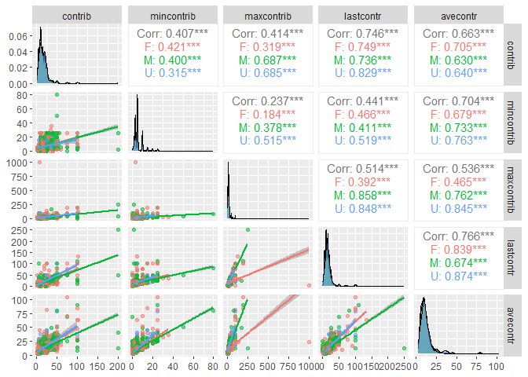<!-- -->

```r
# Let ggpairs plot INT (number of) continuous variables vs "contrib" before analyzing
ggpairs(frcDat, columns = c("contrib", "promocontr", "ncontrib", "mailord"), 
        upper = list(continuous = wrap("cor", size = 4)),
        lower = list(continuous = "smooth"),
        aes(color = gender,  
            alpha = 0.5)
        )
```

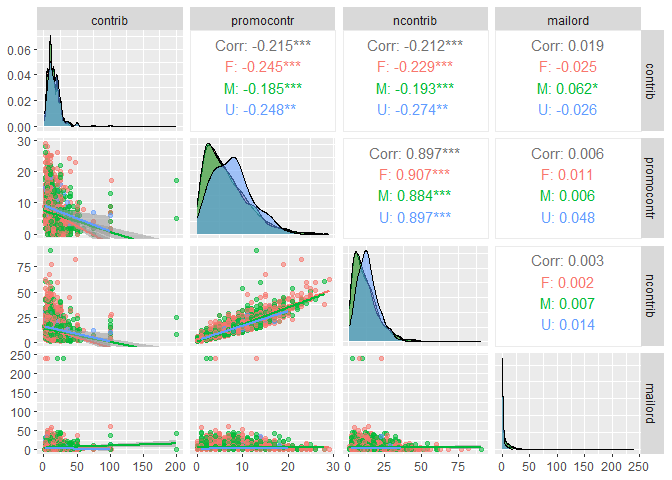<!-- -->

```r
# Let ggpairs plot time, date or age related continuous variables vs "contrib" before analyzing
ggpairs(frcDat, columns = c("contrib", "gapmos", "mindate", "maxdate", "age"), 
        upper = list(continuous = wrap("cor", size = 4)),
        lower = list(continuous = "smooth"),
        aes(color = gender,  
            alpha = 0.5)
        )
```

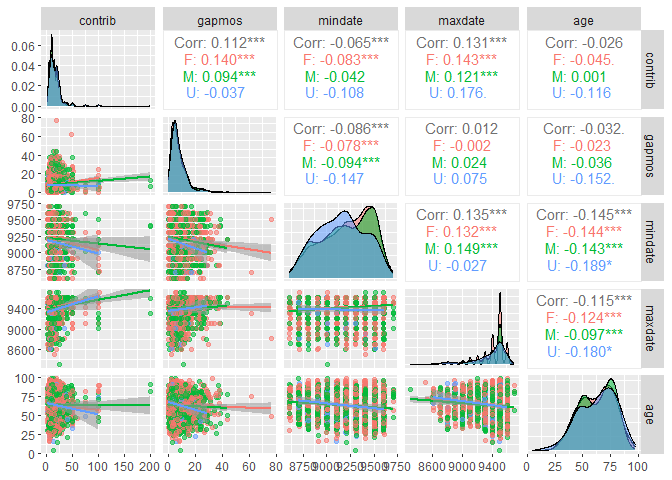<!-- -->

<p style="color:blue">The first *ggpairs()* set of plots for *$USD dollar* variables shows a level of correlation with `contrib`. The second set of *ggpairs()* plots based on counts also shows a level of correlation with `contrib`. The third set shows little correlation. The plots also show outliers that may impact the following results. The plots also show some outliers that may impact the results.</p>

<p style="color:blue">Next, I will run **correlations of all continuous variables into two matrices.**
One matrix for for Pearson and another matrix for Spearman correlations. The first row (or column) provides the correlations of each continuous variable with the target contributions.</p>

<p style="color:blue">Once I have the two matrix, I will be able to create bar plots and compare correlations.</p>

# Correlation matrices

Correlation matrices for continuous variable.

## Pearson


```r
# Correlations matrix for continuous variables.
corPearson <- cor(frcDat[,1:12],
                method = "pearson")


print(corPearson[1,2:12])
```

```
##      gapmos  promocontr  mincontrib    ncontrib  maxcontrib   lastcontr 
##  0.11219211 -0.21458645  0.40717536 -0.21162953  0.41447598  0.74645102 
##    avecontr     mailord     mindate     maxdate         age 
##  0.66309190  0.01859687 -0.06540943  0.13115985 -0.02582929
```

## Spearman


```r
corSpearman <- cor(frcDat[,1:12],
                 method = "spearman")

print(corSpearman[1,2:12])
```

```
##      gapmos  promocontr  mincontrib    ncontrib  maxcontrib   lastcontr 
##  0.15667400 -0.34303277  0.50770483 -0.36794468  0.73568485  0.77011108 
##    avecontr     mailord     mindate     maxdate         age 
##  0.74700987 -0.02334201 -0.10425397  0.19773321 -0.09726779
```

<p style="color:blue">The first row of each matrix gives me a list of correlations of all continuous variables vs `contrib`.
It allows me to create bar plots to visualize those correlations.</p>

<p style="color:blue">The following four bar plots display Pearson and Spearman correlations and correlations squared to easily compare them.</p>


# Bar plots


```r
## Problem 1 - Question 1 - bar plots                                   ####

# Correlation charts
#
old.par <- par(mfrow=c(2,2),ps=10)

barplot(corPearson[1,2:12], 
        main = "Contrib Pearson Corr", 
        ylab = "Pearson Correlation",
        las = 3,
        ylim = c(-0.4,.8),
        col="skyblue")

barplot(corSpearman[1,2:12], 
        main = "Contrib Spearman Corr",  
        ylab = "Spearman Correlation",
        las = 3,
        ylim = c(-0.4,.8),
        col="skyblue")


barplot(corPearson[1,2:12]^2, 
        main = "Contrib Pearson Corr^2 (Squared)", 
        ylab = "Pearson Correlation Square",
        las = 3,
        ylim = c(0,.7),
        col="skyblue")

barplot(corSpearman[1,2:12]^2, 
        main = "Contrib Spearman Corr^2 (Squared)",  
        ylab = "Spearman Correlation Square",
        las = 3,
        ylim = c(0,.7),
        col="skyblue")
```

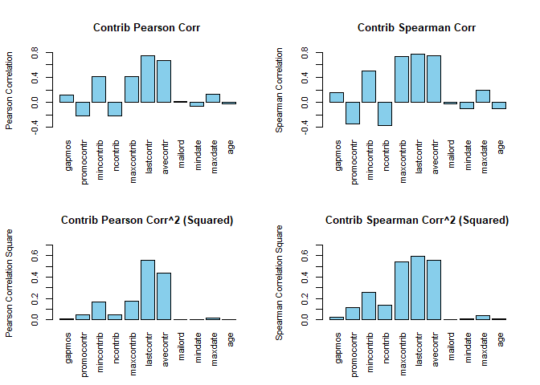<!-- -->

```r
par(old.par)
```

<p style="color:blue">Therefore, based on the above plots and matrices using *gpairs()*, correlations using *cor()* (for Pearson 0.7465 and for Spearman 0.7701), and *barplots()*, the results show that **the last contribution `lastcontr` is the variable most robustly correlated** with the target contributions (`contrib`).</p>

2. Fit linear model for target campaign contribution as the outcome and the last contribution by this donor (`lastcontr` in `fund-raising.csv`) as the predictor, using R function `lm`; inspect the fitted model using `summary` function, and use the output to answer the following questions:

<p style="color:blue">The R code to address the 2nd question follows:</p>


```r
lmModel <- lm(contrib~lastcontr,frcDat)

model.summary <- summary(lmModel)
# model.summary <- summary(lm(contrib~lastcontr,frcDat))

mode(model.summary)
```

```
## [1] "list"
```

```r
print(model.summary)
```

```
## 
## Call:
## lm(formula = contrib ~ lastcontr, data = frcDat)
## 
## Residuals:
##     Min      1Q  Median      3Q     Max 
## -77.046  -2.499  -0.475   1.706 156.716 
## 
## Coefficients:
##             Estimate Std. Error t value Pr(>|t|)    
## (Intercept)  3.52300    0.22092   15.95   <2e-16 ***
## lastcontr    0.79523    0.01204   66.06   <2e-16 ***
## ---
## Signif. codes:  0 '***' 0.001 '**' 0.01 '*' 0.05 '.' 0.1 ' ' 1
## 
## Residual standard error: 7.692 on 3468 degrees of freedom
## Multiple R-squared:  0.5572,	Adjusted R-squared:  0.5571 
## F-statistic:  4364 on 1 and 3468 DF,  p-value: < 2.2e-16
```


   + Does this predictor explain significant amount of variability in response?  I.e. is there statistically (!) significant association between them?
   
<p style="color:blue">Based on linear regression model summary on this dataset, there is statistically significant association between `contrib` and `lastcontr`. For the following reasons.</p> 

<p style="color:blue">The p-value is extremely low *<2e-16*. The null hypothesis is; *there is no association between the two variables.* The alternative hypothesis is; *there is association between the two variables.* A very low p-value indicates that the null hypotheses H0 is not plausible. </p>

<p style="color:blue">Referring to the textbook ISLR, section 3.1.2, page 67, given the linear regression function:</p>

<p style="color:blue">Y = B~0~ + B~1~X + e</p>

<p style="color:blue">The coefficients are B~0~ and B~1~, and e is a residual error.</p>

<p style="color:blue">H~0~: There is no relationship between X and Y (ISLR equation / statement (3.12))</p>
<p style="color:blue">H~a~: There is some relationship between X and Y (ISLR equaiton / statement (3.13))</p>

<p style="color:blue">The book re-states it as follows:</p>

<p style="color:blue">H~0~: B~1~ = 0</p>

<p style="color:blue">versus</p>

<p style="color:blue">H~a~: B~1~ not equal to 0</p>

<p style="color:blue">The very a small *p-value* indicates that we can *reject* the null hypothesis. That allows us to infer that *"there is an association between the predictor and the response* (ISLR p.68).</p>

<p style="color:blue">And the results from *summary(lm(...))* shows *three asterisck* characters next to the *p-value* indicating that the relationship is statistically **significant.** One would need to do additional tests on an additional data samples if possible to make sure the conclusion is not tied to this specific dataset. Therefore, **there is statistically significant association between these two variables, `contrib` and `lastcontr`,** based on this summary.</p>


   + What is the RSE and $R^2$ of this model?  Remember, you can find them in the `summary` output or use `sigma` and `r.sq` slots in the result returned by `summary` instead (the `summary()` command does return a *list*; if instead of just printing the result into the console you save it into a variable, as in `model.summary <- summary(...)`, then you can verify that the content of that variable *is* a list, you can see with `names(model.summary)` which elements this list contains, and you can extract, examine, and use them at will programmatically if you ever need to)

<p style="color:blue">From the *summary(lm(...)))* function:</p>

<p style="color:blue">RSE = 7.692</p>

<p style="color:blue">Multiple R-squared:  0.5572</p>


   + What are the model coefficients and what would be their interpretation? What is the meaning of the intercept of the model, for example?  What about the slope - how would you interpret its value?

<p style="color:blue">Intercept B~0~ = 7.692 with std. error of 0.22092</p>

<p style="color:blue">Slope B~1~:  0.79523 with std. error of 0.01204</p>


3. Create scatterplot of target campaign contribution and the last contribution (the attributes used in the model above) and add to the plot the regression line from the model using `abline` function

<p style="color:blue">Scatterplot for the model (namd `lmModel` here):</p>


```r
plot(frcDat[,c("lastcontr", "contrib")])
abline(lmModel,col=2,lwd=2)
abline(h=0,lty=2)
abline(v=0,lty=2)
```

-1.png)<!-- -->


4. Create diagnostic plots of the model and comment on any irregularities that they present.  For instance, does the plot of residuals vs. fitted values suggest presence of non-linearity that remains unexplained by the model?  Does scale-location plot suggest non-uniformity of variance along the range of fitted values?  Are some standardized residuals far greater than theoretical quantiles?  What about residuals vs. leverage plot and Cook's distance contours therein?  How does your conclusions compare to what's shown in the plot of the predictor and outcome with regression line added to it -- i.e. the plot that was generated above?

<p style="color:blue">The following charts provide diagnostic plots of the model. Answers to individual questions follow.</p>


```r
## / plot lm() -- 4 diagnostic plots created                                          ####
# Using par to do 1x2 plots per row provide larger plots than using 2x2
old.par <- par(mfrow=c(1,2))
plot(lmModel)
```

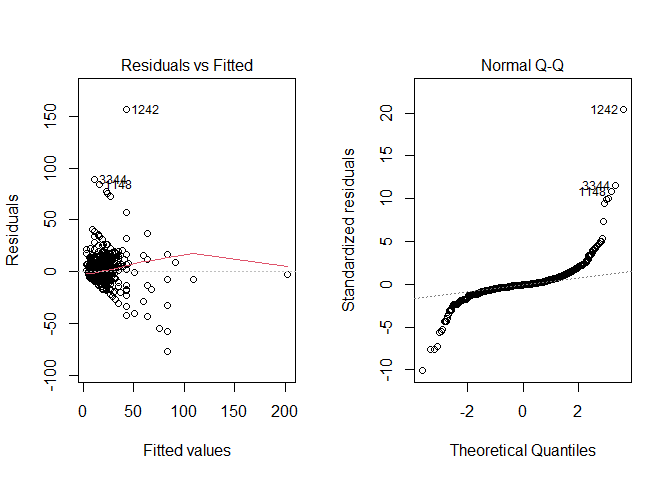<!-- -->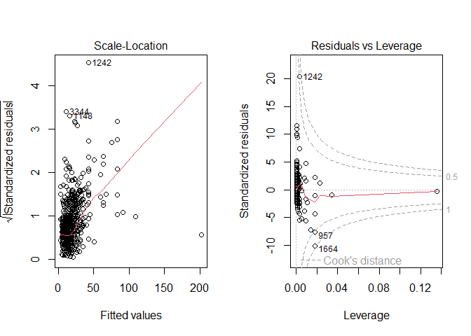<!-- -->

```r
par(old.par)
```

Does the plot of residuals vs. fitted values suggest presence of non-linearity that remains unexplained by the model?

<p style="color:blue">The plot of residuals vs. fitted values exhibits a nice horizontal red line that stays very close to 0 residuals, It is an indication of a good linear fit. There is also a small a cluster of points appearing below that red line, and between fitted values 50 and 100. </p>

<p style="color:blue">On one hand, the plot exhibited linearity. The trend red line in the *residuals vs fitted* plot follows the middle line very closely, but it has a small bend upwards in the middle and data points concentrated on the right side of the chart.</p>

Does scale-location plot suggest non-uniformity of variance along the range of fitted values? 

<p style="color:blue">Yes, it suggest non-uniformity. The *scale-location* plot is a little more problematic exhibiting an upwards trend and concentration of data points on the lower-left side of the chart. Ideally, all the dots would be uniformly spread around a straight and horizontal red trend line. But that is not the case. This plot looks like a cluster.</p>

Are some standardized residuals far greater than theoretical quantiles?  

<p style="color:blue">Yes, the plot of normal Q-Q shows some standardized values that fall outside of the theoretical quantile trend line. That is the case for theoretical quantiles smaller than -2 and larger than 2. The *normal q-q* plot suggest potential non-linearity at the edges, and that should not be surprising.</p>

What about residuals vs. leverage plot and Cook's distance contours therein?

<p style="color:blue">The plot of residuals vs leverage further supports the need to do more analysis. The plot does not show a clean linearity.</p>

How does your conclusions compare to what's shown in the plot of the predictor and outcome with regression line added to it -- i.e. the plot that was generated above?

<p style="color:blue">The plots suggest that there is still a potential presence of non-linearity that remains unexplained by the model, and that needs to be further explored. We need to do more analysis. We cannot rely on the current results to do predictions. The current results may achieve a degree of success, depending on the intended accuracy or objectives.</p>

5. Use function `confint` to obtain 95% confidence intervals on model parameters

<p style="color:blue">The results shows two numbers. One at 2.5% and another one at 97.5%. That is, 2.5% on each side to make for the 5% from both side of the 95% confidence level. That is, 95% of the time, the interval shown below will contain the population mean.</p>


```r
confint(lmModel)
```

```
##                 2.5 %    97.5 %
## (Intercept) 3.0898532 3.9561516
## lastcontr   0.7716243 0.8188294
```


6. Use this model and `predict` function to make predictions for the last contribution values of 10, 20 and 40. Remember that when you pass new data to `predict`, you have to make sure that the variable (column) names in those data match the predictor variable name(s) used in the model, otherwise `predict` will not know how to match the data to the model variables! Use `confidence` and `prediction` settings for parameter `interval` in the call to `predict` to obtain 90% confidence and prediction intervals on these model predictions (please double check what the default confidence level used by those functions is, and adjust if/as necessary).  Explain the differences between interpretation of:
    + confidence intervals on model parameters and model predictions
    + confidence and prediction intervals on model predictions
    + comment on whether confidence or prediction intervals (on predictions) are wider and why

<p style="color:blue">Function *predict()* estimate predictions with 90% confidence. The prediction is under column name `fit`. Both tables exhibit the same values for `fit`. The `lwr` and `upr` columns provide corresponding estimates of uncertainty associated with each prediction.</p>


```r
# Enter a set of inputs to predict:
new.lastcontr = c(10,20,40)

lmModel.conf <- predict(lmModel,
        newdata=data.frame(lastcontr=new.lastcontr),
        interval='confidence',
        level = 0.90)

lmModel.pred <- predict(lmModel,
        newdata=data.frame(lastcontr=new.lastcontr),
        interval='prediction',
        level = 0.90)

lmModel.conf
```

```
##        fit      lwr      upr
## 1 11.47527 11.24031 11.71023
## 2 19.42754 19.18931 19.66577
## 3 35.33207 34.78873 35.87542
```

```r
lmModel.pred
```

```
##        fit       lwr      upr
## 1 11.47527 -1.182759 24.13330
## 2 19.42754  6.769448 32.08563
## 3 35.33207 22.664568 47.99958
```

# Problem 2: model using log-transformed attributes (20 points)

1. Use `lm()` to fit a regression model of *log-transformed* outcome (`contrib`) as a linear function of *log-transformed* last contribution and use `summary` to evaluate its results.

Exclude small number of observations where `lastcontr==0`, otherwise log-transformation will result in negative infinity values for those and error from the call to `lm`.

<p style="color:blue">A new dataset excludes `lastcontr==0` as follows:</p>


```r
####
#
## CSCI E63-C PSET 3 - Problem 2                                            ####
#
# Log Transformed Attributes
#

# Remove lastcontr == 0
frcDatP2 <- frcDat[frcDat$lastcontr != 0,]

print("Dimension of data frame before removing lastcontr==0:")
```

```
## [1] "Dimension of data frame before removing lastcontr==0:"
```

```r
dim(frcDat)
```

```
## [1] 3470   13
```

```r
print("Dimension of data frame after removing lastcontr==0:")
```

```
## [1] "Dimension of data frame after removing lastcontr==0:"
```

```r
dim(frcDatP2)
```

```
## [1] 3460   13
```

```r
print("Summary of variable lastcontr before removing lastcontr==0:")
```

```
## [1] "Summary of variable lastcontr before removing lastcontr==0:"
```

```r
summary(frcDat$lastcontr)
```

```
##    Min. 1st Qu.  Median    Mean 3rd Qu.    Max. 
##     0.0    10.0    14.0    14.8    20.0   250.0
```

```r
print("Summary of variable lastcontr after removing lastcontr==0:")
```

```
## [1] "Summary of variable lastcontr after removing lastcontr==0:"
```

```r
summary(frcDatP2$lastcontr)
```

```
##    Min. 1st Qu.  Median    Mean 3rd Qu.    Max. 
##    1.00   10.00   14.00   14.85   20.00  250.00
```

<p style="color:blue">Without observations where `lastcontr==0` the number of observations went down from 3470 to 3460. </p>

<p style="color:blue">There were *10* observations excluded that had `lastcontr`==0'.</p>

<p style="color:blue">Next, apply `lm()` to fit a regression model of *log-transformed* (`contrib`~`lastcontr`):</p>


```r
logModel <- lm(log10(contrib)~log10(lastcontr), data = frcDatP2)

log.trasformed.summary <- summary(logModel)

print(log.trasformed.summary)
```

```
## 
## Call:
## lm(formula = log10(contrib) ~ log10(lastcontr), data = frcDatP2)
## 
## Residuals:
##      Min       1Q   Median       3Q      Max 
## -1.59373 -0.07460  0.01121  0.09069  0.97954 
## 
## Coefficients:
##                  Estimate Std. Error t value Pr(>|t|)    
## (Intercept)       0.20030    0.01293    15.5   <2e-16 ***
## log10(lastcontr)  0.82016    0.01149    71.4   <2e-16 ***
## ---
## Signif. codes:  0 '***' 0.001 '**' 0.01 '*' 0.05 '.' 0.1 ' ' 1
## 
## Residual standard error: 0.1736 on 3458 degrees of freedom
## Multiple R-squared:  0.5958,	Adjusted R-squared:  0.5957 
## F-statistic:  5098 on 1 and 3458 DF,  p-value: < 2.2e-16
```

<p style="color:blue">The new *log-transformed* model creates pentameters for intercept (0.2), and for slope (0.82).</p>

<p style="color:blue">$R^2$ is 0.5958. The original model's summary had R-squared equal to 0.5572.</p> 

<p style="color:blue">In both cases, new *log-transformed* and original had *p-value* of 2.2e-16.</p>

<p style="color:blue">The *log-transformed* model is slightly more rebustly correlated than the original model.</p> 

<p style="color:blue">There is still need to do further analysis to better understand how well the model correlates.</p>

<p style="color:blue"> The following code creates a matrix to compare attributes between the models.</p>


```r
# Attributes summary from each model
model.summary$coefficients
```

```
##              Estimate Std. Error  t value     Pr(>|t|)
## (Intercept) 3.5230024 0.22092142 15.94686 2.646504e-55
## lastcontr   0.7952268 0.01203814 66.05896 0.000000e+00
```

```r
log.trasformed.summary$coefficients
```

```
##                   Estimate Std. Error  t value     Pr(>|t|)
## (Intercept)      0.2003049 0.01292504 15.49743 2.011276e-52
## log10(lastcontr) 0.8201579 0.01148730 71.39691 0.000000e+00
```

```r
# Next, a short matrix will summarize the comparison between original and transformed models.
# Matrix compares attributes, R^2, and RSE

mCompare <- matrix(c(model.summary$coefficients[1,1],
                     model.summary$coefficients[1,2],
                     model.summary$coefficients[2,1],
                     model.summary$coefficients[2,2],
                     model.summary$r.squared, 
                     model.summary$sigma,
                     log.trasformed.summary$coefficients[1,1],
                     log.trasformed.summary$coefficients[1,2],
                     log.trasformed.summary$coefficients[2,1],
                     log.trasformed.summary$coefficients[2,2],
                     log.trasformed.summary$r.squared, 
                     log.trasformed.summary$sigma),
                   nrow = 6, ncol = 2,
                   dimnames = list(c("Intercept", "SE(Intx)", 
                                     "slope", "SE(slope)", 
                                     "R^2", "RSE"), 
                                   c("orig-model", "log-xform")))

mCompare
```

```
##           orig-model  log-xform
## Intercept 3.52300237 0.20030486
## SE(Intx)  0.22092142 0.01292504
## slope     0.79522682 0.82015794
## SE(slope) 0.01203814 0.01148730
## R^2       0.55718912 0.59581646
## RSE       7.69215443 0.17355234
```

<p style="color:blue">"$R^2$ static that is close to 1 indicates that a large proportion of the variability in the response has been explained by the regression." (ISLR Ch 3.1.3)</p> 

<p style="color:blue">In the *log-transformed model*, $R^2$ is slightly higher than in the *original model.*</p> 

<p style="color:blue">The *log-transformed model* has $R^2$ of almost 0.6, not quite close to 1, but better than 0.5.</p> 

<p style="color:blue">There is variably of the response explained by the regression (further analysis needed).</p>

<p style="color:blue">The model intercept for the *log-transformed model* is 0.2. The model intercept for *untransformed model* is 3.5.</p> 

<p style="color:blue">It  makes sense for the intercept of the *log-transformed model* to be 0.2. If we just took (simple test) the log10 of 3.5 we would get 0.5.</p> 

<p style="color:blue">We have the log10 applied to both variables. We also removed the values where *lastcontr==0".* The *log-transformed model* will observe a much small range of numbers (min and max).</p>


2. Create an XY-scatterplot of *log-transformed* predictor and response and add corresponding regression line to it.  Compare it to the plot in *untransformed* coordinates obtained in Problem 1.  What would you conclude from such comparison?

<p style="color:blue">In addition to xy-scattered plots, I am including boxplots to show another view how the transformed set differs from the untransformed. This set of plots show how the data are spread across their space. The logarithmic transformation makes data spread more evenly. The boxplot provide a nice visual on how data spread. The *transformed dataset* exhibits an even spread. That even spread is supported in the xy-scattered plots.</p>


```r
summary(frcDatP2[,c("contrib")])
```

```
##    Min. 1st Qu.  Median    Mean 3rd Qu.    Max. 
##     1.0    10.0    13.0    15.3    20.0   200.0
```

```r
summary(log10(frcDatP2[,c("contrib")]))
```

```
##    Min. 1st Qu.  Median    Mean 3rd Qu.    Max. 
##   0.000   1.000   1.114   1.099   1.301   2.301
```

```r
#
old.par <- par(mfrow=c(1,2), ps=10)

boxplot(frcDatP2[,c("contrib")],
        main="UnXformed ($)",
        col="skyblue")

boxplot(log10(frcDatP2[,c("contrib")]),
        main="Xformed (log$)",
        col="skyblue")
```

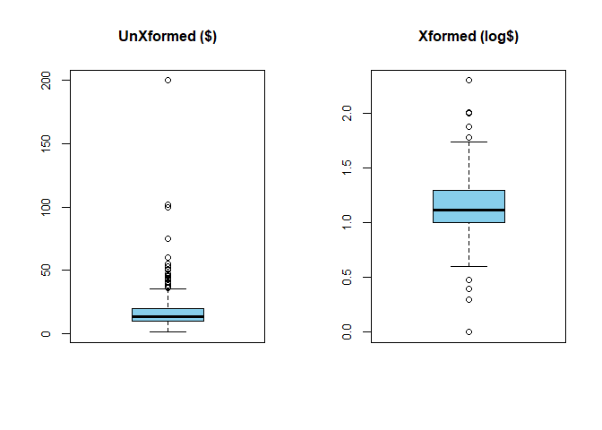<!-- -->

```r
# Original lm model
plot(frcDatP2[,c("lastcontr", "contrib")], 
     main = "UnXformed ($ x $)")
abline(lmModel,col=2,lwd=2)
abline(h=0,lty=2)
abline(v=0,lty=2)

# Recall to use frcDatP2 w/o lastcontr == 0.
plot(log10(frcDatP2[,c("lastcontr", "contrib")]),
     main = "Xformed (log$ x log$")
abline(logModel,col=2,lwd=2)
abline(h=0,lty=2)
abline(v=0,lty=2)
```

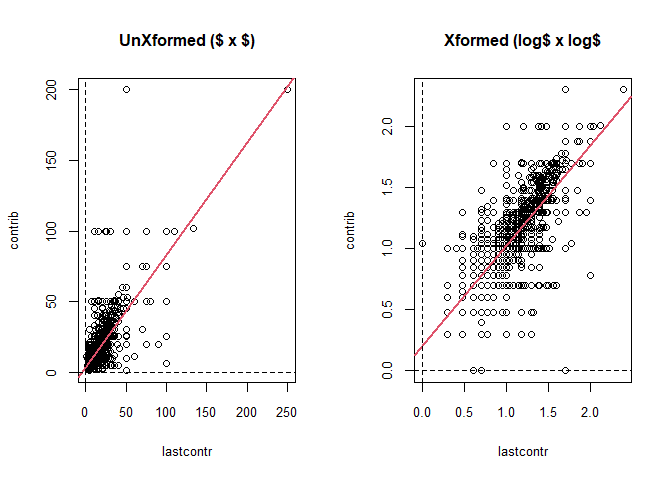<!-- -->

```r
par(old.par)
```


3. Make diagnostic plots for the model fit on log-transformed outcome and the last contribution.  Compare them to the diagnostic plots generated in Problem 1 for the model fitted using original scale of measurements (untransformed). What can you conclude from this comparison about the relative quality of these two models?

<p style="color:blue">The *transformed dataset* fixes some of the issues observed in the *untranformed* diagnoistic set. The *residuals vs. fitted* chart shows the even distribution from left to right as noticed in the linear regression chart above. The *scale-location* chart also straightens the chart, where the original scale of measurements had exhibited a positive slope or positive trend.</p>


```r
## / plot lm() -- 4 diagnostic plots created                                          ####
old.par <- par(mfrow=c(1,2))

plot(logModel)
```

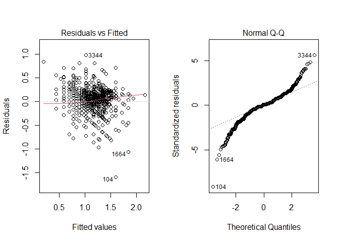<!-- -->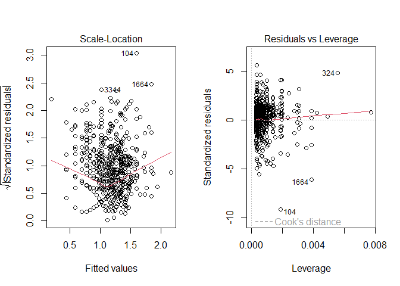<!-- -->

```r
par(old.par)
```

# Problem 3: Adding second variable to the model (10 points)

To explore effects of adding another variable to the model, continue using log-transformed attributes and fit a model of log-transformed outcome (the same target campaign contribution, column `contrib` in `fund-raising.csv`) as a function of the last contribution and average contribution (both log-transformed).  Just an additive model -- no interaction term is necessary at this point. Please obtain and evaluate the summary of this model fit, confidence intervals on its parameters and its diagnostic plots. Where applicable, compare them to the model obtained above and reflect on pros and cons of including average contribution as another variable into the model.  You may find the discussion of *variance inflation factor* (VIF) in ISLR Ch.3.3.3 (Section 6) and its implementation `vif` in `car` library particularly useful in this context. 

<p style="color:blue">To add a second variable and then apply a log-transformation, I will first test the new variable and avoid any 0 equalities (i.e. to prevent possible issues with log), and then will run the `lm()` to perform linear regression.</p>


```r
####
#
## CSCI E63-C PSET 3 - Problem 3                                            ####
#
#  Multi-Variable Model (mvlogModel)

# Remove lastcontr == 0
frcDat_test <- frcDatP2[frcDatP2$avecontr != 0,]

print("Dimension of P2 data frame before removing avecontr==0:")
```

```
## [1] "Dimension of P2 data frame before removing avecontr==0:"
```

```r
dim(frcDatP2)
```

```
## [1] 3460   13
```

```r
print("Dimension of test data frame after removing avecontr==0:")
```

```
## [1] "Dimension of test data frame after removing avecontr==0:"
```

```r
dim(frcDat_test)
```

```
## [1] 3460   13
```

```r
#Since the dimension did not change, I will stick with frcDatP2 for the rest of this problem

mvlogModel <- lm(log10(contrib)~log10(lastcontr + avecontr), data = frcDatP2)

summary(mvlogModel)
```

```
## 
## Call:
## lm(formula = log10(contrib) ~ log10(lastcontr + avecontr), data = frcDatP2)
## 
## Residuals:
##      Min       1Q   Median       3Q      Max 
## -1.57245 -0.06714  0.01032  0.08191  1.00079 
## 
## Coefficients:
##                             Estimate Std. Error t value Pr(>|t|)    
## (Intercept)                 -0.19598    0.01668  -11.75   <2e-16 ***
## log10(lastcontr + avecontr)  0.95707    0.01216   78.72   <2e-16 ***
## ---
## Signif. codes:  0 '***' 0.001 '**' 0.01 '*' 0.05 '.' 0.1 ' ' 1
## 
## Residual standard error: 0.1634 on 3458 degrees of freedom
## Multiple R-squared:  0.6418,	Adjusted R-squared:  0.6417 
## F-statistic:  6196 on 1 and 3458 DF,  p-value: < 2.2e-16
```


<p style="color:blue">Function *confint()* provide confidence intervals with 95% confidence level, and predictions. The following R code provides results to compare the new two-variable (multi-variable) log model, with the previous single-variable log model, and with the original model, as follows:</p>.


```r
print("Confidence intervals for multi-variable log10 transformed model")
```

```
## [1] "Confidence intervals for multi-variable log10 transformed model"
```

```r
confint(mvlogModel)
```

```
##                                  2.5 %     97.5 %
## (Intercept)                 -0.2286816 -0.1632706
## log10(lastcontr + avecontr)  0.9332339  0.9809114
```

```r
print("Confidence intervals for log10 transformed model")
```

```
## [1] "Confidence intervals for log10 transformed model"
```

```r
confint(logModel)
```

```
##                      2.5 %    97.5 %
## (Intercept)      0.1749634 0.2256463
## log10(lastcontr) 0.7976354 0.8426805
```

```r
print("Confidence intervals for original untransformed model")
```

```
## [1] "Confidence intervals for original untransformed model"
```

```r
confint(lmModel)
```

```
##                 2.5 %    97.5 %
## (Intercept) 3.0898532 3.9561516
## lastcontr   0.7716243 0.8188294
```

```r
# Predictions
print("MV-Transformed model (log10, two variables), 95% confidence")
```

```
## [1] "MV-Transformed model (log10, two variables), 95% confidence"
```

```r
10^predict(mvlogModel,
        newdata=data.frame(lastcontr=c(10,20,40), avecontr=c(10,20,40)),
        interval='confidence',
        level = 0.95)
```

```
##        fit      lwr      upr
## 1 11.19964 11.05657 11.34457
## 2 21.74261 21.34281 22.14991
## 3 42.21039 40.85221 43.61372
```

```r
10^predict(mvlogModel,
        newdata=data.frame(lastcontr=c(10,20,40), avecontr=c(10,20,40)),
        interval='prediction',
        level = 0.95)
```

```
##        fit       lwr      upr
## 1 11.19964  5.355826 23.41973
## 2 21.74261 10.396360 45.47180
## 3 42.21039 20.173235 88.32083
```

```r
print("Transformed model (log10, one variable), 95% confidence")
```

```
## [1] "Transformed model (log10, one variable), 95% confidence"
```

```r
10^predict(logModel,
        newdata=data.frame(lastcontr=c(10,20,40)),
        interval='confidence',
        level = 0.95)
```

```
##        fit      lwr      upr
## 1 10.48245 10.33455 10.63247
## 2 18.50781 18.19472 18.82628
## 3 32.67737 31.72884 33.65425
```

```r
10^predict(logModel,
        newdata=data.frame(lastcontr=c(10,20,40)),
        interval='prediction',
        level = 0.95)
```

```
##        fit       lwr      upr
## 1 10.48245  4.787749 22.95061
## 2 18.50781  8.452766 40.52388
## 3 32.67737 14.918709 71.57525
```

```r
print("Original untransformed model, 95% confidence")
```

```
## [1] "Original untransformed model, 95% confidence"
```

```r
predict(lmModel,
        newdata=data.frame(lastcontr=c(10,20,40)),
        interval='confidence',
        level = 0.95)
```

```
##        fit      lwr      upr
## 1 11.47527 11.19527 11.75527
## 2 19.42754 19.14364 19.71143
## 3 35.33207 34.68459 35.97956
```

```r
predict(lmModel,
        newdata=data.frame(lastcontr=c(10,20,40)),
        interval='prediction',
        level = 0.95)
```

```
##        fit       lwr      upr
## 1 11.47527 -3.608938 26.55948
## 2 19.42754  4.343258 34.51182
## 3 35.33207 20.236573 50.42758
```

<p style="color:blue">Those functions generated confidence intervals and predictions for all three cases: Original model, log10 model with one variable, and log10 model with two variables. I used prediction for `lastcont` and `avecontr` 10, 20, and 40. It is interesting to note that all three the models tend to agree on the middle values where `lastcontr` and `avecontr` equal to 20, but the models diverge when we enter a higher number 40. One explanation could be that the models works well for middle numbers, but not as well at the edges, where we could have outliers. The next analysis will help visualize that last point.</p>

<p style="color:blue">Diagnostic plots printed below.</p>


```r
# 
old.par <- par(mfrow=c(1,2))

plot(mvlogModel)
```

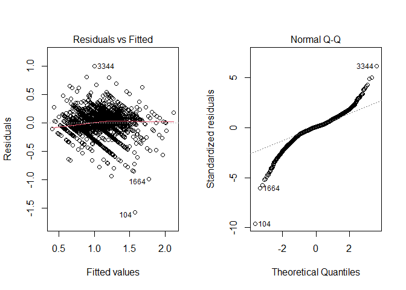<!-- -->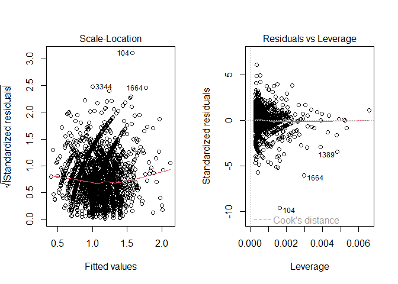<!-- -->

```r
par(old.par)
```

<p style="color:blue">Comparing to the first log-transformed model:</p>


```r
old.par <- par(mfrow=c(1,2))

# Reference: Code to plot individual quality plots (using the "which" argument)
# came from Jose Pena in Week 3 TF Section: Linear Regression in R
plot(logModel, which = 1)

plot(mvlogModel, which = 1)
```

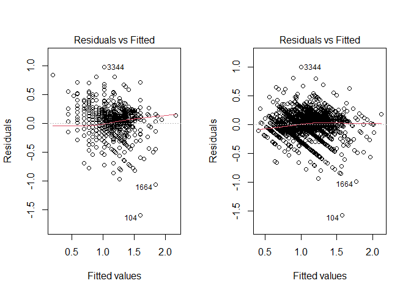<!-- -->

```r
par(old.par)
```

<p style="color:blue">The single-variable log10 model is on the left, and the two-variable log10 model is on the right, as labeled at the bottom.</p>

<p style="color:blue">The two-variable log10 model tends to keep the trending line (red) closer to the middle as we approach higher values.</p>

<p style="color:blue">In my previous observation I noted that the predictions diverged at higher numbers. The residuals vs fitted plot could explain it.</p>

<p style="color:blue">Now let's do another comparison looking at scale-location.</p>


```r
old.par <- par(mfrow=c(1,2))

# Reference: Code to plot individual quality plots (using the "which" argument)
# came from Jose Pena in Week 3 TF Section: Linear Regression in R
plot(logModel, which = 3)

plot(mvlogModel, which = 3)
```

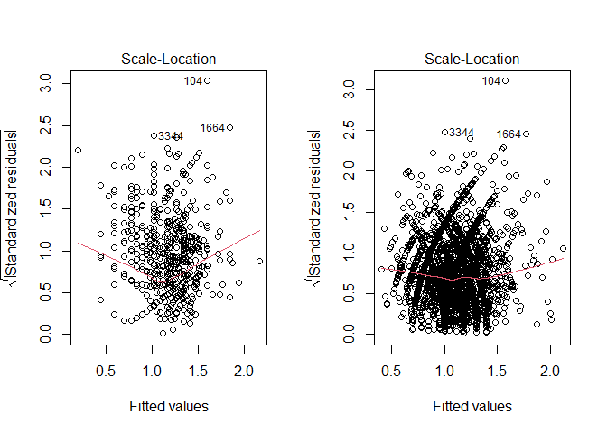<!-- -->

```r
par(old.par)
```

<p style="color:blue">In here too, the scale-location plot has a more straight trendline for the two-variable plot (right) than for the single-variable plot (left).</p>

<p style="color:blue">Overall, the two-variable model offers better results by taking care of higher numbers, such as outliers.</p>

<p style="color:blue">On the other hand, the two-variable model may result on more variability. Having more variables produces more influence on the predictions coming from more sources.</p>


```r
summary(lm(contrib~lastcontr+avecontr, data = frcDatP2))
```

```
## 
## Call:
## lm(formula = contrib ~ lastcontr + avecontr, data = frcDatP2)
## 
## Residuals:
##     Min      1Q  Median      3Q     Max 
## -68.520  -2.315  -0.667   1.767 152.129 
## 
## Coefficients:
##             Estimate Std. Error t value Pr(>|t|)    
## (Intercept)  2.04311    0.24396   8.375   <2e-16 ***
## lastcontr    0.62269    0.01845  33.744   <2e-16 ***
## avecontr     0.35949    0.02897  12.410   <2e-16 ***
## ---
## Signif. codes:  0 '***' 0.001 '**' 0.01 '*' 0.05 '.' 0.1 ' ' 1
## 
## Residual standard error: 7.507 on 3457 degrees of freedom
## Multiple R-squared:  0.5789,	Adjusted R-squared:  0.5787 
## F-statistic:  2377 on 2 and 3457 DF,  p-value: < 2.2e-16
```

```r
summary(lm(contrib~.
           -gapmos
           -promocontr
           -mincontrib
           -ncontrib
           -maxcontrib
           -mailord
           -mindate
           -maxdate
           -age,
           frcDatP2[,colnames(frcDatP2)!="gender"]))
```

```
## 
## Call:
## lm(formula = contrib ~ . - gapmos - promocontr - mincontrib - 
##     ncontrib - maxcontrib - mailord - mindate - maxdate - age, 
##     data = frcDatP2[, colnames(frcDatP2) != "gender"])
## 
## Residuals:
##     Min      1Q  Median      3Q     Max 
## -68.520  -2.315  -0.667   1.767 152.129 
## 
## Coefficients:
##             Estimate Std. Error t value Pr(>|t|)    
## (Intercept)  2.04311    0.24396   8.375   <2e-16 ***
## lastcontr    0.62269    0.01845  33.744   <2e-16 ***
## avecontr     0.35949    0.02897  12.410   <2e-16 ***
## ---
## Signif. codes:  0 '***' 0.001 '**' 0.01 '*' 0.05 '.' 0.1 ' ' 1
## 
## Residual standard error: 7.507 on 3457 degrees of freedom
## Multiple R-squared:  0.5789,	Adjusted R-squared:  0.5787 
## F-statistic:  2377 on 2 and 3457 DF,  p-value: < 2.2e-16
```

```r
# Reference: VIF code came from file "wk3qa.RMD" provided in class.
# and it is based on homework problems from chatper 3 of ISLR textbook.

library(car)
```

```
## Loading required package: carData
```

```r
vif(lm(contrib~lastcontr+avecontr, data = frcDatP2))
```

```
## lastcontr  avecontr 
##  2.453577  2.453577
```

```r
vif(lm(contrib~.
           -gapmos
           -promocontr
           -mincontrib
           -ncontrib
           -maxcontrib
           -mailord
           -mindate
           -maxdate
           -age,
           frcDatP2[,colnames(frcDatP2)!="gender"]))
```

```
## lastcontr  avecontr 
##  2.453577  2.453577
```

```r
#test
summary(frcDatP2)
```

```
##     contrib          gapmos         promocontr       mincontrib    
##  Min.   :  1.0   Min.   : 0.000   Min.   : 0.000   Min.   : 0.000  
##  1st Qu.: 10.0   1st Qu.: 4.000   1st Qu.: 3.000   1st Qu.: 3.000  
##  Median : 13.0   Median : 6.000   Median : 6.000   Median : 5.000  
##  Mean   : 15.3   Mean   : 7.823   Mean   : 6.576   Mean   : 5.623  
##  3rd Qu.: 20.0   3rd Qu.:10.000   3rd Qu.: 9.000   3rd Qu.: 5.000  
##  Max.   :200.0   Max.   :77.000   Max.   :29.000   Max.   :80.000  
##     ncontrib       maxcontrib        lastcontr         avecontr      
##  Min.   : 1.00   Min.   :   5.00   Min.   :  1.00   Min.   :  2.261  
##  1st Qu.: 6.00   1st Qu.:  11.00   1st Qu.: 10.00   1st Qu.:  7.098  
##  Median :10.00   Median :  15.00   Median : 14.00   Median :  9.894  
##  Mean   :12.34   Mean   :  18.09   Mean   : 14.85   Mean   : 11.160  
##  3rd Qu.:16.00   3rd Qu.:  20.00   3rd Qu.: 20.00   3rd Qu.: 13.191  
##  Max.   :91.00   Max.   :1000.00   Max.   :250.00   Max.   :103.571  
##     mailord           mindate        maxdate          age        gender  
##  Min.   :  0.000   Min.   :8608   Min.   :8312   Min.   : 4.00   F:1868  
##  1st Qu.:  0.000   1st Qu.:9006   1st Qu.:9401   1st Qu.:50.00   M:1468  
##  Median :  1.000   Median :9210   Median :9504   Median :64.00   U: 124  
##  Mean   :  4.436   Mean   :9207   Mean   :9409   Mean   :62.63           
##  3rd Qu.:  5.000   3rd Qu.:9410   3rd Qu.:9511   3rd Qu.:75.00           
##  Max.   :240.000   Max.   :9702   Max.   :9702   Max.   :98.00
```

```r
summary(lm(contrib~.,frcDatP2[,colnames(frcDatP2)!="gender"]))
```

```
## 
## Call:
## lm(formula = contrib ~ ., data = frcDatP2[, colnames(frcDatP2) != 
##     "gender"])
## 
## Residuals:
##     Min      1Q  Median      3Q     Max 
## -66.823  -2.237  -0.651   1.746 152.753 
## 
## Coefficients:
##               Estimate Std. Error t value Pr(>|t|)    
## (Intercept)  3.8552706  8.9233645   0.432   0.6657    
## gapmos       0.0294980  0.0207031   1.425   0.1543    
## promocontr  -0.0442674  0.0635951  -0.696   0.4864    
## mincontrib  -0.0107045  0.0460743  -0.232   0.8163    
## ncontrib    -0.0386822  0.0329822  -1.173   0.2409    
## maxcontrib   0.0043328  0.0075044   0.577   0.5637    
## lastcontr    0.6053627  0.0199387  30.361   <2e-16 ***
## avecontr     0.3539121  0.0409038   8.652   <2e-16 ***
## mailord     -0.0145348  0.0118326  -1.228   0.2194    
## mindate     -0.0013286  0.0005647  -2.353   0.0187 *  
## maxdate      0.0011660  0.0007521   1.550   0.1212    
## age          0.0056309  0.0083481   0.675   0.5000    
## ---
## Signif. codes:  0 '***' 0.001 '**' 0.01 '*' 0.05 '.' 0.1 ' ' 1
## 
## Residual standard error: 7.487 on 3448 degrees of freedom
## Multiple R-squared:  0.5824,	Adjusted R-squared:  0.581 
## F-statistic: 437.1 on 11 and 3448 DF,  p-value: < 2.2e-16
```

```r
vif(lm(contrib~.,frcDatP2[,colnames(frcDatP2)!="gender"]))
```

```
##     gapmos promocontr mincontrib   ncontrib maxcontrib  lastcontr   avecontr 
##   1.050807   5.690033   2.560951   5.520969   1.587125   2.880492   4.919317 
##    mailord    mindate    maxdate        age 
##   1.017543   1.350942   1.282494   1.066863
```

```r
vif(lm(contrib~.-lastcontr,frcDatP2[,colnames(frcDatP2)!="gender"]))
```

```
##     gapmos promocontr mincontrib   ncontrib maxcontrib   avecontr    mailord 
##   1.050454   5.665194   2.496871   5.501488   1.547036   3.022373   1.016919 
##    mindate    maxdate        age 
##   1.331296   1.209896   1.066854
```

```r
vif(lm(contrib~.-lastcontr-avecontr,frcDatP2[,colnames(frcDatP2)!="gender"]))
```

```
##     gapmos promocontr mincontrib   ncontrib maxcontrib    mailord    mindate 
##   1.049984   5.656133   1.327124   5.491452   1.118333   1.015228   1.251838 
##    maxdate        age 
##   1.205271   1.066530
```

```r
summary(lm(contrib~.-lastcontr-avecontr,frcDatP2[,colnames(frcDatP2)!="gender"]))
```

```
## 
## Call:
## lm(formula = contrib ~ . - lastcontr - avecontr, data = frcDatP2[, 
##     colnames(frcDatP2) != "gender"])
## 
## Residuals:
##      Min       1Q   Median       3Q      Max 
## -171.245   -4.533   -1.513    2.788  163.555 
## 
## Coefficients:
##               Estimate Std. Error t value Pr(>|t|)    
## (Intercept) 36.8695540 11.0485339   3.337 0.000856 ***
## gapmos       0.0563781  0.0263692   2.138 0.032585 *  
## promocontr  -0.0057477  0.0807901  -0.071 0.943287    
## mincontrib   0.8607341  0.0422616  20.367  < 2e-16 ***
## ncontrib    -0.1475108  0.0419128  -3.519 0.000438 ***
## maxcontrib   0.1774098  0.0080266  22.103  < 2e-16 ***
## mailord      0.0112875  0.0150597   0.750 0.453598    
## mindate     -0.0082015  0.0006926 -11.842  < 2e-16 ***
## maxdate      0.0050143  0.0009291   5.397 7.23e-08 ***
## age          0.0012787  0.0106354   0.120 0.904309    
## ---
## Signif. codes:  0 '***' 0.001 '**' 0.01 '*' 0.05 '.' 0.1 ' ' 1
## 
## Residual standard error: 9.539 on 3450 degrees of freedom
## Multiple R-squared:  0.3216,	Adjusted R-squared:  0.3198 
## F-statistic: 181.7 on 9 and 3450 DF,  p-value: < 2.2e-16
```

```r
# 
# summary(lm(contrib~.,frcDatP2[,colnames(Auto)!="name"], data = frcDatP2))
# vif(lm(mpg~.,Auto[,colnames(Auto)!="name"]))
# vif(lm(mpg~.-displacement,Auto[,colnames(Auto)!="name"]))
# vif(lm(mpg~.-displacement-weight,Auto[,colnames(Auto)!="name"]))
# summary(lm(mpg~.-displacement-weight,Auto[,colnames(Auto)!="name"]))
```
<p style="color:blue">VIF tests collinearity</p>

<p style="color:blue">Collinmarity causes an increase in coefficient estimates to increase. It is hard to detect by inspection. The Variance Correlation Factor (VIF) (ISLR p. 101). Small indicates absence of collinearity. Smallest VIF is 1. THe test for `lastcontr` and `avecontr` resulted in VIF of 2.45. That is a small number and therefore this test indecates that there is no colliearity between these two variables.</p>

# References
1. Book (ISLR) "An Introduction to Statistical Learning with Applications in R" by Gareth James et al
2. Book "R for Data Science" by Hadley Wickham and Garrett Grolemund
3. Book "R Graphics Cookbook" by Winston Chang
4. LinkedIn Learning "Wrangling and Visualizing Data" by Barton Poulson
