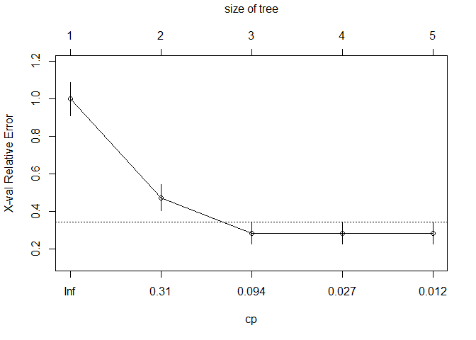

# Classification of Human Migration: Migration Pattern

Migration pattern is defined by the positive or negative net migration median over the period of time in question. In this use case, a country is classfied as 'emigration' if it has a median negative migration, and 'immigration' if it has a positive median net migration reported in thousands of people.


# Load the libraries 

A list of libraries we will need in this project


```r
# Essential libraries
library(dplyr)
library(tidyr)
library(ggplot2)
library(ggExtra)
library(cowplot)
library(rpart)
library(rpart.plot)
library(mlbench)
library(pROC)
library(tree)
library(caret)
```


# Load the data

Read the UN and World Bank dataset created in the initial EDA.
Filter for population larger than 5 million and years larger than or equal to 2000.


```r
# Load the dataset
wpp_wb <- read.csv('../data/wpp_wb_2023.Q1.csv') %>% 
  filter(pop > 5000 & year >= 2000)

wpp_wb$mig_pattern <- as.factor(wpp_wb$mig_pattern)

# Save the original datasets from the CSV files, and assign new dataframe names:
df <- wpp_wb 
```

# Remove columns to create a dataframe for mig_pattern

## Identify non-predictors and save them

This informative type dataset will be handy downstream to be merged re-join 
with train and test results. But these variables should not be part of training
or testing the model.


```r
info_vars <- c('index', 'country', 'subregion', 'region', 'ISO3', 'year')

df_info <- wpp_wb %>% dplyr::select(info_vars)
```

### Handling NAs

Make the NA values to be equal to the next existing value.


```r
# Tip from stackoverflow:
# https://stackoverflow.com/questions/40040834/replace-na-with-previous-or-next-value-by-group-using-dplyr
# Use tidyverse {tidyr} fill() function.

# df <- df %>% group_by(ISO3) %>% fill(colnames(df), .direction = 'downup')
```

# Split train test

## Split by country


```r
# Train test split ----
##
##

# We have 236 countries.
countries <- unique(df$country)

# Now get a sample of say 70% of that list
set.seed(12321) 
countries_sample <- sample(countries, length(countries)*0.7)

# Now we will want train to contain those countries
train <- df %>% filter(country %in% countries_sample)
test <- df %>% filter(!country %in% countries_sample)

# Drop any possible NA from the test set only
train <- train %>% drop_na()
test <- test %>% drop_na()
```

## Keep index, predictors, and outcome


```r
# These columns will not be included when fitting the model.
not_columns <- c('country', 'subregion', 'region', 
                                  'ISO3', 'ISO2', 'year',
                                  'net_mig_rate',
                                  'net_migrants',
                                  'mig_stock',
                                  'log_mig_stock',
                                  'emigrates',
                                  'migration_swings',
                                  'net_mig_rate_mean',
                                  'net_mig_rate_med')

train <- train %>% dplyr::select(-not_columns)

test <- test %>% dplyr::select(-not_columns)

colnames(train)
```

```
##  [1] "index"                  "mig_pattern"            "pop"                   
##  [4] "pop_m"                  "pop_f"                  "pop_density"           
##  [7] "pop_sex_ratio"          "med_age"                "natural_change"        
## [10] "natural_change_rate"    "pop_change"             "pop_growth_rate"       
## [13] "births"                 "births_w15to19"         "birth_rate"            
## [16] "fertility_rate"         "net_reproduction_rate"  "mean_age_childbearing" 
## [19] "sex_ratio_birth"        "tot_deaths"             "male_deaths"           
## [22] "female_deaths"          "death_rate"             "life_exp"              
## [25] "life_exp_m"             "life_exp_f"             "life_exp_15"           
## [28] "life_exp_15_m"          "life_exp_15_f"          "life_exp_65"           
## [31] "life_exp_65_m"          "life_exp_65_f"          "life_exp_80"           
## [34] "life_exp_80_m"          "life_exp_80_f"          "infant_deaths"         
## [37] "under_five_mortality"   "deaths_under_5"         "mortality_rate_under_5"
## [40] "mortality_40"           "mortality_40_m"         "mortality_40_f"        
## [43] "mortality_60"           "mortality_60_m"         "mortality_60_f"        
## [46] "mortality_15_50"        "mortality_15_50_m"      "mortality_15_50_f"     
## [49] "mortality_15_60"        "mortality_15_60_m"      "mortality_15_60_f"     
## [52] "GDP"                    "GDP_growth"             "GDP_pc"                
## [55] "GDP_pc_ppp"             "inflation"              "natl_income_pc"        
## [58] "cpi"                    "food"                   "homicides"             
## [61] "electricity"            "co2_emissions"          "education"             
## [64] "log_GDP"                "log_GDP_pc"             "log_GDP_pc_ppp"        
## [67] "log_inflation"          "log_natl_income_pc"     "log_cpi"               
## [70] "log_food"               "log_homicides"          "log_electricity"       
## [73] "log_co2_emissions"      "log_education"
```

```r
colnames(test)
```

```
##  [1] "index"                  "mig_pattern"            "pop"                   
##  [4] "pop_m"                  "pop_f"                  "pop_density"           
##  [7] "pop_sex_ratio"          "med_age"                "natural_change"        
## [10] "natural_change_rate"    "pop_change"             "pop_growth_rate"       
## [13] "births"                 "births_w15to19"         "birth_rate"            
## [16] "fertility_rate"         "net_reproduction_rate"  "mean_age_childbearing" 
## [19] "sex_ratio_birth"        "tot_deaths"             "male_deaths"           
## [22] "female_deaths"          "death_rate"             "life_exp"              
## [25] "life_exp_m"             "life_exp_f"             "life_exp_15"           
## [28] "life_exp_15_m"          "life_exp_15_f"          "life_exp_65"           
## [31] "life_exp_65_m"          "life_exp_65_f"          "life_exp_80"           
## [34] "life_exp_80_m"          "life_exp_80_f"          "infant_deaths"         
## [37] "under_five_mortality"   "deaths_under_5"         "mortality_rate_under_5"
## [40] "mortality_40"           "mortality_40_m"         "mortality_40_f"        
## [43] "mortality_60"           "mortality_60_m"         "mortality_60_f"        
## [46] "mortality_15_50"        "mortality_15_50_m"      "mortality_15_50_f"     
## [49] "mortality_15_60"        "mortality_15_60_m"      "mortality_15_60_f"     
## [52] "GDP"                    "GDP_growth"             "GDP_pc"                
## [55] "GDP_pc_ppp"             "inflation"              "natl_income_pc"        
## [58] "cpi"                    "food"                   "homicides"             
## [61] "electricity"            "co2_emissions"          "education"             
## [64] "log_GDP"                "log_GDP_pc"             "log_GDP_pc_ppp"        
## [67] "log_inflation"          "log_natl_income_pc"     "log_cpi"               
## [70] "log_food"               "log_homicides"          "log_electricity"       
## [73] "log_co2_emissions"      "log_education"
```


## Explore train and test sets


### By region


```r
right_join(df_info, train) %>% 
  group_by(region) %>% 
  summarize(count = n())
```

```
## # A tibble: 6 × 2
##   region                          count
##   <chr>                           <int>
## 1 AFRICA                             25
## 2 ASIA                               39
## 3 EUROPE                             70
## 4 LATIN AMERICA AND THE CARIBBEAN    31
## 5 NORTHERN AMERICA                    7
## 6 OCEANIA                             4
```

```r
right_join(df_info, test) %>% 
  group_by(region) %>% 
  summarize(count = n())
```

```
## # A tibble: 4 × 2
##   region                          count
##   <chr>                           <int>
## 1 AFRICA                             16
## 2 ASIA                               30
## 3 EUROPE                             12
## 4 LATIN AMERICA AND THE CARIBBEAN    14
```


### By subregion


```r
right_join(df_info, train) %>% 
  group_by(subregion) %>% 
  summarize(count = n())
```

```
## # A tibble: 19 × 2
##    subregion             count
##    <chr>                 <int>
##  1 Australia/New Zealand     4
##  2 Caribbean                 2
##  3 Central America          15
##  4 Central Asia              6
##  5 Eastern Africa            7
##  6 Eastern Asia              7
##  7 Eastern Europe           32
##  8 Middle Africa             3
##  9 NORTHERN AMERICA          7
## 10 Northern Africa           6
## 11 Northern Europe           8
## 12 South America            14
## 13 South-Eastern Asia       11
## 14 Southern Africa           4
## 15 Southern Asia             9
## 16 Southern Europe          10
## 17 Western Africa            5
## 18 Western Asia              6
## 19 Western Europe           20
```

```r
right_join(df_info, test) %>% 
  group_by(subregion) %>% 
  summarize(count = n())
```

```
## # A tibble: 13 × 2
##    subregion          count
##    <chr>              <int>
##  1 Caribbean              3
##  2 Central America        4
##  3 Central Asia           3
##  4 Eastern Africa         8
##  5 Eastern Asia           4
##  6 Northern Africa        4
##  7 Northern Europe        8
##  8 South America          7
##  9 South-Eastern Asia     4
## 10 Southern Asia          6
## 11 Southern Europe        4
## 12 Western Africa         4
## 13 Western Asia          13
```

# Classification Tree

## Fit the model 


```r
# regression tree
set.seed(12321)
tree <- rpart(mig_pattern ~.-index, data = train)
```

## Display the tree


```r
rpart.plot(tree)
```

<!-- -->


## Display the table


```r
printcp(tree)
```

```
## 
## Classification tree:
## rpart(formula = mig_pattern ~ . - index, data = train)
## 
## Variables actually used in tree construction:
## [1] female_deaths GDP_pc        life_exp_80_m pop_sex_ratio
## 
## Root node error: 74/176 = 0.42045
## 
## n= 176 
## 
##         CP nsplit rel error  xerror     xstd
## 1 0.581081      0   1.00000 1.00000 0.088497
## 2 0.162162      1   0.41892 0.47297 0.071558
## 3 0.054054      2   0.25676 0.28378 0.058115
## 4 0.013514      3   0.20270 0.28378 0.058115
## 5 0.010000      4   0.18919 0.28378 0.058115
```


## Plot complexity paramaters


```r
plotcp(tree)
```

<!-- -->


## Predict


```r
p <- predict(tree, test, type = 'class')

p_df <- data.frame(p, test)

p_df <- right_join(df_info, p_df)
```


## Prediction performance

### Confusion matrix: 

#### Using Function confusionMatrix()


```r
confusionMatrix(p, test$mig_pattern, positive = 'immigration')
```

```
## Confusion Matrix and Statistics
## 
##              Reference
## Prediction    emigration immigration
##   emigration          38           5
##   immigration         12          17
##                                          
##                Accuracy : 0.7639         
##                  95% CI : (0.6491, 0.856)
##     No Information Rate : 0.6944         
##     P-Value [Acc > NIR] : 0.1235         
##                                          
##                   Kappa : 0.4891         
##                                          
##  Mcnemar's Test P-Value : 0.1456         
##                                          
##             Sensitivity : 0.7727         
##             Specificity : 0.7600         
##          Pos Pred Value : 0.5862         
##          Neg Pred Value : 0.8837         
##              Prevalence : 0.3056         
##          Detection Rate : 0.2361         
##    Detection Prevalence : 0.4028         
##       Balanced Accuracy : 0.7664         
##                                          
##        'Positive' Class : immigration    
## 
```

#### Calculated by hand


```
##          Actual
## Predicted emigration immigration
##         0         38           5
##         1         12          17
```

### Model performance summary


```
## [1] "Training dataset: Tree Classification"
```

```
## [1] "Accuracy =  76.39 %"
```

```
## [1] "Sensitivity =  77.27 %"
```

```
## [1] "Specificity =  76 %"
```

### ROC


```r
#### ROC
p1 <- predict(tree, test, type = 'prob')
p1 <- p1[,2]
r <- multiclass.roc(test$mig_pattern, p1, percent = TRUE)
roc <- r[['rocs']]
r1 <- roc[[1]]
plot.roc(r1,
         print.auc=TRUE, 
         auc.polygon=TRUE, 
         grid=c(0.1, 0.2),
         grid.col=c("green", "red"), 
         max.auc.polygon=TRUE,
         auc.polygon.col="lightblue", 
         print.thres=TRUE, 
         main= 'ROC Curve')
```

<!-- -->

```r
AUC_p <- as.numeric(r[['auc']])
```


# Bagging

## Prep cross validation: 'cvcontrol'


```r
# Bagging
set.seed(12321)
cvcontrol <- trainControl(method="repeatedcv", 
                          number = 5,
                          repeats = 2,
                          allowParallel=TRUE)
```

## Fit the model: method 'treebag'


```r
# regression tree
set.seed(12321)
bag <- train(mig_pattern ~ . -index, 
             data=train,
             method="treebag",
             trControl=cvcontrol,
             importance=TRUE)
```


## Plot the model


```r
plot(varImp(bag))
```

<!-- -->

```r
varImp(bag)
```

```
## treebag variable importance
## 
##   only 20 most important variables shown (out of 72)
## 
##                       Overall
## GDP_pc                 100.00
## log_GDP_pc              91.51
## co2_emissions           55.52
## pop_sex_ratio           51.21
## GDP_pc_ppp              46.77
## natl_income_pc          46.16
## log_co2_emissions       41.23
## log_GDP_pc_ppp          36.85
## natural_change_rate     31.40
## life_exp_65_f           29.65
## med_age                 20.50
## log_natl_income_pc      20.13
## mortality_60_m          19.00
## net_reproduction_rate   18.39
## life_exp_80             18.13
## life_exp_65             18.12
## pop_density             17.53
## life_exp_80_f           17.35
## birth_rate              16.92
## mortality_15_60_m       16.88
```


## See what 'bag' did


```r
bag
```

```
## Bagged CART 
## 
## 176 samples
##  73 predictor
##   2 classes: 'emigration', 'immigration' 
## 
## No pre-processing
## Resampling: Cross-Validated (5 fold, repeated 2 times) 
## Summary of sample sizes: 141, 140, 141, 140, 142, 141, ... 
## Resampling results:
## 
##   Accuracy  Kappa    
##   0.880112  0.7536245
```


## Predict


```r
ba <- predict(bag,  test, type = 'raw')

ba_df <- data.frame(ba, test)

ba_df <- right_join(df_info, p_df)
```


## Prediction performance

### Prediction performance

#### Confusion matrix: 

##### Using Function confusionMatrix()


```r
confusionMatrix(ba, test$mig_pattern, positive = 'immigration')
```

```
## Confusion Matrix and Statistics
## 
##              Reference
## Prediction    emigration immigration
##   emigration          31           3
##   immigration         19          19
##                                           
##                Accuracy : 0.6944          
##                  95% CI : (0.5747, 0.7976)
##     No Information Rate : 0.6944          
##     P-Value [Acc > NIR] : 0.557317        
##                                           
##                   Kappa : 0.4018          
##                                           
##  Mcnemar's Test P-Value : 0.001384        
##                                           
##             Sensitivity : 0.8636          
##             Specificity : 0.6200          
##          Pos Pred Value : 0.5000          
##          Neg Pred Value : 0.9118          
##              Prevalence : 0.3056          
##          Detection Rate : 0.2639          
##    Detection Prevalence : 0.5278          
##       Balanced Accuracy : 0.7418          
##                                           
##        'Positive' Class : immigration     
## 
```

##### Calculated by hand


```
##          Actual
## Predicted emigration immigration
##         0         31           3
##         1         19          19
```

##### Model performance summary


```
## [1] "Training dataset: Bagging Classification"
```

```
## [1] "Accuracy =  69.44 %"
```

```
## [1] "Sensitivity =  86.36 %"
```

```
## [1] "Specificity =  62 %"
```

##### ROC


```r
#### ROC
p1 <- predict(bag, test, type = 'prob')
p1 <- p1[,2]
r <- multiclass.roc(test$mig_pattern, p1, percent = TRUE)
roc <- r[['rocs']]
r1 <- roc[[1]]
plot.roc(r1,
         print.auc=TRUE, 
         auc.polygon=TRUE, 
         grid=c(0.1, 0.2),
         grid.col=c("green", "red"), 
         max.auc.polygon=TRUE,
         auc.polygon.col="lightblue", 
         print.thres=TRUE, 
         main= 'ROC Curve')
```

<!-- -->

```r
AUC_ba <- as.numeric(r[['auc']])
```


# Random Forest

## Prep cross validation: 'cvcontrol'


```r
# Bagging (already done above)
# set.seed(12321)
# cvcontrol <- trainControl(method="repeatedcv", 
#                           number = 5,
#                           repeats = 2,
#                           allowParallel=TRUE)
```

## Fit the model: method 'rf'


```r
# RF
set.seed(12321)
forest <- train(mig_pattern ~ .-index, 
                data=train,
                method="rf",
                trControl=cvcontrol,
                importance=TRUE)
```

## Plot the model


```r
plot(varImp(forest))
```

<!-- -->

## See what 'rf' did


```r
forest
```

```
## Random Forest 
## 
## 176 samples
##  73 predictor
##   2 classes: 'emigration', 'immigration' 
## 
## No pre-processing
## Resampling: Cross-Validated (5 fold, repeated 2 times) 
## Summary of sample sizes: 141, 140, 141, 140, 142, 141, ... 
## Resampling results across tuning parameters:
## 
##   mtry  Accuracy   Kappa    
##    2    0.8523389  0.6919151
##   37    0.8917087  0.7767475
##   72    0.8916246  0.7766835
## 
## Accuracy was used to select the optimal model using the largest value.
## The final value used for the model was mtry = 37.
```


## Predict


```r
# rf <-  predict(forest,  test)
# plot(rf ~ test$medv, main = 'Predicted Vs Actual MEDV - Test data')

rf <- predict(forest,  test, type = 'raw')

rf_df <- data.frame(rf, test)

rf_df <- right_join(df_info, rf_df)
```


### Prediction performance

#### Confusion matrix: 

##### Using Function confusionMatrix()


```r
confusionMatrix(rf, test$mig_pattern, positive = 'immigration')
```

```
## Confusion Matrix and Statistics
## 
##              Reference
## Prediction    emigration immigration
##   emigration          38           3
##   immigration         12          19
##                                           
##                Accuracy : 0.7917          
##                  95% CI : (0.6798, 0.8784)
##     No Information Rate : 0.6944          
##     P-Value [Acc > NIR] : 0.04462         
##                                           
##                   Kappa : 0.5595          
##                                           
##  Mcnemar's Test P-Value : 0.03887         
##                                           
##             Sensitivity : 0.8636          
##             Specificity : 0.7600          
##          Pos Pred Value : 0.6129          
##          Neg Pred Value : 0.9268          
##              Prevalence : 0.3056          
##          Detection Rate : 0.2639          
##    Detection Prevalence : 0.4306          
##       Balanced Accuracy : 0.8118          
##                                           
##        'Positive' Class : immigration     
## 
```
##### Calculated by hand


```
##          Actual
## Predicted emigration immigration
##         0         38           3
##         1         12          19
```

##### Model performance summary


```
## [1] "Training dataset: Random Forest Classification"
```

```
## [1] "Accuracy =  79.17 %"
```

```
## [1] "Sensitivity =  86.36 %"
```

```
## [1] "Specificity =  76 %"
```

##### ROC


```r
#### ROC
p1 <- predict(forest, test, type = 'prob')
p1 <- p1[,2]
r <- multiclass.roc(test$mig_pattern, p1, percent = TRUE)
roc <- r[['rocs']]
r1 <- roc[[1]]
plot.roc(r1,
         print.auc=TRUE, 
         auc.polygon=TRUE, 
         grid=c(0.1, 0.2),
         grid.col=c("green", "red"), 
         max.auc.polygon=TRUE,
         auc.polygon.col="lightblue", 
         print.thres=TRUE, 
         main= 'ROC Curve')
```

<!-- -->

```r
AUC_rf <- as.numeric(r[['auc']])
```


# Boosting

## Prep cross validation: 'cvcontrol'


```r
# Bagging (already done above)
# set.seed(12321)
# cvcontrol <- trainControl(method="repeatedcv", 
#                           number = 5,
#                           repeats = 2,
#                           allowParallel=TRUE)
```

## Fit the model: method 'xybTree'


```r
# RF
set.seed(12321)
boo <- train(mig_pattern ~ .-index, 
             data=train,
             method="xgbTree",   
             trControl=cvcontrol,
             tuneGrid = expand.grid(nrounds = 500,
                                    max_depth = 4,
                                    eta = 0.28,
                                    gamma = 1.8,
                                    colsample_bytree = 1,
                                    min_child_weight = 1,
                                    subsample = 1))
```

## Plot the model


```r
plot(varImp(boo))
```

<!-- -->

## See what 'boo' did


```r
boo
```

```
## eXtreme Gradient Boosting 
## 
## 176 samples
##  73 predictor
##   2 classes: 'emigration', 'immigration' 
## 
## No pre-processing
## Resampling: Cross-Validated (5 fold, repeated 2 times) 
## Summary of sample sizes: 141, 140, 141, 140, 142, 141, ... 
## Resampling results:
## 
##   Accuracy   Kappa    
##   0.9030626  0.7999327
## 
## Tuning parameter 'nrounds' was held constant at a value of 500
## Tuning
##  held constant at a value of 1
## Tuning parameter 'subsample' was held
##  constant at a value of 1
```


## Predict


```r
# 'raw' or 'class'
b <- predict(boo, test, type = 'raw')

boo_df <- data.frame(b, test)

boo_df <- right_join(df_info, boo_df)
```


## Prediction performance

### Prediction performance

#### Confusion matrix: 

##### Using Function confusionMatrix()


```r
confusionMatrix(b, test$mig_pattern, positive = 'immigration')
```

```
## Confusion Matrix and Statistics
## 
##              Reference
## Prediction    emigration immigration
##   emigration          43           3
##   immigration          7          19
##                                           
##                Accuracy : 0.8611          
##                  95% CI : (0.7594, 0.9313)
##     No Information Rate : 0.6944          
##     P-Value [Acc > NIR] : 0.000877        
##                                           
##                   Kappa : 0.6886          
##                                           
##  Mcnemar's Test P-Value : 0.342782        
##                                           
##             Sensitivity : 0.8636          
##             Specificity : 0.8600          
##          Pos Pred Value : 0.7308          
##          Neg Pred Value : 0.9348          
##              Prevalence : 0.3056          
##          Detection Rate : 0.2639          
##    Detection Prevalence : 0.3611          
##       Balanced Accuracy : 0.8618          
##                                           
##        'Positive' Class : immigration     
## 
```
##### Calculated by hand


```
##          Actual
## Predicted emigration immigration
##         0         43           3
##         1          7          19
```

##### Model performance summary


```
## [1] "Training dataset: Boosting Classification"
```

```
## [1] "Accuracy =  86.11 %"
```

```
## [1] "Sensitivity =  86.36 %"
```

```
## [1] "Specificity =  86 %"
```

##### ROC


```r
#### ROC
p1 <- predict(boo, test, type = 'prob')
p1 <- p1[,2]
r <- multiclass.roc(test$mig_pattern, p1, percent = TRUE)
roc <- r[['rocs']]
r1 <- roc[[1]]
plot.roc(r1,
         print.auc=TRUE, 
         auc.polygon=TRUE, 
         grid=c(0.1, 0.2),
         grid.col=c("green", "red"), 
         max.auc.polygon=TRUE,
         auc.polygon.col="lightblue", 
         print.thres=TRUE, 
         main= 'ROC Curve')
```

<!-- -->

```r
AUC_boo <- as.numeric(r[['auc']])
```

# Plot significant varialbles

## Boxplots: Top Classification Predictors

<!-- -->

## Scatter Plot Classification Patterns: Population Growth Rate vs. Net Migration Rate

<!-- -->

# Results matrix


```
##                   tree    bagging         rf   boosting
## Accuracy     0.7638889  0.6944444  0.7916667  0.8611111
## Sensitivity  0.7727273  0.8636364  0.8636364  0.8636364
## Specificity  0.7600000  0.6200000  0.7600000  0.8600000
## AUC         82.5909091 86.0909091 91.1363636 92.0909091
```

